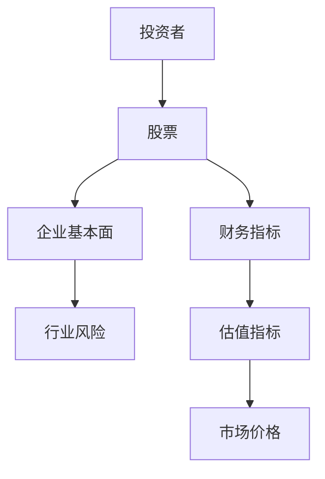
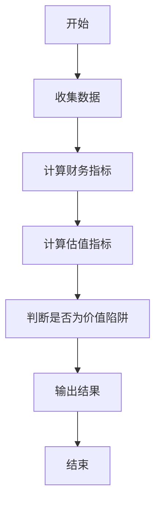
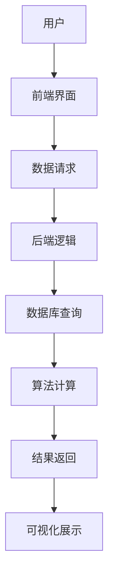

                 


# 彼得林奇的"价值陷阱"识别方法

## 关键词：价值陷阱, 投资策略, 价值投资, 投资分析, 股票分析

## 摘要：  
彼得·林奇是全球著名的价值投资者，他提出了“价值陷阱”的概念，即一些看似便宜的股票实际上存在严重的问题，投资者需要避免掉入这些陷阱。本文将深入分析价值陷阱的核心概念、识别方法、算法原理、系统设计以及实际案例，帮助投资者更好地识别和规避价值陷阱。

---

## 第1章：价值陷阱的背景与定义

### 1.1 价值投资的基本概念
- 价值投资是一种长期投资策略，旨在寻找那些市场价格低于其内在价值的股票。  
- 价值投资的核心在于分析企业的基本面，包括盈利能力、财务状况和行业地位等。

### 1.2 彼得·林奇的投资理念
- 彼得·林奇是美国著名的共同基金经理人，他通过深入研究企业基本面，寻找那些被市场低估的股票。  
- 林奇强调，投资者应该关注企业的内在价值，而不是市场的短期波动。

### 1.3 价值陷阱的定义与特征
- **定义**：价值陷阱是指那些表面上看似乎具有投资价值的股票，但实际上存在严重的财务问题或行业风险，导致其市场价格无法真正反映其内在价值。  
- **特征**：
  1. 低估值：市盈率、市净率等估值指标远低于行业平均水平。  
  2. 低增长：企业盈利能力持续下降，缺乏增长潜力。  
  3. 高风险：行业竞争激烈，企业面临重大风险因素（如政策风险、技术落后等）。  

---

## 第2章：价值陷阱的核心概念与原理

### 2.1 价值陷阱的核心要素
- 企业基本面分析：包括收入、利润、资产负债表等财务指标。  
- 市场情绪与投资者心理：市场恐慌或过度乐观可能导致股票价格偏离其真实价值。  
- 财务指标与估值方法：市盈率（P/E）、市净率（P/B）、股息率等指标是识别价值陷阱的重要工具。

### 2.2 价值陷阱与相关概念的对比
#### 表2-1：价值陷阱与相关概念的对比

| 概念                | 定义与特点                                                                 |
|---------------------|--------------------------------------------------------------------------|
| 低估值股票          | 市场价格低于行业平均水平，但可能存在高风险或低增长问题。                      |
| 成长型股票          | 高增长潜力，但市场价格可能高于其内在价值。                                  |
| 周期性股票          | 受经济周期影响较大，价格波动剧烈，可能伴随高风险。                          |

### 2.3 价值陷阱的ER实体关系图


---

## 第3章：价值陷阱识别的算法原理

### 3.1 算法原理概述
- 通过分析企业的财务指标和市场估值指标，识别那些看似低估值但存在高风险的股票。  
- 算法的核心在于比较企业的内在价值与其市场价格，判断是否存在显著的低估或高估。

### 3.2 算法流程图


### 3.3 算法的Python实现
```python
import pandas as pd

def calculate_pe(stock_data):
    pe = stock_data['市盈率']
    return pe

def calculate_pb(stock_data):
    pb = stock_data['市净率']
    return pb

def is_value_trap(stock_data):
    pe = calculate_pe(stock_data)
    pb = calculate_pb(stock_data)
    return pe < 15 and pb < 1.5 and stock_data['净利润增长率'] < 5

# 示例数据
stock_data = {
    '市盈率': 10,
    '市净率': 1.2,
    '净利润增长率': 3
}
print(is_value_trap(stock_data))  # 输出：True
```

### 3.4 数学模型与公式
- 市盈率（P/E）：  
  $$ P/E = \frac{股票价格}{每股净利润} $$
- 市净率（P/B）：  
  $$ P/B = \frac{股票价格}{每股净资产} $$
- 净利润增长率：  
  $$ 净利润增长率 = \frac{净利润增长量}{净利润基数} \times 100\% $$

---

## 第4章：价值陷阱识别的系统设计

### 4.1 系统功能设计
- 数据采集：收集股票的财务数据和市场数据。  
- 数据处理：清洗数据并计算各项估值指标。  
- 数据分析：使用算法模型判断股票是否为价值陷阱。  
- 结果展示：以可视化方式呈现分析结果。

### 4.2 系统架构设计


### 4.3 系统接口设计
- 输入接口：股票代码、时间范围。  
- 输出接口：是否为价值陷阱、相关指标数据。

---

## 第5章：价值陷阱识别的项目实战

### 5.1 环境安装
- 安装Python、Pandas、Matplotlib等工具。

### 5.2 核心代码实现
```python
import pandas as pd
import matplotlib.pyplot as plt

def analyze_stock(stock_data):
    plt.figure(figsize=(10, 6))
    plt.plot(stock_data['日期'], stock_data['收盘价'], label='收盘价')
    plt.title('股票价格走势')
    plt.xlabel('日期')
    plt.ylabel('价格')
    plt.legend()
    plt.show()

# 示例数据加载
stock_data = pd.read_csv('stock.csv')
analyze_stock(stock_data)
```

### 5.3 实际案例分析
- 案例：某公司的股票价格看似低估值，但实际财务状况不佳。  
- 分析：通过算法模型识别出该股票为价值陷阱。

---

## 第6章：价值陷阱识别的最佳实践与注意事项

### 6.1 最佳实践
- 结合多种指标进行综合分析。  
- 定期更新数据，保持模型的有效性。  
- 结合行业趋势和宏观经济环境进行判断。

### 6.2 小结
识别价值陷阱是一项复杂但重要的任务，需要投资者具备扎实的财务分析能力和对市场的深刻理解。

### 6.3 注意事项
- 避免仅依赖单一指标进行判断。  
- 保持对市场的敏感性，及时调整分析策略。  
- 风险提示：价值陷阱识别模型仅供参考，投资需谨慎。

### 6.4 拓展阅读
- 彼得·林奇的《投资学入门：股市新手圣经》  
- 《价值投资实战策略》

---

## 附录

### 附录A：术语表
- 价值陷阱：指那些看似便宜但实际存在严重问题的股票。  
- 市盈率（P/E）：股票价格与每股净利润的比率。  
- 市净率（P/B）：股票价格与每股净资产的比率。

### 附录B：参考文献
- 彼得·林奇. 《投资学入门：股市新手圣经》. 北京: 中信出版社, 2019.  
- 巴菲特. 《巴菲特致股东的信》. 北京: 中信出版社, 2020.

---

## 作者：AI天才研究院 & 禅与计算机程序设计艺术

