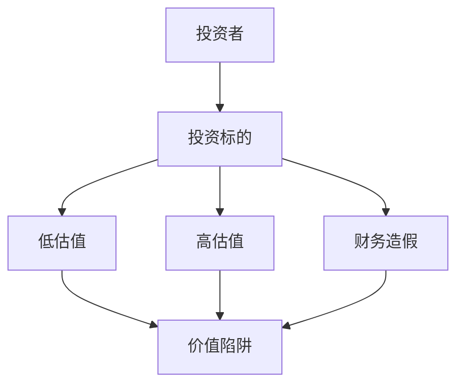
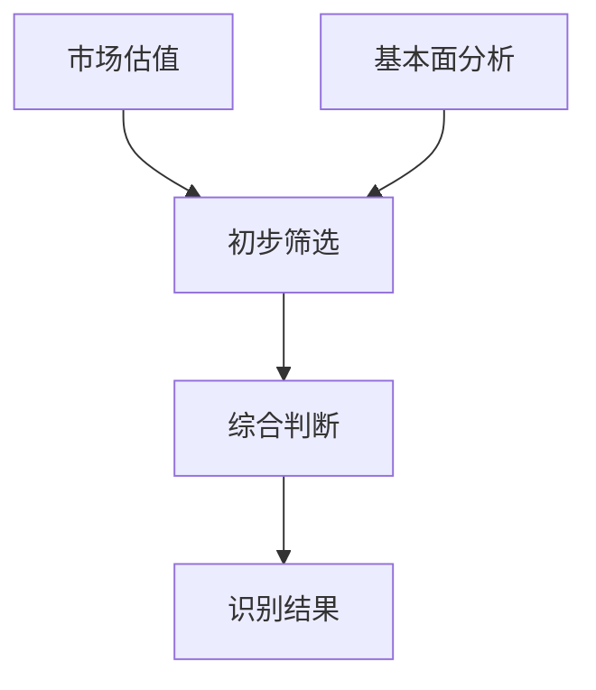
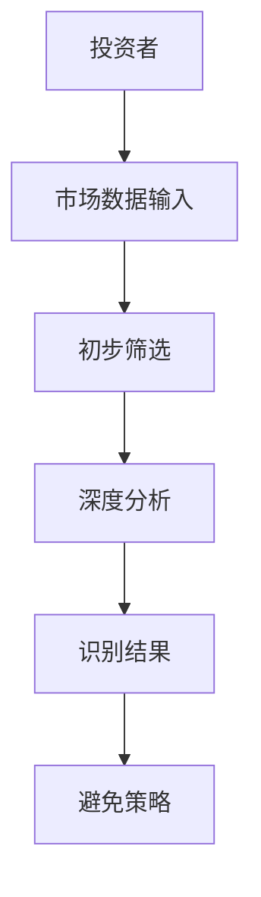
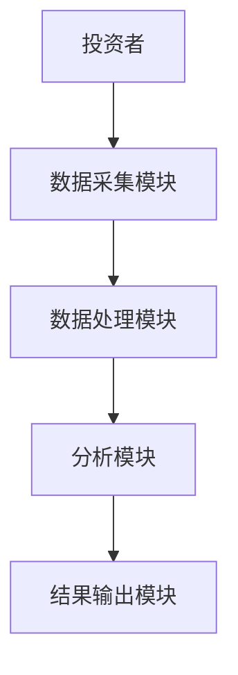

                 


# 彼得林奇的"价值陷阱"避免方法

> 关键词：价值陷阱，彼得林奇，投资策略，风险管理，系统设计，投资分析

> 摘要：本文详细探讨了彼得林奇提出的“价值陷阱”概念，分析了其核心特征、识别方法及避免策略。通过系统设计、算法分析和实际案例，帮助读者掌握如何识别和规避价值陷阱，提升投资决策的科学性和有效性。

---

## 第一部分：价值陷阱的背景与概念

### 第1章：价值陷阱的定义与背景

#### 1.1 价值陷阱的定义

**1.1.1 投资中的价值陷阱概述**

在投资领域，价值陷阱是指那些表面上看似廉价但实际存在严重问题的投资标的。这种陷阱常常以低估值为诱饵，吸引投资者买入，但实际上公司可能面临财务困境、行业衰退或管理问题，导致其价值无法真正回升。

**1.1.2 价值陷阱的核心特征**

- **低估值**：市场可能低估了公司的实际价值，但这种低估往往是由于负面因素导致的。
- **高估值**：市场可能过高估计了公司的价值，导致买入后难以变现。
- **财务造假**：公司通过虚假财务报告掩盖问题，误导投资者。

**1.1.3 价值陷阱的类型与分类**

价值陷阱主要分为以下几类：

- **基本面陷阱**：公司财务状况恶化，如高负债、低利润率。
- **行业陷阱**：行业整体衰退，公司难以扭亏为盈。
- **管理陷阱**：公司管理层存在问题，如欺诈、腐败。

#### 1.2 价值陷阱的形成原因

**1.2.1 市场情绪的影响**

市场情绪的波动可能导致投资者在高点买入或低点卖出。当市场恐慌时，优质资产可能被低估，而问题资产也可能被错误地视为廉价。

**1.2.2 公司基本面的变化**

公司自身经营状况的变化，如市场需求下降、成本上升等，可能导致其估值偏离实际价值。

**1.2.3 投资者心理偏差的作用**

投资者的贪婪和恐惧心理会导致非理性决策，如过度关注短期收益而忽视长期风险。

#### 1.3 价值陷阱的危害

**1.3.1 对个人投资者的影响**

个人投资者可能因缺乏专业分析能力而误入价值陷阱，导致资金损失。

**1.3.2 对机构投资者的影响**

机构投资者若忽视价值陷阱，可能面临更大的财务风险，影响整体投资组合的稳定性。

**1.3.3 对投资组合的长期影响**

长期来看，投资组合中若包含价值陷阱，可能导致整体收益下降，影响投资目标的实现。

#### 1.4 价值陷阱的边界与外延

**1.4.1 价值陷阱与其他投资风险的区别**

- **流动性风险**：因市场流动性不足导致的无法变现。
- **市场风险**：因市场波动导致的资产价值下降。

**1.4.2 价值陷阱与价值投资的联系**

价值投资强调购买低于内在价值的资产，但若不注意，容易误入价值陷阱。

**1.4.3 价值陷阱的常见场景与案例**

- **案例1**：某公司因行业衰退导致利润下降，但市盈率却异常低。
- **案例2**：某企业财务造假，虚报收入，掩盖亏损。

---

## 第二部分：价值陷阱的核心概念与联系

### 第2章：价值陷阱的核心概念

#### 2.1 价值陷阱的核心要素

**2.1.1 低估值陷阱**

- 公司实际价值低于市场估值，但公司存在重大问题。

**2.1.2 高估值陷阱**

- 公司市场估值远高于其实际价值，容易引发泡沫破裂。

**2.1.3 财务造假陷阱**

- 公司通过虚假财务报告掩盖问题，误导投资者。

#### 2.2 价值陷阱的属性特征对比

| 特征             | 价值陷阱             | 非陷阱投资标的 |
|------------------|----------------------|----------------|
| 市场估值         | 低或高                | 合理或高         |
| 公司基本面       | 问题或虚假            | 健康或真实       |
| 投资风险         | 高                   | 低              |
| 投资收益         | 难以回升或亏损        | 可能上升或稳定   |

**2.2.3 价值陷阱的ER实体关系图**



---

## 第三部分：价值陷阱的识别与避免方法

### 第3章：价值陷阱的识别方法

#### 3.1 价值陷阱的识别步骤

**3.1.1 初步筛选：市场估值与基本面分析**

- **市场估值分析**：比较市盈率、市净率等指标与行业平均水平的差异。
- **基本面分析**：审查公司的财务报表，关注收入、利润、负债等关键指标。

**3.1.2 深度分析：财务报表与行业环境**

- **财务报表分析**：检查收入确认的合理性，核实利润的真实性。
- **行业环境分析**：评估行业前景，判断公司是否具备竞争优势。

**3.1.3 综合判断：市场情绪与公司治理**

- **市场情绪分析**：通过媒体、投资者情绪指标等判断市场对公司的看法。
- **公司治理评估**：审查管理层的诚信度和公司的治理结构。

#### 3.2 价值陷阱的识别模型



#### 3.3 价值陷阱的识别算法

```python
def identify_value_trap(company_data):
    # 输入：公司数据，包括市盈率、市净率、收入、利润等
    # 输出：是否为价值陷阱（True或False）

    # 初步筛选：市场估值分析
    if company_data['市盈率'] < 市场平均市盈率:
        return True
    # 深度分析：基本面分析
    if (company_data['收入'] < 市场平均收入 and 
        company_data['利润'] < 市场平均利润):
        return True
    # 综合判断：市场情绪与公司治理
    if company_data['治理评分'] < 60:
        return True
    return False
```

---

### 第4章：价值陷阱的避免策略

#### 4.1 价值陷阱的避免方法

**4.1.1 避免低估值陷阱**

- **加强基本面分析**：深入研究公司财务状况，避免仅看表面估值。
- **关注行业趋势**：选择具备成长性的行业，避免夕阳行业。

**4.1.2 避免高估值陷阱**

- **设定合理的估值上限**：使用DCF模型等方法评估合理估值。
- **分散投资**：避免过度集中于高估值资产。

**4.1.3 避免财务造假陷阱**

- **审查财务报表**：关注收入确认和利润的真实性。
- **选择信誉良好的审计机构**：确保财务报告的准确性。

#### 4.2 价值陷阱的避免系统设计



---

## 第四部分：系统设计与实现

### 第5章：系统架构设计

#### 5.1 领域模型


#### 5.2 系统架构



---

## 第五部分：项目实战

### 第6章：实际案例分析

#### 6.1 实际案例

**案例：某科技公司价值陷阱分析**

- **背景**：某科技公司市盈率远低于行业平均水平，但收入持续下降，利润为负。
- **分析**：财务报表显示收入确认存在问题，管理层涉嫌财务造假。

#### 6.2 代码实现

```python
def analyze_company(company_data):
    # 初步筛选
    if company_data['市盈率'] < 行业平均市盈率:
        return '低估值陷阱'
    # 深度分析
    if company_data['利润'] < 0:
        return '财务造假陷阱'
    # 综合判断
    if company_data['治理评分'] < 60:
        return '治理风险'
    return '非价值陷阱'
```

---

## 第六部分：总结与展望

### 第7章：总结与最佳实践

#### 7.1 总结

通过系统分析和实际案例，我们掌握了如何识别和避免价值陷阱的方法。投资者应结合市场估值、基本面分析和行业趋势，制定合理的投资策略。

#### 7.2 最佳实践 tips

- **保持谨慎**：在投资前进行充分的研究和分析。
- **分散投资**：避免过度集中，降低风险。
- **持续学习**：关注市场动态，提升分析能力。

---

## 作者

**作者：AI天才研究院/AI Genius Institute & 禅与计算机程序设计艺术 /Zen And The Art of Computer Programming**

---

本文通过详细分析价值陷阱的定义、识别方法和避免策略，结合系统设计和实际案例，为投资者提供了实用的指导。希望读者能够通过本文，提升投资决策的科学性和有效性。

