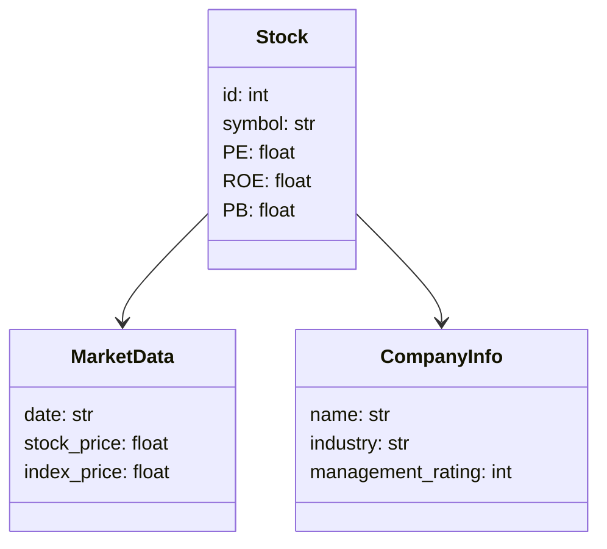
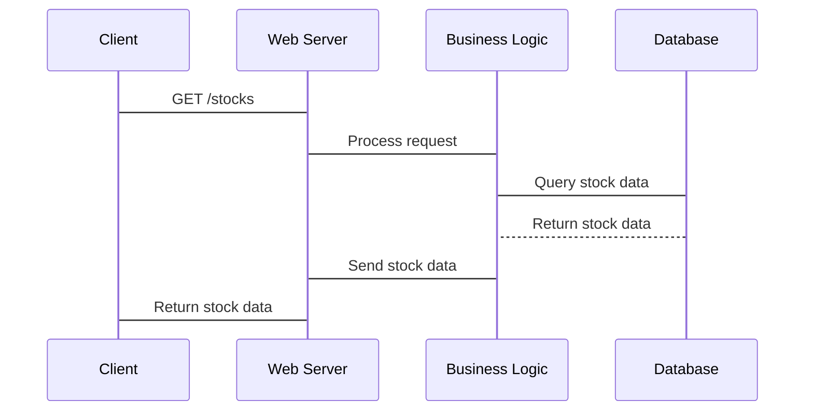

                 


```markdown
# 彼得林奇的"十倍股"识别方法

> 关键词：彼得林奇，十倍股，投资策略，股票筛选，风险管理

> 摘要：本文深入探讨了彼得林奇的“十倍股”识别方法，从其核心概念、筛选标准、算法原理到系统设计和项目实战，全面分析了如何识别和投资十倍股，结合实际案例和最佳实践，为投资者提供实用的指导。

---

## 第一部分：彼得林奇的“十倍股”概述

### 第1章：彼得林奇与十倍股背景

#### 1.1 彼得林奇的背景与投资理念
- 彼得·林奇的生平简介
  - 作为富达投资的传奇基金经理，彼得·林奇以长期优异的投资业绩闻名。
  - 他的投资理念强调深入研究和长期持有优质股票。

- 十倍股的定义
  - 十倍股是指那些能够在较长时期内为投资者带来十倍收益的股票。
  - 这种股票通常具有较高的成长性和低估的特质。

- 为什么寻找十倍股
  - 十倍股能够为投资者带来超额回报，是实现财富增长的重要手段。
  - 通过长期持有十倍股，投资者能够获得复利效应带来的巨大收益。

- 十倍股识别的挑战
  - 十倍股的稀少性意味着识别难度大。
  - 市场波动和宏观经济因素会影响十倍股的表现。

### 1.2 十倍股的核心特征
- 财务指标分析
  - 低市盈率（P/E）：市盈率低于行业平均水平，表明股票价格被低估。
  - 高ROE（净资产收益率）：净资产收益率高，说明公司盈利能力强。
  - 适度的市净率（P/B）：市净率低于行业平均水平，表明资产价值被低估。

- 行业地位
  - 所属行业具有成长性，处于上升周期。
  - 公司在行业内具有竞争优势，市场份额稳定或正在扩大。

- 管理层
  - 公司管理层能力强，有明确的长期发展战略。
  - 管理层诚信可靠，注重股东利益。

- 市场认知度
  - 市场对公司的认知度低，股票被忽视或低估。
  - 公司具有潜在的市场变革能力，能够推动行业进步。

### 1.3 十倍股的识别标准
- 低市盈率：市盈率低于行业平均水平。
- 高ROE：ROE高于行业平均水平。
- 低市净率：市净率低于行业平均水平。
- 高股息率：股息率高于行业平均水平。
- 管理层优秀：公司管理层有良好的声誉和长期的愿景。

---

## 第二部分：十倍股识别的算法原理

### 第2章：十倍股识别的算法设计

#### 2.1 算法概述
- 算法目标：通过筛选满足十倍股特征的股票，帮助投资者识别潜在的十倍股。
- 算法输入：股票的财务数据、市场数据和公司基本面信息。
- 算法输出：符合十倍股特征的股票列表。

#### 2.2 算法流程
1. 数据收集：收集目标股票的财务数据，包括市盈率、市净率、ROE、股息率等。
2. 初步筛选：根据十倍股的识别标准，筛选出符合低市盈率、高ROE、低市净率等条件的股票。
3. 深度分析：对通过初步筛选的股票进行进一步分析，包括行业地位、管理层能力、市场认知度等。
4. 结果输出：输出符合十倍股特征的股票列表。

#### 2.3 算法的数学模型
- 市盈率（P/E）计算公式：
  $$ P/E = \frac{股票价格}{每股收益} $$
- 净资产收益率（ROE）计算公式：
  $$ ROE = \frac{净利润}{净资产} $$
- 市净率（P/B）计算公式：
  $$ P/B = \frac{股票价格}{每股净资产} $$

#### 2.4 算法的Python实现
```python
import pandas as pd

# 数据收集
data = pd.read_csv('stock_data.csv')

# 初步筛选：低市盈率、高ROE、低市净率
mask = (data['PE'] < data['PE'].mean()) & \
       (data['ROE'] > data['ROE'].mean()) & \
       (data['PB'] < data['PB'].mean())

# 深度分析
selected_stocks = data[mask]

# 输出结果
print(selected_stocks.head())
```

#### 2.5 算法的优化与改进
- 数据预处理：增加更多的财务指标和市场数据。
- 算法优化：引入机器学习模型，如随机森林，进行特征选择和分类。
- 模型评估：通过回测和风险指标（如夏普比率）评估算法的性能。

---

## 第三部分：十倍股识别的系统设计

### 第3章：系统分析与架构设计

#### 3.1 系统目标
- 开发一个能够自动识别十倍股的系统，帮助投资者快速筛选潜在投资标的。

#### 3.2 领域模型设计
- 使用Mermaid绘制领域模型类图：


#### 3.3 系统架构设计
- 使用Mermaid绘制系统架构图：


#### 3.4 系统接口设计
- API接口：
  - GET /stocks：获取所有股票数据。
  - POST /screeners：提交筛选条件，返回符合十倍股特征的股票列表。

#### 3.5 系统交互设计
- 使用Mermaid绘制系统交互序列图：


---

## 第四部分：项目实战与案例分析

### 第4章：项目实战

#### 4.1 环境安装
- 安装Python和必要的库：
  ```bash
  pip install pandas numpy scikit-learn
  ```

#### 4.2 核心代码实现
```python
import pandas as pd
from sklearn.ensemble import RandomForestClassifier

# 数据加载
data = pd.read_csv('stock_data.csv')

# 特征选择
features = ['PE', 'ROE', 'PB', 'market_cap', 'industry_rating']
target = 'is_tenbagus'  # 标签：是否为十倍股

# 训练模型
model = RandomForestClassifier()
model.fit(data[features], data[target])

# 预测
new_stock = pd.DataFrame({
    'PE': [8.5],
    'ROE': [15],
    'PB': [1.2],
    'market_cap': [500000000],
    'industry_rating': [3]
})
prediction = model.predict(new_stock[features])
print(f'预测结果：{bool(prediction[0])}')
```

#### 4.3 案例分析
- 以某行业中的两家公司为例，展示如何通过上述方法识别十倍股。
- 分析模型预测结果，并解释影响预测结果的因素。

#### 4.4 项目小结
- 总结项目实施过程中的关键点和经验教训。
- 强调数据质量、模型选择和特征工程的重要性。

---

## 第五部分：最佳实践与注意事项

### 第5章：最佳实践

#### 5.1 小结
- 彼得林奇的十倍股识别方法提供了系统的投资框架。
- 结合定量分析和定性分析，能够更准确地识别潜在的十倍股。

#### 5.2 注意事项
- 数据的准确性和及时性至关重要。
- 模型的泛化能力需要通过回测和风险指标进行评估。
- 投资者需保持耐心，避免短期市场的波动干扰长期投资策略。

#### 5.3 拓展阅读
- 推荐阅读彼得·林奇的书籍《彼得林奇的投资哲学》。
- 关注行业动态和市场趋势，提升对十倍股识别的洞察力。

---

## 作者：AI天才研究院 & 禅与计算机程序设计艺术

```

