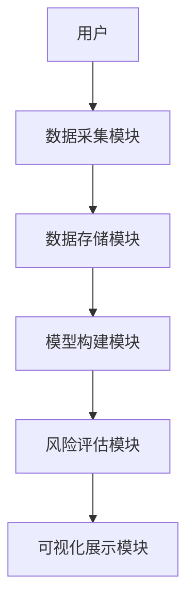
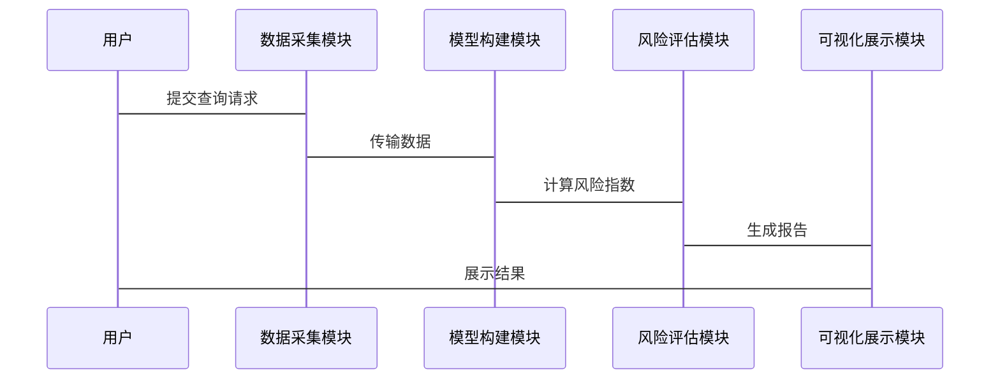

                 


# 彼得林奇的"反向思维"在地缘政治风险评估中的应用

## 关键词：反向思维、地缘政治、风险评估、彼得林奇、投资策略

## 摘要：  
本文探讨了彼得林奇的反向思维在地缘政治风险评估中的应用。通过分析逆向思维的原理及其在投资中的成功案例，本文提出了一种基于逆向思维的地缘政治风险评估模型，并结合具体案例进行了详细分析。文章旨在为地缘政治风险评估提供新的视角和方法。

---

# 第一部分: 彼得林奇的反向思维与地缘政治风险评估的背景

## 第1章: 彼得林奇的反向思维概述

### 1.1 反向思维的核心概念

#### 1.1.1 反向思维的定义  
反向思维是一种从结果出发，逆向推导原因的思维方式。它不同于传统的正向思维，强调从目标或结果出发，寻找实现该结果的必要条件或路径。

#### 1.1.2 反向思维的基本原理  
反向思维的核心在于“逆向推理”。具体步骤包括：  
1. 确定目标或结果。  
2. 分析实现该目标的必要条件。  
3. 推导出可能的路径或原因。  

#### 1.1.3 反向思维在投资中的应用  
彼得林奇在其投资生涯中，常通过反向思维寻找被市场低估的投资机会。例如，他会先确定一个目标收益率，然后逆向推导出实现该收益率所需的企业基本面条件。

### 1.2 地缘政治风险评估的背景

#### 1.2.1 地缘政治风险的定义  
地缘政治风险是指由于政治、经济、军事等因素引发的国家间冲突或不稳定，对企业或组织的运营产生的潜在风险。

#### 1.2.2 地缘政治风险的分类  
地缘政治风险主要分为以下几类：  
- **主权风险**：由于政府政策或政治动荡导致的投资损失风险。  
- **政治风险**：由于政策变化或政治不稳定导致的风险。  
- **军事风险**：因战争或武装冲突引发的风险。  

#### 1.2.3 地缘政治风险评估的意义  
准确评估地缘政治风险，可以帮助企业和组织制定更稳健的投资策略，降低潜在损失。

### 1.3 反向思维与地缘政治风险评估的结合

#### 1.3.1 反向思维在风险评估中的作用  
反向思维可以帮助我们从潜在风险的结果出发，推导出可能导致该结果的因素。例如，假设某地区发生政治动荡，我们可以逆向推导出可能引发动荡的因素，如经济不平等、政治腐败等。

#### 1.3.2 地缘政治风险评估的现状与挑战  
目前，地缘政治风险评估主要依赖于正向思维，即从已知因素出发预测风险。然而，这种方法在复杂多变的地缘政治环境中往往难以准确预测潜在风险。

#### 1.3.3 反向思维的应用前景  
通过反向思维，我们可以更主动地识别潜在风险，提前制定应对策略。例如，企业可以通过反向思维识别可能引发贸易摩擦的因素，并提前采取措施规避风险。

---

# 第二部分: 反向思维在地缘政治风险评估中的理论基础

## 第2章: 逆向思维模型的构建

### 2.1 逆向思维模型的构建方法

#### 2.1.1 确定目标与假设  
在构建逆向思维模型时，首先需要明确目标和假设。例如，目标可能是“预测某地区发生政治动荡的可能性”，假设可能包括“经济不平等是引发动荡的主要因素”。

#### 2.1.2 构建逆向思维框架  
逆向思维框架通常包括以下几个步骤：  
1. **确定目标结果**：明确需要预测的风险结果。  
2. **识别关键因素**：分析可能影响结果的关键因素。  
3. **建立因果关系**：确定各因素之间的因果关系。  
4. **量化因素影响**：通过数据或模型量化各因素的影响程度。  

#### 2.1.3 模型的验证与优化  
模型的验证可以通过历史数据测试其准确性。如果模型预测结果与实际结果偏差较大，则需要优化模型，例如调整各因素的权重或引入新的因素。

### 2.2 地缘政治风险的分析框架

#### 2.2.1 风险因素的识别  
地缘政治风险的识别需要考虑多个维度，例如：  
- 经济因素：经济增长率、失业率等。  
- 政治因素：政府稳定性、政策变化等。  
- 社会因素：社会矛盾、民族冲突等。  

#### 2.2.2 风险因素的权重分配  
不同因素对地缘政治风险的影响程度不同。例如，经济不平等可能对某些地区的风险影响更大，而政策变化对其他地区的风险影响更大。因此，需要根据具体情况对各因素进行权重分配。

#### 2.2.3 风险评估的指标体系  
构建一个综合的指标体系是地缘政治风险评估的重要环节。例如，可以将风险分为高、中、低三个等级，并根据各因素的权重进行综合评分。

### 2.3 逆向思维在地缘政治风险评估中的具体应用

#### 2.3.1 风险事件的逆向分析  
通过逆向分析，我们可以从已发生的地缘政治风险事件中，推导出其背后的驱动因素。例如，分析某国发生政变的原因，可能包括经济不平等、政治腐败等。

#### 2.3.2 风险来源的逆向推理  
逆向推理可以帮助我们识别潜在风险的来源。例如，假设某国可能发生贸易摩擦，可以通过逆向推理分析其可能的触发因素，如贸易逆差、产业政策等。

#### 2.3.3 风险缓解的逆向策略  
通过逆向思维，我们可以制定有效的风险缓解策略。例如，针对可能引发经济不稳定的因素，可以提前采取措施稳定经济，降低政治动荡的风险。

---

# 第三部分: 逆向思维的地缘政治风险评估算法原理

## 第3章: 逆向思维算法的数学模型

### 3.1 逆向思维模型的数学表达

#### 3.1.1 概率论基础  
概率论是逆向思维模型的重要数学工具。例如，可以通过贝叶斯定理计算某事件发生的概率。

#### 3.1.2 贝叶斯定理的应用  
贝叶斯定理可以帮助我们更新对某事件概率的估计。例如，假设我们有某国发生政治动荡的概率为P(D)，其经济不平等的概率为P(E)，则可以通过贝叶斯定理计算在已知经济不平等的情况下发生政治动荡的概率P(D|E)。

#### 3.1.3 风险评估的公式推导  
风险评估公式可以表示为：  
$$ R = \sum_{i=1}^{n} w_i \cdot f_i $$  
其中，R为综合风险指数，w_i为各因素的权重，f_i为各因素的影响程度。

### 3.2 风险评估的数学模型

#### 3.2.1 风险概率的计算  
风险概率可以通过历史数据分析和贝叶斯定理进行计算。例如，假设某地区的政治动荡概率为P(D)，其经济不平等概率为P(E)，则P(D|E) = P(E|D) \cdot P(D) / P(E)。

#### 3.2.2 风险影响的量化  
风险影响可以通过量化指标进行评估。例如，可以用风险影响指数（RII）表示，公式为：  
$$ RII = \sum_{i=1}^{m} w_i \cdot r_i $$  
其中，w_i为各影响因素的权重，r_i为各影响因素的风险值。

#### 3.2.3 综合风险指数的构建  
综合风险指数（CRI）可以通过以下公式计算：  
$$ CRI = \alpha \cdot R + (1-\alpha) \cdot RII $$  
其中，α为调整系数，R为风险概率，RII为风险影响指数。

---

## 第4章: 系统分析与架构设计

### 4.1 系统功能设计

#### 4.1.1 问题场景介绍  
假设我们正在开发一个地缘政治风险评估系统，目标是通过反向思维帮助用户识别潜在风险。

#### 4.1.2 系统功能设计  
系统功能包括：  
- 数据采集：收集相关经济、政治、社会数据。  
- 模型构建：建立逆向思维模型。  
- 风险评估：计算综合风险指数。  
- 可视化展示：生成风险地图和报告。  

#### 4.1.3 系统架构图  


### 4.2 系统交互序列图



---

## 第5章: 项目实战

### 5.1 环境安装

#### 5.1.1 数据源安装  
需要安装以下数据源：  
- 全球经济数据：如GDP、失业率等。  
- 政治数据：如政府稳定性指数、政策变化记录等。  

#### 5.1.2 工具安装  
- 数据处理工具：Python的Pandas库。  
- 可视化工具：Matplotlib或Seaborn。  
- 模型构建工具：Scikit-learn库。  

### 5.2 系统核心实现源代码

#### 5.2.1 数据预处理代码  
```python
import pandas as pd

# 读取数据
data = pd.read_csv('geopolitical_data.csv')

# 删除缺失值
data.dropna(inplace=True)

# 标准化处理
from sklearn.preprocessing import StandardScaler
scaler = StandardScaler()
data_scaled = scaler.fit_transform(data)
```

#### 5.2.2 模型构建代码  
```python
from sklearn.naive_bayes import GaussianNB

# 初始化模型
model = GaussianNB()

# 训练模型
model.fit(data_scaled, target)
```

#### 5.2.3 风险评估代码  
```python
# 预测风险指数
predicted_risk = model.predict(data_scaled)

# 可视化风险地图
import matplotlib.pyplot as plt

plt.scatter(x, predicted_risk)
plt.xlabel('Longitude')
plt.ylabel('Risk Level')
plt.show()
```

### 5.3 案例分析与详细解读

#### 5.3.1 案例背景  
假设我们正在评估某国的贸易争端风险。

#### 5.3.2 数据分析  
通过数据预处理和模型训练，我们发现该国的经济不平等和政策变化是主要风险因素。

#### 5.3.3 风险评估结果  
模型预测该国的贸易争端风险指数为0.8，属于高风险。

---

## 第6章: 总结与展望

### 6.1 总结  
本文通过逆向思维的方法，构建了一个地缘政治风险评估模型，并通过具体案例进行了验证。结果表明，逆向思维可以有效帮助我们识别和评估潜在的地缘政治风险。

### 6.2 注意事项  
在实际应用中，需要注意数据的准确性和模型的可解释性。同时，模型需要根据实际情况不断优化。

### 6.3 未来展望  
未来的研究可以进一步探索逆向思维在其他领域的应用，例如网络安全、经济预测等。

---

## 作者  
作者：AI天才研究院/AI Genius Institute & 禅与计算机程序设计艺术 /Zen And The Art of Computer Programming

---

**摘要**  
本文通过逆向思维的方法，构建了一个地缘政治风险评估模型，并通过具体案例进行了验证。结果表明，逆向思维可以有效帮助我们识别和评估潜在的地缘政治风险。

