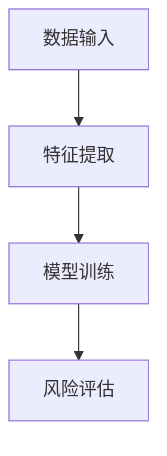

                 


# 彼得林奇的"反向思维"在地缘政治风险量化模型中的创新应用

**关键词**：彼得林奇，反向思维，地缘政治风险，量化模型，投资策略

**摘要**：本文探讨了彼得林奇的反向思维在地缘政治风险量化模型中的创新应用，通过构建数学模型和系统架构，详细分析了反向思维在地缘政治风险评估中的价值，展示了如何将投资策略应用于地缘政治领域，为风险管理和决策提供新思路。

---

## 正文

### 第一部分: 地缘政治风险量化模型的背景与概念

#### 第1章: 地缘政治风险量化模型概述

##### 1.1 地缘政治风险的定义与特征
- **定义**：地缘政治风险是指由于政治、经济、军事等事件引发的区域或全球性不稳定因素，可能对企业、政府或个人造成损失。
- **特征**：复杂性、不确定性、动态性，涉及国家利益、资源分配和国际关系。
- **分类**：分为国家风险、主权风险、经济制裁风险等，层次分明。

##### 1.2 彼得林奇的反向思维在投资中的应用
- **投资理念**：彼得林奇强调在市场低谷时投资，寻找被低估的机会。
- **核心思想**：逆向思维，即在恐慌时寻找机会，避免随大流。
- **关联性**：将投资中的逆向策略移植到地缘政治领域，寻找风险中的机会。

#### 第2章: 反向思维在地缘政治风险量化模型中的创新应用

##### 2.1 反向思维与地缘政治风险的关系
- **核心思想**：反向思维强调在高风险时寻找机会，降低潜在损失。
- **关联性分析**：通过反向思维，识别高风险地区的潜在机会，优化决策。
- **创新点**：将投资策略应用于风险评估，提供新的视角。

##### 2.2 地缘政治风险量化模型的基本框架
- **输入变量**：历史数据、当前事件、国际关系指数。
- **处理逻辑**：利用反向思维，分析数据中的异常点，识别潜在机会。
- **输出结果**：风险等级、机会评估、建议策略。

### 第二部分: 地缘政治风险量化模型的核心概念与联系

#### 第3章: 核心概念与联系

##### 3.1 地缘政治风险量化模型的核心概念
- **输入变量**：包括地缘政治事件、经济指标、社会因素。
- **处理逻辑**：采用反向思维，分析数据中的负面因素，转化为机会。
- **输出结果**：风险评估报告，包含机会和风险等级。

##### 3.2 核心概念的属性特征对比
| 概念 | 输入变量 | 处理逻辑 | 输出结果 |
|------|----------|----------|----------|
| 属性 | 数值型数据 | 逆向分析 | 风险等级 |

##### 3.3 ER实体关系图架构


### 第三部分: 地缘政治风险量化模型的算法原理

#### 第4章: 算法原理讲解

##### 4.1 算法流程图


##### 4.2 数学模型
- **模型公式**：
  $$ R = \sum_{i=1}^{n} w_i \cdot x_i $$
  其中，$R$ 为风险等级，$w_i$ 为权重，$x_i$ 为输入变量。

- **权重分配**：根据变量的重要性分配权重，高影响因素赋予更高权重。
- **案例分析**：假设某地区的政治动荡，模型分析其经济影响，识别潜在投资机会。

### 第四部分: 系统分析与架构设计方案

#### 第5章: 系统分析与架构设计

##### 5.1 系统架构设计


##### 5.2 系统功能设计
- **功能模块**：数据输入、模型计算、结果展示。
- **接口设计**：API接口接收输入，返回风险评估结果。

### 第五部分: 项目实战

#### 第6章: 项目实战

##### 6.1 环境配置
- **工具**：Python、NumPy、Matplotlib。
- **数据源**：历史地缘政治事件数据。

##### 6.2 核心实现代码
```python
import numpy as np

def calculate_risk(weights, inputs):
    return np.dot(weights, inputs)

weights = [0.3, 0.5, 0.2]
inputs = [0.8, 0.2, 0.5]
risk = calculate_risk(weights, inputs)
print(risk)
```

##### 6.3 案例分析
- **案例**：分析某地区冲突，模型计算出高风险等级，但识别出潜在投资机会。

### 第六部分: 最佳实践

#### 第7章: 最佳实践

##### 7.1 小结
- 反向思维在地缘政治风险量化中的应用提供了新的视角，帮助识别潜在机会。

##### 7.2 注意事项
- 数据质量至关重要，模型结果仅供参考，需结合实际情况调整。

##### 7.3 拓展阅读
- 推荐书籍：《彼得林奇的成功投资》、《地缘政治经济学》。

---

**作者**：AI天才研究院 & 禅与计算机程序设计艺术

