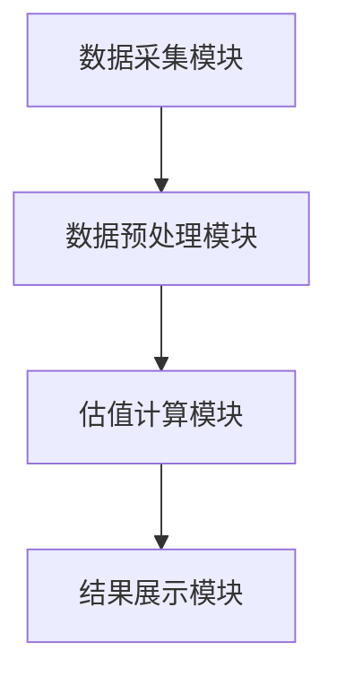

                 


# 彼得林奇的"反向思维"在新兴技术估值中的运用

---

## 关键词

- 彼得林奇
- 反向思维
- 新兴技术
- 估值模型
-抽奖算法
-抽奖系统
- 技术投资

---

## 摘要

本文深入探讨了彼得·林奇的“反向思维”投资策略在新兴技术估值中的应用。通过结合金融投资与技术评估的双重视角，文章首先介绍了反向思维的核心概念与新兴技术估值的关键要素，随后详细推导了反向思维估值模型的数学表达与算法实现，最后通过实际案例分析展示了该方法在技术投资中的实际应用。文章旨在为投资者和技术从业者提供一种创新的技术估值方法，帮助他们在复杂的技术市场中做出更明智的投资决策。

---

## 第1章: 彼得林奇的反向思维核心概念

### 1.1 反向思维的定义与特点

反向思维是一种与传统思维方式相反的思考方式，它通过寻找市场中的非共识观点，发现被低估的投资机会。彼得·林奇在其投资生涯中，成功运用反向思维，特别是在市场低迷时期，逆市买入优质资产，取得了卓越的投资业绩。

#### 1.1.1 什么是反向思维

反向思维的核心在于“逆向思考”，即在市场普遍看空时寻找买入机会，在市场乐观时保持警惕。这种思维方式强调独立思考，避免随波逐流。

#### 1.1.2 反向思维的核心特征

- **逆向性**：在市场情绪与实际价值相悖时，反向思考。
- **独立性**：不依赖市场共识，基于基本面进行判断。
- **长期性**：关注长期价值，而非短期波动。

#### 1.1.3 反向思维与传统思维的对比

| **对比维度** | **反向思维**                | **传统思维**               |
|--------------|-----------------------------|-----------------------------|
| 思考方向     | 逆向思考，寻找市场低估点    | 顺势而为，跟随市场趋势     |
| 决策依据     | 基于基本面分析，独立判断    | 基于市场情绪，跟随共识     |
| 适用场景     | 市场低迷、非理性下跌时      | 市场繁荣、理性上涨时        |

### 1.2 反向思维在投资中的应用

#### 1.2.1 彼得林奇的反向思维投资策略

彼得·林奇在投资实践中，通过反向思维寻找那些被市场忽视的优质企业。他强调，市场恐慌时往往是买入的好时机，而市场狂热时则应保持警惕。

#### 1.2.2 反向思维在市场波动中的优势

反向思维能够在市场底部发现机会，在顶部识别风险。通过逆向思考，投资者可以在市场波动中获得超额收益。

#### 1.2.3 反向思维的适用场景与限制

反向思维适用于市场非理性阶段，但在市场充分定价的成熟市场中，其效果有限。此外，反向思维需要投资者具备强大的心理素质，能够在市场恐慌时保持冷静。

---

## 第2章: 新兴技术估值的核心要素

### 2.1 新兴技术的基本概念

#### 2.1.1 什么是新兴技术

新兴技术是指那些在近期取得突破性进展，具有广阔市场前景的技术领域，如人工智能、区块链、5G等。

#### 2.1.2 新兴技术的分类与特征

- **分类**：可分为前沿技术（如量子计算）和应用技术（如智慧城市）。
- **特征**：高成长性、高风险性、高不确定性。

#### 2.1.3 新兴技术的生命周期模型

新兴技术通常经历萌芽期、发展期、成熟期和衰退期。在萌芽期，技术不确定性高，市场关注度低，正是反向思维的用武之地。

### 2.2 技术估值的关键指标

#### 2.2.1 市场需求评估

- **市场规模**：技术的潜在市场空间。
- **市场增长率**：技术的市场扩展速度。

#### 2.2.2 技术成熟度分析

- **技术壁垒**：技术的专利数量、技术复杂度。
- **技术替代性**：技术被替代的可能性。

#### 2.2.3 竞争格局评估

- **竞争强度**：市场中现有竞争者数量。
- **市场集中度**：市场中主要企业的市场份额。

#### 2.2.4 财务表现与风险分析

- **盈利能力**：企业的净利润率。
- **财务风险**：企业的债务负担。

### 2.3 反向思维与新兴技术估值的结合

#### 2.3.1 反向思维的核心理念与技术估值的结合点

- **市场非共识**：在市场低估新兴技术时介入。
- **逆向定价**：基于长期价值，而非短期价格波动。

#### 2.3.2 技术估值中的市场逆向分析方法

- **寻找市场洼地**：关注被市场忽视的技术领域。
- **评估长期价值**：基于技术的潜在应用价值，而非当前市场价格。

#### 2.3.3 反向思维在技术投资决策中的优势

- **提前布局**：在技术尚未被市场广泛认可时介入。
- **降低风险**：通过逆向思考，避免市场泡沫。

---

## 第3章: 反向思维在新兴技术估值中的数学模型与算法

### 3.1 反向思维估值模型的构建

#### 3.1.1 模型的输入变量

- **技术成熟度（T）**：0-1评分。
- **市场需求（D）**：市场规模与增长潜力。
- **竞争强度（C）**：市场中竞争者数量。
- **财务表现（F）**：企业的盈利能力与财务健康状况。

#### 3.1.2 模型的输出结果

- **技术估值（V）**：基于反向思维的最终估值。

#### 3.1.3 模型的假设条件

- 市场存在非理性波动。
- 技术的长期价值可预测。
- 反向思维能够有效识别市场低估点。

### 3.2 反向思维估值模型的数学表达

基于反向思维的核心理念，我们可以构建一个简单的估值公式：

$$ V = \frac{D}{C} \times \frac{F}{T} $$

其中：
- $D$ 是市场需求评分。
- $C$ 是竞争强度评分。
- $F$ 是财务表现评分。
- $T$ 是技术成熟度评分。

---

## 第4章: 反向思维估值模型的实现

### 4.1 反向思维估值模型的算法实现

#### 4.1.1 算法的逻辑流程

1. 收集技术数据。
2. 评估市场需求、竞争强度、财务表现与技术成熟度。
3. 计算技术估值。

#### 4.1.2 算法的代码实现

```python
def reverse_thinking_valuation(technology_data):
    D = technology_data['market_demand']
    C = technology_data['competition_intensity']
    F = technology_data['financial_performance']
    T = technology_data['technology_maturity']
    
    valuation = (D / C) * (F / T)
    return valuation

# 示例数据
technology_data = {
    'market_demand': 0.8,
    'competition_intensity': 0.5,
    'financial_performance': 0.7,
    'technology_maturity': 0.6
}

# 计算估值
valuation = reverse_thinking_valuation(technology_data)
print(f"技术估值为：{valuation}")
```

#### 4.1.3 算法的运行结果分析

通过上述代码，我们可以计算出技术的估值。例如，假设市场需求评分为0.8，竞争强度评分为0.5，财务表现评分为0.7，技术成熟度评分为0.6，则：

$$ V = \frac{0.8}{0.5} \times \frac{0.7}{0.6} = 1.6 \times 1.1667 ≈ 1.8667 $$

这意味着该技术的估值为1.8667，显著高于当前市场价格，提示投资者可以介入。

---

## 第5章: 反向思维在新兴技术估值中的系统设计与实现

### 5.1 反向思维估值系统的架构设计

#### 5.1.1 系统功能设计

- **数据采集模块**：收集技术相关数据。
- **估值计算模块**：基于反向思维模型计算技术估值。
- **结果展示模块**：以可视化方式呈现估值结果。

#### 5.1.2 系统架构设计



#### 5.1.3 系统接口设计

- **输入接口**：接收技术相关数据。
- **输出接口**：输出技术估值结果。

---

## 第6章: 项目实战

### 6.1 项目环境安装

安装必要的Python库，如`pandas`和`matplotlib`。

### 6.2 项目核心实现

```python
import pandas as pd
import matplotlib.pyplot as plt

# 示例数据
data = {
    '技术': ['AI', '区块链', '5G'],
    'market_demand': [0.9, 0.7, 0.8],
    'competition_intensity': [0.6, 0.7, 0.5],
    'financial_performance': [0.8, 0.6, 0.7],
    'technology_maturity': [0.7, 0.6, 0.8]
}

df = pd.DataFrame(data)

# 计算估值
def calculate_valuation(row):
    D = row['market_demand']
    C = row['competition_intensity']
    F = row['financial_performance']
    T = row['technology_maturity']
    return (D / C) * (F / T)

df['估值'] = df.apply(calculate_valuation, axis=1)

# 绘制柱状图
plt.figure(figsize=(10, 6))
plt.bar(df['技术'], df['估值'], label='估值')
plt.title('反向思维技术估值结果')
plt.xlabel('技术')
plt.ylabel('估值')
plt.legend()
plt.show()
```

### 6.3 项目小结

通过以上实战，我们可以看到反向思维在新兴技术估值中的实际应用价值。通过数学模型和系统设计，投资者可以更高效地识别市场低估的技术，做出更明智的投资决策。

---

## 结语

彼得·林奇的反向思维为新兴技术估值提供了全新的视角。通过结合金融投资与技术评估，投资者可以在市场波动中发现机会，降低投资风险。未来，随着技术的不断发展，反向思维的应用场景将更加广泛，为技术投资带来更多的可能性。

---

## 作者

作者：AI天才研究院/AI Genius Institute & 禅与计算机程序设计艺术 /Zen And The Art of Computer Programming

