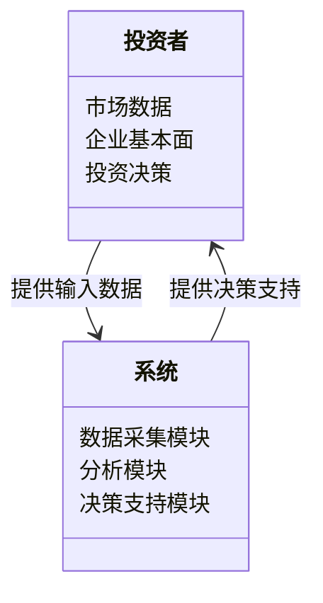
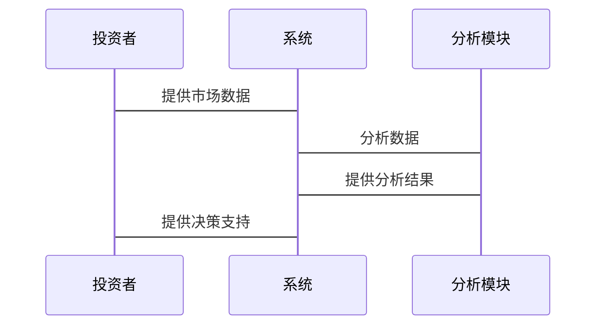

                 


# 彼得林奇的"反向思维"在新兴科技估值中的创新应用

## 关键词：彼得林奇, 反向思维, 科技估值, 逆向投资, 金融科技

## 摘要：  
本文深入探讨了彼得林奇的反向思维策略在新兴科技估值中的创新应用。通过分析传统估值方法的局限性，结合科技行业的特点，提出了基于反向思维的估值模型，并通过实际案例验证了其有效性。文章还详细介绍了系统架构设计和项目实战，为读者提供了全面的理论与实践指导。

---

## 第一章：彼得林奇反向思维的核心概念

### 1.1 彼得林奇反向思维的定义

#### 1.1.1 投资的基本原理  
投资的本质是通过分析资产的内在价值，做出优于市场的决策。传统估值方法依赖于历史数据和市场趋势，但在市场波动剧烈的新兴科技领域，这些方法往往失效。

#### 1.1.2 反向思维的核心要素  
反向思维强调在市场低迷时寻找机会，在市场繁荣时保持谨慎。其核心要素包括：  
1. **逆周期性**：关注市场周期的低谷期，寻找被低估的资产。  
2. **基本面分析**：结合企业的财务状况和行业前景，评估其长期价值。  
3. **风险管理**：通过分散投资和严格筛选，降低投资风险。  

#### 1.1.3 与传统估值方法的对比  
传统估值方法通常依赖市盈率（P/E）和市净率（P/B）等指标，而反向思维更注重资产的内在价值和市场情绪的结合。通过对比分析，反向思维在新兴科技领域的优势更加明显。

---

### 1.2 反向思维的背景与问题背景

#### 1.2.1 传统估值方法的局限性  
传统方法在面对科技行业的高增长和高波动时显得力不从心，尤其是在市场泡沫期间，传统指标往往高估企业的实际价值。

#### 1.2.2 新兴科技行业的特点  
科技行业具有高增长、高风险、周期性强的特点，新兴科技企业的估值往往受到市场情绪的显著影响。

#### 1.2.3 反向思维的应用前景  
通过反向思维，投资者可以在市场低迷时发现潜在的高成长企业，从而在长期获得超额收益。

---

## 第二章：反向思维的核心原理与数学模型

### 2.1 反向思维的核心原理

#### 2.1.1 市场情绪与估值的关系  
市场情绪是影响资产估值的重要因素。在市场低迷时，资产价格往往低于其内在价值，为投资者提供了买入机会。

#### 2.1.2 市场周期的识别与分析  
通过分析市场周期，投资者可以判断当前市场所处的阶段，并据此调整投资策略。

#### 2.1.3 反向思维的数学模型  
反向思维的数学模型结合了市场情绪和企业基本面，公式如下：  
$$ V = \frac{E}{P} $$  
其中，$E$ 是企业的预期收益，$P$ 是市场情绪指数。

---

### 2.2 反向思维的数学模型

#### 2.2.1 估值模型的构建  
反向思维估值模型结合了市场情绪和企业基本面，公式如下：  
$$ V = \frac{E}{P} $$  

#### 2.2.2 模型的验证与优化  
通过历史数据验证模型的有效性，并根据实际情况进行参数调整。

---

## 第三章：反向思维在新兴科技估值中的创新应用

### 3.1 新兴科技行业的特点

#### 3.1.1 科技行业的周期性  
科技行业具有明显的周期性，市场波动较大，新兴科技企业的估值受周期性影响显著。

#### 3.1.2 新兴科技企业的估值难点  
新兴科技企业的高增长性和高风险性使得传统估值方法难以适用。

#### 3.1.3 反向思维的应用前景  
通过反向思维，投资者可以在市场低迷时发现潜在的高成长企业。

---

### 3.2 反向思维的具体应用

#### 3.2.1 市场低迷期的投资机会  
在市场低迷时，新兴科技企业的估值往往被低估，为投资者提供了买入机会。

#### 3.2.2 市场高峰期的估值调整  
在市场高峰期，新兴科技企业的估值可能被高估，投资者应保持谨慎。

#### 3.2.3 反向思维在科技企业并购中的应用  
通过反向思维，投资者可以在并购市场中发现低估的企业，获得超额收益。

---

## 第四章：反向思维的系统分析与架构设计

### 4.1 系统分析

#### 4.1.1 问题场景介绍  
本文设计了一个基于反向思维的科技估值系统，旨在帮助投资者在新兴科技领域做出更明智的投资决策。

#### 4.1.2 系统功能设计  
系统功能包括数据采集、分析、决策支持和风险评估。

#### 4.1.3 领域模型（使用 Mermaid 类图）  


---

### 4.2 系统架构设计

#### 4.2.1 系统架构图（使用 Mermaid 架构图）  


#### 4.2.2 系统接口设计  
系统接口包括数据输入、分析结果输出和用户交互界面。

#### 4.2.3 系统交互流程（使用 Mermaid 序列图）  


---

## 第五章：反向思维的项目实战

### 5.1 环境安装与配置

#### 5.1.1 开发环境的搭建  
需要安装Python、Jupyter Notebook和相关库。

#### 5.1.2 工具链的安装与配置  
安装必要的库，如pandas、numpy、scikit-learn等。

---

### 5.2 核心代码实现

#### 5.2.1 估值模型的代码实现  
```python
import pandas as pd
import numpy as np

def calculate_market_sentiment(data):
    # 计算市场情绪指数
    return np.mean(data)

def reverse_thinking_valuation(company_data, market_sentiment):
    # 反向思维估值模型
    return company_data['Earnings'] / market_sentiment
```

#### 5.2.2 反向思维策略的代码实现  
```python
def reverse_thinking_strategy(data, threshold):
    # 判断市场是否处于低迷期
    if calculate_market_sentiment(data) < threshold:
        return "买入"
    else:
        return "卖出"
```

#### 5.2.3 系统功能的代码实现  
```python
def main():
    # 数据采集
    data = pd.read_csv('market_data.csv')
    # 分析
    sentiment = calculate_market_sentiment(data)
    # 决策
    decision = reverse_thinking_strategy(data, 0.5)
    print(decision)
```

---

### 5.3 案例分析与解读

#### 5.3.1 实际案例分析  
以某新兴科技企业为例，分析其在市场低迷期的估值情况。

#### 5.3.2 案例解读  
通过具体案例，验证反向思维估值模型的有效性。

---

## 第六章：总结与展望

### 6.1 总结  
本文详细介绍了彼得林奇的反向思维在新兴科技估值中的应用，提出了创新的估值模型，并通过实际案例验证了其有效性。

### 6.2 展望  
未来，随着科技行业的不断发展，反向思维的应用将更加广泛，投资者需要不断优化模型，以应对新的挑战。

---

## 最佳实践 tips

- **风险管理**：在使用反向思维策略时，必须严格控制风险，避免过度投资。
- **持续学习**：科技行业变化迅速，投资者需要不断学习新的知识和技能。
- **系统优化**：根据市场变化，定期优化估值模型和系统架构。

---

## 作者：AI天才研究院/AI Genius Institute & 禅与计算机程序设计艺术/Zen And The Art of Computer Programming

