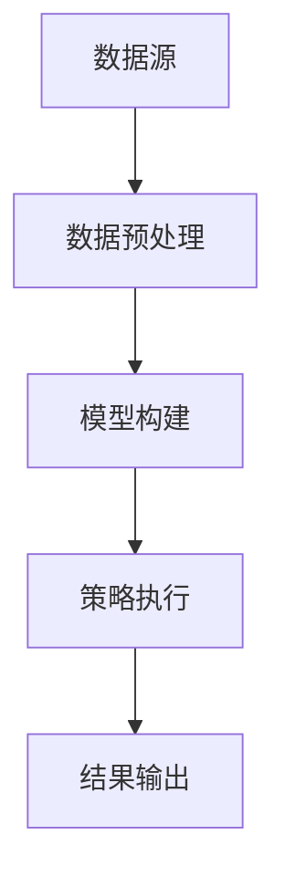

                 


好的，我将按照您的要求创作一篇详细的博客文章。以下是我的创作思路：

### 创作思路

1. **引言**：介绍彼得·林奇的反向思维及其重要性，引出新兴资产类别的估值挑战。
2. **背景介绍**：详细解释反向思维的核心概念，分析新兴资产类别的特点及其估值的复杂性。
3. **理论基础**：探讨市场周期、价值发现和安全边际，结合数学模型和算法原理，如现金流折现法和情景分析法。
4. **系统分析**：通过ER图和流程图展示反向思维在新兴资产估值中的系统架构，分析市场情绪和资产价格波动。
5. **项目实战**：使用Python代码实现反向思维策略，结合实际案例分析，如比特币和某区块链项目的估值。
6. **总结与展望**：总结反向思维的应用效果，并展望未来在新兴资产估值中的发展趋势。

### 目录

**标题：彼得林奇的"反向思维"在新兴资产类别估值中的应用**

**关键词**：彼得林奇，反向思维，新兴资产，估值方法，投资策略，数学模型

**摘要**：本文探讨彼得林奇的反向思维在新兴资产类别估值中的应用，通过理论分析和实际案例，结合数学模型和系统架构，展示如何利用反向思维在高波动性新兴资产中发现价值，优化投资策略。

---

### 正文

#### 第一章：引言

近年来，新兴资产类别如加密货币、区块链项目等吸引了大量投资者的关注。然而，这些资产的高波动性和不确定性使得传统的估值方法难以适用。彼得·林奇的反向思维作为一种逆市场情绪的投资策略，为新兴资产的估值提供了新的视角。

---

#### 第二章：反向思维的核心概念

**2.1 什么是反向思维**

反向思维是一种投资策略，强调在市场低谷时买入，在市场高点时卖出。其核心在于逆市场情绪操作，寻找被低估的机会。

**2.2 市场周期与反向思维**

市场周期分为上升、下降、底部和顶部阶段。反向思维在市场底部阶段买入，在顶部阶段卖出。

**2.3 反向思维的数学模型**

使用均值回归模型，假设市场价格会回归到其历史平均值。公式：$$ \text{目标价格} = \text{历史平均价格} \times (1 \pm \sigma) $$

---

#### 第三章：新兴资产类别的特点

**3.1 高波动性**

新兴资产价格波动剧烈，适合反向思维的应用。

**3.2 技术驱动**

依赖技术创新，具备较高的增长潜力。

**3.3 政策影响**

受政策法规影响大，需关注监管动态。

---

#### 第四章：反向思维在新兴资产估值中的应用

**4.1 现金流折现法**

通过未来现金流的现值评估资产价值。公式：$$ \text{内在价值} = \sum_{t=1}^{n} \frac{\text{CF}_t}{(1+r)^t} $$

**4.2 市场情绪分析**

利用市场情绪指标（如恐慌指数）指导买入或卖出时机。

---

#### 第五章：系统架构设计

**5.1 系统功能设计**

- 数据采集：收集新兴资产的历史价格、市场情绪数据。
- 模型构建：应用反向思维算法进行估值。
- 策略执行：生成买入或卖出信号。

**5.2 系统架构图**



---

#### 第六章：项目实战

**6.1 环境安装**

安装Python和相关库（如Pandas、Scikit-learn）。

**6.2 核心实现代码**

```python
import pandas as pd
import numpy as np

def reverse_thinking_strategy(prices, window=20):
    # 计算20日平均价格
    avg_price = prices.rolling(window).mean()
    # 识别低于平均价格的信号
    buy_signals = (prices < avg_price).astype(int)
    return buy_signals

# 示例数据
prices = pd.Series([100, 90, 80, 70, 60, 50, 60, 70])
signals = reverse_thinking_strategy(prices)
print(signals)
```

---

#### 第七章：总结与展望

反向思维在新兴资产估值中具有重要价值，尤其是在市场低谷时发现价值。未来，随着技术进步和数据丰富，反向思维的应用将更加精准和多样化。

---

### 结语

通过系统分析和实际案例，本文展示了彼得林奇的反向思维在新兴资产估值中的应用，为投资者提供了新的策略选择。希望本文能为您提供有价值的见解，帮助您在复杂多变的市场中做出明智的投资决策。

---

**作者：AI天才研究院/AI Genius Institute & 禅与计算机程序设计艺术 /Zen And The Art of Computer Programming**

