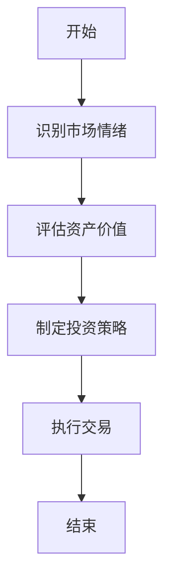
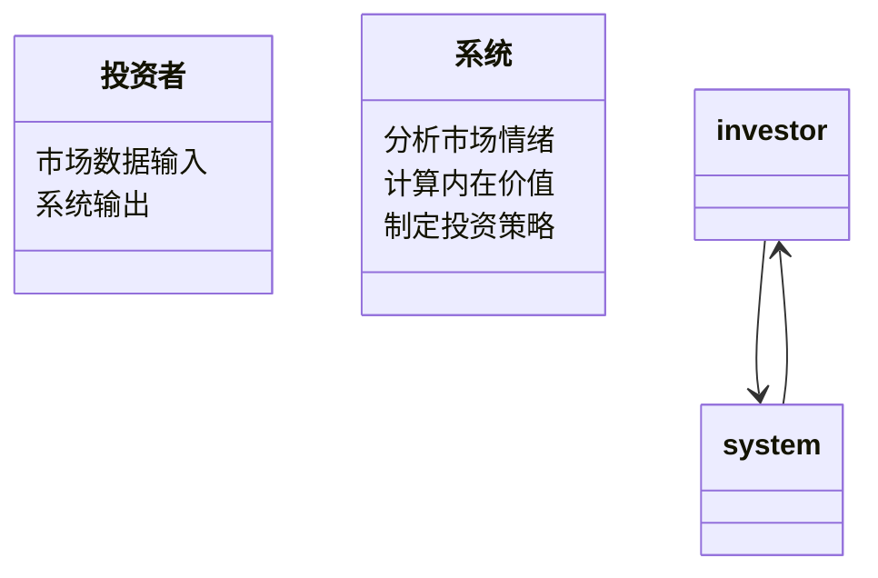
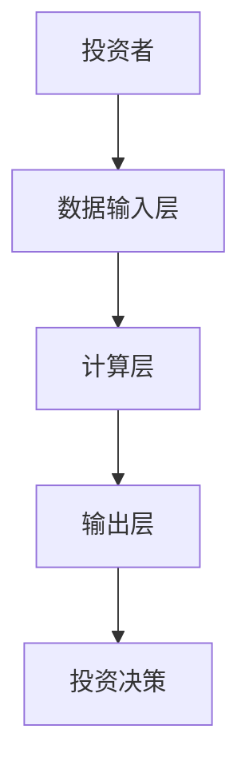

                 

# 彼得林奇的"反向思维"在熊市中的应用

## 关键词：反向思维、彼得林奇、熊市、价值投资、投资策略、市场分析、投资组合

## 摘要：本文通过分析彼得·林奇的反向思维策略，结合算法和系统设计，深入探讨如何在熊市中识别投资机会，优化投资组合，并提供实际案例以指导投资者在市场低迷时期做出明智决策。

---

## 目录大纲：

### 第一章：反向思维的背景与核心概念

1.1 反向思维的起源与发展

1.2 反向思维的核心概念

1.3 熊市中的投资机会

### 第二章：反向思维的算法原理

2.1 算法流程图

2.2 数学模型与公式

### 第三章：系统分析与架构设计

3.1 系统功能设计

3.2 系统架构设计

### 第四章：项目实战

4.1 环境安装

4.2 核心实现

4.3 案例分析

### 第五章：总结与最佳实践

5.1 小结

5.2 注意事项

5.3 拓展阅读

---

接下来将按照上述目录结构详细撰写各章节内容。

---

## 第一章：反向思维的背景与核心概念

### 1.1 反向思维的起源与发展

#### 1.1.1 投资领域的逆向思维概念

反向思维在投资领域中，是指在市场低迷或恐慌时，寻找被低估的资产进行投资，而在市场繁荣时避免过度投资。这种策略与传统的顺势投资相反，强调逆市场周期进行操作。

#### 1.1.2 彼得·林奇的反向思维策略

彼得·林奇是著名的基金经理，他在职业生涯中成功运用反向思维策略，在市场低谷时投资优质资产，获得了显著的收益。他的策略强调对基本面的分析，寻找那些在市场恐慌时被低估的股票。

#### 1.1.3 熊市中的投资机会

熊市期间，市场情绪低落，投资者往往恐慌性抛售，导致许多优质资产价格被低估。反向思维投资者通过分析市场情绪和资产价值，能够在熊市中找到潜在的投资机会，实现长期收益。

### 1.2 反向思维的核心概念

#### 1.2.1 价值投资的基本原理

价值投资强调购买低于其内在价值的资产。反向思维策略是价值投资的一种应用，在熊市中，市场恐慌导致资产价格低于其真实价值，为投资者提供了买入机会。

#### 1.2.2 反向思维在熊市中的应用

在熊市中，反向思维策略通过分析市场情绪和资产价值，识别出被低估的资产。投资者在市场底部买入，待市场回升时卖出，实现收益。

#### 1.2.3 投资者心理与市场周期

投资者心理波动与市场周期密切相关。在熊市中，恐慌情绪导致市场超卖，为反向思维提供了机会。理解投资者心理有助于制定有效的投资策略。

---

## 第二章：反向思维的算法原理

### 2.1 算法流程图

### 2.2 数学模型与公式

#### 2.2.1 价值评估公式

$$ V = \frac{E}{P} $$

其中，V是内在价值，E是企业预期收益，P是资本成本。

#### 2.2.2 市场情绪指标

$$ S = \frac{\sum (P_i - V_i)}{N} $$

其中，S是市场情绪指数，P_i是资产价格，V_i是内在价值，N是资产数量。

---

## 第三章：系统分析与架构设计

### 3.1 系统功能设计

### 3.2 系统架构设计

---

## 第四章：项目实战

### 4.1 环境安装

#### 4.1.1 数据获取工具

使用Python的pandas库和yfinance库获取历史数据。

#### 4.1.2 分析工具安装

安装Jupyter Notebook和相关数据分析库。

#### 4.1.3 系统配置

配置环境变量，确保所有库已正确安装。

### 4.2 核心实现

#### 4.2.1 数据预处理

使用pandas清洗数据，处理缺失值和异常值。

#### 4.2.2 情绪分析

通过计算市场情绪指数，识别市场处于熊市阶段。

#### 4.2.3 策略执行

根据反向思维策略，执行买入操作。

### 4.3 案例分析

#### 4.3.1 真实案例解读

分析2008年金融危机期间某公司的股票走势，应用反向思维策略进行投资。

#### 4.3.2 投资组合优化

通过历史数据验证反向思维策略的有效性，优化投资组合。

---

## 第五章：总结与最佳实践

### 5.1 小结

反向思维策略在熊市中能够帮助投资者识别低估资产，实现长期收益。通过系统的分析和实战案例，我们可以更好地理解这一策略的应用。

### 5.2 注意事项

投资者需谨慎评估市场情绪和资产价值，避免盲目跟风。同时，需定期监控投资组合，及时调整策略。

### 5.3 拓展阅读

推荐阅读彼得·林奇的著作，深入理解价值投资和反向思维策略。

---

## 作者：AI天才研究院/AI Genius Institute & 禅与计算机程序设计艺术 /Zen And The Art of Computer Programming

---

这篇文章通过详细分析彼得林奇的反向思维策略，结合算法和系统设计，为投资者提供了在熊市中寻找投资机会的实用方法。希望对读者在投资决策中有所帮助。

