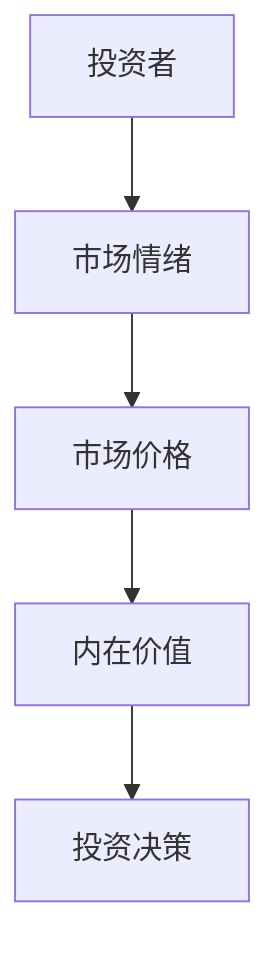
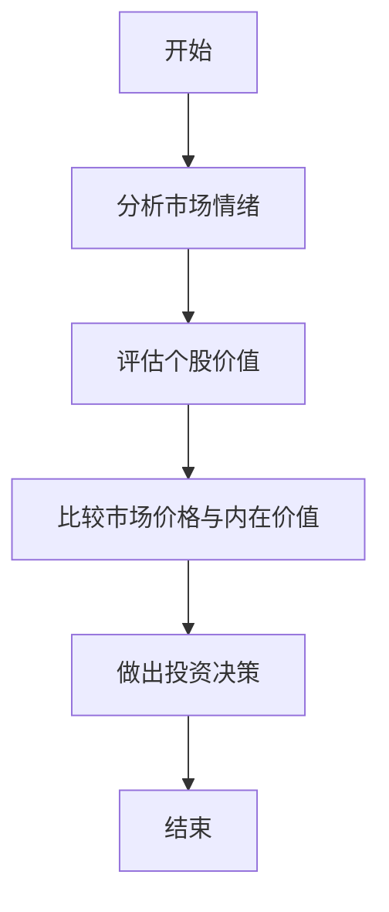
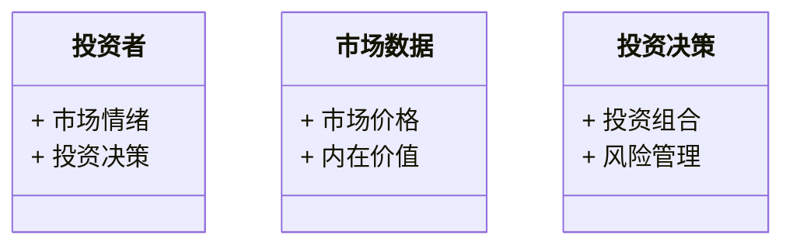
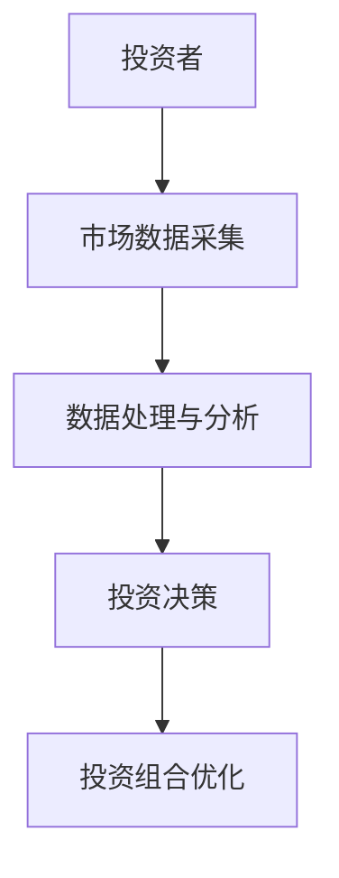
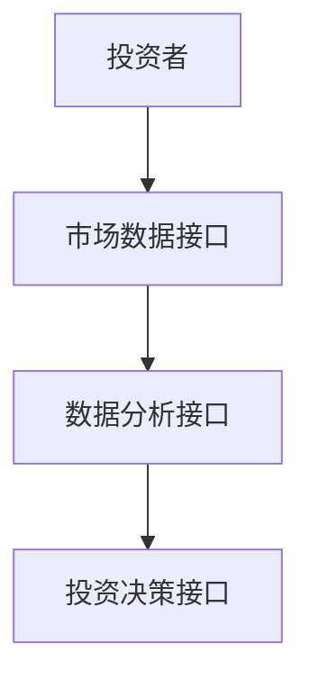

                 


# 彼得林奇的"反向思维"在牛市中的应用

> 关键词：反向思维, 彼得林奇, 牛市, 投资策略, 价值评估, 市场情绪, 投资决策

> 摘要：本文深入探讨了彼得林奇的反向思维在牛市中的应用，从定义、核心概念、数学模型到算法实现，系统地分析了反向思维在投资决策中的价值。通过具体的案例分析和系统设计，本文为投资者提供了实用的指导和建议，帮助他们在复杂多变的市场中做出明智的投资决策。

---

## 第1章: 反向思维与牛市投资概述

### 1.1 反向思维的定义与核心概念

反向思维是一种与传统思维相反的投资策略，它强调在市场情绪高涨时保持冷静，在市场低迷时积极投资。核心概念包括：

1. **市场情绪与投资决策的关系**：市场情绪高亢时，投资者往往过于乐观；市场情绪低落时，投资者往往过于悲观。
2. **价值评估与市场价格的偏离**：反向思维的核心在于识别市场价格与内在价值的偏离，寻找被市场低估的投资机会。
3. **投资组合的构建与优化**：通过逆向思维，投资者可以在牛市中构建一个具有防御性的投资组合，降低风险。

### 1.2 彼得林奇投资策略简介

彼得林奇是全球著名投资专家，他的投资策略以基本面分析和长期持有为核心。以下是彼得林奇投资策略的三个关键点：

1. **投资理念**：彼得林奇强调长期投资和价值发现，他认为市场的短期波动不应该影响长期投资决策。
2. **选股方法**：他注重对公司基本面的深入研究，寻找具有持续增长潜力的公司。
3. **市场观点**：彼得林奇认为，市场情绪往往会导致价格与价值的偏离，这为投资者提供了套利机会。

### 1.3 反向思维在牛市中的应用背景

牛市是反向思维的重要应用场景。在牛市中，市场情绪高涨，投资者往往过于乐观，导致市场价格远高于内在价值。此时，反向思维可以帮助投资者识别被市场忽视的低估机会，或者在市场高估时选择退出。

---

## 第2章: 反向思维的核心概念与数学模型

### 2.1 反向思维的核心概念

1. **市场情绪与投资决策的关系**：市场情绪是投资者决策的重要因素。在牛市中，市场情绪通常过于乐观，导致市场价格高估。
2. **价值评估与市场价格的偏离**：反向思维的核心在于识别市场价格与内在价值的偏离。当市场价格远高于内在价值时，市场可能存在泡沫，投资者应保持警惕。
3. **投资组合的构建与优化**：通过逆向思维，投资者可以在牛市中构建一个具有防御性的投资组合，降低风险。

### 2.2 反向思维的数学模型

1. **价值评估模型**：
$$ V = \frac{E}{P} $$
其中，\( V \) 是内在价值，\( E \) 是预期收益，\( P \) 是当前价格。

2. **市场情绪指数**：
$$ S = \frac{M}{V} $$
其中，\( S \) 是市场情绪指数，\( M \) 是市场平均市盈率，\( V \) 是市场平均内在价值。

### 2.3 反向思维的ER实体关系图



---

## 第3章: 反向思维的算法原理

### 3.1 反向思维的算法流程



### 3.2 算法实现的Python代码

```python
import pandas as pd
import numpy as np

def calculate_intrinsic_value(eps, growth_rate, required_return):
    return eps * (1 + growth_rate) / required_return

def calculate_market_mood(price, intrinsic_value):
    return price / intrinsic_value

# 示例数据
data = {
    'eps': [10, 15, 20],
    'growth_rate': [0.1, 0.15, 0.05],
    'required_return': [0.05, 0.06, 0.04]
}

df = pd.DataFrame(data)

# 计算内在价值
df['intrinsic_value'] = df.apply(lambda row: calculate_intrinsic_value(row['eps'], row['growth_rate'], row['required_return']), axis=1)

# 计算市场情绪指数
df['market_mood'] = df.apply(lambda row: calculate_market_mood(row['price'], row['intrinsic_value']), axis=1)

print(df)
```

---

## 第4章: 系统分析与架构设计方案

### 4.1 系统功能设计

1. **领域模型**：


2. **系统架构设计**：


3. **系统接口设计**：


---

## 第5章: 项目实战

### 5.1 环境安装

1. 安装Python和必要的库（如Pandas、NumPy）。
2. 安装数据分析工具（如Jupyter Notebook）。

### 5.2 核心实现代码

```python
import pandas as pd
import numpy as np

def calculate_intrinsic_value(eps, growth_rate, required_return):
    return eps * (1 + growth_rate) / required_return

def calculate_market_mood(price, intrinsic_value):
    return price / intrinsic_value

# 示例数据
data = {
    'eps': [10, 15, 20],
    'growth_rate': [0.1, 0.15, 0.05],
    'required_return': [0.05, 0.06, 0.04],
    'price': [50, 75, 60]
}

df = pd.DataFrame(data)

# 计算内在价值
df['intrinsic_value'] = df.apply(lambda row: calculate_intrinsic_value(row['eps'], row['growth_rate'], row['required_return']), axis=1)

# 计算市场情绪指数
df['market_mood'] = df.apply(lambda row: calculate_market_mood(row['price'], row['intrinsic_value']), axis=1)

print(df)
```

### 5.3 案例分析

假设我们有一个股票，其eps为15，增长率为0.15，要求回报率为0.06，市场价格为75。计算其内在价值和市场情绪指数：

1. 内在价值：
$$ V = \frac{15}{0.06} = 250 $$

2. 市场情绪指数：
$$ S = \frac{75}{250} = 0.3 $$

结果表明，该股票的市场价格远低于内在价值，市场情绪指数较低，说明该股票被市场低估，适合买入。

---

## 第6章: 总结与最佳实践

### 6.1 总结

反向思维是一种在牛市中极具价值的投资策略。通过识别市场价格与内在价值的偏离，投资者可以在市场高估时保持冷静，在市场低估时积极投资。彼得林奇的投资理念为我们提供了宝贵的指导。

### 6.2 最佳实践

1. **风险管理**：在使用反向思维时，投资者需要严格控制风险，避免过度杠杆。
2. **长期投资**：反向思维强调长期投资，避免短期市场的波动干扰。
3. **持续学习**：投资者需要不断学习和更新自己的知识，以应对市场的变化。

### 6.3 注意事项

1. **市场周期**：反向思维在牛市中的应用需要结合市场的周期性，避免在市场顶部过度乐观。
2. **数据质量**：投资者需要确保数据的准确性和完整性，以提高分析的准确性。

### 6.4 拓展阅读

1. 彼得林奇的《股票投资手册》
2. 《价值投资入门》
3. 《投资的常识》

---

作者：AI天才研究院/AI Genius Institute & 禅与计算机程序设计艺术 /Zen And The Art of Computer Programming

