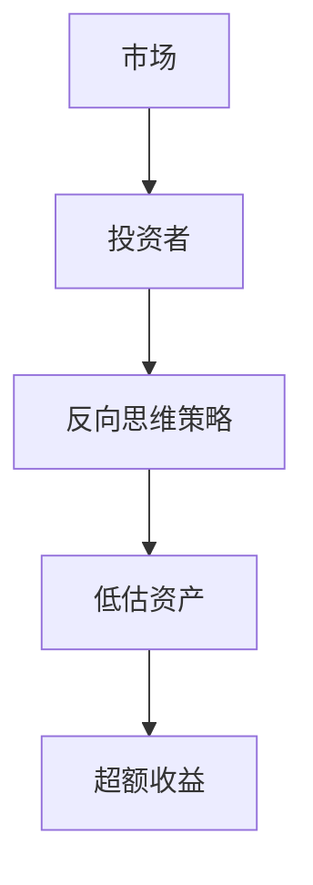
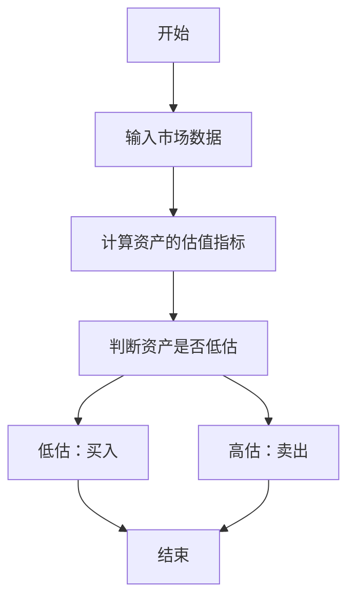
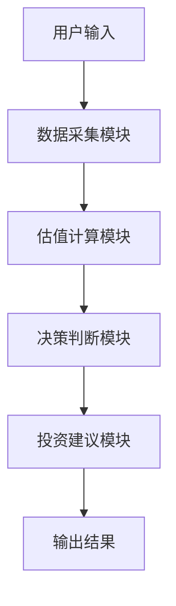

                 


# 彼得林奇的"反向思维"在资产配置中的运用

## 关键词：反向思维，彼得林奇，资产配置，投资策略，价值投资

## 摘要：  
彼得·林奇是全球著名投资家，他提出的“反向思维”在资产配置中具有重要的应用。本文将详细阐述反向思维的定义、核心原理及其在资产配置中的具体运用，通过数学模型、算法流程图和实际案例分析，探讨如何通过反向思维找到被市场低估的投资机会，优化资产配置，提升投资收益。

---

## 第一部分：反向思维的定义与背景

### 第1章：反向思维的定义与背景

#### 1.1 反向思维的定义  
- **反向思维**是指在投资决策中，通过寻找市场上的非共识性机会，关注那些被市场忽视或低估的资产，从而实现超额收益的投资策略。  
- 反向思维的核心在于“逆向思考”，即当市场情绪高涨时寻找低估资产，当市场恐慌时寻找优质资产。

#### 1.2 彼得·林奇的投资理念  
- 彼得·林奇是全球著名投资家，担任富达投资集团麦哲伦基金经理期间创造了辉煌的投资业绩。  
- 他强调**价值投资**，即通过深入研究公司基本面，寻找那些具有持续竞争优势且市场价格低于内在价值的企业。  
- 林奇的反向思维体现在他对市场的逆向思考：当市场恐慌时，他会积极寻找被错杀的优质资产；当市场疯狂时，他会警惕潜在的风险。

#### 1.3 资产配置的定义与重要性  
- **资产配置**是指将资金分配到不同的资产类别（如股票、债券、房地产等）中，以实现风险分散和收益最大化。  
- 资产配置的核心在于根据市场环境和个人风险偏好，选择最优的资产组合。  
- 在复杂多变的市场环境中，科学的资产配置能够帮助投资者降低风险，提高收益的稳定性。

#### 1.4 反向思维与资产配置的关系  
- 反向思维为资产配置提供了新的视角，帮助投资者在市场波动中找到超额收益的机会。  
- 通过反向思维，投资者可以避免盲目跟随市场情绪，制定更具前瞻性的资产配置策略。

---

## 第二部分：反向思维的核心概念与联系

### 第2章：核心概念与联系

#### 2.1 反向思维的核心原理  
- 反向思维的核心在于**市场非有效假设**，即市场并非总是能够合理定价资产，特别是在市场恐慌或狂热时，价格与价值会出现背离。  
- 投资者通过反向思维，能够在市场低估时买入，在市场高估时卖出。

#### 2.2 反向思维与传统投资策略的对比  
| 对比维度           | 传统投资策略                     | 反向思维策略                     |
|--------------------|----------------------------------|----------------------------------|
| 投资理念           | 追踪市场趋势，顺势而为           | 逆市场趋势，寻找低估资产         |
| 风险偏好           | 风险中性或厌恶                   | 适度承担逆向风险               |
| 投资时机           | 市场热时积极投资                 | 市场冷时积极寻找机会             |
| 核心策略           | 分散投资，降低波动性             | 集中投资，寻找高性价比资产       |

#### 2.3 反向思维的实体关系图  


---

## 第三部分：反向思维在资产配置中的算法原理

### 第3章：反向思维的算法原理

#### 3.1 算法概述  
反向思维的核心是通过量化分析，识别市场中的低估资产。常用的方法包括：  
1. **相对估值法**：通过市盈率（PE）、市净率（PB）等指标，寻找低于行业平均水平的资产。  
2. **价值回归法**：假设市场价格会回归其内在价值，寻找价格偏离价值的资产。  
3. **情绪指标法**：通过市场情绪指标（如恐慌指数VIX）判断市场是否处于非理性状态。

#### 3.2 数学模型与公式  
- **市盈率（PE）计算公式**：  
  $$ PE = \frac{\text{股价}}{\text{每股收益}} $$  
- **价值比（Value Ratio）**：  
  $$ VR = \frac{\text{内在价值}}{\text{市场价格}} $$  
  内在价值可以通过DCF模型或其他方法计算。  

#### 3.3 算法流程图  


---

## 第四部分：反向思维的系统分析与设计

### 第4章：系统分析与架构设计

#### 4.1 系统功能设计  
- **数据采集模块**：收集市场数据（如股价、财务指标等）。  
- **估值计算模块**：计算资产的估值指标（如PE、PB等）。  
- **决策判断模块**：根据反向思维策略判断资产是否低估。  
- **投资建议模块**：输出投资建议（如买入、卖出等）。  

#### 4.2 系统架构设计  


#### 4.3 接口设计  
- **输入接口**：市场数据接口（如API）。  
- **输出接口**：投资建议接口（如邮件或短信通知）。  

---

## 第五部分：反向思维的项目实战

### 第5章：项目实战

#### 5.1 项目背景  
假设当前市场处于恐慌状态，投资者希望通过反向思维寻找低估的股票。

#### 5.2 环境安装  
- 需要安装Python、Pandas、NumPy等工具。

#### 5.3 核心代码实现  
```python
import pandas as pd
import numpy as np

# 示例数据：股票信息
data = {
    '股票代码': ['A', 'B', 'C'],
    '股价': [10, 15, 20],
    '每股收益': [2, 3, 4]
}

df = pd.DataFrame(data)

# 计算市盈率
df['PE'] = df['股价'] / df['每股收益']

# 找出PE低于行业平均水平的股票
industry_pe = df['PE'].mean()
undervalued_stocks = df[df['PE'] < industry_pe]

print("低估股票:", undervalued_stocks['股票代码'].tolist())
```

#### 5.4 案例分析  
假设行业PE平均水平为15，计算结果显示股票A的PE为5，远低于行业平均水平，因此建议买入股票A。

#### 5.5 项目小结  
通过反向思维算法，投资者能够在市场恐慌时找到低估资产，优化资产配置。

---

## 第六部分：反向思维的总结与展望

### 第6章：总结与展望

#### 6.1 投资建议  
- 在市场恐慌时，投资者可以运用反向思维寻找低估资产，分散投资风险。  
- 在市场狂热时，投资者应保持冷静，避免盲目跟风。

#### 6.2 注意事项  
- 反向思维需要结合市场环境和公司基本面进行综合判断。  
- 投资者应具备较强的研究能力和风险承受能力。

#### 6.3 拓展阅读  
- 彼得·林奇的《投资最重要的事情》  
- 《反向投资策略》  

---

## 作者：AI天才研究院 & 禅与计算机程序设计艺术

---

通过以上步骤，我们系统地分析了彼得·林奇的反向思维在资产配置中的应用，从理论到实践，从算法到系统设计，帮助投资者在复杂多变的市场中找到超额收益的机会。

