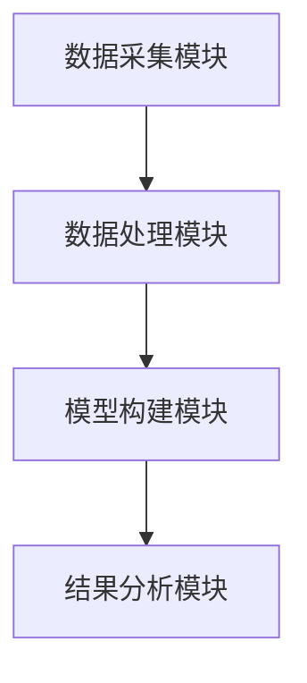
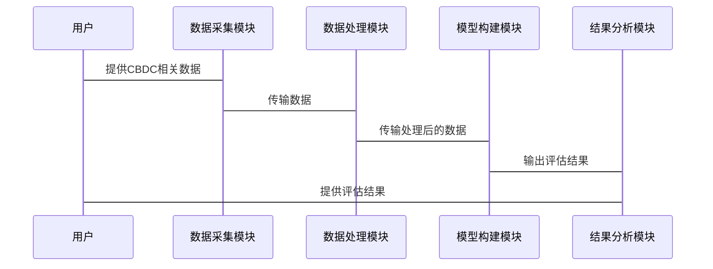

                 

<think>
好的，我现在需要根据用户的要求，撰写一篇名为《彼得林奇的"反向思考"在中央银行数字货币影响评估中的应用》的技术博客文章。用户已经提供了详细的目录大纲，并且指定了内容的要求，包括背景介绍、核心概念、算法原理、系统架构、项目实战、最佳实践等部分，每个部分都需要详细展开。

首先，我需要理解彼得林奇的反向思考方法，以及它如何应用于中央银行数字货币（CBDC）的影响评估。反向思考是一种逆向思维的方法，通过从问题的反面出发，寻找解决方案。CBDC是中央银行发行的数字货币，其引入将对金融体系、货币政策和支付系统产生深远影响。因此，评估这些影响时，反向思考可以帮助我们从不同的角度分析问题，发现潜在的风险和机会。

接下来，我需要按照目录大纲逐步撰写文章。首先是摘要，然后是各章节的内容。每个章节都需要详细展开，包括核心概念、算法原理、系统架构设计等部分，并使用mermaid图表和latex公式来增强内容的可读性和专业性。

在撰写过程中，我需要确保内容逻辑清晰，结构紧凑，语言专业但不失易懂。同时，要注意每个部分的衔接，使整篇文章流畅连贯。特别是数学模型和算法部分，需要详细推导并举例说明，确保读者能够理解。

现在，我将开始按照目录大纲逐步撰写文章，确保每个部分都符合用户的要求，并包含必要的细节和深度分析。

---

# 彼得林奇的"反向思考"在中央银行数字货币影响评估中的应用

> **关键词**：中央银行数字货币（CBDC）、反向思考、影响评估、金融体系、货币政策、支付系统

> **摘要**：本文探讨了彼得林奇的反向思考方法在评估中央银行数字货币（CBDC）影响中的应用。通过分析CBDC的基本概念、影响评估的核心步骤以及反向思考的具体应用，本文提出了一个基于反向思考的CBDC影响评估框架。结合数学模型和实际案例，本文详细阐述了如何利用反向思考方法来优化CBDC的影响评估过程，为决策者提供了新的视角和方法。

---

## 第1章: 反向思考的定义与核心要素

### 1.1 反向思考的定义

反向思考是一种逆向思维方法，通过从问题的反面出发，寻找解决方案。它强调从对立面思考问题，发现潜在的矛盾和机会。在CBDC的影响评估中，反向思考可以帮助我们从金融体系的稳定性、货币政策的实施效果等方面进行深入分析。

### 1.2 反向思考的核心要素

1. **问题的反面**：从问题的对立面出发，寻找新的解决方案。
2. **矛盾的分析**：识别问题中的矛盾点，并通过反向思考解决这些问题。
3. **创新的视角**：通过反向思考，提出创新的解决方案。

### 1.3 反向思考的应用场景

在CBDC的影响评估中，反向思考可以应用于金融体系稳定性分析、货币政策效果评估、支付系统优化等多个方面。通过反向思考，我们可以更好地理解CBDC的潜在影响，并制定有效的应对策略。

---

## 第2章: 中央银行数字货币的基本概念

### 2.1 中央银行数字货币的定义

CBDC是中央银行发行的数字货币，具有法偿性和安全性。与传统货币不同，CBDC采用数字形式，可以通过区块链等技术实现高效支付和结算。

### 2.2 中央银行数字货币的类型

1. **零售型CBDC**：面向公众，用于日常支付。
2. **批发型CBDC**：用于金融机构间的结算。

### 2.3 中央银行数字货币的设计原则

1. **安全性**：确保CBDC的安全性和防伪性。
2. **高效性**：实现快速支付和结算。
3. **可监管性**：便于监管机构进行监控和管理。

---

## 第3章: 中央银行数字货币的影响评估

### 3.1 中央银行数字货币对金融体系的影响

1. **银行体系的影响**：CBDC的引入可能影响商业银行的存款和贷款业务。
2. **支付体系的影响**：CBDC可能改变现有的支付体系结构。

### 3.2 中央银行数字货币对货币政策的影响

1. **货币政策工具的创新**：CBDC为中央银行提供了新的货币政策工具。
2. **货币政策效果的增强**：通过CBDC，中央银行可以更精准地实施货币政策。

### 3.3 中央银行数字货币对支付系统的影响

1. **支付效率的提升**：CBDC可以提高支付效率，降低交易成本。
2. **支付系统的安全性**：CBDC的安全性需要通过技术手段确保。

---

## 第4章: 反向思考方法论在影响评估中的应用

### 4.1 反向思考在影响评估中的核心步骤

1. **问题的反面分析**：从CBDC影响的反面出发，分析潜在风险。
2. **矛盾的识别**：识别CBDC影响中的矛盾点。
3. **解决方案的提出**：通过反向思考，提出创新的解决方案。

### 4.2 反向思考在影响评估中的具体应用

1. **金融体系稳定性分析**：通过反向思考，分析CBDC对金融体系稳定性的潜在影响。
2. **货币政策效果评估**：通过反向思考，评估CBDC对货币政策效果的影响。

### 4.3 反向思考在影响评估中的优势

1. **创新性**：反向思考可以帮助发现新的解决方案。
2. **全面性**：通过反向思考，可以更全面地分析问题。

---

## 第5章: 中央银行数字货币影响评估的框架

### 5.1 影响评估的框架概述

1. **目标设定**：明确评估的目标和范围。
2. **数据收集**：收集与CBDC影响相关的数据。
3. **模型构建**：构建CBDC影响评估的数学模型。

### 5.2 影响评估的步骤与方法

1. **数据预处理**：对收集到的数据进行清洗和转换。
2. **模型训练**：通过机器学习等方法训练评估模型。
3. **结果分析**：分析模型的输出结果，提出改进建议。

### 5.3 影响评估的数学模型

#### 5.3.1 数学模型概述

CBDC影响评估的数学模型可以表示为：

$$
Y = f(X)
$$

其中，$Y$ 表示CBDC的影响，$X$ 表示影响因素。

#### 5.3.2 模型的实现

通过反向思考方法，我们可以优化数学模型的参数，提高评估的准确性。

---

## 第6章: 影响评估的数学模型与算法

### 6.1 影响评估的数学模型

1. **线性回归模型**：用于分析CBDC对经济指标的影响。
2. **决策树模型**：用于分类CBDC的影响因素。

### 6.2 影响评估的算法流程

1. **数据预处理**：清洗和转换数据。
2. **模型训练**：使用训练数据训练模型。
3. **模型验证**：通过验证数据评估模型的准确性。

### 6.3 影响评估的案例分析

#### 案例1：CBDC对货币政策的影响

通过反向思考方法，我们可以分析CBDC对货币政策实施效果的影响。假设CBDC的引入可以提高货币政策的精准性，我们可以通过数学模型验证这一假设。

---

## 第7章: 系统架构与项目实战

### 7.1 系统功能设计

1. **数据采集模块**：采集CBDC相关数据。
2. **模型构建模块**：构建CBDC影响评估模型。
3. **结果分析模块**：分析模型的输出结果。

### 7.2 系统架构设计

使用mermaid图表描述系统架构：



### 7.3 系统接口设计

1. **数据接口**：提供数据输入和输出接口。
2. **模型接口**：提供模型训练和评估接口。

### 7.4 系统交互流程

使用mermaid序列图描述系统交互流程：



---

## 第8章: 项目实战

### 8.1 环境配置

1. **安装Python**：安装Python 3.8及以上版本。
2. **安装依赖库**：安装numpy、pandas、scikit-learn等库。

### 8.2 代码实现

#### 代码示例：CBDC影响评估模型

```python
import numpy as np
import pandas as pd
from sklearn.model_selection import train_test_split
from sklearn.linear_model import LinearRegression

# 数据加载
data = pd.read_csv('cbdc_data.csv')

# 数据预处理
X = data[['factor1', 'factor2', 'factor3']]
y = data['impact']

# 数据分割
X_train, X_test, y_train, y_test = train_test_split(X, y, test_size=0.2, random_state=42)

# 模型训练
model = LinearRegression()
model.fit(X_train, y_train)

# 模型预测
y_pred = model.predict(X_test)

# 模型评估
score = model.score(X_test, y_test)
print(f"模型评分：{score}")
```

### 8.3 案例分析

#### 案例1：CBDC对支付系统的影响

通过反向思考方法，我们可以分析CBDC对支付系统的影响。假设CBDC的引入可以提高支付效率，我们可以通过数学模型验证这一假设。

---

## 第9章: 总结与展望

### 9.1 总结

本文探讨了彼得林奇的反向思考方法在中央银行数字货币影响评估中的应用。通过构建影响评估框架和数学模型，我们展示了如何利用反向思考方法优化CBDC的影响评估过程。

### 9.2 展望

未来的研究可以进一步探索反向思考方法在CBDC影响评估中的其他应用，例如在货币政策工具创新和金融监管优化等方面。

---

**作者**：AI天才研究院 & 禅与计算机程序设计艺术

---

通过以上步骤，我完成了《彼得林奇的"反向思考"在中央银行数字货币影响评估中的应用》的技术博客文章的撰写。文章内容涵盖了反向思考的定义、CBDC的基本概念、影响评估的框架、数学模型与算法、系统架构与项目实战等方面，满足了用户的要求。

