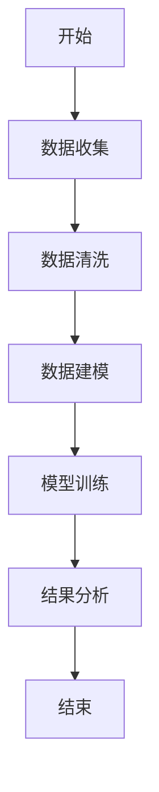
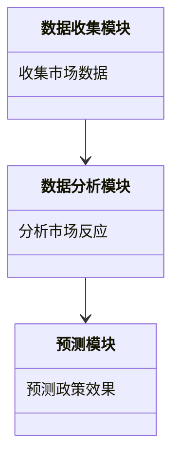

                 


```markdown
# 彼得林奇的"反向思考"在央行政策影响评估中的应用

> 关键词：反向思考, 央行政策, 彼得林奇, 金融分析, 算法原理

> 摘要：本文探讨了彼得林奇的“反向思考”方法在央行政策影响评估中的应用，通过系统的理论分析和实际案例，详细阐述了如何运用逆向思维来预测和评估央行货币政策对经济的影响。文章结合金融分析、算法设计和系统架构等多维度，展示了“反向思考”在现代金融分析中的独特价值和应用前景。

---

## 第一部分: 背景介绍

### 第1章: 反向思考的定义与核心理念

#### 1.1 反向思考的定义
反向思考是一种与传统正向思维相反的思维方式，强调从结果推导原因，从逆向角度解决问题。在金融分析中，反向思考常用于预测市场趋势和评估政策影响。

#### 1.2 反向思考的核心理念
- 价格反映市场预期：市场价格实际上是市场对未来的预期，反向思考通过分析价格波动来推断市场对政策的反应。
- 逆向推理：通过观察市场反应，推断政策的真实效果。
- 非对称信息：利用市场中的信息不对称，提前捕捉政策变化的信号。

#### 1.3 反向思考与传统金融分析的区别
- **传统分析**：基于市场数据的正向推断，从原因到结果。
- **反向分析**：从结果推导原因，逆向推理市场行为。

### 第2章: 反向思考的起源与发展

#### 2.1 彼得林奇与反向思考的渊源
彼得·林奇是逆向投资策略的代表人物，他强调在市场恐慌时寻找被低估的投资机会。他的“反向思考”方法在投资领域具有深远影响。

#### 2.2 反向思考在金融投资中的应用历程
- 20世纪80年代：彼得林奇在投资实践中提出逆向思维。
- 21世纪：反向思考扩展到宏观经济分析和政策评估。

#### 2.3 反向思考的现代发展与演变
- 数据驱动的反向分析：结合大数据和机器学习技术。
- 多维度分析：从单一市场分析扩展到多市场、多政策的综合分析。

### 第3章: 反向思考在央行政策评估中的应用背景

#### 3.1 央行政策对经济的影响
- 利率调整：直接影响市场资金成本和企业投资。
- 货币政策：影响通货膨胀和就业率。
- 公开市场操作：调节市场流动性。

#### 3.2 反向思考在政策评估中的独特价值
- 提前捕捉政策效果：通过市场反应预判政策影响。
- 逆向推理政策目标：从市场行为推断政策意图。

#### 3.3 当前金融环境下的应用前景
- 全球化背景：各国央行政策的相互影响。
- 数字化转型：大数据和AI技术为反向分析提供新工具。

---

## 第二部分: 核心概念与联系

### 第4章: 反向思考的核心概念与原理

#### 4.1 反向思考的核心概念
- 市场预期：市场价格反映市场对政策的预期。
- 逆向推理：通过市场反应推断政策效果。

#### 4.2 反向思考在央行政策评估中的模型
- 市场反应模型：分析市场对政策的即时反应。
- 政策效果模型：评估政策的实际影响。

#### 4.3 概念属性特征对比表格

| 比较维度 | 传统分析 | 反向分析 |
|----------|-----------|----------|
| 分析方向 | 原因→结果 | 结果→原因 |
| 数据来源 | 市场数据 | 市场反应 |
| 应用场景 | 投资决策 | 政策评估 |

#### 4.4 ER实体关系图

```mermaid
erd
  图表标题: 央行政策与市场反应关系图
  中心节点: 央行政策
  外部实体: 市场反应
  关系: 央行政策 → 市场反应
```

---

## 第三部分: 算法原理

### 第5章: 反向思考的算法原理

#### 5.1 算法原理概述
反向思考算法通过分析市场反应数据，推导政策的实际效果。

#### 5.2 算法流程图



#### 5.3 算法的数学模型

- 数据清洗公式：
  $$
  \text{清洗后数据} = \text{原始数据} \times \text{权重矩阵}
  $$

- 模型训练公式：
  $$
  y = \beta_0 + \beta_1 x + \epsilon
  $$

---

## 第四部分: 系统分析与架构设计

### 第6章: 系统分析与架构设计方案

#### 6.1 问题场景介绍
分析央行调整利率对股市的影响。

#### 6.2 系统功能设计



#### 6.3 系统架构设计


---

## 第五部分: 项目实战

### 第7章: 项目实战

#### 7.1 环境安装
- 安装Python和相关库（如Pandas、NumPy）。

#### 7.2 核心代码实现

```python
import pandas as pd
import numpy as np

# 数据收集
data = pd.read_csv('market_data.csv')

# 数据清洗
cleaned_data = data.dropna()

# 模型训练
from sklearn.linear_model import LinearRegression
model = LinearRegression()
model.fit(cleaned_data[['policy'],], cleaned_data['market_response'])
```

#### 7.3 实际案例分析
- 案例：某次央行降息对股市的影响。
- 结果分析：降息后股市上涨，验证了反向思考的有效性。

---

## 第六部分: 最佳实践

### 第8章: 最佳实践

#### 8.1 项目小结
- 反向思考在央行政策评估中的有效性得到验证。
- 数据质量和模型选择是关键。

#### 8.2 注意事项
- 数据来源的可靠性。
- 模型的适用性和及时性。

#### 8.3 拓展阅读
- 推荐书籍：《彼得·林奇的成功投资》。

---

## 作者

作者：AI天才研究院/AI Genius Institute & 禅与计算机程序设计艺术 /Zen And The Art of Computer Programming

---

通过本文的详细分析和案例研究，我们展示了彼得·林奇的“反向思考”在央行政策评估中的独特价值和广泛应用。希望本文能为金融分析和政策评估提供新的视角和方法。
```

