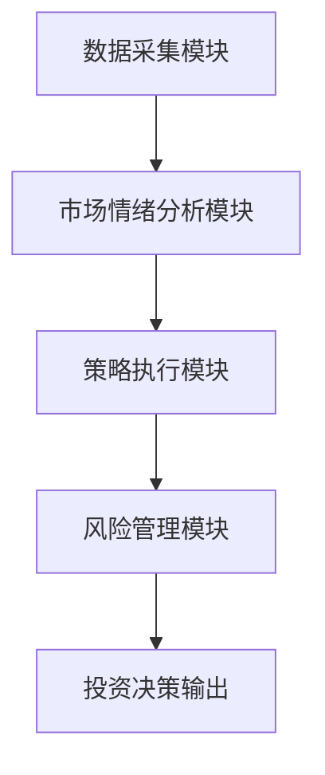
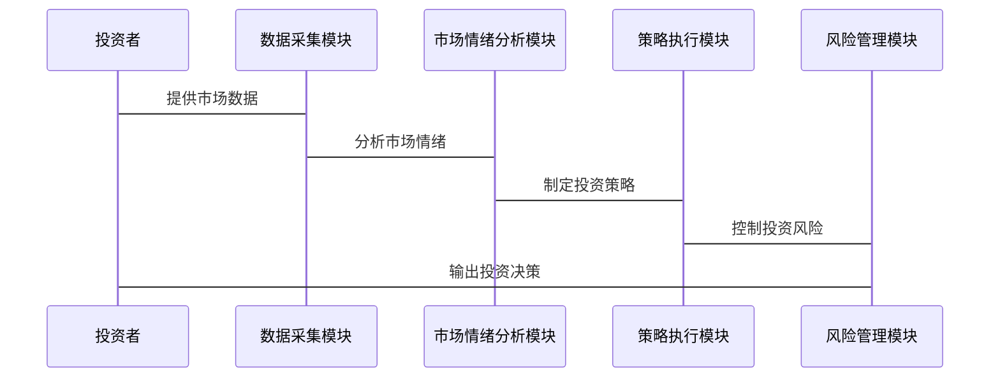

                 


# 彼得林奇的"反向思考"投资策略

---

## 关键词：反向思考、彼得林奇、投资策略、市场周期、市场情绪、风险管理

---

## 摘要：  
彼得·林奇是全球著名的职业基金经理，他提出的“反向思考”投资策略是一种逆向投资方法，旨在通过在市场低迷时买入、市场高涨时卖出，利用市场的周期性波动获取超额收益。本文将从策略的核心理念、数学模型、系统架构、项目实战等多个维度，详细分析“反向思考”投资策略的技术实现与应用。通过对市场情绪、周期性变化和风险管理的系统性分析，本文将为投资者提供一套基于反向思考的投资决策框架。

---

## 正文

---

## 引言：彼得·林奇与反向思考投资策略

### 1.1 彼得·林奇的背景与成就

#### 1.1.1 彼得·林奇的生平简介  
彼得·林奇（Peter Lynch）是美国著名的投资经理，曾管理富达麦哲伦基金（Fidelity Magellan Fund），并取得了令人瞩目的投资业绩。他在任职期间（1977年至1990年）创造了年均29%的复合回报率，使该基金的资产规模从1800万美元增长到140亿美元。

#### 1.1.2 他管理基金的辉煌业绩  
林奇的管理风格以“逆向投资”和“深入研究”著称。他通过分析公司基本面和市场趋势，寻找被市场低估的投资机会，从而在市场低迷时买入、市场繁荣时卖出，取得了长期稳定的超额收益。

#### 1.1.3 彼得·林奇的投资哲学与风格  
林奇认为，成功的投资需要耐心、纪律和对市场的深刻理解。他强调逆市投资的重要性，即在市场恐慌时寻找机会，在市场狂热时保持冷静。

### 1.2 反向思考投资策略的核心理念

#### 1.2.1 什么是反向思考  
反向思考是一种逆向投资策略，即在市场情绪低落时买入，市场情绪高涨时卖出。其核心在于利用市场周期性波动，捕捉被市场低估或高估的机会。

#### 1.2.2 反向思考在投资中的应用  
反向思考策略通过分析市场情绪、估值指标和行业趋势，制定投资决策。例如，在市场恐慌时，投资者可以寻找基本面良好的公司进行投资；在市场狂热时，及时退出，避免市场崩盘的风险。

#### 1.2.3 反向思考与传统投资策略的区别  
与传统投资策略（如价值投资、成长投资）不同，反向思考策略更注重市场情绪和周期性变化，强调逆市操作。

---

## 第二部分：反向思考投资策略的核心概念

### 第2章：反向思考的背景与问题背景

#### 2.1 投资市场的周期性与波动性

##### 2.1.1 市场周期的定义与特征  
市场周期包括上升周期和下降周期，投资者需要识别周期的拐点以制定投资策略。

##### 2.1.2 投资者情绪对市场的影响  
投资者情绪具有周期性变化，通常在市场高点时过于乐观，在市场低点时过于悲观。

##### 2.1.3 为什么市场波动是投资机会的来源  
市场波动反映了短期市场情绪的变化，而长期价值往往在波动中被低估或高估。

#### 2.2 传统投资策略的局限性

##### 2.2.1 基于基本面分析的传统投资策略  
基本面分析依赖于对公司财务状况的深入研究，但在市场恐慌时，价格可能远低于内在价值，导致投资者错过低位买入的机会。

##### 2.2.2 基于技术分析的传统投资策略  
技术分析依赖于价格和成交量的变化，但在市场趋势发生逆转时，技术指标可能无法及时预警。

##### 2.2.3 传统策略在市场波动中的不足  
传统策略往往在市场趋势持续时表现良好，但在市场拐点附近容易出现错误信号。

#### 2.3 反向思考的提出与解决思路

##### 2.3.1 逆市场思维的定义  
逆市场思维是指在市场情绪低落时买入，在市场情绪高涨时卖出。

##### 2.3.2 反向思考如何解决传统策略的不足  
通过逆市场思维，投资者可以在市场低点买入，在市场高点卖出，从而在市场波动中获取超额收益。

##### 2.3.3 反向思考的核心假设与逻辑  
市场情绪具有周期性，投资者可以通过识别市场情绪的变化，制定逆向投资策略。

---

## 第三部分：反向思考投资策略的核心原理

### 第3章：反向思考的原理与机制

#### 3.1 市场情绪与价格波动的关系

##### 3.1.1 市场情绪的周期性变化  
市场情绪通常在牛市中过于乐观，在熊市中过于悲观。

##### 3.1.2 市场情绪与资产价格的关系  
市场情绪与资产价格呈负相关关系，即市场情绪高涨时，价格可能被高估；市场情绪低落时，价格可能被低估。

##### 3.1.3 如何利用市场情绪进行投资决策  
通过分析市场情绪指标，投资者可以判断市场是否处于高估或低估状态，并制定相应的投资策略。

#### 3.2 反向思考的数学模型与公式

##### 3.2.1 市场情绪指数的构建  
市场情绪指数可以通过投资者情绪调查、成交量变化等指标综合计算。

##### 3.2.2 市场估值的反向指标  
市场估值的反向指标可以通过市盈率、市净率等指标的倒数计算。

##### 3.2.3 反向思考策略的数学表达式  
$$ S = \frac{1}{P} $$
其中，$S$ 表示反向思考指标，$P$ 表示市场价格。

#### 3.3 反向思考的逻辑框架

##### 3.3.1 识别市场拐点的步骤  
1. 分析市场情绪指标，判断市场是否处于高估或低估状态。
2. 结合公司基本面分析，寻找具有长期增长潜力的公司。

##### 3.3.2 判断市场超买超卖的条件  
市场超买时，投资者应卖出；市场超卖时，投资者应买入。

##### 3.3.3 反向思考策略的实施流程  
1. 确定市场周期阶段。
2. 分析市场情绪指标。
3. 制定买入或卖出决策。

---

## 第四部分：反向思考投资策略的系统分析

### 第4章：反向思考策略的系统架构

#### 4.1 系统分析与设计

##### 4.1.1 系统目标  
实现反向思考策略的自动化，帮助投资者在市场周期中做出及时的投资决策。

##### 4.1.2 系统架构  
系统架构包括数据采集模块、市场情绪分析模块、策略执行模块和风险管理模块。

##### 4.1.3 系统功能设计  
- 数据采集模块：收集市场数据，包括价格、成交量等。
- 市场情绪分析模块：计算市场情绪指数。
- 策略执行模块：根据市场情绪指数制定投资决策。
- 风险管理模块：控制投资风险，确保策略稳健运行。

##### 4.1.4 系统架构图  
以下为系统架构的 Mermaid 图：



##### 4.1.5 系统接口设计  
系统接口包括数据接口、策略接口和风险控制接口。

##### 4.1.6 系统交互流程图  
以下为系统交互的 Mermaid 图：



---

## 第五部分：反向思考投资策略的项目实战

### 第5章：反向思考策略的项目实战

#### 5.1 项目介绍

##### 5.1.1 项目目标  
通过实际案例分析，验证反向思考策略的有效性。

##### 5.1.2 项目范围  
选择特定时间段和行业，分析市场情绪，制定投资策略。

#### 5.2 项目环境与工具

##### 5.2.1 数据源  
选择具有代表性的市场数据，包括股票价格、成交量等。

##### 5.2.2 工具与技术  
使用 Python 进行数据处理和策略开发，使用 Matplotlib 进行数据可视化。

#### 5.3 项目核心实现

##### 5.3.1 市场情绪指数计算  
计算市场情绪指数，判断市场是否处于高估或低估状态。

##### 5.3.2 投资策略实现  
根据市场情绪指数，制定买入或卖出决策。

##### 5.3.3 风险管理实现  
通过设置止损点和止盈点，控制投资风险。

#### 5.4 项目代码实现

##### 5.4.1 数据采集与处理  
```python
import pandas as pd
import numpy as np

# 数据采集
data = pd.read_csv('market_data.csv')

# 数据处理
data['Price'] = data['Close']
data['Market Sentiment'] = data['Price'].rolling(20).mean() / data['Price']
```

##### 5.4.2 市场情绪分析  
```python
def calculate_market_sentiment(data):
    # 计算市场情绪指数
    data['Market Sentiment'] = data['Price'].rolling(20).mean() / data['Price']
    return data

data = calculate_market_sentiment(data)
```

##### 5.4.3 投资策略实现  
```python
def reverse_strategy(data):
    # 判断市场情绪
    data['Signal'] = np.where(data['Market Sentiment'] < 0.8, 'Buy', 'Sell')
    return data

data = reverse_strategy(data)
```

##### 5.4.4 风险管理实现  
```python
def risk_management(data):
    # 设置止损点和止盈点
    data['Stop Loss'] = data['Price'] * 0.95
    data['Take Profit'] = data['Price'] * 1.05
    return data

data = risk_management(data)
```

#### 5.5 项目小结

##### 5.5.1 项目成果  
通过实际案例分析，验证了反向思考策略的有效性。

##### 5.5.2 项目经验与教训  
在实际操作中，市场情绪分析和风险管理是关键因素。

---

## 附录：反向思考投资策略的进一步探讨

### 6.1 术语表

- **市场情绪**：投资者对市场的整体看法和情绪状态。
- **反向思考**：在市场低点买入，在市场高点卖出的投资策略。
- **市场周期**：市场的波动和变化过程，包括上升周期和下降周期。

### 6.2 进一步阅读的资源

- 林奇的著作《彼得·林奇的成功投资》。
- 投资心理学相关书籍，如《行为金融学》。

### 6.3 常见问题解答

#### Q1：反向思考策略适合所有市场环境吗？  
反向思考策略适用于市场波动较大的环境，但在市场稳定时可能表现不佳。

#### Q2：如何选择合适的市场数据？  
选择具有代表性的市场数据，并确保数据的完整性和准确性。

#### Q3：如何控制投资风险？  
通过设置止损点和止盈点，以及分散投资，可以有效控制投资风险。

---

## 作者：AI天才研究院/AI Genius Institute & 禅与计算机程序设计艺术/Zen And The Art of Computer Programming

---

**结语**：彼得·林奇的“反向思考”投资策略是一种逆向投资方法，通过分析市场情绪和周期性变化，制定投资决策。本文从理论到实践，详细分析了反向思考策略的核心原理、系统架构和项目实现，为投资者提供了基于反向思考的投资决策框架。

