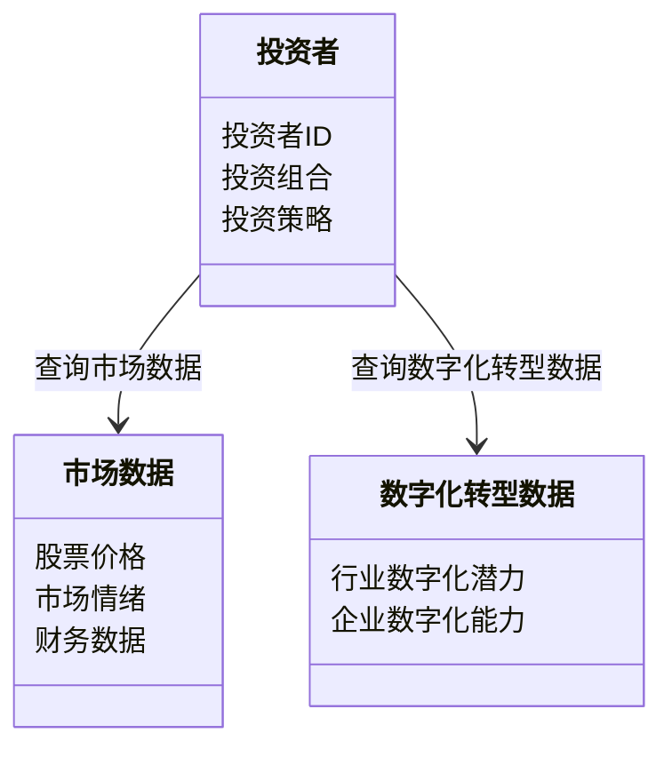
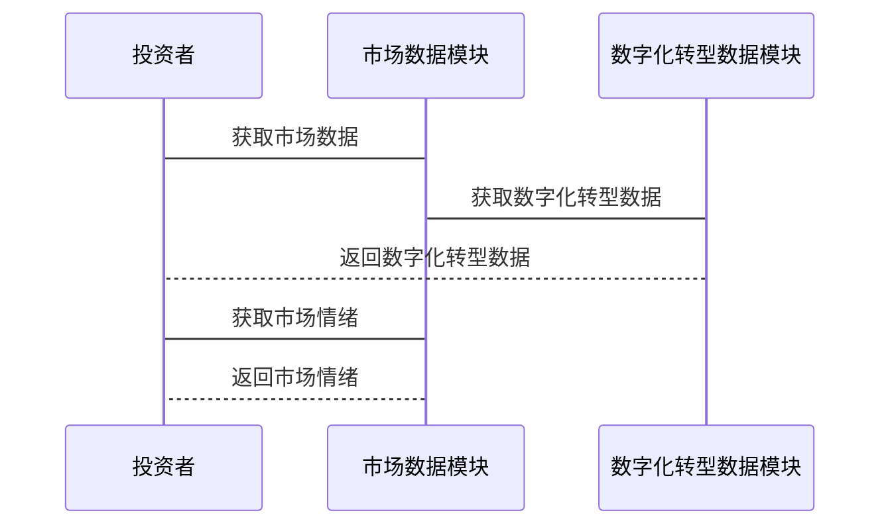

                 


# 彼得林奇的"反向投资"在传统行业数字化转型中的机会识别

**关键词**：反向投资、数字化转型、机会识别、传统行业、投资策略、市场周期、价值评估

**摘要**：  
本文将探讨彼得林奇的反向投资策略在传统行业数字化转型中的应用。通过分析反向投资的核心概念、数字化转型的背景与挑战，以及两者的结合，本文揭示了如何在传统行业中识别数字化转型带来的投资机会。通过数学模型、算法原理和系统架构设计，本文为读者提供了一套基于反向投资策略的数字化转型机会识别方法，并结合实际案例进行了详细分析。

---

## 第一部分：彼得林奇的“反向投资”与数字化转型概述

### 第1章：彼得林奇的“反向投资”概述

#### 1.1 反向投资的核心概念

##### 1.1.1 价值投资的基本原理
反向投资的核心理念来源于价值投资，强调以低于内在价值的价格买入资产。彼得林奇认为，市场恐慌时，投资者往往低估了资产的真实价值，此时是买入的最佳时机。  
**公式：**  
$$ \text{内在价值} = \frac{\text{未来现金流}}{\text{折现率}} $$  
例如，假设某公司的未来现金流为 $100，折现率为 $5，则其内在价值为 $20。

##### 1.1.2 市场情绪与逆向思维
反向投资的关键在于逆市场情绪而行。当市场情绪高涨时，投资者往往高估资产价格；当市场恐慌时，投资者低估资产价格。这种情绪波动为反向投资者提供了套利机会。

##### 1.1.3 反向投资的策略与原则
彼得林奇的反向投资策略包括以下原则：  
1. 长期投资，避免短期波动的干扰。  
2. 选择基本面良好但被市场低估的资产。  
3. 在市场恐慌时增加投资，市场狂热时减少投资。

#### 1.2 数字化转型的背景与挑战

##### 1.2.1 数字化转型的定义与目标
数字化转型是指通过数字技术（如大数据、人工智能、云计算等）改造传统行业，提升效率、降低成本并创造新的业务模式。其目标是实现业务流程的数字化、智能化和自动化。

##### 1.2.2 传统行业面临的数字化转型挑战
传统行业在数字化转型中面临以下挑战：  
1. 传统业务模式与数字技术的融合难度大。  
2. 缺乏数字化人才和技术支持。  
3. 数据孤岛问题严重，难以实现数据共享。

##### 1.2.3 数字化转型的核心驱动力
数字化转型的核心驱动力包括：  
1. 技术创新（如人工智能、区块链）。  
2. 业务需求的变化（如客户期望的提升）。  
3. 竞争压力（如新兴企业的数字化竞争优势）。

---

### 第2章：反向投资与数字化转型的结合

#### 2.1 反向投资在传统行业的应用

##### 2.1.1 传统行业数字化转型的痛点
传统行业在数字化转型中面临的主要痛点包括：  
1. 技术落后，难以应对数字化挑战。  
2. 传统业务模式难以适应市场需求变化。  
3. 数字化转型成本高，回报周期长。

##### 2.1.2 反向投资在传统行业中的机会识别
反向投资的核心在于发现市场低估的资产或机会。在数字化转型中，传统行业往往因为市场恐慌或技术落后而被市场低估，这为反向投资者提供了机会。

##### 2.1.3 反向投资与数字化转型的协同效应
反向投资与数字化转型的协同效应体现在以下方面：  
1. 通过数字化技术提升传统行业的竞争力。  
2. 利用反向投资策略在数字化转型中发现低估的投资机会。

#### 2.2 数字化转型中的反向投资策略

##### 2.2.1 从市场周期视角看反向投资
市场周期分为四个阶段：繁荣、衰退、萧条、复苏。反向投资的最佳时机通常出现在市场衰退或萧条阶段。

##### 2.2.2 数字化转型中的价值发现
在数字化转型中，反向投资者可以通过以下方式发现价值：  
1. 分析传统行业的数字化转型潜力。  
2. 识别那些被市场低估但具有数字化转型潜力的企业。

##### 2.2.3 反向投资在数字化转型中的风险管理
反向投资的风险管理包括：  
1. 选择具有强大基本面的传统行业企业。  
2. 避免盲目跟风，注重长期价值。  
3. 建立合理的投资组合，分散风险。

---

## 第二部分：反向投资的核心概念与数学模型

### 第3章：反向投资的核心概念与原理

#### 3.1 反向投资的核心概念

##### 3.1.1 价值评估模型
价值评估模型是反向投资的核心工具之一。常用的价值评估模型包括：  
1. **DCF模型（ discounted cash flow model）**：用于评估资产的未来现金流。  
2. **PE模型（ price-to-earnings ratio model）**：用于评估资产的市盈率。  

##### 3.1.2 市场情绪分析模型
市场情绪分析模型用于判断市场的整体情绪，从而指导反向投资决策。常用的方法包括：  
1. 基于新闻 sentiment 的情绪分析。  
2. 基于交易量的情绪分析。

##### 3.1.3 数字化转型中的机会识别模型
机会识别模型用于在数字化转型中发现投资机会。模型包括以下步骤：  
1. 识别传统行业的数字化转型潜力。  
2. 评估企业的基本面和数字化转型能力。  
3. 判断市场情绪，寻找被低估的投资机会。

#### 3.2 数字化转型中的反向投资分析

##### 3.2.1 数字化转型中的市场机会识别
在数字化转型中，反向投资者可以通过以下方式识别市场机会：  
1. 分析行业的数字化转型趋势。  
2. 识别那些被市场低估但具有数字化转型潜力的企业。

##### 3.2.2 反向投资与数字化转型的结合模型
结合模型包括以下步骤：  
1. 选择具有数字化转型潜力的传统行业。  
2. 分析企业的基本面和数字化转型能力。  
3. 判断市场情绪，寻找被低估的投资机会。

---

### 第4章：反向投资的数学模型与算法

#### 4.1 反向投资的数学模型

##### 4.1.1 价值评估模型
价值评估模型用于评估资产的未来现金流。公式如下：  
$$ \text{内在价值} = \sum_{t=1}^{n} \frac{CF_t}{(1 + r)^t} $$  
其中，$CF_t$ 是第 $t$ 年的现金流，$r$ 是折现率。

##### 4.1.2 市场情绪分析模型
市场情绪分析模型用于判断市场的整体情绪。公式如下：  
$$ \text{市场情绪指数} = \frac{\sum \text{情绪得分}}{n} $$  
其中，$\text{情绪得分}$ 是每条新闻的情绪得分，$n$ 是新闻总数。

##### 4.1.3 数字化转型中的机会识别模型
机会识别模型用于在数字化转型中发现投资机会。公式如下：  
$$ \text{机会评分} = \alpha \times \text{基本面评分} + \beta \times \text{数字化转型潜力评分} $$  
其中，$\alpha$ 和 $\beta$ 是权重系数，$\text{基本面评分}$ 和 $\text{数字化转型潜力评分}$ 是评分指标。

#### 4.2 算法原理与实现

##### 4.2.1 基于机器学习的市场情绪分析
基于机器学习的市场情绪分析算法如下：  
1. 收集市场新闻数据。  
2. 使用自然语言处理技术（NLP）提取新闻情绪。  
3. 训练情绪分类模型。  
4. 评估模型性能。  
5. 应用模型进行市场情绪分析。

##### 4.2.2 数字化转型中的机会识别算法
机会识别算法如下：  
1. 收集传统行业的数字化转型数据。  
2. 使用聚类分析识别潜力企业。  
3. 训练机会评分模型。  
4. 应用模型进行机会识别。

##### 4.2.3 反向投资策略的优化与实现
反向投资策略的优化包括：  
1. 调整价值评估模型的参数。  
2. 优化市场情绪分析模型的算法。  
3. 提高机会识别模型的准确率。

---

## 第三部分：系统分析与架构设计

### 第5章：数字化转型中的系统分析

#### 5.1 问题场景介绍

##### 5.1.1 传统行业数字化转型的痛点
传统行业在数字化转型中面临的主要痛点包括：  
1. 技术落后，难以应对数字化挑战。  
2. 传统业务模式难以适应市场需求变化。  
3. 数字化转型成本高，回报周期长。

##### 5.1.2 反向投资在数字化转型中的应用
反向投资在数字化转型中的应用包括：  
1. 识别被低估的传统行业企业。  
2. 分析企业的数字化转型潜力。  
3. 判断市场情绪，寻找投资机会。

#### 5.2 项目介绍

##### 5.2.1 项目背景
本项目旨在通过反向投资策略在传统行业数字化转型中识别投资机会。

##### 5.2.2 项目目标
本项目的目标是：  
1. 构建反向投资与数字化转型结合的分析模型。  
2. 开发基于机器学习的市场情绪分析系统。  
3. 实现机会识别算法，并应用于实际案例。

---

### 第6章：系统架构设计

#### 6.1 系统功能设计

##### 6.1.1 领域模型类图
领域模型类图展示了系统的各个模块及其关系。  


##### 6.1.2 系统架构图
系统架构图展示了系统的整体架构。  


##### 6.1.3 系统交互序列图
系统交互序列图展示了投资者与系统之间的交互流程。  


---

### 第7章：项目实战

#### 7.1 环境安装

##### 7.1.1 安装Python
```bash
python --version
pip install --upgrade pip
```

##### 7.1.2 安装依赖库
```bash
pip install numpy pandas scikit-learn
```

#### 7.2 系统核心实现源代码

##### 7.2.1 价值评估模型实现
```python
import numpy as np

def calculate_intrinsic_value(cash_flows, discount_rate):
    return np.sum(cash_flows / (1 + discount_rate) ** np.arange(len(cash_flows)))

cash_flows = [100, 150, 200]
discount_rate = 0.05
intrinsic_value = calculate_intrinsic_value(cash_flows, discount_rate)
print(f"内在价值为：{intrinsic_value}")
```

##### 7.2.2 机会识别算法实现
```python
from sklearn.cluster import KMeans

def cluster_businesses(businesses, n_clusters):
    model = KMeans(n_clusters=n_clusters)
    model.fit(businesses)
    return model.labels_

businesses = [[2, 3], [4, 5], [6, 7]]
n_clusters = 2
labels = cluster_businesses(businesses, n_clusters)
print(f"聚类结果为：{labels}")
```

---

## 第四部分：最佳实践与总结

### 第8章：最佳实践

#### 8.1 投资策略 tips
1. 在市场恐慌时增加投资，市场狂热时减少投资。  
2. 选择基本面良好且具有数字化转型潜力的企业。  
3. 建立合理的投资组合，分散风险。

#### 8.2 系统设计 tips
1. 使用机器学习算法进行市场情绪分析。  
2. 构建领域模型类图，明确系统模块之间的关系。  
3. 设计合理的系统架构，确保系统的可扩展性和可维护性。

### 第9章：小结

本文通过分析彼得林奇的反向投资策略，探讨了其在传统行业数字化转型中的应用。通过数学模型、算法实现和系统架构设计，本文为读者提供了一套基于反向投资策略的数字化转型机会识别方法。希望本文能够为传统行业数字化转型中的投资机会识别提供有价值的参考。

### 第10章：注意事项

1. 反向投资需要长期投资，避免短期波动的干扰。  
2. 数字化转型中的机会识别需要结合企业的基本面和数字化转型潜力。  
3. 市场情绪分析需要结合实际情况，避免过度依赖模型。

### 第11章：拓展阅读

1. 彼得林奇的《投资最重要的事情》。  
2. 数字化转型相关的技术书籍（如《数字化转型：方法与实践》）。  
3. 机器学习与数据挖掘相关的技术书籍（如《机器学习实战》）。

---

**作者：AI天才研究院/AI Genius Institute & 禅与计算机程序设计艺术 /Zen And The Art of Computer Programming**

