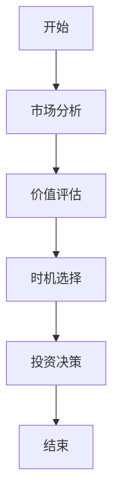
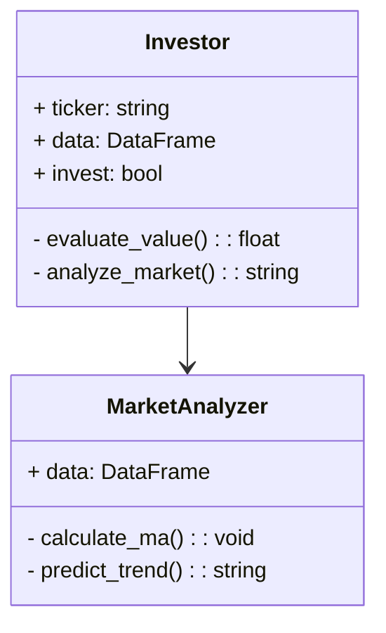
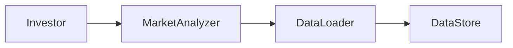

                 


# 彼得林奇的"反向投资"在传统行业智能化转型中的应用

> **关键词**：反向投资、彼得·林奇、智能化转型、传统行业、投资策略  
> **摘要**：本文探讨了彼得·林奇的反向投资策略在传统行业智能化转型中的应用。通过分析反向投资的原理和策略，结合数学模型和系统架构设计，展示了如何利用反向思维优化传统行业的数字化转型，提供实际案例分析和最佳实践建议。

---

## 引言

### 1.1 反向投资的基本概念

#### 1.1.1 投资的基本概念
投资是将资金投入到某个领域以期望获得收益的行为。投资的核心在于识别价值，并在合适的时间进行买入或卖出。成功的投资需要对市场趋势、行业动态以及经济周期有深刻的理解。

#### 1.1.2 反向投资的定义与特点
反向投资是一种投资策略，强调在市场低迷时买入，市场繁荣时卖出。其特点包括逆周期性、价值发现和长期视角。反向投资者倾向于在市场恐慌时寻找被低估的机会，而在市场狂热时保持冷静。

#### 1.1.3 反向投资的核心理念
反向投资的核心理念是逆市场情绪操作。当市场情绪过于乐观时，反向投资者会保持谨慎；当市场情绪低落时，他们会积极寻找投资机会。这种策略强调独立思考和长期价值。

---

### 1.2 彼得·林奇的投资策略

#### 1.2.1 彼得·林奇的投资风格
彼得·林奇是全球著名投资家，以其成功的共同基金管理经验闻名。他的投资风格注重基本面分析，寻找那些具有持续增长潜力的公司，并长期持有。

#### 1.2.2 反向投资在林奇策略中的应用
林奇在其投资生涯中，多次运用反向投资策略。例如，在20世纪80年代初，他通过投资那些因市场恐慌而被低估的优质股票，取得了显著的收益。

#### 1.2.3 林奇策略的成功案例
以可口可乐为例，林奇在该公司股价低迷时进行投资，并长期持有，最终获得了丰厚的回报。这一案例展示了反向投资在价值发现中的有效性。

---

### 1.3 传统行业智能化转型的背景

#### 1.3.1 传统行业的现状与挑战
传统行业如制造、零售和金融等行业，正面临数字化转型的压力。技术进步和市场竞争要求企业必须采用智能化手段，以提高效率和竞争力。

#### 1.3.2 智能化转型的必要性
智能化转型是传统行业应对市场竞争和技术创新的必经之路。通过引入人工智能、大数据和物联网等技术，企业可以实现业务流程的优化和创新。

#### 1.3.3 反向投资在转型中的作用
反向投资可以帮助企业在市场低迷时抓住转型机会，通过投资技术升级和数字化转型，提升企业的长期竞争力。

---

## 第二部分：核心概念与联系

### 2.1 反向投资的原理

#### 2.1.1 市场周期分析
市场周期分为上升和下降阶段。反向投资者在市场低谷时买入，在市场高点时卖出。这种策略要求对市场周期有准确的判断。

#### 2.1.2 价值评估与市场定价
反向投资者关注的是内在价值，而非市场情绪。当市场价格低于内在价值时，投资机会出现。

#### 2.1.3 投资时机的选择
时机选择是反向投资的关键。投资者需要识别市场恐慌和理性之间的区别，并在合适时机进行操作。

---

### 2.2 反向投资与传统行业转型的联系

#### 2.2.1 反向思维在转型中的应用
传统行业在智能化转型中，常常面临技术落后和市场萎缩的问题。反向思维可以帮助企业发现转型机会，通过技术投资和业务模式创新，实现弯道超车。

#### 2.2.2 逆周期投资策略与行业调整
在行业低谷时，企业可以利用反向投资策略，进行技术改造和市场拓展。这种逆周期操作可以帮助企业在行业复苏时占据有利位置。

---

## 第三部分：算法原理讲解

### 3.1 算法原理

#### 3.1.1 反向投资的算法步骤
1. 市场分析：识别市场周期和趋势。
2. 价值评估：计算资产的内在价值。
3. 时机选择：确定买入或卖出的最佳时机。
4. 投资决策：根据分析结果进行投资操作。

#### 3.1.2 算法流程图


#### 3.1.3 算法实现代码
```python
def reverse_investing(ticker):
    import pandas as pd
    import numpy as np
    data = pd.read_csv(f'data/{ticker}.csv')
    # 计算移动平均线
    ma = data['Close'].rolling(20).mean()
    # 识别市场周期
    data['Market_Trend'] = np.where(data['Close'] > ma, 'Up', 'Down')
    # 计算内在价值
    data['Intrinsic_Value'] = data['Close'] * 0.8  # 示例计算
    # 时机选择
    data['Investment_Flag'] = np.where((data['Market_Trend'] == 'Down') & 
                                        (data['Close'] < data['Intrinsic_Value']), 
                                        True, False)
    return data.tail(1)['Investment_Flag'].values[0]
```

---

## 第四部分：数学模型与公式

### 4.1 数学模型

#### 4.1.1 反向投资的价值评估模型
$$ V = \frac{E}{k} $$
其中，\( V \) 是内在价值，\( E \) 是企业盈利，\( k \) 是折现率。

#### 4.1.2 市场趋势预测模型
$$ T = \sum_{i=1}^{n} (P_i - V_i) $$
其中，\( T \) 是市场趋势指标，\( P_i \) 是市场价，\( V_i \) 是内在价值。

---

## 第五部分：系统分析与架构设计

### 5.1 系统架构设计

#### 5.1.1 系统功能设计


#### 5.1.2 系统架构图


---

## 第六部分：项目实战

### 6.1 项目环境与核心代码

#### 6.1.1 项目环境
- 数据来源：历史股价数据
- 工具：Python、Pandas、Matplotlib
- 目标：通过反向投资策略，实现自动化投资决策。

#### 6.1.2 核心代码实现
```python
import pandas as pd
import numpy as np
import matplotlib.pyplot as plt

# 加载数据
data = pd.read_csv('example.csv')

# 反向投资策略实现
def reverse_invest(data):
    ma = data['Close'].rolling(20).mean()
    data['Market_Trend'] = np.where(data['Close'] > ma, 'Up', 'Down')
    data['Intrinsic_Value'] = data['Close'] * 0.8
    data['Investment_Flag'] = np.where((data['Market_Trend'] == 'Down') & 
                                        (data['Close'] < data['Intrinsic_Value']), 
                                        True, False)
    return data

# 可视化
data_with_signals = reverse_invest(data)
plt.plot(data_with_signals['Close'], label='Price')
plt.plot(data_with_signals[数据['Investment_Flag']], '--', label='Investment Signal')
plt.legend()
plt.show()
```

---

## 第七部分：最佳实践与结论

### 7.1 最佳实践

#### 7.1.1 独立思考与长期视角
投资者应保持独立思考，避免随市场情绪波动。

#### 7.1.2 持续学习与优化
市场变化迅速，投资者需不断学习，优化投资策略。

#### 7.1.3 控制风险
反向投资并非无风险，需合理控制仓位，分散投资。

---

### 7.2 小结

反向投资策略在传统行业智能化转型中具有重要应用价值。通过识别市场周期、评估内在价值和选择合适时机，企业可以在市场低谷期抓住转型机会，实现长期发展。

---

### 7.3 未来展望

随着人工智能和大数据技术的进步，反向投资策略将更加精准和高效。未来，投资者可以利用更复杂的模型和算法，优化投资决策，实现更高收益。

---

## 作者

**作者：AI天才研究院/AI Genius Institute & 禅与计算机程序设计艺术 /Zen And The Art of Computer Programming**

