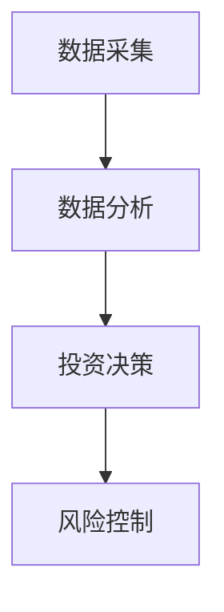

                 


# 彼得林奇的"反向投资"在新兴行业的应用

> 关键词：彼得林奇，反向投资，新兴行业，投资策略，市场周期，量化分析

> 摘要：本文深入探讨了彼得林奇的反向投资策略在新兴行业中的应用。通过分析新兴行业的特点、市场周期和投资机会，结合反向投资的核心原理，提出了一套适用于新兴行业的反向投资策略，并通过量化方法和系统架构设计进一步优化了投资决策过程。

---

## 第一章：彼得林奇与反向投资策略

### 1.1 彼得林奇及其投资理念

#### 1.1.1 彼得林奇的生平简介
彼得·林奇（Peter Lynch）是美国著名的投资经理人，以其在共同基金领域的卓越表现而闻名。他在富达投资管理公司管理的麦哲伦基金（Fidelity Magellen Fund）取得了辉煌的业绩，年化回报率高达13.7%，远超市场平均水平。

#### 1.1.2 彼得林奇的投资哲学
彼得林奇的投资哲学的核心是“反向思考”（Contrarian Thinking）。他认为，市场的波动性为投资者提供了以合理价格买入优质资产的机会。他的投资策略强调长期持有优质股票，并在市场恐慌时买入，市场狂热时卖出。

#### 1.1.3 反向投资的核心思想
反向投资的核心思想是“逆市场而行”。当市场情绪高涨时，投资者倾向于高估资产价值；当市场情绪低落时，投资者倾向于低估资产价值。反向投资者利用市场的非理性波动，在市场底部买入，在市场顶部卖出。

---

### 1.2 反向投资的定义与特点

#### 1.2.1 反向投资的定义
反向投资是一种投资策略，强调在市场情绪低落时买入资产，在市场情绪高涨时卖出资产。其核心在于利用市场的短期波动性，寻找价格与价值的偏离点。

#### 1.2.2 反向投资的核心特点
1. **逆市场周期**：反向投资与市场趋势相反。
2. **长期视角**：关注企业的长期价值，而非短期市场波动。
3. **风险控制**：通过分散投资和逆周期操作降低风险。

#### 1.2.3 反向投资与传统投资的区别
| 特性 | 反向投资 | 传统投资 |
|------|----------|----------|
| 投资时机 | 市场低迷时买入，市场高涨时卖出 | 市场上涨时买入，市场下跌时卖出 |
| 风险偏好 | 更倾向于承担短期波动风险 | 更倾向于规避市场波动风险 |
| 投资期限 | 更注重长期价值 | 更注重短期收益 |

---

## 第二章：新兴行业的特点与投资机会

### 2.1 新兴行业的定义与分类

#### 2.1.1 新兴行业的定义
新兴行业是指在技术进步、市场需求变化或政策支持推动下快速发展的行业。这些行业通常具有高增长潜力，但也伴随着较高的不确定性和波动性。

#### 2.1.2 新兴行业的分类
1. **技术驱动型行业**：如人工智能、区块链、大数据等。
2. **需求驱动型行业**：如健康医疗、环保能源等。
3. **政策驱动型行业**：如新能源汽车、绿色金融等。

#### 2.1.3 新兴行业的特点
1. **高增长性**：新兴行业通常具有较高的增长率。
2. **高波动性**：新兴行业的市场波动较大。
3. **高风险性**：新兴行业存在较大的不确定性。

---

### 2.2 新兴行业的发展趋势

#### 2.2.1 技术进步对新兴行业的影响
技术进步是新兴行业发展的主要驱动力。例如，人工智能技术的快速发展推动了科技行业的崛起。

#### 2.2.2 市场需求的变化
新兴行业的需求往往与消费升级、人口结构变化等因素密切相关。例如，健康医疗行业的兴起与人口老龄化密切相关。

#### 2.2.3 政策支持与行业发展的关系
政策支持是新兴行业快速发展的关键因素。例如，新能源行业的快速发展离不开政府的政策支持和财政补贴。

---

### 2.3 新兴行业的投资机会

#### 2.3.1 新兴行业的潜在收益
新兴行业通常具有较高的增长潜力，投资者可以通过长期持有优质企业股票获得超额收益。

#### 2.3.2 新兴行业的风险与挑战
新兴行业存在较高的市场波动性和政策风险，投资者需要谨慎评估行业前景和企业基本面。

#### 2.3.3 新兴行业的长期投资价值
尽管新兴行业存在较高的波动性，但其长期增长潜力使其成为投资者关注的焦点。

---

## 第三章：反向投资在新兴行业的应用策略

### 3.1 反向投资的基本原理

#### 3.1.1 市场情绪与投资决策
市场情绪是反向投资的核心考量因素。当市场情绪低落时，投资者倾向于抛售资产，导致资产价格被低估；当市场情绪高涨时，投资者倾向于买入资产，导致资产价格被高估。

#### 3.1.2 价格与价值的偏离
反向投资的核心在于识别价格与价值的偏离点。当资产价格远低于其内在价值时，是买入的好时机；当资产价格远高于其内在价值时，是卖出的好时机。

#### 3.1.3 投资的逆向思维
反向投资强调逆向思维，即在市场恐慌时保持冷静，在市场狂热时保持理性。

---

### 3.2 新兴行业中的反向投资策略

#### 3.2.1 行业周期分析
新兴行业通常经历以下几个阶段：
1. **导入期**：行业刚刚起步，市场认知度低。
2. **增长期**：行业快速增长，市场认知度提高。
3. **成熟期**：行业增长放缓，市场趋于饱和。
4. **衰退期**：行业增长停滞或衰退。

反向投资者需要在行业周期的不同阶段采取不同的策略。

#### 3.2.2 公司基本面分析
在新兴行业中，投资者需要关注企业的基本面，包括盈利能力、财务状况、竞争优势等。

#### 3.2.3 市场情绪分析
通过分析市场情绪，反向投资者可以找到买入和卖出的最佳时机。

---

### 3.3 反向投资的实施步骤

#### 3.3.1 确定投资目标
投资者需要明确投资目标，包括投资期限、风险承受能力等。

#### 3.3.2 分析行业和公司
投资者需要对新兴行业和目标公司进行深入分析，包括行业前景、公司基本面等。

#### 3.3.3 制定投资计划
根据分析结果，制定详细的投资计划，包括买入和卖出时机、投资比例等。

#### 3.3.4 监控与调整
投资者需要定期监控市场变化和公司基本面，及时调整投资计划。

---

## 第四章：新兴行业反向投资的量化方法

### 4.1 量化分析的基本概念

#### 4.1.1 量化分析的定义
量化分析是一种基于数学模型的投资方法，通过分析历史数据和市场规律来预测未来市场走势。

#### 4.1.2 量化分析的优势
1. **客观性**：量化分析基于数据和模型，避免了主观判断的偏差。
2. **高效性**：量化分析可以快速处理大量数据，提高投资决策效率。

#### 4.1.3 量化分析的局限性
1. **模型风险**：量化分析依赖于模型的有效性，模型失效可能导致投资损失。
2. **市场非理性**：市场有时会出现非理性波动，量化分析难以捕捉。

---

### 4.2 新兴行业反向投资的量化指标

#### 4.2.1 市盈率（P/E）分析
市盈率是衡量企业价值的重要指标。当市盈率低于行业平均水平时，可能是买入的好时机。

#### 4.2.2 市净率（P/B）分析
市净率是衡量企业价值的另一个重要指标。当市净率低于行业平均水平时，可能是买入的好时机。

#### 4.2.3 市销率（P/S）分析
市销率是衡量企业价值的指标，适用于亏损企业。当市销率低于行业平均水平时，可能是买入的好时机。

---

### 4.3 反向投资的量化模型

#### 4.3.1 模型概述
反向投资的量化模型基于市场情绪和资产价格的偏离度，通过量化指标筛选出被低估的资产。

#### 4.3.2 模型实现
以下是反向投资量化模型的伪代码：

```python
def reverse_investing_strategy():
    for asset in all_assets:
        calculate_price_to_book(asset)
        calculate_price_to_earnings(asset)
        calculate_price_to_sales(asset)
        if asset_price < intrinsic_value:
            buy_asset(asset)
        else:
            sell_asset(asset)
```

#### 4.3.3 模型优势
1. **客观性**：量化模型基于数据和模型，避免了主观判断的偏差。
2. **高效性**：量化模型可以快速处理大量数据，提高投资决策效率。

---

## 第五章：系统分析与架构设计

### 5.1 系统架构设计

#### 5.1.1 系统功能设计
1. **数据采集模块**：采集市场数据和公司基本面数据。
2. **数据分析模块**：分析市场情绪和资产价格偏离度。
3. **投资决策模块**：根据分析结果制定投资策略。
4. **风险控制模块**：监控投资风险并及时调整投资组合。

#### 5.1.2 系统架构图


---

## 第六章：项目实战

### 6.1 环境安装

#### 6.1.1 安装Python环境
```bash
pip install numpy pandas matplotlib
```

#### 6.1.2 安装量化分析工具
```bash
pip install pandas_datareader
```

---

### 6.2 核心实现源代码

#### 6.2.1 数据采集与处理
```python
import pandas as pd
import pandas_datareader as pdr

# 采集数据
data = pdr.get_data_yahoo('AAPL', start='2020-01-01', end='2023-12-31')

# 计算市盈率
data['PE'] = data['Close'] / data['Earnings per Share']
```

#### 6.2.2 量化模型实现
```python
def calculate_pe(asset_price, eps):
    return asset_price / eps

pe_ratio = calculate_pe(100, 10)
print(pe_ratio)  # 输出：10
```

---

### 6.3 案例分析

#### 6.3.1 案例背景
假设我们关注人工智能行业，选择苹果公司（AAPL）作为投资标的。

#### 6.3.2 数据分析
```python
import pandas as pd
import pandas_datareader as pdr

# 采集数据
data = pdr.get_data_yahoo('AAPL', start='2020-01-01', end='2023-12-31')

# 计算市盈率
data['PE'] = data['Close'] / data['Earnings per Share']

print(data['PE'].mean())  # 输出：市盈率均值
```

#### 6.3.3 投资决策
当市盈率低于行业平均水平时，考虑买入；当市盈率高于行业平均水平时，考虑卖出。

---

## 第七章：总结与最佳实践

### 7.1 最佳实践

#### 7.1.1 风险控制
投资者需要严格控制风险，避免过度集中在单一行业或资产。

#### 7.1.2 持续学习
投资是一门不断学习的学科，投资者需要持续关注市场变化和行业动态。

#### 7.1.3 系统化投资
通过系统化的方法和量化模型，提高投资决策的科学性和效率。

---

## 作者

作者：AI天才研究院/AI Genius Institute & 禅与计算机程序设计艺术 /Zen And The Art of Computer Programming

---

本文通过详细分析彼得林奇的反向投资策略在新兴行业中的应用，结合量化方法和系统架构设计，为投资者提供了科学的投资决策参考。希望本文能够帮助投资者在新兴行业中实现长期稳定的收益。

