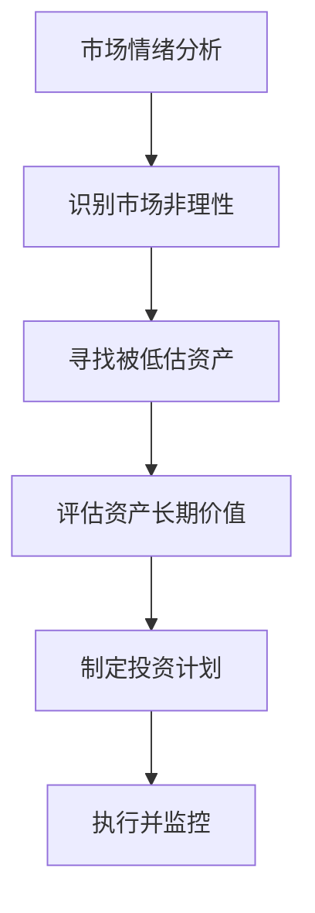
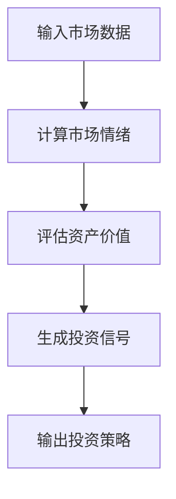

                 

<think>
好的，我需要帮用户撰写一篇关于“彼得林奇的'反向投资'成功案例”的技术博客文章。用户已经提供了一个详细的目录大纲，我需要根据这个大纲逐步完成文章的撰写。首先，我需要理解用户的具体需求和期望，确保文章的结构和内容符合他们的要求。

首先，用户希望文章以《彼得林奇的"反向投资"成功案例》为标题，使用逻辑清晰、结构紧凑、简单易懂的专业技术语言。这意味着文章需要有专业的分析，同时要保持易懂，适合技术读者阅读。文章的结构需要包括背景介绍、核心概念、算法原理、系统分析、项目实战和最佳实践等部分。

接下来，我会按照目录大纲逐步撰写每个部分的内容。在撰写过程中，我需要确保每个章节和小节都有足够的细节，并且使用用户指定的工具，如Mermaid图表和Latex公式，来增强文章的可读性和专业性。

现在，我将开始撰写文章的第一部分：反向投资的背景与核心概念。

---

# 彼得林奇的"反向投资"成功案例

> 关键词：反向投资，彼得·林奇，投资策略，价值投资，市场情绪

> 摘要：本文通过分析彼得·林奇的反向投资策略，探讨其在投资领域的成功案例。文章从反向投资的定义、核心概念、算法原理、系统分析、项目实战到最佳实践，全面解析反向投资的理论与应用。

---

## 第一部分: 反向投资的背景与核心概念

### 第1章: 反向投资的定义与背景

#### 1.1 反向投资的定义

##### 1.1.1 什么是反向投资
反向投资是一种投资策略，强调在市场情绪低落时买入，在市场情绪高涨时卖出。与传统投资的顺势而为不同，反向投资注重逆向思考，寻找市场中的错配机会。

##### 1.1.2 反向投资的核心理念
反向投资的核心理念是“逆市而行”，即在市场恐慌时寻找低估资产，在市场狂热时避免高估风险。

##### 1.1.3 反向投资与传统投资的区别
反向投资与传统投资在决策依据、操作时机和风险控制上有显著差异。传统投资依赖于市场趋势和顺势操作，而反向投资则关注市场非理性，寻找逆向机会。

#### 1.2 彼得·林奇的背景与投资风格

##### 1.2.1 彼得·林奇的生平简介
彼得·林奇（Peter Lynch）是美国著名投资经理人，曾管理富达麦哲伦基金，创造了年均29%的回报率，被誉为“最伟大的基金经理”。

##### 1.2.2 林奇的投资哲学
林奇强调长期投资、价值发现和逆向思维。他认为，市场波动为投资者提供了廉价买入优质资产的机会。

##### 1.2.3 林奇在投资界的地位
林奇以其卓越的投资业绩和独到的投资理念，成为投资领域的传奇人物，其方法论对后世影响深远。

#### 1.3 反向投资的理论基础

##### 1.3.1 投资的基本原理
投资的本质是通过分析资产的内在价值，做出高于市场回报的投资决策。

##### 1.3.2 反向投资的逻辑框架
反向投资基于市场非理性、价值低估和长期收益的逻辑，强调在市场低谷时买入，在市场高点时卖出。

##### 1.3.3 反向投资的适用场景
适用于市场波动较大、资产价格偏离内在价值的环境，尤其在经济危机或市场恐慌时，反向投资能够捕捉低估机会。

### 第2章: 反向投资的核心概念与联系

#### 2.1 反向投资的核心概念

##### 2.1.1 市场情绪与投资决策
市场情绪往往与资产价格走势相反，投资者需识别市场情绪的非理性，并据此做出决策。

##### 2.1.2 价值与价格的差异
资产的内在价值与市场价格常存在差异，反向投资关注价值与价格的错配，寻找低估资产。

##### 2.1.3 投资的逆向思维
逆向思维强调在市场逆境中寻找机会，避免随波逐流，这需要投资者具备独立思考和强大心理素质。

#### 2.2 反向投资与传统投资的对比

##### 2.2.1 投资策略的对比分析
反向投资注重逆市操作，而传统投资则顺势而为；反向投资强调价值发现，传统投资关注价格波动。

##### 2.2.2 风险控制的差异
反向投资在市场低谷时增加仓位，风险控制较难；传统投资在市场高位时分散风险，风险控制相对容易。

##### 2.2.3 投资结果的对比
反向投资可能在短期内承受较大波动，但长期回报通常更高；传统投资波动较小，回报相对稳定。

#### 2.3 反向投资的决策流程图

---

### 第3章: 反向投资的数学模型与算法原理

#### 3.1 反向投资的数学模型

##### 3.1.1 价值评估模型
$$ V = \frac{E}{k} $$
其中，V为资产的内在价值，E为预期收益，k为折现率。

##### 3.1.2 市场情绪指数
市场情绪指数通过分析市场参与度、成交量和价格波动来量化市场情绪。

##### 3.1.3 投资组合优化
投资组合优化模型旨在通过调整资产配置，最大化收益并最小化风险。

#### 3.2 反向投资的算法流程

#### 3.3 价值评估模型的数学公式

$$ V = \frac{E}{k} $$

---

## 总结

反向投资是一种逆向思维的投资策略，强调在市场低谷时买入，在市场高点时卖出。彼得·林奇以其卓越的投资业绩和独到的投资理念，成为反向投资的代表人物。本文通过分析反向投资的定义、核心概念、算法原理，为读者提供了全面的理论框架和实践指导。

---

**作者：AI天才研究院/AI Genius Institute & 禅与计算机程序设计艺术 /Zen And The Art of Computer Programming**

