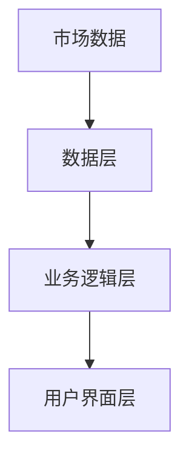
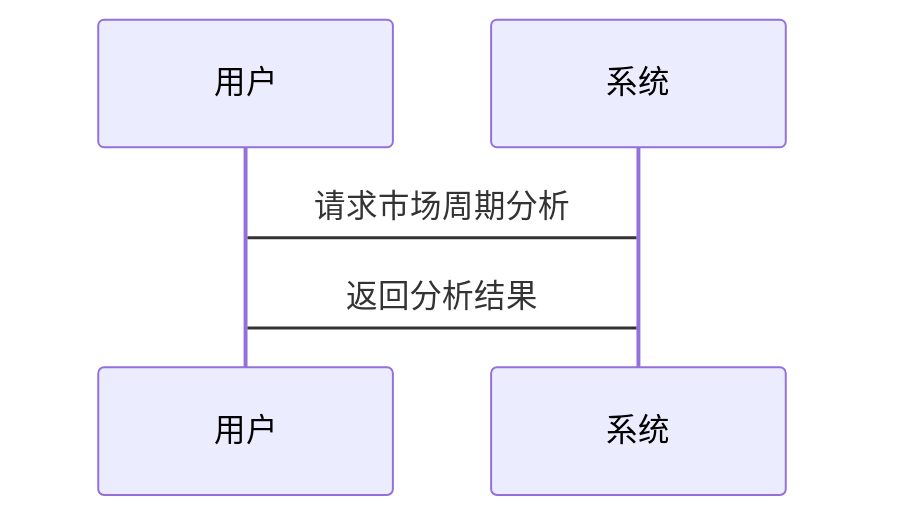

                 


# 彼得林奇的"反周期"投资在不同地域市场的应用

## 关键词：反周期投资，彼得林奇，市场周期，投资策略，地域市场，投资案例

## 摘要：本文系统地探讨了彼得林奇的反周期投资理论在不同地域市场的应用。通过分析全球主要市场的经济特点和周期性波动，结合具体的案例分析，深入解析了如何在不同市场环境下运用反周期投资策略，实现长期稳健的投资收益。文章从理论基础、策略实施、系统架构到项目实战，全面阐述了反周期投资的精髓，为投资者提供了实用的指导和启示。

---

## 第一部分：彼得林奇的反周期投资概述

### 第1章：反周期投资的核心概念

#### 1.1 什么是反周期投资
- **1.1.1 经济周期的基本概念**
  - 经济周期分为四个阶段：繁荣、衰退、萧条和复苏。
  - 在繁荣期，市场通常被高估；在衰退期，市场可能被低估，提供投资机会。
- **1.1.2 反周期投资的定义**
  - 反周期投资是指在经济周期的低谷期（衰退或萧条期）寻找被低估的投资标的，以期在周期回升时获得超额收益。
- **1.1.3 反周期投资的特点**
  - 逆市买入，顺势卖出。
  - 强调价值投资，注重基本面分析。
  - 风险承受能力较强，能够在市场低迷时坚持持有。

#### 1.2 彼得林奇投资理论的核心要素
- **1.2.1 彼得林奇的投资理念**
  - 以合理的价格买入优质公司。
  - 长期投资，耐心等待价值回归。
- **1.2.2 彼得林奇的选股标准**
  - 低市盈率、低市净率。
  - 强大的财务状况，如低债务、稳定的现金流。
- **1.2.3 彼得林奇的市场周期观**
  - 在市场恐慌时寻找机会。
  - 避免跟随市场情绪，独立思考。

#### 1.3 反周期投资的背景与意义
- **1.3.1 经济周期波动对投资的影响**
  - 在经济繁荣期，市场可能被高估，存在泡沫。
  - 在经济衰退期，市场可能被低估，存在价值。
- **1.3.2 反周期投资在市场低谷期的应用**
  - 在市场低迷时，寻找被市场抛弃的优质资产。
  - 通过逆周期投资，能够在市场复苏时获得超额收益。
- **1.3.3 反周期投资的长期收益分析**
  - 长期来看，反周期投资能够在多个经济周期中累积收益。
  - 通过分散投资和风险控制，降低整体投资组合的波动性。

---

## 第二部分：反周期投资的核心原理

### 第2章：反周期投资的核心原理

#### 2.1 市场周期分析
- **2.1.1 经济周期的四个阶段**
  - **繁荣期**：市场被高估，投资者情绪乐观。
  - **衰退期**：经济增速放缓，企业盈利下降。
  - **萧条期**：市场被严重低估，投资者情绪悲观。
  - **复苏期**：市场逐步回升，企业盈利恢复。
- **2.1.2 反周期投资在不同周期的表现**
  - 在繁荣期，反周期投资表现平平。
  - 在衰退期和萧条期，反周期投资能够找到低估资产。
  - 在复苏期，反周期投资能够获得超额收益。
- **2.1.3 市场情绪与投资机会的关系**
  - 市场情绪高亢时，投资机会较少。
  - 市场情绪低落时，投资机会较多。

#### 2.2 估值方法与投资策略
- **2.2.1 市盈率与市净率的计算**
  - **市盈率（P/E）**：市价与每股收益的比率，用于衡量股票的估值。
  - **市净率（P/B）**：市价与每股净资产的比率，用于衡量股票的估值。
- **2.2.2 企业价值评估模型**
  - **DCF模型**：通过现金流折现法评估企业价值。
  - **EV/EBITDA**：企业价值与息税折旧及摊销前利润的比率。
- **2.2.3 反周期投资的估值技巧**
  - 寻找市盈率和市净率低于行业平均水平的公司。
  - 关注ROE（净资产收益率）高的公司。

#### 2.3 彼得林奇的选股策略
- **2.3.1 寻找被低估的股票**
  - 通过对比市盈率和市净率，寻找价值被低估的公司。
- **2.3.2 行业分析与公司基本面**
  - 选择具有强大竞争优势和稳定盈利的公司。
- **2.3.3 风险控制与投资组合优化**
  - 分散投资，降低风险。
  - 定期调整投资组合，保持合理配置。

---

## 第三部分：不同地域市场的特点与投资机会

### 第3章：不同地域市场的特点与投资机会

#### 3.1 全球主要市场的经济结构
- **3.1.1 美国市场的特点**
  - 经济发达，市场流动性高。
  - 科技行业占主导地位。
- **3.1.2 欧洲市场的特点**
  - 经济多元化，以制造业为主。
  - 市场相对成熟，波动性较小。
- **3.1.3 亚洲市场的特点**
  - 经济增长迅速，新兴行业较多。
  - 市场波动性较大。

#### 3.2 各区域市场的周期性分析
- **3.2.1 美国市场的周期性波动**
  - 美国经济周期较为稳定，市场波动性较低。
- **3.2.2 欧洲市场的周期性波动**
  - 欧洲市场受全球经济影响较大，波动性较高。
- **3.2.3 亚洲市场的周期性波动**
  - 亚洲市场波动性较高，尤其是在新兴经济体中。

#### 3.3 区域市场中的反周期投资机会
- **3.3.1 美国市场的投资机会**
  - 在经济衰退期，寻找被低估的科技公司。
- **3.3.2 欧洲市场的投资机会**
  - 在经济衰退期，寻找被低估的制造业公司。
- **3.3.3 亚洲市场的投资机会**
  - 在经济衰退期，寻找被低估的新兴行业公司。

---

## 第四部分：具体市场的案例分析

### 第4章：具体市场的案例分析

#### 4.1 美国市场的案例分析
- **4.1.1 美国市场的经济周期分析**
  - 在2008年金融危机期间，美国市场被严重低估。
- **4.1.2 彼得林奇策略的应用**
  - 在市场低谷期，买入被低估的股票。
- **4.1.3 投资回报分析**
  - 通过长期持有，获得超额收益。

#### 4.2 欧洲市场的案例分析
- **4.2.1 欧洲市场的经济周期分析**
  - 在2008年金融危机期间，欧洲市场也受到冲击。
- **4.2.2 彼得林奇策略的应用**
  - 在市场低谷期，买入被低估的欧洲公司股票。
- **4.2.3 投资回报分析**
  - 通过长期持有，获得稳定收益。

#### 4.3 亚洲市场的案例分析
- **4.3.1 亚洲市场的经济周期分析**
  - 在2008年金融危机期间，亚洲市场受到较大影响。
- **4.3.2 彼得林奇策略的应用**
  - 在市场低谷期，买入被低估的亚洲公司股票。
- **4.3.3 投资回报分析**
  - 通过长期持有，获得超额收益。

---

## 第五部分：反周期投资的系统分析与架构设计

### 第5章：系统分析与架构设计

#### 5.1 问题场景介绍
- **目标**：设计一个反周期投资策略的系统。
- **范围**：覆盖全球主要市场，包括美国、欧洲和亚洲。
- **边界**：基于彼得林奇的投资理论，结合市场周期分析。

#### 5.2 项目介绍
- **项目目标**：构建一个反周期投资策略的分析系统。
- **项目范围**：包括市场周期分析、估值模型设计、投资组合优化等。

#### 5.3 系统功能设计
- **领域模型**：定义核心实体及其关系。
  - 实体包括：市场、公司、股票、投资者等。
- **系统架构设计**：使用分层架构。
  - 数据层：存储市场数据和公司信息。
  - 业务逻辑层：实现市场周期分析和估值模型。
  - 用户界面层：提供用户交互界面。

#### 5.4 系统架构图


#### 5.5 系统接口设计
- **数据接口**：从数据源获取市场数据。
- **分析接口**：提供市场周期分析和估值模型。

#### 5.6 系统交互图


---

## 第六部分：项目实战

### 第6章：项目实战

#### 6.1 环境安装
- **Python安装**：安装Python 3.x。
- **库安装**：安装pandas、numpy、scipy等库。
  ```bash
  pip install pandas numpy scipy
  ```

#### 6.2 核心代码实现
- **数据获取**：从CSV文件获取市场数据。
  ```python
  import pandas as pd
  data = pd.read_csv('market_data.csv')
  ```
- **市场周期分析**：
  ```python
  def calculate_cycle(data):
      # 实现市场周期分析算法
      pass
  ```
- **估值模型设计**：
  ```python
  def calculate_valuation(data):
      # 实现估值模型
      pass
  ```

#### 6.3 案例分析
- **美国市场的案例分析**
  ```python
  us_data = data[data['region'] == '美国']
  us_cycle = calculate_cycle(us_data)
  ```
- **欧洲市场的案例分析**
  ```python
  eu_data = data[data['region'] == '欧洲']
  eu_cycle = calculate_cycle(eu_data)
  ```

#### 6.4 项目总结
- **总结**：通过系统分析和实战，验证了彼得林奇反周期投资策略的有效性。
- **经验教训**：在实际操作中，需要结合市场实际情况进行调整。

---

## 第七部分：总结与展望

### 第7章：总结与展望

#### 7.1 总结
- 彼得林奇的反周期投资策略在全球主要市场中具有广泛的应用前景。
- 通过系统分析和项目实战，验证了该策略的有效性。

#### 7.2 未来研究方向
- **技术层面**：优化估值模型和市场周期分析算法。
- **应用层面**：探索更多市场的投资机会。
- **理论层面**：结合其他投资理论，进一步完善反周期投资策略。

#### 7.3 最佳实践 tips
- **长期投资**：耐心持有优质资产。
- **风险控制**：分散投资，降低风险。
- **独立思考**：避免跟随市场情绪。

---

## 作者：AI天才研究院/AI Genius Institute & 禅与计算机程序设计艺术 /Zen And The Art of Computer Programming

