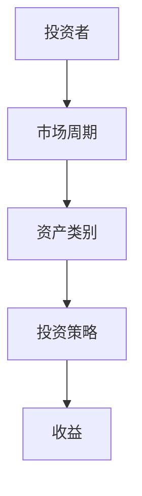
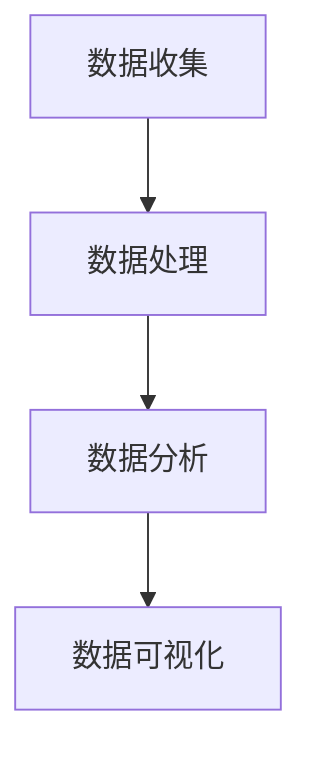

                 


# 彼得林奇的"反周期"投资在新兴资产类别中的应用

## 关键词：反周期投资，彼得林奇，新兴资产，数学模型，投资策略，风险管理

## 摘要：
本文深入探讨了彼得林奇的反周期投资理论及其在新兴资产类别中的应用。首先，我们介绍了反周期投资的基本概念和核心理念，对比了传统投资与反周期投资的差异。接着，我们分析了新兴资产类别的特点及其在投资组合中的重要性。随后，我们详细阐述了反周期投资的数学模型和算法原理，包括时间序列分析和回归模型的应用。通过系统架构设计和项目实战，我们展示了如何在新兴资产类别中实施反周期投资策略。最后，我们总结了反周期投资在新兴资产中的应用，并提出了风险管理的最佳实践建议。

---

# 第一部分: 反周期投资的背景与理论基础

## 第1章: 反周期投资的定义与核心理念

### 1.1 反周期投资的定义
反周期投资是一种投资策略，其核心在于在市场周期的低谷期进行投资，以期在市场复苏或高峰期时获得超额收益。与传统投资策略不同，反周期投资强调逆向思维，即在市场低迷时买入资产，在市场繁荣时卖出资产。

#### 1.1.1 投资周期的基本概念
市场的周期性波动是投资活动的核心特征之一。市场周期通常分为四个阶段：复苏期、增长期、成熟期和衰退期。反周期投资的核心在于识别这些周期性波动，并在低谷期进行投资。

#### 1.1.2 反周期投资的核心理念
彼得林奇的反周期投资理念基于一个简单的逻辑：市场周期是可预测的，而投资者可以通过分析市场周期的波动性来优化投资决策。反周期投资的目标是在市场低谷期找到被低估的资产，在市场高峰期卖出资产以获得最大收益。

#### 1.1.3 反周期投资与传统投资的区别
- **传统投资策略**：通常基于市场的长期趋势进行投资，忽视短期波动。
- **反周期投资策略**：强调逆向思维，关注市场的短期波动，寻找被低估的资产。

### 1.2 彼得林奇投资理论的背景
彼得林奇是美国著名的投资经理和作家，以其在富达麦哲伦基金的卓越表现而闻名。他的投资理论以基本面分析和逆向思维为核心，强调在市场低谷期寻找被低估的资产。

#### 1.2.1 彼得林奇的生平简介
彼得林奇（Peter Lynch）于1949年出生在美国波士顿。他在富达投资集团管理麦哲伦基金期间，取得了卓越的投资业绩，年化收益率超过29%，成为全球最著名的基金经理之一。

#### 1.2.2 彼得林奇投资理论的主要贡献
彼得林奇的投资理论以基本面分析和逆向思维为核心，强调以下几点：
1. **长期投资**：投资于具有强大基本面的公司，长期持有。
2. **逆向思维**：在市场低迷时买入，市场高涨时卖出。
3. **分散投资**：通过分散投资降低风险。

#### 1.2.3 反周期投资在彼得林奇理论中的地位
反周期投资是彼得林奇投资理论的重要组成部分。他认为，市场周期是可预测的，投资者可以通过分析市场周期的波动性来优化投资决策。

### 1.3 新兴资产类别的定义与特点
新兴资产类别是指那些具有高增长潜力但尚未被广泛认可的资产，包括科技、加密货币、绿色能源等领域。

#### 1.3.1 新兴资产类别的定义
新兴资产类别是指那些具有高增长潜力但尚未被广泛认可的资产，包括科技、加密货币、绿色能源等领域。

#### 1.3.2 新兴资产类别与传统资产的区别
- **传统资产**：如股票、债券、房地产等，具有较高的流动性但增长潜力有限。
- **新兴资产**：如科技、加密货币、绿色能源等领域，增长潜力高但风险也较高。

#### 1.3.3 新兴资产类别在投资中的潜力
新兴资产类别的高增长潜力使其成为投资者关注的焦点。通过反周期投资策略，投资者可以在新兴资产类别中找到被低估的资产，从而获得超额收益。

---

## 第2章: 反周期投资的核心概念与联系

### 2.1 反周期投资的原理
反周期投资的原理基于市场周期的波动性分析。通过识别市场周期的低谷期，投资者可以在市场复苏时获得超额收益。

#### 2.1.1 市场周期的波动性分析
市场周期的波动性是反周期投资的核心分析对象。通过分析市场的波动性，投资者可以识别市场周期的低谷期和高峰期。

#### 2.1.2 反周期投资的逻辑与策略
反周期投资的逻辑是基于市场的波动性。通过识别市场周期的低谷期，投资者可以在市场复苏时获得超额收益。

#### 2.1.3 反周期投资的核心要素
- **市场周期分析**：识别市场周期的低谷期和高峰期。
- **资产选择策略**：在市场低谷期选择被低估的资产。
- **风险管理**：通过分散投资降低风险。

### 2.2 核心概念的属性特征对比
反周期投资的核心概念包括市场周期、资产选择和风险管理。

#### 2.2.1 不同市场周期下的资产表现对比
- **市场低谷期**：资产价格被低估，具有较高的投资价值。
- **市场高峰期**：资产价格被高估，具有较高的卖出风险。

#### 2.2.2 反周期投资与周期性资产的关系
反周期投资与周期性资产密切相关。通过分析周期性资产的市场周期，投资者可以在市场低谷期买入，在市场高峰期卖出。

#### 2.2.3 市场波动性与反周期投资策略的匹配
市场波动性是反周期投资策略的核心分析对象。通过分析市场波动性，投资者可以识别市场周期的低谷期和高峰期。

### 2.3 ER实体关系图架构


---

## 第3章: 反周期投资的数学模型与算法原理

### 3.1 数学模型的建立
反周期投资的数学模型基于时间序列分析和回归模型。

#### 3.1.1 市场周期的数学建模
市场周期的数学建模基于时间序列分析。通过分析市场数据的时间序列，投资者可以识别市场周期的低谷期和高峰期。

#### 3.1.2 反周期投资的收益预测模型
反周期投资的收益预测模型基于回归模型。通过分析市场周期与资产收益的关系，投资者可以预测市场周期的低谷期和高峰期。

#### 3.1.3 资产价格波动的数学分析
资产价格波动的数学分析基于波动率模型。通过分析资产价格的波动率，投资者可以识别市场周期的低谷期和高峰期。

### 3.2 时间序列分析与反周期投资
时间序列分析是反周期投资的核心数学工具之一。通过分析市场数据的时间序列，投资者可以识别市场周期的低谷期和高峰期。

#### 3.2.1 时间序列分析的数学模型
时间序列分析的数学模型包括自回归模型（AR）、移动平均模型（MA）和ARIMA模型。

#### 3.2.2 时间序列分析的实现步骤
时间序列分析的实现步骤包括数据收集、数据预处理、模型选择、模型训练和模型验证。

#### 3.2.3 时间序列分析的Python实现
```python
import pandas as pd
import numpy as np
from statsmodels.tsa.arima_model import ARIMA

# 数据收集
data = pd.read_csv('market_data.csv')

# 数据预处理
data = data['price'].values

# 模型选择
model = ARIMA(data, order=(5,1,0))

# 模型训练
model_fit = model.fit()

# 模型验证
print(model_fit.summary())
```

### 3.3 回归模型与反周期投资
回归模型是反周期投资的另一个核心数学工具。通过分析市场周期与资产收益的关系，投资者可以预测市场周期的低谷期和高峰期。

#### 3.3.1 回归模型的数学公式
回归模型的数学公式为：
$$ y = \beta_0 + \beta_1 x + \epsilon $$
其中，$y$ 是因变量，$x$ 是自变量，$\beta_0$ 是截距，$\beta_1$ 是回归系数，$\epsilon$ 是误差项。

#### 3.3.2 回归模型的实现步骤
回归模型的实现步骤包括数据收集、数据预处理、模型选择、模型训练和模型验证。

#### 3.3.3 回归模型的Python实现
```python
import pandas as pd
import numpy as np
from sklearn.linear_model import LinearRegression

# 数据收集
data = pd.read_csv('market_data.csv')

# 数据预处理
X = data[['market_cycle']]
y = data['returns']

# 模型选择
model = LinearRegression()

# 模型训练
model.fit(X, y)

# 模型验证
print(model.coef_)
```

### 3.4 数学模型的比较与优化
反周期投资的数学模型包括时间序列分析和回归模型。通过比较这两种模型的优缺点，投资者可以选择最适合的模型来优化投资决策。

#### 3.4.1 时间序列分析与回归模型的比较
- **时间序列分析**：适用于分析市场数据的时间序列，能够识别市场周期的低谷期和高峰期。
- **回归模型**：适用于分析市场周期与资产收益的关系，能够预测市场周期的低谷期和高峰期。

#### 3.4.2 数学模型的优化策略
通过结合时间序列分析和回归模型，投资者可以优化投资决策，提高反周期投资的收益。

---

## 第4章: 反周期投资的系统架构设计

### 4.1 系统功能设计
反周期投资的系统架构设计包括数据收集、数据处理、数据分析和数据可视化。

#### 4.1.1 数据收集模块
数据收集模块负责收集市场数据，包括股票价格、指数数据和经济指标。

#### 4.1.2 数据处理模块
数据处理模块负责对市场数据进行预处理，包括数据清洗和特征提取。

#### 4.1.3 数据分析模块
数据分析模块负责分析市场数据，识别市场周期的低谷期和高峰期。

#### 4.1.4 数据可视化模块
数据可视化模块负责将分析结果可视化，帮助投资者更好地理解市场周期。

### 4.2 系统架构设计
反周期投资的系统架构设计基于模块化设计，包括数据收集、数据处理、数据分析和数据可视化四个模块。

#### 4.2.1 系统架构的模块化设计


#### 4.2.2 系统架构的交互设计
系统架构的交互设计包括数据收集、数据处理、数据分析和数据可视化四个步骤。

#### 4.2.3 系统架构的优化建议
通过模块化设计，投资者可以优化系统架构，提高反周期投资的效率和效果。

### 4.3 系统接口设计
反周期投资的系统接口设计包括数据接口和用户接口。

#### 4.3.1 数据接口设计
数据接口设计负责与数据源进行交互，收集市场数据。

#### 4.3.2 用户接口设计
用户接口设计负责与用户进行交互，展示分析结果。

### 4.4 系统交互设计
系统交互设计包括数据收集、数据处理、数据分析和数据可视化四个步骤。

#### 4.4.1 系统交互的流程设计
系统交互的流程设计包括数据收集、数据处理、数据分析和数据可视化四个步骤。

#### 4.4.2 系统交互的优化建议
通过优化系统交互流程，投资者可以提高反周期投资的效率和效果。

---

## 第5章: 反周期投资的项目实战

### 5.1 项目背景与目标
本项目的目标是通过反周期投资策略，在新兴资产类别中实现超额收益。

#### 5.1.1 项目背景
新兴资产类别包括科技、加密货币和绿色能源等领域，具有高增长潜力但风险也较高。

#### 5.1.2 项目目标
通过反周期投资策略，在新兴资产类别中实现超额收益。

### 5.2 项目环境安装
项目环境安装包括安装Python、Pandas、NumPy和Matplotlib等工具。

#### 5.2.1 安装Python
```bash
python --version
pip install --upgrade pip
```

#### 5.2.2 安装Pandas
```bash
pip install pandas
```

#### 5.2.3 安装NumPy
```bash
pip install numpy
```

#### 5.2.4 安装Matplotlib
```bash
pip install matplotlib
```

### 5.3 项目核心实现
项目核心实现包括数据收集、数据处理、数据分析和数据可视化四个步骤。

#### 5.3.1 数据收集
```python
import pandas as pd
import numpy as np
import requests

# 数据收集
url = 'https://example.com/market_data.csv'
data = pd.read_csv(url)
```

#### 5.3.2 数据处理
```python
# 数据处理
data = data[['price', 'volume', 'market_cycle']]
data = data.dropna()
```

#### 5.3.3 数据分析
```python
# 数据分析
from statsmodels.tsa.arima_model import ARIMA

model = ARIMA(data['price'], order=(5,1,0))
model_fit = model.fit()
print(model_fit.summary())
```

#### 5.3.4 数据可视化
```python
# 数据可视化
import matplotlib.pyplot as plt

plt.plot(data['price'])
plt.title('Market Price')
plt.xlabel('Time')
plt.ylabel('Price')
plt.show()
```

### 5.4 项目实战小结
通过反周期投资策略，投资者可以在新兴资产类别中实现超额收益。通过数据收集、数据处理、数据分析和数据可视化四个步骤，投资者可以优化投资决策，提高投资收益。

---

## 第6章: 反周期投资的最佳实践与总结

### 6.1 反周期投资的最佳实践
反周期投资的最佳实践包括以下几点：
1. **市场周期分析**：通过分析市场周期，识别市场周期的低谷期和高峰期。
2. **资产选择策略**：在市场低谷期选择被低估的资产，在市场高峰期卖出资产。
3. **风险管理**：通过分散投资降低风险，避免过度集中在某一种资产。

### 6.2 项目总结
通过本项目，我们深入探讨了反周期投资在新兴资产类别中的应用。通过数据收集、数据处理、数据分析和数据可视化四个步骤，投资者可以在新兴资产类别中实现超额收益。

### 6.3 反周期投资的注意事项
反周期投资的注意事项包括以下几点：
1. **市场周期的不确定性**：市场周期的波动性是反周期投资的核心分析对象，但市场周期的不确定性可能导致投资失败。
2. **资产选择的风险**：新兴资产类别的高增长潜力也伴随着高风险，投资者需要谨慎选择资产。
3. **风险管理的重要性**：通过分散投资降低风险，避免过度集中在某一种资产。

### 6.4 拓展阅读
- 彼得林奇的《彼得林奇的成功投资》
- 《时间序列分析与应用》
- 《回归分析与投资策略》

---

## 作者：AI天才研究院/AI Genius Institute & 禅与计算机程序设计艺术 /Zen And The Art of Computer Programming

