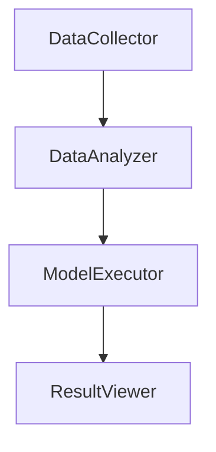
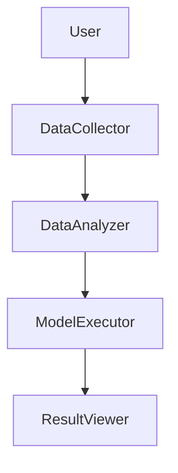

                 


# 彼得林奇的"周期股"投资时机把握

## 关键词：周期股、彼得林奇、投资时机、K线图分析、财务指标、数学模型

## 摘要：本文深入分析了彼得林奇的周期股投资策略，探讨了如何通过K线图和财务指标识别周期股的投资时机。文章结合数学模型和系统架构设计，提供了一个完整的周期股分析框架，并通过实际案例展示了如何在市场中应用这些策略。最后，本文总结了周期股投资的最佳实践和注意事项。

---

# 第3章: 彼得林奇周期股投资模型

## 3.1 投资模型的构建

### 3.1.1 模型的核心要素

周期股的投资模型需要考虑以下几个核心要素：

- **市场周期**：市场的波动性对周期股的影响至关重要。周期股的表现往往与经济周期密切相关，例如在经济复苏期，周期股可能表现强劲；而在经济衰退期，周期股可能面临压力。

- **行业特征**：不同行业的周期性表现不同。例如，制造业和建筑业的周期性较强，而科技行业的周期性相对较弱。

- **公司基本面**：公司的财务状况、盈利能力、成长性等指标是判断周期股投资价值的重要依据。

- **技术分析**：通过K线图和趋势线等技术指标，可以帮助投资者判断周期股的买卖时机。

### 3.1.2 模型的逻辑框架

彼得林奇的投资模型基于以下几个步骤：

1. **识别周期性行业**：选择那些在经济周期中表现波动较大的行业。
2. **分析公司基本面**：评估公司的财务健康状况，寻找具有长期增长潜力的公司。
3. **技术分析**：通过K线图和指标分析，判断股票的买卖时机。
4. **市场周期判断**：结合宏观经济指标，判断当前市场所处的周期阶段。
5. **构建投资组合**：根据分析结果，构建分散化的投资组合，降低风险。

### 3.1.3 模型的适用范围

该模型适用于那些对经济周期敏感的行业，如制造业、建筑业、汽车业等。同时，也适用于那些具有较强周期性但又具备长期增长潜力的公司。

---

## 3.2 模型的数学表达

### 3.2.1 周期股的波动周期公式

周期股的波动周期可以通过以下公式进行估计：

$$
周期 = \frac{市场周期}{行业敏感性}
$$

其中，市场周期通常为3-5年，行业敏感性取决于具体行业的波动程度。

### 3.2.2 市场情绪对股价的影响

市场情绪可以通过投资者情绪指数（PSI）来衡量。当PSI高于平均水平时，市场情绪乐观，周期股可能会上涨；反之则会下跌。

$$
PSI = \sum_{i=1}^{n} \left( \frac{投资者情绪}{n} \right)
$$

### 3.2.3 投资回报率的计算公式

周期股的投资回报率可以通过以下公式计算：

$$
回报率 = \left( \frac{卖出价 - 买入价}{买入价} \right) \times 100\%
$$

---

## 3.3 模型的验证与优化

### 3.3.1 历史数据的验证方法

通过历史数据验证模型的有效性，例如选择过去10年的市场数据，验证模型在不同经济周期下的表现。

### 3.3.2 模型的参数调整

根据验证结果，调整模型的参数，例如优化行业敏感性的权重，以提高模型的准确性。

### 3.3.3 模型的持续优化

定期更新模型，结合最新的市场数据和行业趋势，确保模型的有效性。

---

# 第4章: 周期股投资的系统架构设计

## 4.1 系统架构概述

### 4.1.1 系统的功能模块划分

- 数据采集模块：负责采集股票数据、市场数据等。
- 数据分析模块：对数据进行清洗、处理和分析。
- 模型实现模块：应用彼得林奇模型进行周期股的分析。
- 结果展示模块：将分析结果以图表和报告的形式展示出来。

### 4.1.2 模块之间的关系

使用mermaid绘制系统架构图：



### 4.1.3 系统的输入输出设计

- **输入**：股票代码、时间范围、市场数据等。
- **输出**：周期股的买卖信号、投资回报率预测、市场情绪分析等。

---

## 4.2 数据采集与处理

### 4.2.1 数据源的选择

- 股票数据来源：Yahoo Finance、Google Finance等。
- 市场数据来源：美联储经济指标、行业报告等。

使用mermaid绘制数据流图：

```mermaid
graph TD
    DataCollector --> [股票数据] --> DataProcessor
    DataCollector --> [市场数据] --> DataProcessor
    DataProcessor --> [处理后数据] --> ModelExecutor
```

---

## 4.3 系统接口设计

### 4.3.1 接口定义

- 数据接口：提供数据采集和处理的API。
- 模型接口：提供周期股分析的API。
- 结果接口：提供分析结果的展示API。

### 4.3.2 接口交互流程

使用mermaid绘制序列图：

```mermaid
sequenceDiagram
   参与者 用户
    参与者 系统
    用户->系统: 请求周期股分析
    系统->系统: 数据采集模块采集数据
    系统->系统: 数据分析模块处理数据
    系统->系统: 模型执行模块运行分析
    系统->用户: 返回分析结果
```

---

## 4.4 系统架构图

使用mermaid绘制系统架构图：



---

# 第5章: 项目实战

## 5.1 环境安装

### 5.1.1 安装Python环境

- 安装Python 3.8及以上版本。
- 安装必要的库：pandas、numpy、matplotlib、yfinance等。

### 5.1.2 安装数据可视化工具

- 安装Plotly或Matplotlib。

## 5.2 核心代码实现

### 5.2.1 数据采集代码

```python
import pandas as pd
import yfinance as yf

# 采集周期股数据
def fetch_data(ticker, start_date, end_date):
    data = yf.download(ticker, start=start_date, end=end_date)
    return data['Close']

# 示例：采集通用电气（GE）的股价数据
ge_data = fetch_data('GE', '2010-01-01', '2023-12-31')
print(ge_data.head())
```

### 5.2.2 模型实现代码

```python
import pandas as pd
import numpy as np
import matplotlib.pyplot as plt

# 计算相对强弱指数（RSI）
def calculate_rsi(data, period=14):
    delta = data.diff()
    up = delta.where(delta > 0, 0)
    down = delta.where(delta < 0, 0)
    ma_up = up.rolling(period).mean()
    ma_down = down.rolling(period).mean()
    rsi = 100 - (100 - (ma_up / ma_down))
    return rsi

# 示例：计算GE股票的RSI
rsi = calculate_rsi(pd.Series(ge_data))
plt.plot(rsi)
plt.title('RSI Chart')
plt.xlabel('Date')
plt.ylabel('RSI')
plt.show()
```

## 5.3 实际案例分析

### 5.3.1 案例选择

以通用电气（GE）为例，分析其周期股的投资时机。

### 5.3.2 数据分析与结果展示

使用采集的数据和模型分析，生成买卖信号和投资回报率预测。

---

## 第6章: 最佳实践与注意事项

### 6.1 最佳实践

- **长期视角**：周期股的投资需要耐心，等待合适的时机。
- **分散投资**：避免将所有资金投入单一行业或股票。
- **持续学习**：关注行业动态和市场变化，及时调整投资策略。

### 6.2 小结

本文通过彼得林奇的周期股投资策略，结合数学模型和系统架构设计，为投资者提供了一个完整的周期股分析框架。通过实际案例分析，展示了如何在市场中应用这些策略。

### 6.3 注意事项

- 市场波动风险：周期股的价格波动较大，需注意市场风险。
- 模型局限性：模型的有效性依赖于数据质量和市场环境，需结合实际情况进行调整。
- 投资决策的独立性：本文内容仅为参考，具体投资决策需结合自身情况。

### 6.4 拓展阅读

- 彼得林奇的其他投资策略。
- 其他周期股分析方法。

---

# 作者：AI天才研究院 & 禅与计算机程序设计艺术

---

