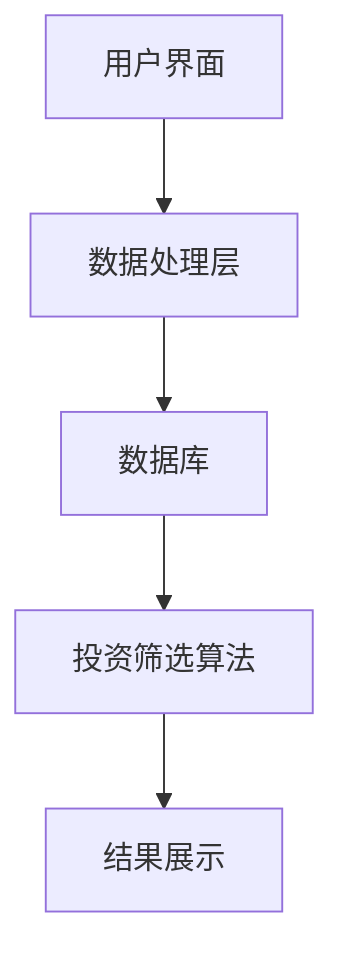

                 


# 彼得林奇的"墓地投资法"

## 关键词：彼得林奇、墓地投资法、股票投资、价值投资、市盈率、市净率、投资策略

## 摘要：本文详细介绍了彼得林奇的“墓地投资法”，探讨了其核心概念、算法原理、系统架构以及实际应用案例。通过分析，读者可以理解如何通过寻找被市场低估的股票来实现长期投资收益。

---

## 第一章：投资法的背景与起源

### 1.1 彼得·林奇的背景介绍
彼得·林奇是美国著名的投资经理人，以其在富达投资管理公司的卓越表现而闻名。他的投资哲学强调长期投资和深入的基本面分析。

### 1.2 墓地投资法的定义与核心理念
墓地投资法是指在市场低迷时期，寻找那些被市场低估、具有长期投资价值的股票。这种方法的核心在于识别那些暂时被忽视但基本面良好的公司。

### 1.3 投资法的应用背景
在经济衰退或市场恐慌时期，许多优质股票会被抛售，价格远低于其内在价值。墓地投资法正是在这种情况下寻找机会。

---

## 第二章：核心概念与理论基础

### 2.1 核心概念解析
- **低估股票**：市盈率和市净率低于行业平均水平的股票。
- **长期价值**：关注公司的基本面，如盈利能力、财务状况和行业地位。

### 2.2 投资法的数学模型与公式

#### 2.2.1 市盈率计算
$$市盈率 = \frac{股价}{每股收益}$$

#### 2.2.2 市净率计算
$$市净率 = \frac{股价}{每股净资产}$$

#### 2.2.3 坟墓投资法的筛选标准
$$\text{筛选条件：市盈率} < \text{行业平均市盈率} \quad \text{且} \quad \text{市净率} < \text{行业平均市净率}$$

---

## 第三章：算法原理与实现

### 3.1 算法原理
1. 筛选市盈率和市净率低于行业平均水平的公司。
2. 深入分析公司的财务报表和行业地位。
3. 确定投资标的并进行长期持有。

### 3.2 核心代码实现

```python
import pandas as pd

# 假设df是包含股票数据的DataFrame
# 筛选市盈率低于行业平均水平的公司
df['市盈率低于行业'] = df['市盈率'] < df['行业平均市盈率']
selected_stocks = df[df['市盈率低于行业']]
```

---

## 第四章：系统分析与架构设计

### 4.1 系统功能设计
- 数据采集：从数据库中获取股票数据。
- 数据处理：计算市盈率和市净率，与行业平均水平进行比较。
- 投资决策：筛选出符合条件的股票，生成投资报告。

### 4.2 系统架构图


---

## 第五章：项目实战与案例分析

### 5.1 环境安装与配置
- 安装Python和Pandas库。
- 获取股票数据，存储在CSV文件中。

### 5.2 核心代码实现

```python
import pandas as pd

# 加载数据
df = pd.read_csv('stocks.csv')

# 筛选市盈率低于行业平均水平的公司
selected_stocks = df[df['市盈率'] < df['行业平均市盈率']]
print(selected_stocks)
```

### 5.3 案例分析

#### 5.3.1 2008年金融危机后的投资案例
在2008年金融危机后，许多优质股票被低估。通过墓地投资法筛选出的公司，如某些银行股和工业股，在市场复苏后带来了丰厚的回报。

---

## 第六章：最佳实践与投资策略优化

### 6.1 投资策略的注意事项
- **风险管理**：分散投资，避免过度集中在单一行业或公司。
- **持续监控**：定期复盘，根据市场变化调整投资组合。

### 6.2 投资法的优化与改进
- 结合技术分析，如趋势线和成交量分析，进一步优化投资决策。

---

## 附录

### 附录A：术语表
- 市盈率：股价与每股收益的比率。
- 市净率：股价与每股净资产的比率。

### 附录B：参考文献
1. 彼得·林奇. 《彼得·林奇的投资策略》.
2. 哈佛商学院案例：墓地投资法的实际应用。

---

## 作者：AI天才研究院 & 禅与计算机程序设计艺术

---

通过以上目录，读者可以系统地了解彼得林奇的墓地投资法，并在实际操作中应用这些方法。

