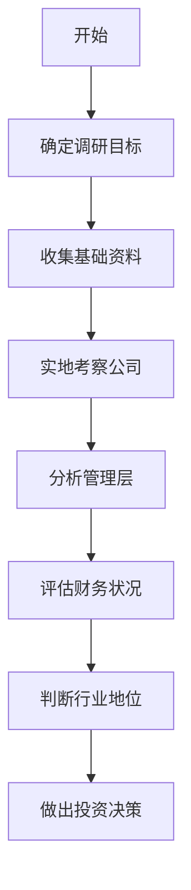
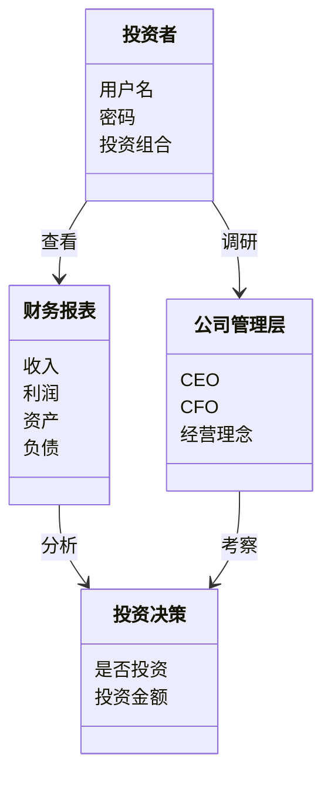

                 


# 彼得林奇的"实地调研"投资方法

> 关键词：投资方法，实地调研，彼得林奇，投资策略，风险管理，投资分析

> 摘要：本文详细探讨了彼得林奇的实地调研投资方法，分析了其核心概念、算法原理、系统架构，并通过实战案例展示了如何应用这些方法。文章还总结了最佳实践、注意事项和拓展阅读，为读者提供了全面的指导。

---

## 第1章: 背景介绍

### 1.1 实地调研的定义与重要性
- **1.1.1 什么是实地调研**
  - 实地调研是通过亲自考察公司、采访管理层、分析财务数据等手段，全面了解企业的经营状况和潜在风险。
- **1.1.2 实地调研在投资中的作用**
  - 提供第一手资料，帮助投资者做出更准确的判断。
  - 识别潜在风险，避免纸上谈兵的错误。
- **1.1.3 彼得林奇投资方法的核心理念**
  - 价值投资的核心在于寻找被市场低估的企业。
  - 实地调研是验证企业价值的重要手段。

### 1.2 彼得林奇的投资理念
- **1.2.1 彼得林奇的个人背景**
  - 曾任富达投资的基金经理，管理资金超过1000亿美元。
  - 以价值投资著称，注重基本面分析。
- **1.2.2 彼得林奇的投资哲学**
  - 长期投资，追求企业内在价值的增长。
  - 避免短期波动，专注于企业基本面。
- **1.2.3 实地调研在彼得林奇投资方法中的地位**
  - 实地调研是验证企业价值的关键步骤。
  - 通过调研获取的信息帮助彼得林奇做出投资决策。

### 1.3 本书的核心内容与目标
- **1.3.1 本书的核心主题**
  - 探讨彼得林奇的实地调研方法，分析其在投资中的应用。
- **1.3.2 本书的目标读者**
  - 投资新手、价值投资者、对彼得林奇投资方法感兴趣的读者。
- **1.3.3 本书的结构安排**
  - 分章节详细讲解实地调研的各个步骤和注意事项。

---

## 第2章: 核心概念与联系

### 2.1 投资方法的核心概念
- **2.1.1 投资标的的选择标准**
  - 行业地位：选择行业龙头或有竞争优势的企业。
  - 财务状况：关注企业的盈利能力、资产负债情况。
  - 管理层素质：考察管理层的背景、经验和决策能力。
- **2.1.2 投资标的的估值方法**
  - 市盈率（P/E）：评估企业股价是否合理。
  - 市净率（P/B）：衡量股价与账面价值的关系。
  - 内在价值：通过现金流折现法估算企业的真实价值。
- **2.1.3 投资标的的风险管理**
  - 分散投资：避免过度集中。
  - 设置止损：控制投资风险。

### 2.2 实地调研的核心要素
- **2.2.1 公司管理层的评估**
  - 通过面试和考察了解管理层的诚信和能力。
  - 关注管理层的决策历史和企业战略。
- **2.2.2 公司财务状况的分析**
  - 通过财务报表分析企业的盈利能力和财务健康状况。
  - 关注现金流、资产负债表和利润表。
- **2.2.3 公司行业地位的判断**
  - 分析企业在行业中的竞争力和市场份额。
  - 考察行业的发展前景和竞争格局。

### 2.3 实地调研与投资决策的关系
- **2.3.1 实地调研对投资决策的影响**
  - 提供第一手资料，帮助投资者做出更准确的判断。
  - 识别潜在风险，避免纸上谈兵的错误。
- **2.3.2 实地调研的局限性与优劣对比**
  - 局限性：时间成本高，覆盖面有限。
  - 优势：信息更准确，决策更可靠。
- **2.3.3 实地调研与其他投资方法的结合**
  - 结合技术分析和基本面分析，全面评估企业价值。

---

## 第3章: 投资方法的算法原理

### 3.1 投资方法的数学模型
- **3.1.1 投资价值的计算公式**
  - 内在价值计算公式：
  $$ \text{内在价值} = \sum_{t=1}^{\infty} \frac{\text{现金流}_t}{(1 + r)^t} $$
  其中，r为折现率，现金流t为第t年的现金流。
- **3.1.2 估值模型的比较与选择**
  - 市盈率模型：适用于盈利稳定的公司。
  - 市净率模型：适用于资产密集型企业。
  - 现金流折现模型：适用于成长型企业。

### 3.2 投资方法的流程图


---

## 第4章: 系统分析与架构设计

### 4.1 问题场景介绍
- **问题场景**：如何构建一个基于实地调研的投资分析系统？

### 4.2 项目介绍
- **项目目标**：开发一个自动化投资分析工具，辅助投资者进行实地调研。

### 4.3 系统功能设计（领域模型）


### 4.4 系统架构设计


---

## 第5章: 项目实战

### 5.1 环境安装
- **工具安装**：安装Python、Pandas、Matplotlib等数据分析工具。

### 5.2 系统核心实现源代码
```python
import pandas as pd

def analyze_financials(finance_data):
    # 计算盈利能力
    profitability = finance_data['净利润'] / finance_data['营业收入']
    # 计算资产负债率
    leverage = finance_data['负债总额'] / finance_data['资产总额']
    return profitability, leverage

# 示例数据
finance_data = {
    '营业收入': [100, 200, 300],
    '净利润': [20, 40, 60],
    '负债总额': [50, 100, 150],
    '资产总额': [80, 160, 240]
}

profitability, leverage = analyze_financials(finance_data)
print("盈利能力:", profitability)
print("资产负债率:", leverage)
```

### 5.3 实际案例分析
- **案例选择**：以苹果公司为例，分析其财务状况和管理层。

---

## 第6章: 最佳实践

### 6.1 投资策略小结
- **长期投资**：避免短期波动，关注企业长期价值。
- **分散投资**：降低风险，避免过度集中。

### 6.2 投资注意事项
- **风险控制**：设置止损点，避免重大损失。
- **持续学习**：不断更新知识，适应市场变化。

### 6.3 拓展阅读
- 推荐书籍：《彼得林奇选股术》。
- 推荐网站：晨星网、Value Investors Club。

---

## 第7章: 小结

### 7.1 内容总结
- 本文详细探讨了彼得林奇的实地调研投资方法，分析了其核心概念、算法原理和系统架构，并通过实战案例展示了如何应用这些方法。

### 7.2 学习要点
- 理解彼得林奇的投资理念。
- 掌握实地调研的核心要素和方法。
- 学习如何结合数学模型和系统架构进行投资分析。

---

## 第8章: 注意事项

### 8.1 投资风险提示
- 投资有风险，入市需谨慎。
- 避免盲目跟风，注重独立思考。

### 8.2 信息来源的可靠性
- 确保数据来源可靠，避免误导。
- 多渠道验证信息，提高判断准确性。

---

## 第9章: 拓展阅读

### 9.1 相关书籍
- 《彼得林奇选股术》：深入探讨彼得林奇的投资方法。
- 《价值投资入门》：介绍价值投资的基本理念。

### 9.2 网站推荐
- 晨星网：提供专业的基金评级和分析。
- Value Investors Club：价值投资者的交流平台。

---

作者：AI天才研究院/AI Genius Institute & 禅与计算机程序设计艺术 /Zen And The Art of Computer Programming

