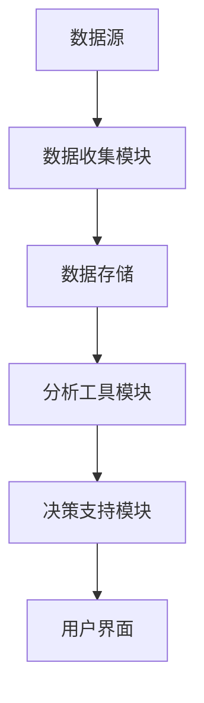

                 

# 彼得林奇的"实地调研"投资方法论

## 关键词
- 彼得·林奇
- 实地调研
- 投资方法论
- 财务分析
- 价值投资

## 摘要
彼得·林奇是全球著名投资专家，他的实地调研方法强调通过深入分析公司基本面来进行投资决策。本文详细探讨了实地调研的核心概念、方法论、数学模型、系统架构，并通过案例分析展示了如何应用这些方法进行投资决策。文章内容丰富，涵盖从基础到高级的投资策略，帮助读者全面理解并掌握彼得·林奇的投资方法。

## 第一部分：背景介绍

### 第1章：实地调研投资方法概述

#### 1.1 什么是实地调研
实地调研是一种通过深入研究公司、行业和市场来评估其投资价值的方法。它强调从公司基本面出发，分析财务数据、管理层素质和行业环境，以做出更明智的投资决策。

#### 1.2 彼得·林奇及其投资理念
彼得·林奇是美国著名的投资专家，曾管理富达麦哲伦基金，取得了优异的业绩。他主张通过深入调研，寻找具有竞争优势的公司，并长期持有，以实现超额收益。

## 第二部分：核心概念与联系

### 第2章：实地调研的核心要素

#### 2.1 公司基本面分析
公司基本面分析是实地调研的核心，包括财务报表分析、行业分析和管理层评估。通过这些分析，投资者可以全面了解公司的经营状况和未来前景。

#### 2.2 市场与竞争分析
了解行业竞争结构和市场需求是评估公司投资价值的重要部分。分析竞争对手和市场趋势，可以帮助投资者识别潜在的风险和机会。

## 第三部分：算法原理讲解

### 第3章：投资决策的数学模型

#### 3.1 基本面分析的量化指标
- 市盈率（P/E）：$$P/E = \frac{Price}{Earnings}$$
- 市净率（P/B）：$$P/B = \frac{Price}{Book\ Value}$$
- 股息率：$$Dividend\ Yield = \frac{Dividend}{Price}$$

#### 3.2 财务报表分析的数学模型
- 净利润计算：$$Net\ Income = Revenue - Expenses$$
- 资产负债表分析：$$Assets = Liabilities + Equity$$

## 第四部分：系统分析与架构设计

### 第4章：投资分析系统架构

#### 4.1 系统功能设计
- 数据收集模块：从多渠道获取数据。
- 分析工具模块：提供财务分析和市场分析工具。
- 决策支持模块：生成投资建议和风险评估。

#### 4.2 系统架构图

## 第五部分：项目实战

### 第5章：案例分析与实战技巧

#### 5.1 案例分析：XYZ公司
- 公司概况：XYZ公司是一家制造业企业，近年来净利润稳步增长。
- 财务报表分析：XYZ公司的市盈率为15，市净率为2，股息率为3%。
- 投资决策：基于分析，XYZ公司具有投资价值，适合长期持有。

#### 5.2 技巧总结
- 快速识别投资机会：关注行业龙头和财务健康的企业。
- 避免常见错误：避免盲目跟风，注重基本面分析。

## 第六部分：总结与注意事项

### 第6章：总结与注意事项

#### 6.1 方法论总结
实地调研是彼得·林奇成功的关键，通过深入分析公司基本面，投资者可以做出明智的投资决策。该方法在现代投资中依然具有重要价值。

#### 6.2 投资中的注意事项
- 风险管理：分散投资，避免过度集中。
- 持续学习：不断更新知识，适应市场变化。

---

# 作者：AI天才研究院/AI Genius Institute & 禅与计算机程序设计艺术 /Zen And The Art of Computer Programming

---

本文通过详细分析彼得·林奇的实地调研方法，为投资者提供了系统的投资策略。从背景介绍到案例分析，每一部分都深入浅出，帮助读者全面理解和应用这一方法。通过本文的学习，读者可以掌握如何通过基本面分析和系统架构设计，做出更明智的投资决策。

