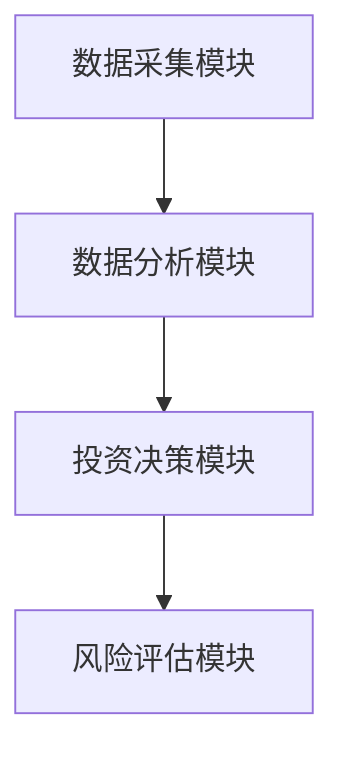

                 


# 彼得林奇的实用投资策略

> 关键词：彼得林奇、投资策略、价值投资、长期投资、风险管理

> 摘要：本文系统地介绍和分析了彼得·林奇的实用投资策略，包括其投资哲学、长期投资策略、价值投资核心要素、投资组合管理方法以及风险管理策略。通过理论分析、算法原理、数学模型和实际案例的结合，帮助读者全面理解和应用彼得·林奇的投资策略。

---

# 第一部分：彼得林奇的实用投资策略概述

---

# 第1章：彼得林奇与投资策略概述

## 1.1 彼得林奇及其投资理念

### 1.1.1 彼得林奇的生平简介

彼得·林奇（Peter Lynch）是美国著名的投资专家，曾任美国著名共同基金——富达麦哲伦基金（Fidelity Magellan Fund）的经理。他在任职期间（1977年-1990年）取得了卓越的投资业绩，年平均回报率达到29.2%，远超同期市场表现。林奇的投资风格以长期投资、价值投资和基本面分析为核心，被誉为“普通投资者的圣经”。

### 1.1.2 彼得林奇的投资哲学

彼得林奇的投资哲学可以总结为以下几点：
1. **长期投资**：林奇认为，成功的投资需要耐心和长期视角，而不是频繁交易。
2. **价值投资**：他强调以低于内在价值的价格买入优质股票。
3. **基本面分析**：林奇擅长通过分析公司的财务报表、行业地位和竞争优势来评估股票的价值。
4. **分散投资**：通过分散投资降低风险，避免过度集中。

### 1.1.3 彼得林奇的投资策略特点

- **注重基本面**：林奇的投资决策基于对公司的深入了解。
- **长期持有**：他倾向于长期持有优质股票，避免频繁交易。
- **逆向思考**：在市场恐慌时寻找机会，逆向投资。
- **分散与平衡**：通过分散投资降低风险，同时保持投资组合的平衡。

---

## 1.2 投资策略的核心概念

### 1.2.1 投资的基本概念

- **投资**：将资金投入某种资产以获取未来收益的行为。
- **风险**：投资过程中可能面临的本金损失或收益低于预期的情况。
- **收益**：投资的回报，包括资本增值和分红收益。

### 1.2.2 投资与投机的区别

| 方面 | 投资 | 投机 |
|------|------|------|
| 定义 | 长期持有，追求内在价值 | 短期交易，追求价格波动 |
| 风险 | 较低，基于基本面分析 | 较高，依赖市场情绪 |
| 期限 | 长期 | 短期 |

### 1.2.3 长期投资与短期投资的对比

| 方面 | 长期投资 | 短期投资 |
|------|----------|----------|
| 风险 | 较低 | 较高 |
| 困难 | 需要深入研究 | 需要快速决策 |
| 收益 | 稳定 | 不稳定 |

---

## 1.3 彼得林奇投资策略的背景与环境

### 1.3.1 美国股市的历史背景

20世纪70年代至90年代，美国股市经历了多次波动，包括石油危机、经济滞胀等。林奇的投资策略在这一背景下逐渐形成。

### 1.3.2 经济周期对投资策略的影响

经济周期分为四个阶段：衰退、复苏、繁荣、萧条。林奇的投资策略在不同阶段有不同的表现：
- **衰退阶段**：寻找价值被低估的股票。
- **复苏阶段**：逐步增加投资。
- **繁荣阶段**：谨慎操作，避免高估。
- **萧条阶段**：寻找被市场遗忘的优质股票。

### 1.3.3 投资者心理与市场行为

- **市场情绪**：投资者心理波动会影响市场行为。
- **非理性行为**：市场恐慌时，优质股票可能被低估。
- **逆向思维**：在市场低迷时买入，在市场繁荣时卖出。

---

## 1.4 本章小结

本章介绍了彼得·林奇的投资哲学和策略特点，分析了投资的核心概念和经济周期对投资策略的影响。接下来，我们将深入探讨彼得林奇投资策略的核心要素。

---

# 第2章：投资策略的核心要素分析

## 2.1 投资目标的确定

### 2.1.1 投资目标的分类

- **资本增值**：通过股价上涨获得收益。
- **收入投资**：通过股息或债券利息获得稳定收益。
- **组合投资**：平衡资本增值和收入。

### 2.1.2 投资目标的设定方法

1. **明确投资目的**：是追求资本增值还是稳定收益？
2. **评估风险承受能力**：根据自身风险偏好选择投资策略。
3. **设定时间框架**：长期还是短期？

### 2.1.3 投资目标与风险承受能力的关系

- **高风险承受能力**：适合长期资本增值目标。
- **低风险承受能力**：适合稳定收入目标。

---

## 2.2 投资组合的构建

### 2.2.1 投资组合的基本概念

- **投资组合**：多种资产的组合，以分散风险。
- **分散化**：通过投资不同类型资产降低风险。

### 2.2.2 投资组合的分散化原理

- **资产配置**：股票、债券、现金等的合理分配。
- **行业分散**：避免集中在单一行业。
- **地域分散**：全球化投资。

### 2.2.3 投资组合的风险与收益平衡

- **风险-收益权衡**：高风险可能带来高收益。
- **夏普比率**：衡量投资组合的风险调整后收益。

---

## 2.3 投资策略的分类与选择

### 2.3.1 主动投资与被动投资的对比

| 方面 | 主动投资 | 被动投资 |
|------|----------|----------|
| 定义 | 积极选股，追求超额收益 | 按照指数权重投资，追求市场平均收益 |
| 成本 | 高 | 低 |
| 风险 | 高 | 低 |

### 2.3.2 基于价值的投资策略

- **价值投资**：寻找价格低于内在价值的股票。
- **内在价值计算**：使用DCF模型（现金流贴现法）。

### 2.3.3 基于成长的投资策略

- **成长投资**：寻找高成长性的公司。
- **成长股特征**：高市盈率、高营收增长率。

---

## 2.4 本章小结

本章分析了投资目标的确定、投资组合的构建以及投资策略的分类。通过对比主动投资与被动投资，价值投资与成长投资，帮助读者选择适合自己的策略。

---

# 第3章：彼得林奇的长期投资策略

## 3.1 长期投资的基本原理

### 3.1.1 长期投资的定义与特点

- **定义**：持有资产超过三年的投资策略。
- **特点**：注重基本面分析，避免短期波动影响。

### 3.1.2 长期投资的优势与劣势

- **优势**：
  - 避免短期波动风险。
  - 利用复利效应。
- **劣势**：
  - 需要长期资金。
  - 需要深入研究。

### 3.1.3 长期投资与市场波动的关系

- **市场波动**：短期影响股价，长期不影响内在价值。
- **复利效应**：长期投资能够最大化收益。

---

## 3.2 彼得林奇的长期投资方法

### 3.2.1 买入并持有策略

- **操作步骤**：
  1. 选择优质股票。
  2. 长期持有，避免频繁交易。
  3. 定期调整持仓。

### 3.2.2 价值投资的核心要素

- **内在价值**：通过DCF模型计算。
- **安全边际**：买入价格低于内在价值。

### 3.2.3 如何选择长期投资的标的

- **行业分析**：选择增长型行业。
- **财务分析**：关注ROE（净资产收益率）和ROA（资产回报率）。
- **竞争优势**：寻找护城河。

---

## 3.3 长期投资中的风险管理

### 3.3.1 风险管理的基本原则

- **分散投资**：避免过度集中。
- **止损策略**：设定止损点。
- **定期评估**：检查投资组合表现。

### 3.3.2 如何识别和避免投资风险

- **基本面恶化**：公司财务状况恶化。
- **市场风险**：整体市场下跌。
- **流动性风险**：难以变现。

### 3.3.3 长期投资中的再平衡策略

- **再平衡**：定期调整持仓比例，保持目标配置。

---

## 3.4 本章小结

本章详细介绍了彼得林奇的长期投资策略，包括买入并持有策略、价值投资的核心要素以及风险管理方法。通过长期投资，投资者可以在市场波动中实现稳健收益。

---

# 第4章：价值投资的核心要素

## 4.1 价值投资的定义与特点

### 4.1.1 价值投资的基本概念

- **定义**：寻找价格低于内在价值的股票。
- **特点**：注重基本面分析，长期持有。

### 4.1.2 价值投资与市场定价的关系

- **市场定价**：短期可能偏离内在价值。
- **价值回归**：价格最终会回归内在价值。

### 4.1.3 价值投资的核心要素

- **内在价值**：股票的真正价值。
- **安全边际**：买入价格低于内在价值。
- **竞争优势**：公司具有长期竞争优势。

---

## 4.2 公司基本面分析

### 4.2.1 公司财务报表分析

- **利润表**：关注收入和利润。
- **资产负债表**：分析资产和负债。
- **现金流量表**：评估现金流健康状况。

### 4.2.2 行业分析与竞争地位

- **行业分析**：行业前景和竞争状况。
- **竞争地位**：公司在行业中的地位。

### 4.2.3 公司管理团队的评估

- **管理层素质**：管理团队的能力和诚信。
- **公司治理**：董事会结构和公司治理情况。

---

## 4.3 安全边际的概念

### 4.3.1 安全边际的定义

- **安全边际**：买入价格与内在价值的差距。

### 4.3.2 安全边际的计算方法

- **公式**：安全边际 = 买入价格 / 内在价值 - 1。
- **实例**：如果内在价值为100，买入价格为80，安全边际为20%。

### 4.3.3 安全边际在投资决策中的应用

- **降低风险**：确保买入价格具有足够的安全边际。
- **价值发现**：寻找具有较大安全边际的股票。

---

## 4.4 本章小结

本章深入分析了价值投资的核心要素，包括公司基本面分析和安全边际的概念。通过基本面分析，投资者可以找到具有长期竞争优势的公司，并以合理的价格买入。

---

# 第5章：彼得林奇的投资组合管理策略

## 5.1 投资组合管理的基本原则

### 5.1.1 投资组合管理的定义

- **定义**：通过调整持仓比例，优化投资组合的过程。

### 5.1.2 投资组合管理的目标

- **目标**：实现投资目标，控制风险。

### 5.1.3 投资组合管理的步骤

1. **评估市场环境**：分析经济周期和市场趋势。
2. **评估持仓表现**：检查持仓是否符合投资目标。
3. **调整持仓比例**：优化投资组合。

---

## 5.2 投资组合的调整与优化

### 5.2.1 投资组合调整的时机

- **市场变化**：经济周期变化时调整。
- **持仓表现**：部分股票表现不佳时调整。
- **目标变化**：投资目标变化时调整。

### 5.2.2 投资组合优化的方法

- **分散化**：增加不同资产或行业的配置。
- **再平衡**：定期调整持仓比例。
- **汰弱留强**：剔除表现不佳的股票。

### 5.2.3 如何应对市场变化

- **市场上涨**：增加优质股票配置。
- **市场下跌**：寻找被低估的股票。

---

## 5.3 投资组合的风险管理

### 5.3.1 风险管理的基本原则

- **分散投资**：避免集中投资。
- **止损策略**：设定止损点。
- **定期评估**：检查投资组合风险。

### 5.3.2 如何在投资组合中管理风险

- **资产配置**：合理分配股票、债券和现金。
- **行业分散**：避免集中在单一行业。
- **个股风险**：避免过于集中于个别股票。

### 5.3.3 风险调整后的收益

- **夏普比率**：衡量投资组合的风险调整后收益。

---

## 5.4 本章小结

本章分析了投资组合管理的基本原则、调整优化方法和风险管理策略。通过科学的投资组合管理，投资者可以在不同市场环境下实现稳健收益。

---

# 第6章：彼得林奇投资策略的数学模型与算法

## 6.1 投资价值评估的数学模型

### 6.1.1 现金流贴现模型（DCF模型）

$$ V = \frac{CF}{(1 + r)^n} $$

其中：
- \( V \)：股票的内在价值
- \( CF \)：未来现金流
- \( r \)：贴现率
- \( n \)：现金流的时间跨度

### 6.1.2 内在价值计算步骤

1. **预测未来现金流**：估计公司未来几年的现金流。
2. **确定贴现率**：通常使用无风险利率加适当的风险溢价。
3. **计算现值**：将未来现金流贴现到当前价值。
4. **比较市场价格**：如果市场价格低于内在价值，股票具有投资价值。

---

## 6.2 投资组合优化的算法

### 6.2.1 马科维茨均值-方差模型

$$ \text{Minimize} \quad \sigma^2 $$
$$ \text{Subject to} \quad \mu \geq \text{目标收益} $$
$$ \quad \sum w_i = 1 $$

其中：
- \( \mu \)：投资组合的期望收益
- \( \sigma^2 \)：投资组合的方差
- \( w_i \)：各资产的权重

### 6.2.2 投资组合优化步骤

1. **确定投资目标**：收益目标和风险承受能力。
2. **选择资产**：根据资产的风险和收益特征选择资产。
3. **计算权重**：使用均值-方差模型计算各资产的权重。
4. **构建组合**：根据权重分配资金。

---

## 6.3 投资组合风险的数学评估

### 6.3.1 风险调整后收益的计算

- **夏普比率**：
$$ \text{夏普比率} = \frac{r_p - r_f}{\sigma_p} $$

其中：
- \( r_p \)：投资组合的收益
- \( r_f \)：无风险利率
- \( \sigma_p \)：投资组合的收益标准差

### 6.3.2 风险调整后收益的比较

- **夏普比率越高**，投资组合的风险调整后收益越高。

---

## 6.4 本章小结

本章通过数学模型和算法，分析了彼得林奇投资策略中的内在价值计算和投资组合优化方法。通过这些模型，投资者可以更科学地进行投资决策。

---

# 第7章：彼得林奇投资策略的系统架构与项目实战

## 7.1 系统架构设计

### 7.1.1 系统功能模块

- **数据采集模块**：采集股票数据。
- **数据分析模块**：分析公司基本面。
- **投资决策模块**：基于分析结果做出投资决策。
- **风险评估模块**：评估投资组合的风险。

### 7.1.2 系统架构图



---

## 7.2 项目实战

### 7.2.1 环境安装

- **Python**：安装Python 3.8及以上版本。
- **库的安装**：安装pandas、numpy、scipy等库。

### 7.2.2 核心代码实现

```python
import pandas as pd
import numpy as np
from scipy.stats import norm

def calculate_intrinsic_value(cash_flows, discount_rate, num_periods):
    intrinsic_value = sum(cash_flows / (1 + discount_rate) ** np.arange(num_periods))
    return intrinsic_value

def calculate_sharpe_ratio(returns, risk_free_rate):
    excess_returns = returns - risk_free_rate
    sharpe_ratio = excess_returns.mean() / excess_returns.std()
    return sharpe_ratio

# 示例数据
cash_flows = [100, 120, 150, 200]
discount_rate = 0.08
num_periods = 4

intrinsic_value = calculate_intrinsic_value(cash_flows, discount_rate, num_periods)
print(f"内在价值：{intrinsic_value}")

returns = pd.Series([0.1, 0.05, -0.02, 0.08, 0.03])
risk_free_rate = 0.02

sharpe_ratio = calculate_sharpe_ratio(returns, risk_free_rate)
print(f"夏普比率：{sharpe_ratio}")
```

---

## 7.3 实际案例分析

### 7.3.1 案例背景

- **公司**：某成长型科技公司。
- **行业**：科技行业，增长前景良好。
- **财务数据**：ROE为15%，ROA为10%。

### 7.3.2 投资决策

- **内在价值计算**：使用DCF模型计算内在价值。
- **安全边际评估**：比较市场价格与内在价值。
- **投资组合优化**：根据风险承受能力调整持仓比例。

---

## 7.4 本章小结

本章通过系统架构设计和项目实战，展示了彼得林奇投资策略在实际操作中的应用。通过Python代码实现，读者可以更好地理解和应用这些策略。

---

# 第8章：彼得林奇投资策略的小结与展望

## 8.1 本章小结

彼得林奇的实用投资策略以长期投资、价值投资和基本面分析为核心，帮助投资者在市场波动中实现稳健收益。通过科学的投资组合管理和风险管理，投资者可以降低风险，提高收益。

---

## 8.2 投资中的注意事项

- **避免过度自信**：市场波动难以预测。
- **保持耐心**：长期投资需要耐心。
- **持续学习**：市场环境不断变化，需要不断学习。

---

## 8.3 最佳实践Tips

1. **分散投资**：避免集中投资。
2. **长期持有**：减少交易成本。
3. **关注基本面**：选择优质公司。
4. **定期评估**：检查投资组合表现。

---

## 8.4 拓展阅读

- 《彼得·林奇的投资智慧》
- 《价值投资实战》
- 《投资学基础》

---

# 作者：AI天才研究院/AI Genius Institute & 禅与计算机程序设计艺术/Zen And The Art of Computer Programming

