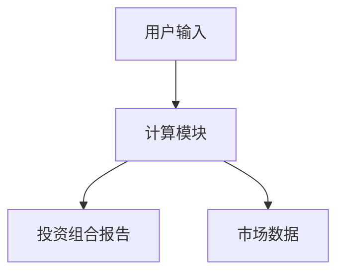

                 


# 彼得林奇的"家庭投资组合"在不同人生阶段的调整

> 关键词：彼得林奇，家庭投资组合，人生阶段，资产配置，风险管理

> 摘要：本文详细探讨了彼得林奇的家庭投资组合在不同人生阶段的调整策略。从单身阶段到退休阶段，每个阶段的财务需求和风险承受能力不同，因此需要相应调整投资组合。文章通过分析各个阶段的资产分配、风险管理及定期评估策略，提供了构建和优化家庭投资组合的实用指导。

---

## 第一章：彼得林奇及其家庭投资组合概述

### 1.1 彼得林奇的生平简介
彼得·林奇（Peter Lynch）是美国著名投资专家，以其在富达投资集团（Fidelity）管理麦哲伦基金的卓越成绩闻名。他强调长期投资和价值投资，倡导根据个人财务状况和风险承受能力构建投资组合。

### 1.2 家庭投资组合的核心概念
家庭投资组合是指根据家庭的财务目标和风险承受能力，合理配置股票、债券、现金等资产的投资策略。其核心目标是在不同人生阶段实现资产增值和财务安全。

---

## 第二章：家庭投资组合的构成与核心要素

### 2.1 投资组合的核心要素
- **股票**：提供较高收益，适合风险承受能力强的阶段。
- **债券**：提供稳定收益，适合风险承受能力较低的阶段。
- **现金**：用于应急和短期目标，保持流动性。

### 2.2 不同人生阶段的财务需求
- **单身阶段**：注重高收益，风险承受能力强。
- **家庭形成阶段**：注重稳定性，需考虑子女教育和房贷。
- **家庭成熟阶段**：注重资产增值和风险管理。
- **退休阶段**：注重保值和稳定收益。

---

## 第三章：家庭投资组合的数学模型与资产配置

### 3.1 资产配置的数学模型
马科维茨的有效投资组合模型用于确定最优资产配置。公式为：
$$ \text{最优投资组合} = \arg\min_w \{ w^T \Sigma w \} \text{ subject to } \mu^T w = r_p $$

其中，$\Sigma$是协方差矩阵，$\mu$是收益向量，$r_p$是目标收益。

### 3.2 根据年龄调整的资产配置比例
- **年轻阶段**（20-30岁）：股票60%，债券20%，现金20%。
- **成熟阶段**（30-50岁）：股票40%，债券40%，现金20%。
- **退休阶段**（50岁以上）：股票20%，债券60%，现金20%。

---

## 第四章：风险管理与定期评估

### 4.1 风险管理策略
- **分散投资**：通过多样化减少风险。
- **定期再平衡**：每年至少评估一次，调整偏离目标比例的部分。

### 4.2 定期评估流程
1. **评估当前财务状况**：收入、支出、资产和负债。
2. **分析市场变化**：经济周期、利率变化。
3. **调整投资组合**：根据评估结果优化资产配置。

---

## 第五章：系统分析与架构设计

### 5.1 系统功能设计
- **用户输入**：年龄、收入、风险偏好。
- **计算模块**：根据模型计算最优配置。
- **输出模块**：生成投资组合报告。

### 5.2 系统架构设计


---

## 第六章：项目实战与代码实现

### 6.1 环境安装
- Python 3.8+
- pandas、numpy、scipy库。

### 6.2 核心代码实现
```python
import numpy as np
import pandas as pd

def calculate_optimal_portfolio(r, cov, target_return):
    # 计算最优投资组合
    n = len(r)
    min_var = np.inf
    best_w = None
    for w in np.random.dirichlet(np.ones(n), 1000):
        if np.dot(r, w) >= target_return and np.dot(w, np.dot(cov, w)) < min_var:
            min_var = np.dot(w, np.dot(cov, w))
            best_w = w
    return best_w
```

---

## 第七章：最佳实践与小结

### 7.1 最佳实践
- 定期评估和调整投资组合。
- 根据市场变化和个人财务状况优化配置。

### 7.2 小结
家庭投资组合在不同人生阶段的调整需要综合考虑财务目标、风险承受能力和市场环境。通过科学的资产配置和定期评估，可以实现长期稳健的收益。

---

## 附录

### 术语表
- **资产配置**：决定投资组合中各类资产的比例。
- **风险管理**：通过分散投资降低风险。

### 工具推荐
- **投资组合优化工具**：如Python的pandas库。
- **投资组合模拟器**：帮助用户模拟不同策略的效果。

### 扩展阅读
- 马科维茨的《投资学》。
- 彼得林奇的《彼得林奇的 investing in value funds》。

---

## 作者：AI天才研究院/AI Genius Institute & 禅与计算机程序设计艺术/Zen And The Art of Computer Programming

---

这篇文章系统地介绍了彼得林奇的家庭投资组合在不同人生阶段的调整策略，从理论分析到实际操作，为读者提供了全面的指导。

