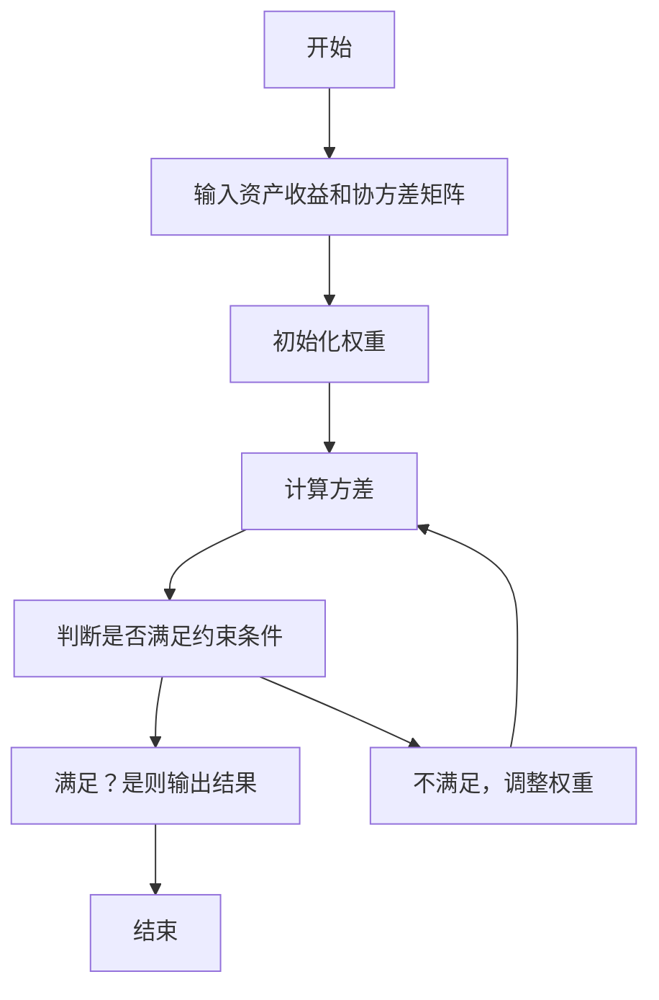

                 


# 彼得林奇的"家庭投资组合"多元化策略

> 关键词：家庭投资组合, 多元化策略, 彼得林奇, 投资组合优化, 资产配置

> 摘要：本文详细探讨了彼得林奇的家庭投资组合多元化策略，从背景介绍、核心概念、算法原理、系统分析、项目实战到最佳实践，全面解析了如何构建和优化一个高效的家庭投资组合。通过数学模型和实际案例，本文为读者提供了理论与实践相结合的指导，帮助他们在投资领域实现稳健收益。

---

## 第一部分：彼得林奇的"家庭投资组合"多元化策略概述

### 第1章：多元化投资的基本概念

#### 1.1 多元化投资的定义与重要性
- **1.1.1 什么是多元化投资**  
  多元化投资是指将资金分散投资于不同的资产类别、行业或地区，以降低风险并提高收益。  
  $$\text{风险分散化} = \text{资产多样性} \times \text{投资组合管理}$$  

- **1.1.2 多元化投资的重要性**  
  通过分散投资，投资者可以降低特定资产或市场的风险，同时捕捉不同资产的收益潜力。  

- **1.1.3 多元化投资的核心目标**  
  稳定收益、风险控制、资产保值与增值。  

#### 1.2 彼得林奇的背景与投资风格
- **1.2.1 彼得林奇的个人简介**  
  彼得·林奇是美国著名的投资专家，以其在共同基金领域的卓越表现闻名。  

- **1.2.2 彼得林奇的投资哲学**  
  林奇强调长期投资、价值投资和多样化投资。  

- **1.2.3 彼得林奇的成功案例**  
  通过长期持有优质资产，林奇实现了稳定而可观的收益。

---

### 第2章：家庭投资组合的构建原则

#### 2.1 投资目标的多样性
- 短期、中期和长期目标的平衡。  
  $$\text{投资目标多样性} = \text{短期目标} + \text{中期目标} + \text{长期目标}$$  

#### 2.2 风险管理
- **风险分散原则**  
  将资金分配到不同资产类别，降低单一资产风险。  

- **风险承受能力**  
  根据家庭的财务状况和风险偏好制定投资策略。  

#### 2.3 资产配置
- **资产配置的重要性**  
  资产配置决定了投资组合的收益和风险特征。  

- **不同资产类别的对比**  
  | 资产类别 | 风险 | 收益 |
  |----------|------|------|
  | 股票     | 高   | 高   |
  | 债券     | 中   | 中   |
  | 现金     | 低   | 低   |

---

## 第二部分：多元化投资的数学模型与算法原理

### 第3章：投资组合优化的数学模型

#### 3.1 均值-方差模型
- **马科维茨的现代投资组合理论（MPT）**  
  通过优化投资组合的收益-风险比率，实现收益最大化。  

- **数学公式**  
  $$\text{Minimize } \sigma^2 \text{ subject to } E(r) \geq \text{目标收益}$$  

#### 3.2 Python实现投资组合优化
```python
import numpy as np
import matplotlib.pyplot as plt

# 示例数据：资产的期望收益和协方差矩阵
returns = np.array([0.05, 0.07, 0.03])
cov_matrix = np.array([[0.02, 0.01, 0.005],
                        [0.01, 0.03, 0.01],
                        [0.005, 0.01, 0.02]])

# 计算最优投资组合
def optimize_portfolio(returns, cov_matrix):
    n = len(returns)
    # 构建优化问题
    from scipy.optimize import minimize
    # 初始猜测：等权重
    init_guess = np.array([1.0/n]*n)
    # 约束条件：权重之和为1
    constraints = {'type': 'eq', 'fun': lambda x: sum(x) - 1}
    # 目标函数：最小化方差
    def objective(x):
        return np.dot(x.T, np.dot(cov_matrix, x))
    # 使用SLSQP求解
    result = minimize(objective, init_guess, method='SLSQP', constraints=constraints)
    return result.x

# 调用函数
weights = optimize_portfolio(returns, cov_matrix)
print("最优权重:", weights)
```

#### 3.3 投资组合优化的算法流程图


---

## 第三部分：系统分析与架构设计

### 第4章：家庭投资组合优化系统

#### 4.1 问题场景介绍
- 家庭投资组合优化的目标是通过数学模型和算法，找到最优的资产配置。  

#### 4.2 系统功能设计
- **领域模型**  
  ```mermaid
  classDiagram
      class 资产 {
          收益率：float
          风险：float
      }
      class 投资组合 {
          权重：float
          收益：float
          风险：float
      }
      class 优化算法 {
          输入：资产列表
          输出：最优权重
      }
      资产 --> 优化算法
      优化算法 --> 投资组合
  ```

#### 4.3 系统架构设计
- **系统架构图**  
  ```mermaid
  architecture
      A[资产数据] --> B[数据处理层]
      B --> C[算法层]
      C --> D[结果展示层]
  ```

---

## 第四部分：项目实战

### 第5章：家庭投资组合优化的实现

#### 5.1 环境安装
- 安装必要的Python库：`numpy`, `scipy`, `matplotlib`。

#### 5.2 核心实现代码
```python
import numpy as np
from scipy.optimize import minimize

def portfolio_optimizer(assets, returns):
    n = len(assets)
    # 初始化权重
    init_guess = np.array([1.0/n]*n)
    # 约束条件：权重之和为1
    constraints = [{'type': 'eq', 'fun': lambda x: sum(x) - 1}]
    # 目标函数：最小化方差
    def objective(x):
        return np.dot(x.T, np.dot(returns, x))
    # 求解
    result = minimize(objective, init_guess, method='SLSQP', constraints=constraints)
    return result.x

# 示例
assets = ['股票', '债券', '现金']
returns = np.array([0.07, 0.05, 0.02])
cov_matrix = np.array([[0.02, 0.01, 0.005],
                       [0.01, 0.03, 0.01],
                       [0.005, 0.01, 0.02]])

weights = portfolio_optimizer(assets, cov_matrix)
print("最优权重:", weights)
```

---

## 第五部分：最佳实践与总结

### 第6章：多元化投资的实践与总结

#### 6.1 最佳实践
- 定期审视和调整投资组合。  
- 根据市场变化动态优化资产配置。  

#### 6.2 小结
通过本文的分析，读者可以掌握彼得林奇的家庭投资组合多元化策略，并通过数学模型和代码实现优化投资组合。

#### 6.3 注意事项
- 避免过度分散投资，防止收益下降。  
- 定期评估市场环境和自身风险承受能力。  

#### 6.4 拓展阅读
- 《The Intelligent Investor》——本杰明·格雷厄姆  
- 《Portfolios for Dummies》—— Patricia A. Tassone

---

**作者：AI天才研究院/AI Genius Institute & 禅与计算机程序设计艺术/Zen And The Art of Computer Programming**

