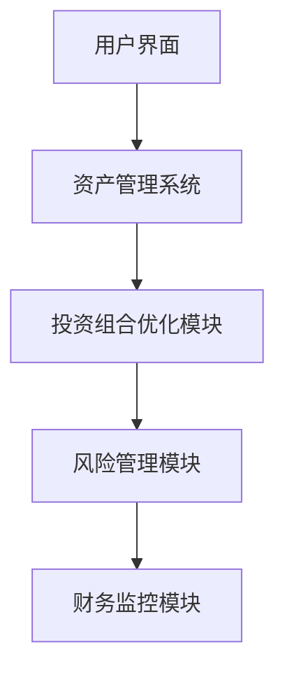
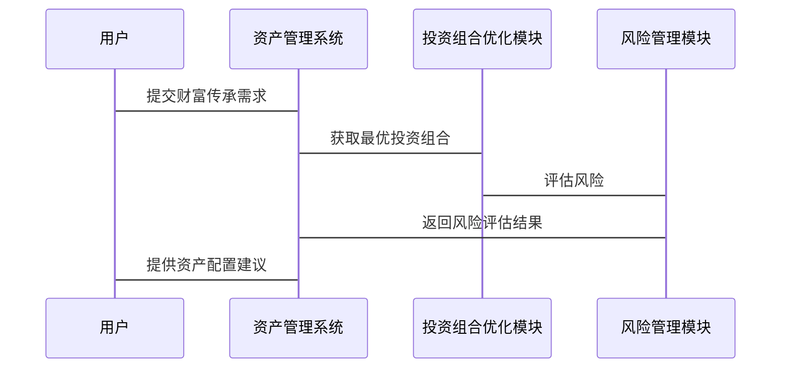

                 


# 彼得林奇的"家庭股票"在跨代财富传承中的作用

## 关键词：彼得林奇，家庭股票，跨代传承，财富管理，投资策略

## 摘要：  
彼得·林奇作为投资领域的传奇人物，提出了“家庭股票”的概念，将家庭资产视为一种长期投资，通过科学的资产配置和风险管理实现财富的跨代传承。本文从家庭股票的定义、核心要素、投资策略、系统架构等多个维度进行分析，结合实际案例，探讨家庭股票在跨代财富传承中的独特作用，为读者提供理论支持和实践指导。

---

## 第一部分：引言

### 第1章：家庭财富传承的背景与挑战

#### 1.1 财富传承的定义与重要性
财富传承是指通过法律、经济和文化等手段，将财富从一代人传递给下一代人。在现代社会中，财富传承不仅仅是资产的转移，更涉及到家族文化的延续、家庭关系的维系以及财富的保值增值。

#### 1.2 贫富差距与财富传承的挑战
随着社会经济的发展，贫富差距逐渐扩大，财富传承的重要性也日益凸显。然而，传统的财富传承方式（如遗嘱和信托）往往存在效率低下、成本高昂、税务负担重等问题，难以满足现代家族的多样化需求。

#### 1.3 彼得林奇的“家庭股票”概念
彼得·林奇提出了“家庭股票”的概念，将家庭资产视为一种长期投资，通过科学的资产配置和风险管理，实现财富的跨代传承。这种方法不仅能够保障财富的保值增值，还能促进家族成员之间的合作与沟通。

---

## 第二部分：家庭股票的核心概念与联系

### 第2章：家庭股票的定义与特点

#### 2.1 家庭股票的原理
家庭股票是一种将家庭资产视为长期投资的理念，其核心在于通过科学的资产配置和风险管理，实现财富的保值与增值。家庭股票的形成过程需要考虑家族成员的需求、风险承受能力和长期目标。

#### 2.2 家庭股票的核心要素对比
以下是家庭股票与其他财富传承方式的核心要素对比表：

| 对比维度 | 家庭股票 | 遗嘱与信托 | 家族企业传承 |
|----------|----------|------------|--------------|
| **控制权** | 家族成员共同持有 | 受托人持有 | 家族企业董事会持有 |
| **流动性** | 高（通过投资实现） | 低（信托财产具有独立性） | 低（企业股权流动性差） |
| **风险** | 中等（通过资产配置分散风险） | 低（信托具有法律保护） | 高（企业经营风险较高） |

#### 2.3 家庭股票的ER实体关系图

```mermaid
er
actor 家庭成员 {
  role: 股东
}
actor 家庭资产 {
  role: 股权持有
}
actor 投资组合 {
  role: 资产管理
}
```

---

## 第三部分：家庭股票在财富传承中的作用

### 第3章：家庭股票的投资策略

#### 3.1 家庭股票的投资理念
彼得·林奇的投资理念强调长期投资和价值发现。家庭股票的投资策略需要结合家族成员的需求和长期目标，通过分散投资降低风险，实现财富的稳定增长。

#### 3.2 家庭股票的投资组合优化（数学模型与公式）

##### 投资组合优化的数学模型
$$\text{目标函数：最大化收益} \quad \max \sum_{i=1}^{n} w_i r_i$$  
$$\text{约束条件：权重之和为1} \quad \sum_{i=1}^{n} w_i = 1$$  
$$\text{风险控制：最小化波动率} \quad \min \sqrt{\sum_{i=1}^{n} w_i^2 \sigma_i^2}$$  

##### 投资组合优化的Python实现

```python
import numpy as np
import pandas as pd

# 示例数据：资产的预期收益和波动率
assets = pd.DataFrame({
    '收益': [0.08, 0.12, 0.05],
    '波动率': [0.2, 0.3, 0.1]
})

# 计算协方差矩阵
cov_matrix = np.diag(assets['波动率'].values)  # 简单假设资产独立

# 使用优化算法求解最优权重
from scipy.optimize import minimize

def portfolio_risk(weights, cov_matrix):
    return np.sqrt(weights.T @ cov_matrix @ weights)

# 初始猜测权重（均等分配）
initial_weights = np.array([1/3, 1/3, 1/3])

# 约束条件：权重之和为1
cons = ({'type': 'eq', 'fun': lambda w: np.sum(w) - 1})

# 求解最小风险问题
result = minimize(portfolio_risk, initial_weights, args=cov_matrix, constraints=cons)

# 输出最优权重和最小风险
print("最优权重：", result.x)
print("最小风险：", result.fun)
```

#### 3.3 家庭股票的风险管理
风险管理是家庭股票投资策略的重要组成部分。通过分散投资、定期评估和动态调整投资组合，可以有效降低财富传承中的风险。

---

## 第四部分：系统分析与架构设计

### 第4章：系统功能设计

#### 4.1 问题场景介绍
跨代财富传承的系统需要实现以下功能：  
- 资产评估与分配  
- 投资组合管理  
- 财务监控与报告  

#### 4.2 系统架构设计
以下是系统架构的Mermaid图：



#### 4.3 系统接口设计
以下是系统接口的Mermaid序列图：



---

## 第五部分：项目实战

### 第5章：家庭股票的实战应用

#### 5.1 环境安装
需要安装以下工具：  
- Python 3.x  
- NumPy 和 Pandas 库  
- Mermaid 插件支持  

#### 5.2 核心功能实现

```python
import numpy as np
import pandas as pd

# 示例数据：家庭成员的需求和风险偏好
family_members = {
    '成员': ['父亲', '母亲', '子女'],
    '风险偏好': [0.5, 0.3, 0.7],
    '收益目标': [0.08, 0.12, 0.05]
}

# 资产配置方案
assets = ['股票', '债券', '房地产']

# 动态调整投资组合
def adjust_portfolio(member, assets, risk_tolerance):
    # 假设资产回报率和波动率已知
    return np.random.dirichlet([1, 1, 1])  # 示例分配

# 示例调整
member = '子女'
new_weights = adjust_portfolio(member, assets, family_members['风险偏好'][2])
print(f"{member}的新投资组合：", new_weights)
```

#### 5.3 实际案例分析
以一个典型家族为例，分析家庭股票在财富传承中的应用，包括资产分配、投资组合优化和风险管理的具体实施。

---

## 第六部分：最佳实践

### 第6章：家庭股票的实践经验

#### 6.1 小结
家庭股票作为一种创新的财富传承方式，通过科学的投资策略和系统化的管理，能够有效实现财富的跨代传承。

#### 6.2 注意事项
- 家族成员的需求和风险偏好需要充分沟通与协调  
- 投资组合需要定期评估和动态调整  
- 系统设计需要考虑法律、税务和风险管理等因素  

#### 6.3 扩展阅读
建议进一步阅读彼得·林奇的经典著作《彼得·林奇的成功投资策略》以及相关财富管理领域的学术文献。

---

## 第七部分：总结

### 第7章：家庭股票的未来展望

#### 7.1 未来趋势
随着人工智能和大数据技术的发展，家庭股票的投资策略将更加智能化和个性化。

#### 7.2 作者观点
财富传承不仅是资产的转移，更是家族文化和价值观的延续。家庭股票作为一种创新的财富管理方式，将在未来的跨代传承中发挥重要作用。

---

## 作者信息

作者：AI天才研究院/AI Genius Institute & 禅与计算机程序设计艺术 /Zen And The Art of Computer Programming

---

**本文内容来源于AI天

