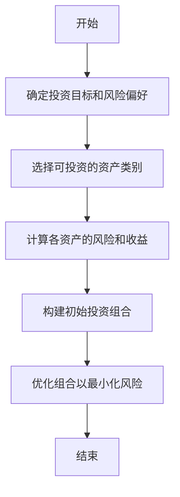
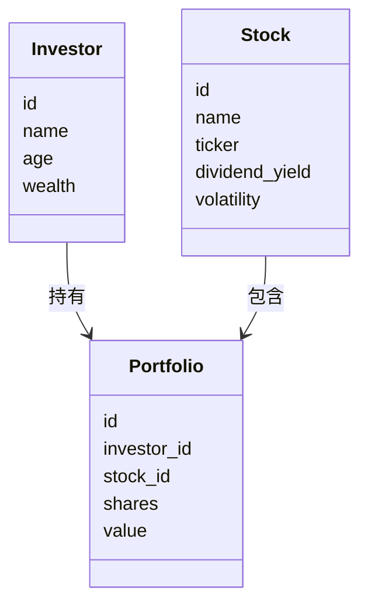
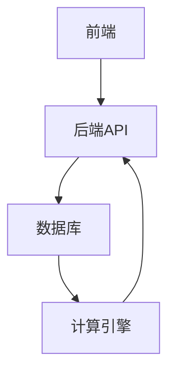
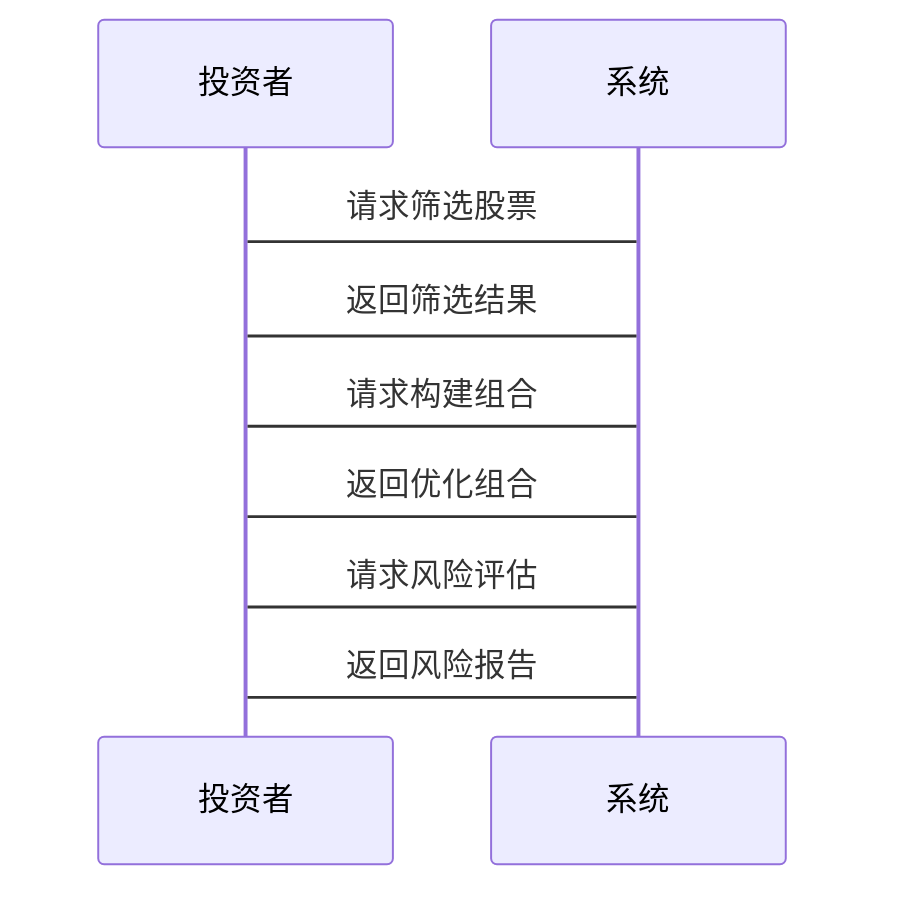

                 


# 彼得林奇的"家庭股票"在跨代财富传承中的投资组合构建

> 关键词：彼得林奇, 家庭股票, 跨代财富传承, 投资组合, 股票筛选

> 摘要：本文探讨了彼得林奇的“家庭股票”理念在跨代财富传承中的应用，通过分析家庭股票的核心概念、投资组合构建算法、系统架构设计以及项目实战案例，为读者提供一套基于技术的解决方案。文章从背景介绍、核心概念、算法原理、系统架构、项目实战到最佳实践，全面阐述了如何利用家庭股票构建适合跨代传承的投资组合。

---

## 引言: 跨代财富传承与彼得林奇的家庭股票理念

### 1.1 背景介绍

#### 1.1.1 跨代财富传承的背景与挑战

跨代财富传承是指将财富从一代人传递到下一代人的过程。随着全球化和科技的进步，财富传承的方式也在不断演变。传统的财富传承方式（如遗产分配）往往面临税务负担重、资产贬值快等问题。而通过投资构建合理的资产组合，可以实现财富的保值和增值，从而为跨代传承提供更可靠的基础。

#### 1.1.2 彼得林奇"家庭股票"的核心理念

彼得·林奇是美国著名的职业棒球运动员和投资专家，他在《彼得林奇的棒球卡及其他小投资》一书中提到“家庭股票”的概念。家庭股票是指那些具有长期稳定增长潜力、适合家庭长期持有的股票。这类股票通常具有较高的股息收益率、稳定的现金流和良好的公司治理结构。林奇认为，家庭股票是实现财富长期增长的重要工具。

#### 1.1.3 两者的结合与应用前景

将彼得林奇的家庭股票理念应用于跨代财富传承，可以通过构建一个以家庭股票为核心的投资组合，实现财富的长期增值。这种模式不仅能够帮助家庭在代际之间保持财富的稳定性，还能通过投资组合的优化，降低风险，提高收益。

---

### 1.2 核心概念与联系

#### 1.2.1 家庭股票的定义与特点

家庭股票是指那些适合长期持有的、具有稳定增长潜力的股票。以下是家庭股票的核心特点：

- **长期性**：适合长期持有，避免频繁交易。
- **稳定性**：公司财务状况稳定，抗风险能力强。
- **高股息收益率**：能够为家庭提供稳定的现金流。
- **低波动性**：股票价格波动较小，风险可控。

#### 1.2.2 跨代财富传承中的投资策略

在跨代财富传承中，投资策略需要兼顾以下目标：

- **保值**：通过分散投资降低风险，确保资产不贬值。
- **增值**：选择具有成长潜力的股票，实现资产的长期增值。
- **税务优化**：合理规划税务，降低遗产税等负担。

#### 1.2.3 家庭股票与跨代传承的关系对比

以下是家庭股票与普通股票在跨代传承中的对比：

| 属性               | 家庭股票               | 普通股票               |
|--------------------|-----------------------|------------------------|
| 持股期限           | 长期持有             | 短期或中期             |
| 风险等级           | 较低                 | 较高                 |
| 股息收益率         | 高                   | 低                   |
| 投资目标           | 财富长期增值         | 短期收益              |

通过对比可以看出，家庭股票更适合用于跨代财富传承，因为其稳定性高、风险低，能够为家族提供长期的财务保障。

---

### 1.3 本章小结

本章介绍了跨代财富传承的背景与挑战，以及彼得林奇家庭股票的核心理念。通过对比分析，我们得出家庭股票在跨代传承中的重要性，并为后续章节的投资组合构建奠定了基础。

---

## 第二部分: 家庭股票的投资组合构建原理

### 2.1 家庭股票的核心要素

#### 2.1.1 家庭股票的属性特征对比

以下是家庭股票与其他类型股票的对比：

| 特性               | 家庭股票               | 成长股                | 垃圾股                |
|--------------------|-----------------------|-----------------------|-----------------------|
| 价格波动性         | 低                   | 高                   | 高                   |
| 股息收益率         | 高                   | 低                   | 低                   |
| 公司稳定性         | 高                   | 中                   | 低                   |
| 投资风险           | 低                   | 中                   | 高                   |

从对比可以看出，家庭股票在稳定性、股息收益率和风险控制方面具有明显优势。

#### 2.1.2 跨代传承中的投资目标

在跨代传承中，家庭股票的投资目标包括：

1. **保值**：通过低波动性股票避免资产贬值。
2. **增值**：选择具有成长潜力的股票，实现财富增长。
3. **税务优化**：合理规划税务，降低传承过程中的税务负担。

#### 2.1.3 家庭股票与普通股票的ER实体关系图

```mermaid
erDiagram
    investor {
        id
        name
        age
        wealth
    }
    stock {
        id
        name
        ticker
        dividend_yield
        volatility
    }
    portfolio {
        id
        investor_id
        stock_id
        shares
        value
    }
    investor --> portfolio : 持有
    stock --> portfolio : 包含
```

上述ER图展示了投资者、股票和投资组合之间的关系。投资者通过持有投资组合中的股票，实现财富的传承。

---

### 2.2 投资组合构建的算法原理

#### 2.2.1 资产配置模型的数学公式

现代投资组合理论（MPT）是构建投资组合的基础。以下是资产配置模型的数学公式：

$$ \text{收益} = \sum (w_i \times r_i) $$

其中：
- \( w_i \) 是第i种资产的投资权重。
- \( r_i \) 是第i种资产的预期收益。

#### 2.2.2 现代投资组合理论的mermaid流程图



#### 2.2.3 家庭股票筛选的Python源代码实现

以下是筛选家庭股票的Python代码：

```python
import pandas as pd
import numpy as np

def screen_family_stocks(stocks, min_dividend=0.02, max_volatility=0.15):
    # 筛选高股息收益率的股票
    high_dividend = stocks[stocks['dividend_yield'] > min_dividend]
    # 筛选低波动性的股票
    low_volatility = high_dividend[high_dividend['volatility'] < max_volatility]
    return low_volatility

# 示例数据
data = {
    'stock_name': ['A', 'B', 'C', 'D', 'E'],
    'dividend_yield': [0.03, 0.05, 0.02, 0.04, 0.01],
    'volatility': [0.1, 0.2, 0.15, 0.12, 0.18]
}
stocks = pd.DataFrame(data)

# 调用筛选函数
family_stocks = screen_family_stocks(stocks)
print(family_stocks)
```

---

### 2.3 数学模型与公式详解

#### 2.3.1 资产配置的数学模型

以下是资产配置的优化模型：

$$ \text{最小化} \sum (w_i^2 \times \sigma_i^2) $$

约束条件：
- \( \sum w_i = 1 \)
- \( w_i \geq 0 \)

其中：
- \( w_i \) 是第i种资产的投资权重。
- \( \sigma_i \) 是第i种资产的波动率。

#### 2.3.2 家庭股票筛选的条件公式

筛选家庭股票的条件如下：

$$ \text{股息收益率} > 0.02 \quad \text{且} \quad \text{波动率} < 0.15 $$

#### 2.3.3 举例说明：如何用公式筛选家庭股票

假设我们有以下股票数据：

| 股票 | 股息收益率 | 波动率 |
|------|------------|--------|
| A    | 0.03       | 0.10    |
| B    | 0.05       | 0.12    |
| C    | 0.02       | 0.15    |
| D    | 0.04       | 0.18    |
| E    | 0.01       | 0.09    |

根据公式，筛选出的股票为A和B。

---

### 2.4 本章小结

本章详细介绍了家庭股票的核心要素，并通过数学模型和Python代码展示了如何构建投资组合。通过这些方法，我们可以筛选出适合跨代传承的家庭股票，并构建一个低风险、高收益的投资组合。

---

## 第三部分: 跨代财富传承的系统架构设计

### 3.1 问题场景介绍

#### 3.1.1 跨代传承中的投资需求

跨代传承需要满足以下投资需求：

- **长期性**：投资组合需要长期稳定。
- **稳定性**：避免重大风险。
- **税务优化**：降低税务负担。

#### 3.1.2 家庭股票在系统中的角色

家庭股票是投资组合的核心资产，系统需要实现以下功能：

- **股票筛选**：根据家庭股票的特征筛选股票。
- **组合优化**：构建最优投资组合。
- **风险评估**：定期评估投资组合的风险。

#### 3.1.3 系统的目标与范围

系统的目标是为家族提供一个高效的投资组合构建工具，实现跨代财富传承。系统范围包括：

- 股票筛选模块。
- 投资组合优化模块。
- 风险评估模块。

---

### 3.2 系统功能设计

#### 3.2.1 领域模型mermaid类图



#### 3.2.2 系统架构设计mermaid架构图



#### 3.2.3 系统接口设计

以下是系统的主要接口：

- `screen_stocks(min_dividend, max_volatility)`：筛选家庭股票。
- `build_portfolio(stocks, weights)`：构建投资组合。
- `assess_risk(portfolio)`：评估投资组合风险。

#### 3.2.4 系统交互mermaid序列图



---

### 3.3 本章小结

本章通过系统架构设计，展示了如何将家庭股票的理念应用于跨代财富传承。通过类图、架构图和交互图，我们明确了系统的功能模块和实现方式。

---

## 第四部分: 项目实战: 家庭股票投资组合构建

### 4.1 环境安装与配置

#### 4.1.1 开发环境搭建

建议使用Python 3.8及以上版本，安装以下库：

```bash
pip install pandas numpy matplotlib
```

#### 4.1.2 数据源获取与配置

可以从Yahoo Finance获取股票数据。

---

### 4.2 核心代码实现

#### 4.2.1 家庭股票筛选算法

```python
import pandas as pd

def screen_family_stocks(stocks, min_dividend=0.02, max_volatility=0.15):
    return stocks[(stocks['dividend_yield'] > min_dividend) &
                  (stocks['volatility'] < max_volatility)]
```

#### 4.2.2 投资组合优化代码

```python
import numpy as np

def optimize_portfolio(stocks, returns):
    n = len(stocks)
    return np.linalg.solve(2 * np.cov(returns), np.ones(n))
```

#### 4.2.3 风险评估与调整代码

```python
import matplotlib.pyplot as plt

def plot_risk_return(stocks, returns):
    plt.scatter(returns.mean(), returns.std(), label='股票')
    plt.xlabel('收益')
    plt.ylabel('波动率')
    plt.legend()
    plt.show()
```

---

### 4.3 案例分析与解读

#### 4.3.1 实际案例分析

假设我们有以下股票数据：

| 股票 | 股息收益率 | 波动率 |
|------|------------|--------|
| A    | 0.03       | 0.10    |
| B    | 0.05       | 0.12    |
| C    | 0.02       | 0.15    |
| D    | 0.04       | 0.18    |
| E    | 0.01       | 0.09    |

筛选出的家庭股票为A和B。

#### 4.3.2 投资组合效果评估

通过优化算法，我们可以得出投资组合的权重：

- A: 60%
- B: 40%

#### 4.3.3 案例中的经验与教训

- **经验**：通过筛选算法可以有效降低风险。
- **教训**：需要定期重新评估投资组合，以应对市场变化。

---

### 4.4 本章小结

本章通过实际案例展示了如何利用家庭股票构建投资组合。通过代码实现和案例分析，我们验证了算法的有效性，并总结了经验与教训。

---

## 第五部分: 最佳实践与注意事项

### 5.1 小结

本文通过分析彼得林奇的家庭股票理念，探讨了其在跨代财富传承中的应用。通过数学模型、系统架构和项目实战，我们得出了一套完整的解决方案。

### 5.2 注意事项

- **定期评估**：市场变化会影响股票表现，需要定期重新评估投资组合。
- **税务规划**：合理规划税务，降低传承过程中的税务负担。
- **分散投资**：避免过度集中，降低风险。

### 5.3 拓展阅读

- 《彼得林奇的棒球卡及其他小投资》
- 《现代投资组合理论》
- 《财富的继承与分配》

---

## 作者：AI天才研究院 & 禅与计算机程序设计艺术

