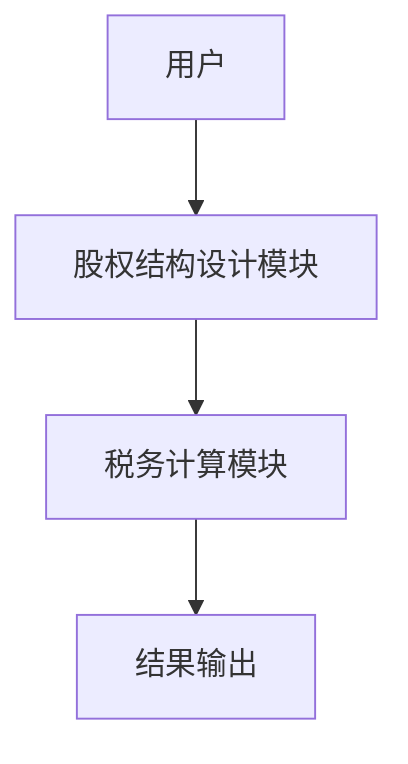

                 


# 彼得林奇的"家庭股票"在跨代财富传承中的税务优化

> 关键词：跨代财富传承、税务优化、家庭股票、彼得林奇、财富管理

> 摘要：本文深入探讨了彼得林奇提出的"家庭股票"概念在跨代财富传承中的税务优化策略。通过分析股权结构设计、税务递延机制、税务抵扣原理等核心内容，结合实际案例和数学模型，详细阐述了如何通过合理配置家庭股票实现财富传承的税务优化。文章最后总结了最佳实践和未来发展方向。

---

## 第一章: 背景介绍

### 1.1 跨代财富传承的背景与挑战

#### 1.1.1 财富传承的背景
现代社会中，财富积累的速度显著加快，而财富传承的需求也日益增长。随着家族企业的发展和资产规模的扩大，如何在代际之间高效传承财富成为许多家庭面临的重要问题。

#### 1.1.2 财富传承的核心问题
财富传承的核心问题包括：
1. 如何避免高额遗产税和赠与税。
2. 如何确保财富传承的效率和安全性。
3. 如何平衡各代际之间的利益分配。

#### 1.1.3 税务优化在财富传承中的重要性
税务优化是财富传承的关键环节，直接影响财富的保值与增值。通过合理的税务规划，可以最大限度地减少税收损失，确保财富传承的效率。

---

### 1.2 家庭财富传承中的税务挑战

#### 1.2.1 财富传承中的主要税务类型
财富传承涉及的主要税务类型包括：
1. 遗产税。
2. 赠与税。
3. 资本利得税。
4. 企业所得税。

#### 1.2.2 税务对财富传承效率的影响
税务负担过重可能导致财富大幅缩水，甚至影响家族企业的正常运营。因此，如何降低税务负担是财富传承的关键。

#### 1.2.3 税务规划在财富传承中的作用
税务规划是财富传承的核心策略之一，通过合理规划税务，可以有效降低税务负担，确保财富的顺利传承。

---

### 1.3 彼得林奇的"家庭股票"概念

#### 1.3.1 "家庭股票"的定义与特点
"家庭股票"是指以家庭成员为核心，通过股权结构设计实现财富传承的一种工具。其特点包括：
1. 股权分散化。
2. 财富保值与增值并重。
3. 税务优化能力强。

#### 1.3.2 "家庭股票"在财富传承中的优势
"家庭股票"的优势包括：
1. 可以通过股权结构设计实现税务递延。
2. 股权传承具有较高的灵活性。
3. 股权价值稳定，风险较低。

#### 1.3.3 "家庭股票"与其他财富传承工具的对比
"家庭股票"与其他财富传承工具（如信托、保险）相比，具有以下优势：
1. 税务优化能力更强。
2. 股权结构更灵活。
3. 财富传承效率更高。

---

## 第二章: "家庭股票"的核心概念与税务优化原理

### 2.1 "家庭股票"的税务优化原理

#### 2.1.1 股权结构设计对税务的影响
股权结构设计直接影响税务负担。通过合理设计股权结构，可以有效降低遗产税和赠与税。

#### 2.1.2 股权传承中的税务递延机制
税务递延机制是指在股权传承过程中，通过合理安排传承时间，延迟税务缴纳，从而降低税务负担。

#### 2.1.3 股权价值评估与税务计算
股权价值评估是税务计算的基础。通过合理评估股权价值，可以最大限度地降低税务负担。

---

### 2.2 "家庭股票"税务优化的关键因素

#### 2.2.1 股权持有方式的选择
股权持有方式包括直接持有和间接持有。间接持有（如通过信托公司持有）通常具有更低的税务负担。

#### 2.2.2 股权传承的时间规划
时间规划是税务优化的重要因素。通过合理安排传承时间，可以实现税务递延。

#### 2.2.3 股权结构的法律合规性
法律合规性是税务优化的前提条件。必须确保股权结构设计符合相关法律法规。

---

### 2.3 "家庭股票"税务优化的数学模型

#### 2.3.1 股权价值的计算公式
股权价值的计算公式为：
$$ \text{股权价值} = \text{公司价值} \times \text{股权比例} $$

#### 2.3.2 税后财富传承效率的评估模型
$$ \text{财富传承效率} = \frac{\text{传承财富} - \text{税务支出}}{\text{初始财富}} \times 100\% $$

#### 2.3.3 税务递延与税务抵扣的数学分析
通过合理设计股权结构，可以实现税务递延和税务抵扣。例如，通过将股权转移时间安排在税率较低的时期，可以降低税务负担。

---

## 第三章: 财富传承中的税务优化策略

### 3.1 税务优化的基本原则

#### 3.1.1 税务最小化原则
在不违反法律法规的前提下，尽可能减少税务支出。

#### 3.1.2 财富保值与增值原则
在实现税务优化的同时，确保财富的保值与增值。

#### 3.1.3 法律合规性原则
确保税务优化方案符合相关法律法规。

---

### 3.2 税务优化的具体策略

#### 3.2.1 股权结构优化
通过调整股权比例和股东结构，降低税务负担。

#### 3.2.2 股权传承时间规划
合理安排股权传承时间，实现税务递延。

#### 3.2.3 股权价值评估
通过合理评估股权价值，降低税务支出。

---

## 第四章: 系统分析与架构设计

### 4.1 系统功能设计

#### 4.1.1 股权结构设计模块
功能：设计股权结构，优化税务负担。

#### 4.1.2 税务计算模块
功能：计算股权传承过程中的税务支出。

---

### 4.2 系统架构设计

#### 4.2.1 系统架构图


#### 4.2.2 接口设计
1. 输入接口：股权比例、公司价值。
2. 输出接口：税务支出、财富传承效率。

---

## 第五章: 项目实战

### 5.1 环境安装

#### 5.1.1 系统环境
- 操作系统：Windows 10或更高版本。
- 开发工具：Python 3.8或更高版本。

---

### 5.2 核心代码实现

#### 5.2.1 股权价值计算
```python
def calculate_equity_value(company_value, equity_ratio):
    return company_value * equity_ratio
```

#### 5.2.2 税务计算
```python
def calculate_tax(equity_value, tax_rate):
    return equity_value * tax_rate
```

---

## 第六章: 最佳实践与未来展望

### 6.1 最佳实践

#### 6.1.1 合规性原则
确保税务优化方案符合法律法规。

#### 6.1.2 专业性原则
建议聘请专业税务顾问和法律顾问。

---

### 6.2 小结

通过合理设计股权结构和税务规划，可以有效降低财富传承中的税务负担，确保财富的顺利传承。

---

### 6.3 未来展望

随着税收政策的变化和法律法规的完善，"家庭股票"的税务优化策略也将不断 evolves.未来，随着技术的进步和法律的完善，财富传承的税务优化将更加智能化和个性化。

---

## 作者：AI天才研究院/AI Genius Institute & 禅与计算机程序设计艺术 /Zen And The Art of Computer Programming

---

**注**：以上内容为《彼得林奇的"家庭股票"在跨代财富传承中的税务优化》的技术博客文章的详细大纲，根据需要可以进一步扩展每个部分的内容。

