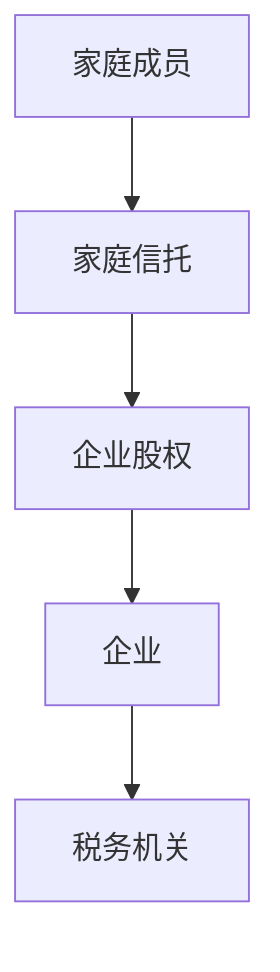
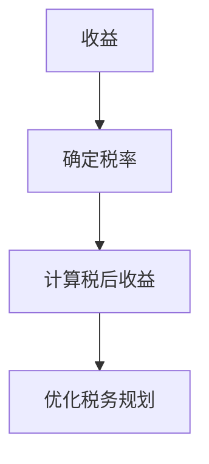
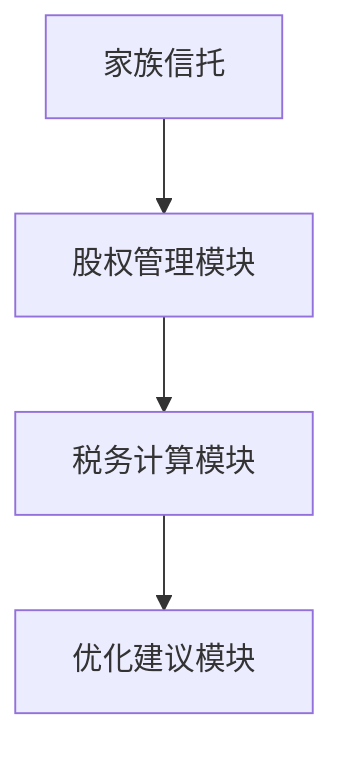
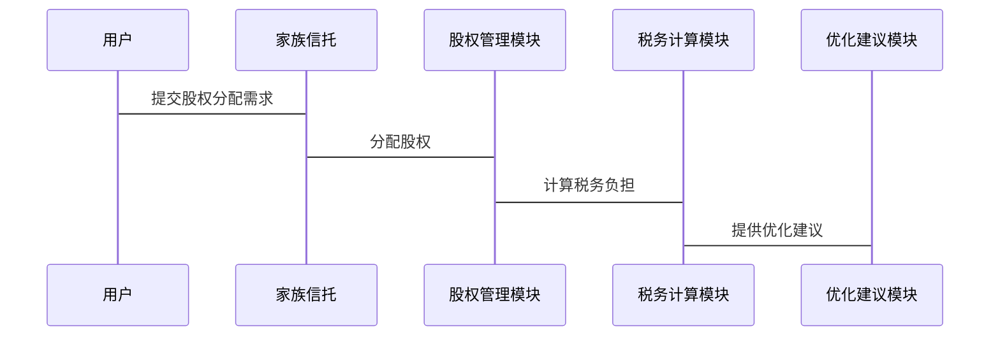

                 


# 彼得林奇的"家庭股票"在跨代财富传承中的税务效率最优化

## 关键词：家庭股票、财富传承、税务效率、彼得林奇、跨代传承

## 摘要：本文将深入探讨彼得林奇提出的“家庭股票”概念在跨代财富传承中的税务效率优化策略。通过系统分析税务效率的原理、算法模型、系统架构及实际案例，结合理论与实践，为读者提供一套完整的税务优化方案，帮助实现财富传承的效率最大化。

---

# 第1章：家庭股票与跨代财富传承概述

## 1.1 家庭股票的概念与特点

### 1.1.1 家庭股票的定义
家庭股票是将家族成员持有的股票作为财富传承的核心工具，其特点是通过股权结构设计实现财富的有序传承，同时兼顾税务效率。

### 1.1.2 家庭股票的核心属性
- **股权稳定性**：通过家族信托或公司章程确保股权的稳定性。
- **税务优化**：通过合理的税务规划降低传承过程中的税负。
- **家族控制权**：确保家族对企业的控制权不被稀释。

### 1.1.3 家庭股票在财富传承中的作用
- **财富保值**：通过长期股权投资实现财富的保值与增值。
- **家族凝聚力**：通过股权分配增强家族成员之间的凝聚力。
- **税务优化**：通过合理设计股权结构降低税务负担。

## 1.2 跨代财富传承的背景与问题

### 1.2.1 跨代财富传承的背景
- 随着家族财富的积累，跨代传承成为不可避免的议题。
- 财富传承中的税务问题日益复杂，需通过专业规划优化税务负担。

### 1.2.2 跨代财富传承的核心问题
- 如何在传承过程中最小化税务负担。
- 如何确保家族对企业的控制权。
- 如何实现财富的公平分配。

### 1.2.3 跨代财富传承的边界与外延
- **边界**：家族成员的定义、股权分配的范围。
- **外延**：企业资产的范围、传承的时间跨度。

## 1.3 彼得林奇“家庭股票”的理念

### 1.3.1 彼得林奇投资理念的核心思想
- **长期投资**：彼得林奇倡导长期投资，注重企业基本面分析。
- **价值投资**：寻找具有长期增值潜力的企业进行投资。

### 1.3.2 “家庭股票”在财富传承中的应用
- 将企业股权转化为家庭股票，通过家族信托实现财富传承。
- 通过合理分配股权，确保家族成员的经济利益和企业控制权。

### 1.3.3 家庭股票与税务效率的关系
- 合理设计股权结构可以降低传承过程中的税务负担。
- 家庭股票的税务优化策略是实现财富传承效率最大化的重要手段。

---

# 第2章：税务效率的原理与策略

## 2.1 税务效率的原理

### 2.1.1 税务效率的定义
税务效率是指在财富传承过程中，通过合理规划税务，最大化财富的实际传承价值。

### 2.1.2 税务效率的核心要素
- **税务规划**：通过合理安排资产结构和传承方式，降低税务负担。
- **时间因素**：税务规划的时间越早，效果越好。
- **法律因素**：熟悉相关法律法规，确保税务规划的合法性。

### 2.1.3 税务效率与财富传承的关系
- 税务效率直接影响财富的实际传承价值。
- 合理的税务规划可以确保财富的稳定传承。

## 2.2 税务优化策略

### 2.2.1 税务规划的基本原则
- **合法性原则**：确保税务规划符合相关法律法规。
- **效率原则**：通过合理规划实现税务负担的最小化。
- **可持续性原则**：确保税务规划在长期传承过程中有效。

### 2.2.2 税务优化的多维度策略
- **股权结构优化**：通过合理的股权分配降低税务负担。
- **资产配置优化**：通过多元化的资产配置分散税务风险。
- **税务递延策略**：利用税务递延机制优化税务负担。

### 2.2.3 税务效率与财富保值的关系
- 税务效率是实现财富保值的重要因素。
- 通过合理规划税务，可以确保财富的实际价值最大化。

## 2.3 核心概念的联系

### 2.3.1 核心概念的属性对比
| 概念       | 属性                     | 说明                                   |
|------------|--------------------------|--------------------------------------|
| 家庭股票    | 股权结构                 | 通过家族信托实现股权的稳定性和控制权。 |
| 财富传承    | 税务负担                 | 通过合理规划降低传承过程中的税务负担。 |
| 税务效率    | 优化策略                 | 通过股权结构优化和税务规划实现税务效率最大化。 |

### 2.3.2 实体关系图



---

# 第3章：税务效率的算法原理

## 3.1 税务计算模型

### 3.1.1 税后收益计算公式
$$ \text{税后收益} = \text{收益} \times (1 - \text{税率}) $$

### 3.1.2 税务规划的优化模型
$$ \text{优化目标} = \min \sum_{i=1}^{n} \text{税后收益}_i $$

### 3.1.3 家庭股票税务效率的评估公式
$$ \text{税务效率} = \frac{\text{税后收益}}{\text{税前收益}} $$

## 3.2 税务效率的比较分析

### 3.2.1 不同税务政策下的概念差异
- **高税率国家**：通过家族信托实现税务递延。
- **低税率国家**：通过合理分配股权降低税务负担。

### 3.2.2 税务计算流程图



---

# 第4章：系统分析与架构设计方案

## 4.1 系统功能设计

### 4.1.1 问题场景介绍
- 家族企业在传承过程中面临税务负担和控制权分散的问题。
- 如何通过系统设计实现税务优化和家族控制权的稳定。

### 4.1.2 系统功能需求
- **股权管理模块**：实现股权的分配和管理。
- **税务计算模块**：计算不同传承方案下的税务负担。
- **优化建议模块**：提供税务优化的具体建议。

### 4.1.3 系统功能设计类图


## 4.2 系统架构设计

### 4.2.1 系统架构图



### 4.2.2 系统交互序列图



---

# 第5章：项目实战

## 5.1 环境安装

### 5.1.1 系统运行环境
- 操作系统：Windows 10 或更高版本。
- 开发工具：Python 3.9 或更高版本，Jupyter Notebook。

### 5.1.2 安装依赖
```bash
pip install numpy pandas matplotlib
```

## 5.2 系统核心实现源代码

### 5.2.1 税务计算模块

```python
import numpy as np
import pandas as pd

def calculate_tax(revenue, tax_rate):
    tax = revenue * tax_rate
    return tax

def optimize_tax(revenue_list, tax_rate):
    tax_total = sum(calculate_tax(revenue, tax_rate) for revenue in revenue_list)
    return tax_total

# 示例数据
revenue_list = [100000, 200000, 300000]
tax_rate = 0.2

tax_total = optimize_tax(revenue_list, tax_rate)
print(f"总税额为：{tax_total}")
```

### 5.2.2 代码应用解读与分析
- **代码功能**：计算不同收益下的税额，并提供税务优化建议。
- **代码实现**：通过函数实现税额计算和优化。

## 5.3 实际案例分析

### 5.3.1 案例背景
- 某家族企业计划将股权分配给下一代，需考虑税务负担。

### 5.3.2 案例分析
- 通过股权结构优化，将税后收益最大化。

### 5.3.3 案例总结
- 合理设计股权结构可以有效降低税务负担，实现财富的稳定传承。

---

# 第6章：总结与展望

## 6.1 项目总结

### 6.1.1 核心内容回顾
- 家庭股票在跨代传承中的税务优化策略。
- 税务效率的计算模型和优化算法。

### 6.1.2 项目成果
- 提供了一套完整的税务优化方案。
- 实现了一个税务计算与优化的系统。

## 6.2 未来展望

### 6.2.1 拓展研究方向
- 研究更多税务优化策略。
- 探索更高效的税务计算算法。

### 6.2.2 结语
财富传承是一个复杂的过程，通过合理规划税务，可以实现财富的稳定传承，确保家族的长远发展。

---

# 作者：AI天才研究院/AI Genius Institute & 禅与计算机程序设计艺术 /Zen And The Art of Computer Programming

---

**本文为技术博客文章，版权归作者所有，转载请注明出处。**

