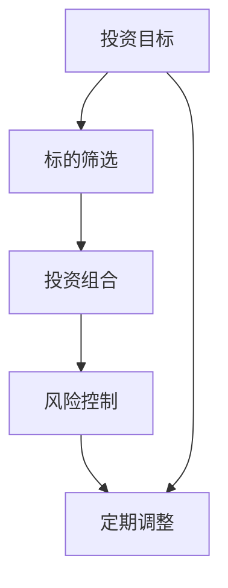
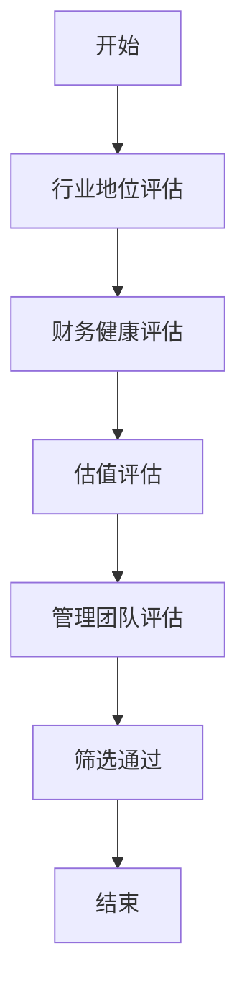

                 


# 彼得林奇的"家庭股票"投资策略

> 关键词：彼得林奇，家庭股票，投资策略，股票筛选，风险管理，投资组合，长期投资

> 摘要：本文详细介绍了彼得林奇的“家庭股票”投资策略，从背景介绍、核心概念、算法原理、系统架构到项目实战，全面解析了这一策略的实施方法和实际应用。文章通过详细分析和案例研究，帮助读者理解和掌握这一投资策略，并提供了最佳实践建议。

---

# 第一部分: 彼得林奇投资策略的背景与概述

## 第1章: 彼得林奇投资策略的背景介绍

### 1.1 家庭股票的定义与特点

家庭股票投资是彼得林奇提出的一种适合个人和家庭投资者的股票投资策略。与机构投资者不同，家庭投资者通常追求长期稳健的收益，注重风险控制，并希望投资标的具有较高的成长性和稳定性。家庭股票的核心在于“家庭”二字，强调投资标的与家庭需求的契合，注重长期价值而非短期波动。

#### 1.1.1 家庭股票的定义

家庭股票是指那些具备以下特点的股票：
- **高成长性**：公司处于成长期，未来有较大的发展空间。
- **低波动性**：股价波动较小，适合风险厌恶型投资者。
- **高分红率**：公司愿意将利润分配给股东，提供稳定的现金流。
- **行业地位稳固**：公司处于行业领先地位，具有竞争优势。

#### 1.1.2 家庭股票与传统股票投资的区别

| 特性 | 家庭股票 | 传统股票投资 |
|------|----------|--------------|
| 投资目标 | 长期稳健收益 | 短期收益或长期资本增值 |
| 风险偏好 | 低风险厌恶 | 高风险承受能力 |
| 标的选择 | 稳定成长型公司 | 高增长或高估值公司 |
| 投资期限 | 中长期 | 短期或中长期 |

---

## 第2章: 家庭股票投资的核心要素

### 2.1 家庭股票投资的核心要素分析

家庭股票投资的核心在于通过科学的筛选方法和合理的投资组合配置，实现长期稳健的收益。以下是其核心要素：

#### 2.1.1 投资标的筛选标准

彼得林奇的家庭股票筛选标准如下：
- **行业地位**：选择行业龙头公司，具有竞争优势。
- **财务健康**：公司财务状况良好，资产负债率低，盈利能力强。
- **成长性**：公司未来三年内预计有稳定的收入和利润增长。
- **估值合理**：市盈率（P/E）和市净率（P/B）处于合理区间，避免高估值陷阱。
- **管理团队**：公司管理层稳定，具有良好的管理能力和愿景。

#### 2.1.2 投资组合的构建逻辑

家庭股票投资强调分散投资，避免过度集中于某一只股票或行业。建议将资金分配到5-10只股票中，每只股票的投资比例不超过总投资额的20%。以下是构建投资组合的步骤：

1. **确定投资目标**：明确投资期限、收益目标和风险承受能力。
2. **筛选股票池**：根据筛选标准，选出符合条件的股票。
3. **分散投资**：将资金分配到多个股票中，降低风险。
4. **定期调整**：根据市场变化和公司基本面，定期审视投资组合，进行优化调整。

#### 2.1.3 投资风险的控制机制

家庭股票投资通过以下方式控制风险：
- **分散投资**：降低单一股票的风险。
- **长期持有**：避免频繁交易，减少交易成本和税务负担。
- **定期再平衡**：定期审视投资组合，及时调整持仓比例，应对市场变化。

---

## 第3章: 家庭股票投资的逻辑结构

### 3.1 家庭股票投资的逻辑结构分析

家庭股票投资的逻辑结构可以分为以下几个层次：

1. **目标设定**：明确投资目标和风险偏好。
2. **标的筛选**：根据筛选标准，选择符合条件的股票。
3. **组合构建**：通过分散投资构建投资组合。
4. **风险控制**：通过定期调整和再平衡控制风险。
5. **持续监控**：跟踪投资标的和市场变化，及时调整策略。

---

## 第4章: 家庭股票投资的核心概念架构

### 4.1 家庭股票投资的实体关系图

以下是家庭股票投资的核心要素关系图：



---

## 第5章: 家庭股票投资的算法原理

### 5.1 家庭股票投资的筛选算法

彼得林奇的家庭股票筛选算法如下：

1. **行业地位评估**：选择行业龙头公司，优先考虑市场份额高、竞争优势明显的公司。
2. **财务健康评估**：计算公司的盈利能力、资产负债率等财务指标，筛选出财务健康、成长性好的公司。
3. **估值评估**：计算市盈率（P/E）、市净率（P/B）等估值指标，排除高估值股票。
4. **管理团队评估**：选择管理团队稳定、能力强的公司。

#### 5.1.1 算法流程图



---

## 第6章: 家庭股票投资的系统架构设计

### 6.1 家庭股票投资的系统功能设计

家庭股票投资系统需要具备以下功能模块：
- **数据采集**：获取股票的基本面数据、财务数据等。
- **筛选模型**：根据筛选标准，筛选出符合条件的股票。
- **组合构建**：根据投资目标，构建投资组合。
- **风险控制**：评估投资组合的风险，进行再平衡调整。

---

## 第7章: 家庭股票投资的项目实战

### 7.1 环境安装

为了实现家庭股票投资的系统，需要以下环境：
- **编程语言**：Python
- **数据源**：股票数据可以从Yahoo Finance获取。
- **工具**：使用Pandas、NumPy等库进行数据分析。

### 7.2 核心代码实现

以下是家庭股票投资系统的核心代码示例：

```python
import pandas as pd

# 数据获取
def get_stock_data(tickers):
    data = {}
    for ticker in tickers:
        df = pd.read_csv(f'data/{ticker}.csv')
        data[ticker] = df
    return data

# 筛选标准
def screen_stocks(data):
    selected = []
    for ticker, df in data.items():
        # 行业地位评估
        if df['Market Cap'].iloc[-1] < 1000000000:
            continue
        # 财务健康评估
        if df['Debt/Equity'].iloc[-1] > 0.5:
            continue
        # 估值评估
        if df['PE'].iloc[-1] > 25 or df['PB'].iloc[-1] > 5:
            continue
        # 管理团队评估（简化）
        selected.append(ticker)
    return selected

# 投资组合构建
def build_portfolio(selected_stocks, data):
    portfolio = {}
    for ticker in selected_stocks:
        weight = 1 / len(selected_stocks)
        portfolio[ticker] = weight
    return portfolio

# 风险控制
def rebalance_portfolio(portfolio, data):
    current_weights = {}
    for ticker, weight in portfolio.items():
        current_weights[ticker] = weight
    # 这里可以进行再平衡操作
    return current_weights
```

### 7.3 代码解读与分析

上述代码展示了家庭股票投资系统的实现步骤：
1. **数据获取**：从数据文件中读取股票数据。
2. **筛选标准**：根据行业地位、财务健康、估值等标准筛选股票。
3. **组合构建**：根据筛选结果构建投资组合。
4. **风险控制**：定期审视投资组合，进行再平衡调整。

### 7.4 实际案例分析

以苹果公司为例，假设我们通过家庭股票筛选标准，筛选出苹果公司作为投资标的。以下是具体分析：

1. **行业地位**：苹果是全球科技行业的龙头企业，市场份额领先。
2. **财务健康**：苹果的资产负债率较低，盈利能力强。
3. **估值**：苹果的市盈率和市净率均处于合理区间。
4. **管理团队**：苹果的管理层稳定，创新能力强。

---

## 第8章: 家庭股票投资的最佳实践

### 8.1 小结

家庭股票投资是一种适合个人和家庭投资者的长期稳健投资策略。通过科学的筛选方法和合理的投资组合配置，投资者可以在控制风险的前提下实现长期收益。

### 8.2 注意事项

- **分散投资**：避免过度集中于某一只股票或行业。
- **长期持有**：避免频繁交易，减少交易成本和税务负担。
- **定期再平衡**：根据市场变化和公司基本面，定期审视投资组合，进行优化调整。

### 8.3 拓展阅读

- 彼得林奇的《彼得林奇投资指南》
- 投资学经典著作《证券分析》

---

## 作者

作者：AI天才研究院/AI Genius Institute & 禅与计算机程序设计艺术 /Zen And The Art of Computer Programming

