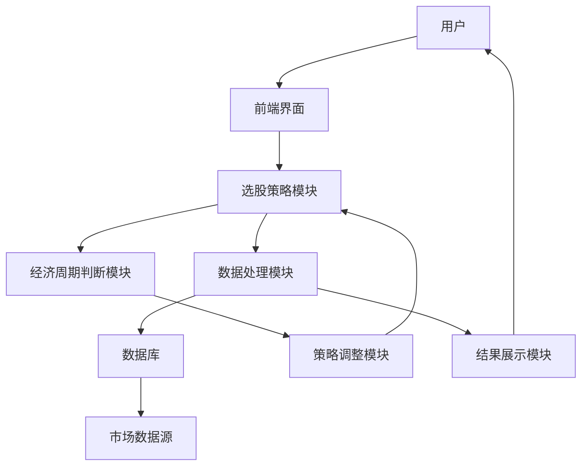
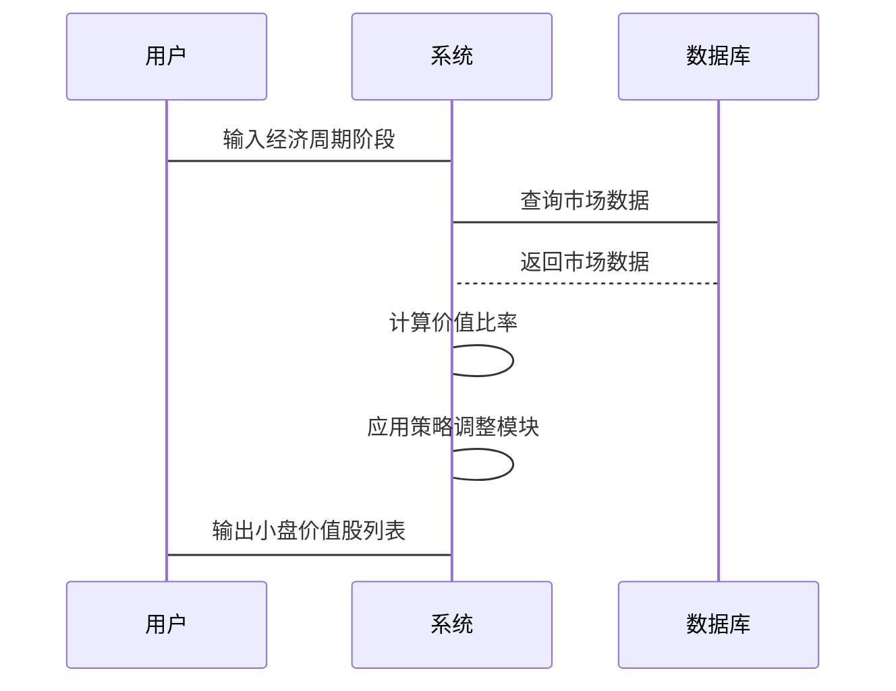

                 


# 彼得林奇的"小盘价值股"在不同经济周期中的筛选策略

> 关键词：彼得林奇，小盘价值股，经济周期，投资策略，价值投资

> 摘要：本文深入探讨了彼得·林奇的价值投资理念，特别是如何在不同经济周期中筛选小盘价值股。通过分析经济周期对股市的影响，本文详细阐述了小盘价值股的筛选标准，并结合实际案例，展示了彼得林奇选股策略在不同经济阶段的应用。文章还总结了最佳投资实践，为投资者提供了实用的指导。

---

## 目录大纲

### 第一部分: 彼得林奇的"小盘价值股"投资理念

#### 第1章: 小盘价值股的定义与特点

##### 1.1 小盘价值股的定义
- 小盘股的定义与特征
- 价值股的定义与特征
- 小盘价值股的结合与特点

##### 1.2 彼得林奇的投资理念
- 价值投资的定义
- 彼得林奇的投资策略
- 小盘价值股在彼得林奇投资组合中的地位

#### 第2章: 经济周期的基本概念与分类

##### 2.1 经济周期的定义与阶段
- 经济周期的定义
- 经济周期的四个阶段：衰退、复苏、过热、滞胀
- 不同阶段对投资的影响

##### 2.2 经济周期对股市的影响
- 不同经济周期阶段的股市表现
- 小盘股与大盘股在不同经济周期中的表现差异
- 价值股在经济周期中的防御性与进攻性

#### 第3章: 小盘价值股的筛选标准

##### 3.1 价值投资的核心指标
- 市盈率（P/E）的定义与计算
- 市净率（P/B）的定义与计算
- 股东权益收益率（ROE）的定义与计算
- 其他辅助指标：股息率、营业收入增长率等

##### 3.2 小盘股的筛选标准
- 市值范围的界定
- 估值指标的筛选标准
- 财务健康状况的评估

#### 第4章: 不同经济周期中的投资策略

##### 4.1 经济衰退期的投资策略
- 价值股的优势
- 小盘股的风险与机会
- 选股标准的调整

##### 4.2 经济复苏期的投资策略
- 价值股的修复与反弹
- 小盘股的潜在增长机会
- 选股标准的优化

##### 4.3 经济过热期的投资策略
- 价值股的估值压力
- 小盘股的高增长机会
- 选股标准的动态调整

##### 4.4 经济滞胀期的投资策略
- 价值股的防御性
- 小盘股的低估值机会
- 选股标准的保守策略

#### 第5章: 彼得林奇选股策略的数学模型

##### 5.1 价值投资的数学模型
- 价值比率计算公式：
$$ \text{价值比率} = \frac{\text{内在价值}}{\text{市场价格}} $$
- 内在价值的估算方法：现金流折现法
- 通过公式计算内在价值与市场价格的差异，判断股票是否被低估。

##### 5.2 小盘股的筛选模型
- 市盈率筛选公式：
$$ P/E < 市场平均市盈率 $$
- 市净率筛选公式：
$$ P/B < 市场平均市净率 $$
- 结合市值与财务指标的多维度筛选模型：
$$ \text{筛选标准} = (P/E < 市场平均P/E) \land (P/B < 市场平均P/B) \land (\text{市值} < 小盘股界定值) $$

##### 5.3 经济周期调整的选股模型
- 根据经济周期阶段调整筛选指标权重：
$$ \text{权重调整} = \begin{cases} 
0.5 \times P/E + 0.5 \times P/B & \text{经济衰退期} \\
0.6 \times P/E + 0.4 \times P/B & \text{经济复苏期} \\
0.4 \times P/E + 0.6 \times P/B & \text{经济过热期} \\
0.7 \times P/E + 0.3 \times P/B & \text{经济滞胀期} 
\end{cases} $$

---

### 第二部分: 系统分析与架构设计

#### 第6章: 系统分析与架构设计方案

##### 6.1 问题场景介绍
- 投资者在不同经济周期中寻找小盘价值股的需求
- 现有选股工具的不足
- 本系统的目标：提供基于彼得林奇策略的自动化选股工具

##### 6.2 系统功能设计
- 领域模型：
  - 用户需求：输入经济周期阶段，输出符合筛选标准的小盘价值股列表。
  - 系统功能：数据采集（实时市场数据）、指标计算、策略匹配、结果展示。

##### 6.3 系统架构设计


##### 6.4 系统接口设计
- 数据接口：与市场数据供应商的API对接。
- 用户接口：网页或移动端应用程序，供用户输入参数和查看结果。

##### 6.5 系统交互设计


---

### 第三部分: 项目实战

#### 第7章: 项目实战

##### 7.1 环境安装
- 数据库：MySQL 或 PostgreSQL
- 开发工具：Python (使用pandas, numpy, matplotlib)
- 可视化工具：Tableau 或 Excel

##### 7.2 核心实现源代码

```python
import pandas as pd
import numpy as np

def calculate_value_ratios(df):
    df['PE'] = df['股价'] / df['每股收益']
    df['PB'] = df['股价'] / df['每股净资产']
    df['ROE'] = df['净利润'] / df['股东权益']
    return df

def select_undervalued_stocks(df, market_pe, market_pb):
    df['是否低估'] = (df['PE'] < market_pe) & (df['PB'] < market_pb) & (df['市值'] < 200)
    return df[df['是否低估']]

# 示例数据加载
data = pd.read_csv('market_data.csv')
data = calculate_value_ratios(data)
market_pe = data['PE'].mean()
market_pb = data['PB'].mean()

selected_stocks = select_undervalued_stocks(data, market_pe, market_pb)
print(selected_stocks)
```

##### 7.3 代码应用解读与分析
- 数据预处理：加载市场数据，计算关键指标（PE、PB、ROE）。
- 筛选策略：根据市场平均PE和PB，筛选出PE和PB均低于市场平均水平的小盘股。
- 结果展示：输出符合筛选条件的股票列表。

##### 7.4 实际案例分析
- 选取2008年经济衰退期的数据，应用上述模型筛选小盘价值股。
- 分析筛选出的股票在后续经济周期中的表现，验证策略的有效性。

##### 7.5 项目小结
- 项目实现的难点与解决方案
- 系统的可扩展性与改进方向
- 实际应用中的注意事项

---

### 第四部分: 最佳实践与总结

#### 第8章: 最佳实践 tips

##### 8.1 投资建议
- 持续关注市场动态，及时调整投资策略。
- 分散投资，降低风险。
- 定期复盘，评估策略的有效性。

##### 8.2 小结
- 彼得林奇的小盘价值股策略在不同经济周期中的应用
- 价值投资的核心理念：寻找被低估的优质股票，长期持有。

##### 8.3 注意事项
- 避免追涨杀跌，理性投资。
- 保持对财务报表的分析能力，识别财务造假。
- 结合宏观经济环境，灵活调整选股标准。

##### 8.4 拓展阅读
- 彼得林奇的其他投资策略
- 其他价值投资者的选股方法
- 进一步研究经济周期对不同行业的影响

---

作者：AI天才研究院/AI Genius Institute & 禅与计算机程序设计艺术 /Zen And The Art of Computer Programming

---

### 附录: 图表与公式汇总

##### 图表：
1. 经济周期与股市表现的对比图
2. 小盘股与大盘股在不同经济周期中的表现对比图
3. 价值比率计算的流程图

##### 公式：
1. $$ P/E = \frac{\text{股价}}{\text{每股收益}} $$
2. $$ P/B = \frac{\text{股价}}{\text{每股净资产}} $$
3. $$ \text{价值比率} = \frac{\text{内在价值}}{\text{市场价格}} $$

---

通过以上结构和内容，这篇文章将系统地介绍彼得林奇的小盘价值股策略，并结合经济周期分析，为投资者提供实用的选股方法和投资建议。

