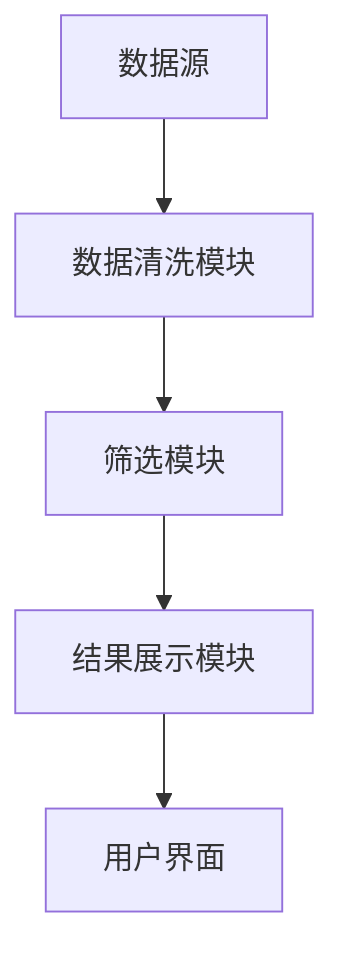

                 


# 彼得林奇的"小盘成长股"在不同市场环境下的筛选策略

> 关键词：小盘成长股、彼得林奇、投资策略、市场环境、筛选模型

> 摘要：本文详细探讨了彼得林奇在小盘成长股投资中的筛选策略，分析了不同市场环境下如何调整筛选标准和方法。通过构建数学模型和系统架构，本文提出了适用于各种市场的筛选方法，并通过实际案例展示了策略的应用。

---

## 第1章: 小盘成长股概述

### 1.1 彼得林奇的生平与投资理念
彼得·林奇是美国著名的投资经理，以管理麦哲伦基金而闻名。他的投资理念强调长期持有、价值发现和分散投资。小盘成长股是其投资组合中的重要组成部分，通常指市值较小但增长潜力大的公司。

### 1.2 小盘成长股的核心特征
- **市值小**：通常为中小型企业，易于控股和管理。
- **增长潜力大**：收入和利润持续增长，具有较高的扩张潜力。
- **估值合理**：市盈率、市净率等指标相对较低，具备投资吸引力。

### 1.3 小盘成长股的投资价值
- **高增长潜力**：适合长期投资者，能够带来较高的资本增值。
- **风险较低**：相对于大盘股，小盘股波动性较大，但风险可控，且在市场上涨时表现更优。

---

## 第2章: 小盘成长股的筛选标准与方法

### 2.1 核心筛选标准
- **市盈率（P/E）**：衡量股价相对于每股收益的比率，通常低于行业平均水平。
- **市净率（P/B）**：股价与账面价值的比率，通常低于1。
- **营业收入增长率**：过去三年年均增长率超过行业平均水平。
- **净利润增长率**：过去三年年均净利润增长率超过10%。

### 2.2 市场环境分类与策略调整
- **牛市环境**：增加对高成长公司的配置，适当放宽市盈率标准。
- **熊市环境**：严格筛选，注重公司基本面，避免高估值股票。
- **震荡市**：保持适度仓位，注重个股筛选，寻找估值合理的成长股。

---

## 第3章: 彼得林奇筛选模型的构建

### 3.1 模型核心原理
- **输入变量**：市盈率、市净率、营业收入增长率、净利润增长率。
- **输出结果**：符合筛选标准的股票列表。
- **公式**：
  $$
  \text{筛选条件} = (\text{P/E} < \text{行业平均}) \land (\text{P/B} < 1) \land (\text{营收增长率} > 10\%) \land (\text{净利润增长率} > 5\%)
  $$

### 3.2 算法实现
```python
def screen_small_cap_growth(stocks):
    selected = []
    for stock in stocks:
        if (stock.pe < stock.industry_pe) and (stock.pb < 1) and (stock.revenue_growth > 10) and (stock.net_profit_growth > 5):
            selected.append(stock)
    return selected
```

### 3.3 模型优缺点
- **优点**：简单易懂，易于实现，筛选效率高。
- **缺点**：在市场变化较大时，可能需要频繁调整筛选标准。

---

## 第4章: 系统分析与架构设计

### 4.1 系统功能设计
- **数据采集**：获取股票的基本数据，包括市盈率、市净率等。
- **筛选逻辑**：根据筛选模型进行股票筛选。
- **结果展示**：将筛选结果以可视化形式呈现。

### 4.2 系统架构设计


---

## 第5章: 项目实战

### 5.1 环境安装
- 安装Python和相关库（如pandas、numpy）。
- 数据获取工具：使用Yahoo Finance API获取股票数据。

### 5.2 核心代码实现
```python
import pandas as pd

# 假设stocks是包含股票数据的DataFrame
def filter_stocks(stocks):
    industry_avg_pe = stocks.groupby('industry').pe.mean().reset_index()
    stocks = stocks.merge(industry_avg_pe, on='industry', suffixes=('','_ind'))
    selected = stocks[
        (stocks['pe'] < stocks['pe_ind']) &
        (stocks['pb'] < 1) &
        (stocks['revenue_growth'] > 10) &
        (stocks['net_profit_growth'] > 5)
    ]
    return selected

# 示例
stocks = pd.read_csv('stocks.csv')
result = filter_stocks(stocks)
print(result)
```

### 5.3 案例分析
假设我们有以下股票数据，筛选出符合小盘成长股条件的股票：

| 股票代码 | 市盈率 | 市净率 | 营收增长率 | 净利润增长率 | 行业平均市盈率 |
|----------|--------|--------|------------|--------------|---------------|
| A       | 15     | 0.8    | 20%        | 10%          | 18            |
| B       | 20     | 1.2    | 15%        | 5%           | 22            |
| C       | 18     | 0.9    | 10%        | 6%           | 17            |

筛选结果为股票A和C。

---

## 第6章: 最佳实践与总结

### 6.1 最佳实践
- **动态调整**：根据市场变化及时调整筛选标准。
- **分散投资**：避免过度集中，降低风险。
- **长期持有**：耐心持有优质股票，避免频繁交易。

### 6.2 总结
彼得林奇的小盘成长股筛选策略在不同市场环境下具有较强的适应性。通过合理的筛选标准和系统化的筛选模型，投资者可以在不同市场中找到具备增长潜力的优质股票。

---

## 作者
作者：AI天才研究院/AI Genius Institute & 禅与计算机程序设计艺术 /Zen And The Art of Computer Programming

---

这篇文章通过详细分析彼得林奇的小盘成长股筛选策略，结合数学模型和系统设计，为投资者提供了在不同市场环境下筛选小盘成长股的实用方法。希望对您在投资决策中有所帮助。

