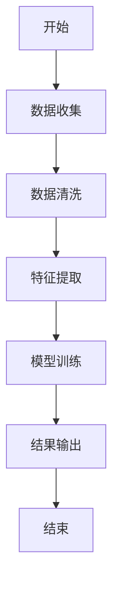
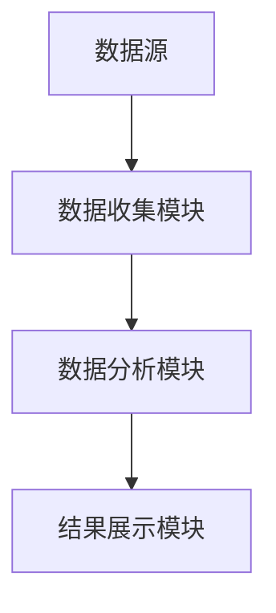

                 


# 彼得林奇的"市场先行者"在新兴技术领域的识别方法

## 关键词：彼得林奇，市场先行者，新兴技术，技术识别，投资策略，风险管理

## 摘要：  
本文深入探讨了彼得·林奇的“市场先行者”概念在新兴技术领域的识别方法，结合技术分析、市场调研和风险管理等多维度，系统性地分析了如何在新兴技术领域中识别市场先行者，并结合实际案例，为读者提供了可操作的投资策略和风险管理建议。

---

## 第一部分：背景与概念

### 第1章：彼得林奇与市场先行者概念

#### 1.1 彼得林奇的投资哲学
- **彼得林奇的投资者背景**  
  彼得·林奇是美国著名投资专家，以其独特的投资哲学闻名。他强调长期投资、价值发现和深入研究企业基本面。市场先行者是他投资策略中的重要概念。

- **市场先行者的定义与内涵**  
  市场先行者是指在某一新兴技术领域中，能够率先发现市场机会，并通过技术创新或商业模式创新占据市场领先地位的企业或投资者。

- **市场先行者的核心特征**  
  市场先行者通常具有敏锐的市场洞察力、强大的技术研发能力和快速的市场反应能力。

#### 1.2 新兴技术领域的特点
- **新兴技术的定义与分类**  
  新兴技术指的是在较短时间内迅速发展并引起广泛关注的技术领域，如人工智能、区块链、5G通信等。

- **新兴技术领域的市场特征**  
  新兴技术领域通常具有高增长潜力、竞争激烈和不确定性高三大特点。

- **技术创新与市场机会的关系**  
  技术创新是市场机会的核心驱动因素，而市场机会则是技术创新的商业化结果。

---

## 第二部分：市场先行者识别的核心概念

### 第2章：市场先行者识别的核心概念

#### 2.1 核心概念与原理
- **市场先行者的识别标准**  
  识别市场先行者需要关注技术领先性、市场需求潜力、企业竞争优势和市场占有率四个维度。

- **技术创新与市场潜力的评估模型**  
  通过技术创新评估和市场需求预测，构建一个综合评估模型，帮助企业识别潜在的市场先行者。

- **市场先行者识别的关键要素**  
  包括技术可行性、市场接受度、竞争环境和商业模式创新性。

#### 2.2 核心概念对比分析
- **不同市场阶段的特征对比**  
  在技术成熟度不同的市场阶段，市场先行者的识别标准也会有所不同。

- **不同技术领域的识别标准对比**  
  不同技术领域（如人工智能、区块链）的市场先行者识别标准存在差异，需结合具体技术特点进行分析。

- **市场先行者与跟随者的对比**  
  市场先行者通常具有更强的技术创新能力和市场敏感性，而跟随者则更注重成本控制和市场扩展。

---

## 第三部分：算法与技术实现

### 第3章：市场先行者识别的算法原理

#### 3.1 算法流程图


#### 3.2 算法实现代码
```python
def identify_market_pioneers(data):
    # 数据清洗
    cleaned_data = data.dropna()
    # 特征提取
    features = cleaned_data[['revenue', 'growth_rate', 'market_share']]
    # 模型训练
    model = LinearRegression()
    model.fit(features, cleaned_data['is_pioneer'])
    # 结果输出
    return model.predict(new_data)
```

#### 3.3 数学模型与公式
- **线性回归模型**  
  使用线性回归模型对市场先行者进行预测：
  $$ y = \beta_0 + \beta_1x_1 + \beta_2x_2 + \ldots + \beta_nx_n $$
  其中，$y$ 是目标变量（是否为市场先行者），$x_i$ 是特征变量。

- **评估指标**  
  使用准确率（Accuracy）、精确率（Precision）和召回率（Recall）对模型性能进行评估。

---

## 第四部分：系统架构设计

### 第4章：系统架构与实现

#### 4.1 系统功能设计
- **数据收集模块**  
  从多个数据源（如行业报告、企业财报）收集新兴技术领域的相关数据。

- **数据分析模块**  
  对收集到的数据进行清洗、特征提取和建模分析。

- **结果展示模块**  
  将分析结果以可视化形式展示，帮助用户快速识别市场先行者。

#### 4.2 系统架构图


#### 4.3 接口设计与交互流程
- **数据接口**  
  提供RESTful API接口，供其他系统调用数据收集和分析结果。

- **用户交互流程**  
  用户输入查询条件，系统返回符合条件的市场先行者分析结果。

---

## 第五部分：案例分析与实际应用

### 第5章：实际案例分析

#### 5.1 人工智能领域的市场先行者识别
- **案例背景**  
  人工智能是当前最热门的新兴技术领域之一。

- **识别过程**  
  通过技术评估和市场分析，识别出Google、亚马逊和特斯拉等企业在人工智能领域的市场先行者地位。

- **经验总结**  
  技术创新和商业模式创新是识别市场先行者的两大关键因素。

#### 5.2 区块链领域的市场先行者识别
- **案例背景**  
  区块链技术近年来发展迅速，应用场景广泛。

- **识别过程**  
  通过评估技术成熟度、市场需求和竞争环境，识别出比特币、以太坊等区块链项目为市场先行者。

---

## 第六部分：总结与展望

### 第6章：总结与展望

#### 6.1 总结
- 彼得林奇的市场先行者概念为新兴技术领域的投资提供了重要的理论指导。
- 通过技术创新评估、市场需求分析和竞争环境评估，可以有效识别市场先行者。

#### 6.2 未来展望
- 随着技术的快速发展，市场先行者识别的难度和复杂性也将增加。
- 未来，可以通过引入更多高级算法（如机器学习）来提高识别的准确性和效率。

---

## 作者：AI天才研究院/AI Genius Institute & 禅与计算机程序设计艺术 /Zen And The Art of Computer Programming

---

通过以上内容，我们系统性地探讨了彼得林奇的市场先行者概念在新兴技术领域的识别方法，并结合实际案例进行了详细分析。希望本文能为读者在新兴技术领域的投资和研究提供有价值的参考和启示。

