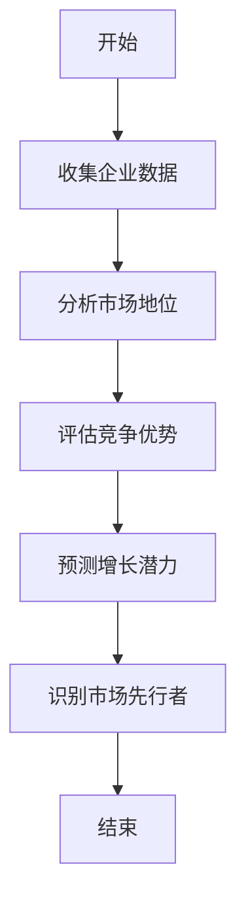
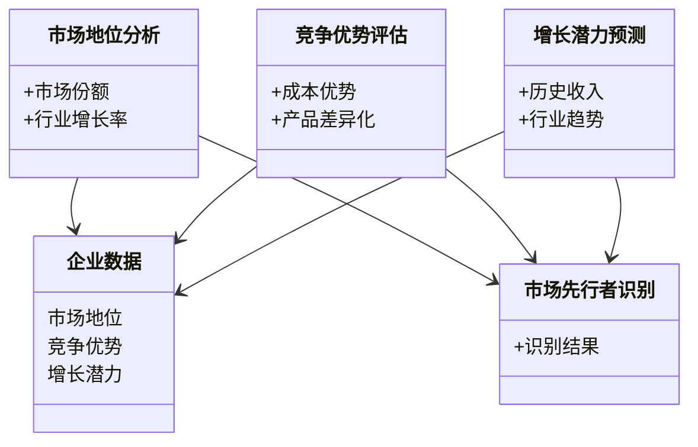
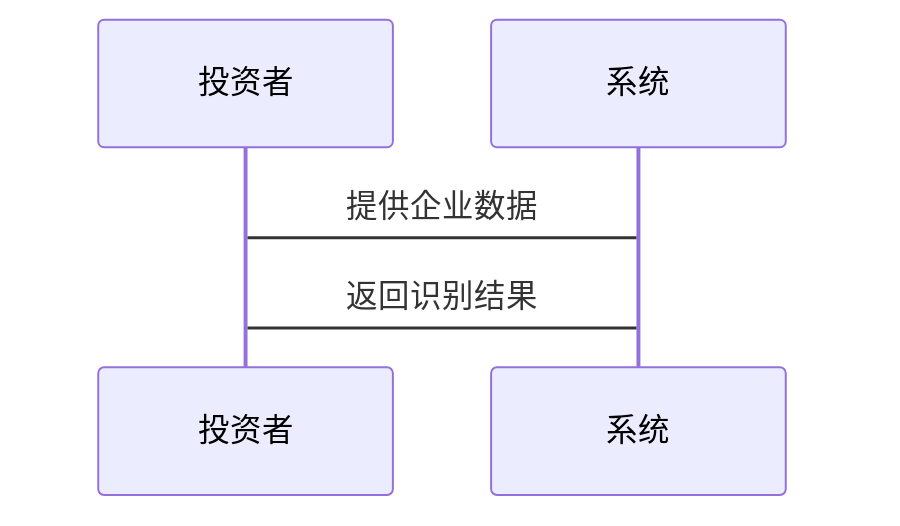

                 


# 彼得林奇的"市场先行者"识别方法

## 关键词：市场先行者，彼得林奇，投资方法，竞争优势，增长潜力

## 摘要：本文详细介绍了彼得林奇的市场先行者识别方法，从核心概念到算法原理，再到系统设计和项目实战，全面解析了如何在市场中识别具有高增长潜力的企业。通过详细讲解和实际案例分析，帮助读者掌握这一投资策略。

---

# 第一部分: 彼得林奇的"市场先行者"识别方法概述

## 第1章: 背景介绍

### 1.1 核心概念

#### 1.1.1 问题背景

- 投资者如何在市场中发现潜在的高增长企业？
- 市场先行者的定义：在特定行业中占据领先地位并具有竞争优势的企业。
- 彼得林奇的投资哲学：长期关注企业的基本面，寻找具有持续增长潜力的公司。

#### 1.1.2 问题描述

- 传统投资方法的局限性：依赖市场波动，难以预测长期趋势。
- 市场先行者识别的必要性：通过分析企业内部因素，提前发现具有增长潜力的企业。
- 企业成长周期与市场先行者的关系：企业从起步到成熟，市场先行者在特定阶段具有引领作用。

#### 1.1.3 问题解决

- 市场先行者识别的核心目标：发现具有竞争优势和增长潜力的企业。
- 识别方法的逻辑框架：分析市场地位、竞争优势和增长潜力。
- 方法的实际应用价值：帮助投资者在早期阶段发现优质企业，获得超额收益。

#### 1.1.4 边界与外延

- 市场先行者识别的适用范围：适用于成长型企业，尤其是初创期和扩张期的公司。
- 方法的局限性：受市场环境和企业内部管理的影响，存在不确定性。
- 与其他投资方法的区别与联系：结合基本面分析和市场趋势，弥补传统方法的不足。

#### 1.1.5 概念结构与核心要素

- 核心要素：市场地位、竞争优势、增长潜力。
- 概念关系：市场地位影响企业的发展空间，竞争优势决定企业的盈利能力，增长潜力反映企业的未来前景。

## 第2章: 核心概念与联系

### 2.1 核心概念原理

- 市场先行者识别的核心逻辑：通过分析企业的市场地位、竞争优势和增长潜力，判断其是否具备成为市场领导者的条件。
- 企业成长周期与市场地位的关系：企业在不同阶段的市场地位不同，市场先行者通常出现在成长期。
- 市场先行者的竞争优势分析：包括产品创新、成本优势、品牌影响力等方面。

### 2.2 概念属性特征对比表

| 概念属性 | 特征描述 |
|----------|----------|
| 市场地位 | 在行业内占据领先地位，具有较高的市场份额 |
| 竞争优势 | 具有独特的产品或服务，能够在竞争中占据优势 |
| 增长潜力 | 预期未来收入和利润将显著高于行业平均水平 |

### 2.3 ER实体关系图

```mermaid
entity 市场先行者 {
  市场地位
  竞争优势
  增长潜力
}
```

---

# 第二部分: 算法原理讲解

## 第3章: 算法原理讲解

### 3.1 算法流程图



### 3.2 Python源代码实现

```python
def identify_market_pioneer(company_data):
    # 数据清洗
    cleaned_data = preprocess(company_data)
    # 市场地位分析
    market_position = analyze_market(cleaned_data)
    # 竞争优势评估
    competitive_advantage = assess_competition(cleaned_data)
    # 增长潜力预测
    growth_potential = predict_growth(cleaned_data)
    # 识别市场先行者
    is_market_pioneer = is_pioneer(market_position, competitive_advantage, growth_potential)
    return is_market_pioneer
```

### 3.3 数学模型与公式

- 市场地位分析：使用市场份额占比（Market Share）和行业增长率（Industry Growth Rate）进行评估。
  $$ Market\ Position = \frac{Market\ Share}{Industry\ Growth\ Rate} $$

- 竞争优势评估：采用成本优势（Cost Advantage）和产品差异化（Product Differentiation）的综合指标。
  $$ Competitive\ Advantage = \alpha \times Cost\ Advantage + \beta \times Product\ Differentiation $$

- 增长潜力预测：通过回归分析预测未来收入增长，使用历史数据和行业趋势。
  $$ Growth\ Potential = \beta_0 + \beta_1 \times Revenue\ Growth $$

---

# 第三部分: 系统分析与架构设计

## 第4章: 系统分析与架构设计

### 4.1 问题场景介绍

- 投资者需要一个系统化的工具来识别市场先行者，优化投资决策过程。
- 系统功能需求：数据收集、分析、预测和可视化。

### 4.2 系统功能设计

#### 4.2.1 领域模型



### 4.3 系统架构设计

```mermaid
graph TD
    A[企业数据] --> B[数据处理模块]
    B --> C[市场地位分析模块]
    B --> D[竞争优势评估模块]
    B --> E[增长潜力预测模块]
    C --> F[市场地位结果]
    D --> G[竞争优势结果]
    E --> H[增长潜力结果]
    F, G, H --> I[市场先行者识别模块]
    I --> J[识别结果]
```

### 4.4 系统接口设计

- 数据输入接口：接收企业数据，包括市场份额、成本优势等。
- 数据输出接口：返回市场先行者识别结果，包括识别状态和分析报告。

### 4.5 系统交互流程图



---

# 第四部分: 项目实战

## 第5章: 项目实战

### 5.1 环境安装

- Python环境：安装Python 3.8及以上版本。
- 依赖库：安装pandas、numpy、scikit-learn等数据分析库。

### 5.2 核心代码实现

```python
import pandas as pd
import numpy as np
from sklearn.linear_model import LinearRegression

def preprocess(data):
    # 数据清洗
    data = data.dropna()
    return data

def analyze_market(data):
    # 市场地位分析
    market_share = data['市场份额'].mean()
    industry_growth = data['行业增长率'].mean()
    return market_share / industry_growth

def assess_competition(data):
    # 竞争优势评估
    cost_advantage = data['成本优势'].mean()
    product_diff = data['产品差异化'].mean()
    return cost_advantage * 0.4 + product_diff * 0.6

def predict_growth(data):
    # 增长潜力预测
    model = LinearRegression()
    X = data[['历史收入']]
    y = data['增长潜力']
    model.fit(X, y)
    return model.predict(X)

def is_pioneer(mp, ca, gp):
    # 识别市场先行者
    if mp > 1.5 and ca > 0.7 and gp > 0.8:
        return True
    else:
        return False

# 示例数据
data = pd.DataFrame({
    '市场份额': [0.2, 0.3, 0.25, 0.35],
    '行业增长率': [5, 6, 4, 7],
    '成本优势': [0.8, 0.7, 0.9, 0.6],
    '产品差异化': [0.7, 0.8, 0.6, 0.9],
    '历史收入': [100, 120, 90, 110]
})

cleaned_data = preprocess(data)
mp = analyze_market(cleaned_data)
ca = assess_competition(cleaned_data)
gp = predict_growth(cleaned_data)
result = is_pioneer(mp, ca, gp)
print("识别结果:", result)
```

### 5.3 实际案例分析

假设我们有一个企业数据集，包括市场份额、行业增长率、成本优势和产品差异化。通过上述代码，我们可以计算出企业的市场地位、竞争优势和增长潜力。如果上述指标均超过阈值，则识别为企业为市场先行者。

### 5.4 代码解读与分析

- 数据清洗：去除缺失值，确保数据完整性。
- 市场地位分析：计算市场份额与行业增长率的比率，判断企业在市场中的地位。
- 竞争优势评估：结合成本优势和产品差异化，计算综合竞争优势指数。
- 增长潜力预测：使用线性回归模型，基于历史收入预测未来增长潜力。
- 市场先行者识别：根据市场地位、竞争优势和增长潜力的综合判断，确定企业是否为市场先行者。

---

# 第五部分: 总结与展望

## 第6章: 总结与展望

### 6.1 最佳实践 tips

- 定期更新企业数据，确保分析结果的准确性。
- 结合市场环境变化，调整识别模型的参数。
- 多维度分析，避免单一指标的误导。

### 6.2 小结

彼得林奇的市场先行者识别方法通过分析企业的市场地位、竞争优势和增长潜力，帮助投资者在市场中发现具有高增长潜力的企业。这种方法结合了基本面分析和市场趋势，是投资决策的重要工具。

### 6.3 注意事项

- 数据质量：确保数据的准确性和完整性。
- 模型局限：识别结果需结合市场环境和其他因素综合判断。
- 风险控制：投资需谨慎，合理分散投资风险。

### 6.4 拓展阅读

- 《彼得林奇选股术》：深入理解彼得林奇的投资哲学。
- 《投资学基础》：掌握投资的基本理论和方法。
- 《数据挖掘与机器学习》：学习更多数据分析和预测技术。

---

# 作者：AI天才研究院/AI Genius Institute & 禅与计算机程序设计艺术 /Zen And The Art of Computer Programming

---

**注意：** 本文是基于彼得林奇的市场先行者识别方法进行的系统化分析，旨在提供理论和实践指导。实际投资需结合市场环境和个人判断，谨慎操作。

