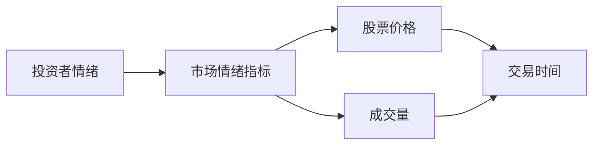
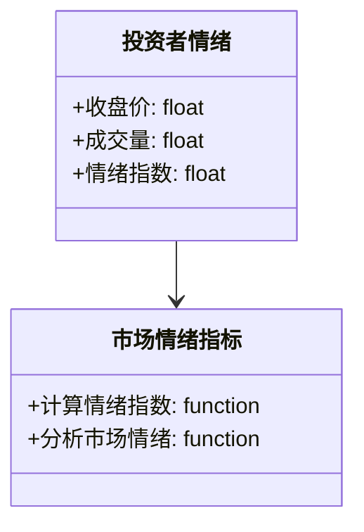
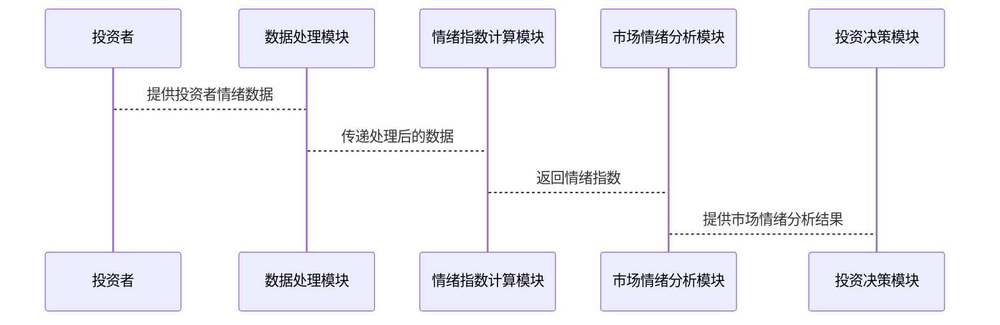

                 


# 彼得林奇的"市场情绪"指标分析

> 关键词：彼得林奇，市场情绪，投资决策，情绪指标，投资者心理

> 摘要：本文深入分析了彼得林奇提出的市场情绪指标，探讨其理论基础、算法原理、系统架构及实际应用。通过详细的技术分析和案例解读，揭示了市场情绪指标在投资决策中的重要作用。

---

# 第一部分: 彼得林奇的市场情绪指标概述

## 第1章: 市场情绪指标的背景与概念

### 1.1 市场情绪的定义与核心要素

#### 1.1.1 市场情绪的定义  
市场情绪（Market Sentiment）是指投资者对市场整体看法和预期的综合反映，通常表现为乐观或悲观两种状态。市场情绪指标通过量化这些看法，帮助投资者判断市场的整体走势。

#### 1.1.2 市场情绪的核心要素  
- **投资者情绪**：个体或群体对市场的看法。
- **市场参与度**：市场中活跃的投资者数量。
- **价格波动**：股票价格的短期波动反映了市场情绪的变化。

#### 1.1.3 市场情绪与投资决策的关系  
市场情绪是影响投资决策的重要因素，尤其是在短期市场波动中。投资者的情绪通过买卖行为影响市场，进而形成价格波动。

---

### 1.2 彼得林奇市场情绪指标的背景

#### 1.2.1 彼得林奇的投资者心理研究  
彼得·林奇（Peter Lynch）是著名基金经理，他通过长期的市场观察，发现投资者情绪对市场的影响巨大。他的研究表明，市场情绪往往在市场顶部或底部时达到极端，从而为投资者提供了逆向投资的机会。

#### 1.2.2 市场情绪指标的提出动机  
彼得林奇提出市场情绪指标的目的是为了帮助投资者识别市场的过度乐观或过度悲观情绪，从而避免在市场顶部追高或在市场底部恐慌抛售。

#### 1.2.3 市场情绪指标的理论基础  
市场情绪指标的理论基础是行为金融学，认为投资者的情绪和行为会影响市场价格，而不仅仅是基本面因素。

---

### 1.3 市场情绪指标的实际应用场景

#### 1.3.1 个股投资中的应用  
- 通过分析个股的情绪指标，投资者可以判断该股票是否被市场过度炒作或低估。

#### 1.3.2 投资组合管理中的应用  
- 市场情绪指标可以帮助投资者调整投资组合的配置，避免过度集中在情绪高涨的资产。

#### 1.3.3 市场周期分析中的应用  
- 市场情绪指标可以用于判断市场所处的周期阶段（牛市、熊市、震荡市），从而指导投资策略。

---

## 第2章: 彼得林奇市场情绪指标的核心概念

### 2.1 市场情绪指标的数学模型

#### 2.1.1 情绪指数的计算公式  
情绪指数的计算公式如下：
$$
\text{情绪指数} = \frac{\sum (\text{收盘价变化率} \times \text{成交量变化率})}{\text{交易天数}}
$$

其中，$\text{收盘价变化率}$ 和 $\text{成交量变化率}$ 是衡量市场情绪的关键指标。

---

### 2.2 市场情绪指标的属性特征对比

#### 2.2.1 不同市场情绪指标的对比表格  

| 指标名称       | 计算方法                     | 优点                     | 缺点                     |
|----------------|------------------------------|--------------------------|--------------------------|
| 情绪指数       | 基于价格和成交量变化率计算   | 能反映市场参与度         | 易受短期波动影响         |
| 技术指标       | 基于价格和成交量分析         | 反映价格趋势             | 不能直接反映市场情绪     |
| 基本面指标     | 基于公司财务数据             | 反映公司基本面           | 忽略短期市场情绪影响     |

---

### 2.3 市场情绪指标的ER实体关系图  



---

## 第3章: 市场情绪指标的算法原理

### 3.1 市场情绪指标的分析流程

#### 3.1.1 数据采集阶段  
- 采集股票的收盘价、成交量等数据。

#### 3.1.2 数据处理阶段  
- 计算价格变化率和成交量变化率。

#### 3.1.3 情绪指数计算阶段  
- 根据公式计算情绪指数。

---

### 3.2 市场情绪指标的计算方法

#### 3.2.1 基于成交量的情绪指数计算  
- 通过分析成交量的变化率，判断市场情绪的强弱。

#### 3.2.2 基于价格波动的情绪指数计算  
- 通过分析价格波动幅度，判断市场情绪的高低。

#### 3.2.3 综合指标的情绪指数计算  
- 综合价格和成交量的变化率，计算综合情绪指数。

---

### 3.3 市场情绪指标的算法实现

#### 3.3.1 基于Python的情绪指数计算代码  

```python
import pandas as pd

def calculate_sentiment(data):
    # 计算收盘价变化率
    price_change = data['收盘价'].pct_change().fillna(0)
    # 计算成交量变化率
    volume_change = data['成交量'].pct_change().fillna(0)
    # 计算情绪指数
    sentiment_index = (price_change * volume_change).mean()
    return sentiment_index
```

---

## 第4章: 市场情绪指标的系统分析与架构设计

### 4.1 问题场景介绍  
市场情绪指标可以帮助投资者识别市场情绪的变化，从而做出更明智的投资决策。

---

## 4.2 系统功能设计

#### 4.2.1 领域模型设计  


---

## 4.3 系统架构设计  


---

## 4.4 系统接口设计  
- 数据接口：投资者情绪数据的输入接口。
- 计算接口：情绪指数的计算接口。
- 输出接口：市场情绪分析结果的输出接口。

---

## 4.5 系统交互设计  



---

## 第5章: 项目实战

### 5.1 环境安装  
- 安装Python和相关库（如pandas、numpy）。

### 5.2 核心实现代码  

```python
import pandas as pd
import numpy as np

def calculate_sentiment(data):
    # 计算收盘价变化率
    price_change = data['收盘价'].pct_change().fillna(0)
    # 计算成交量变化率
    volume_change = data['成交量'].pct_change().fillna(0)
    # 计算情绪指数
    sentiment_index = np.mean(price_change * volume_change)
    return sentiment_index

# 示例数据
data = pd.DataFrame({
    '收盘价': [100, 102, 101, 99, 98],
    '成交量': [1000, 1200, 800, 900, 700]
})

# 计算情绪指数
sentiment = calculate_sentiment(data)
print(f"情绪指数为: {sentiment}")
```

---

### 5.3 代码解读与分析  
- 代码首先计算收盘价和成交量的变化率。
- 然后通过计算变化率的乘积，得到情绪指数的平均值。

---

### 5.4 实际案例分析  
- 以某股票为例，计算其情绪指数，并分析市场情绪的变化。

---

## 第6章: 最佳实践与总结

### 6.1 小结  
彼得林奇的市场情绪指标为投资者提供了一种量化市场情绪的方法，帮助投资者做出更明智的投资决策。

---

### 6.2 注意事项  
- 市场情绪指标仅适用于短期投资分析，长期投资应结合基本面分析。
- 市场情绪指标可能存在滞后性，需结合其他指标综合分析。

---

### 6.3 拓展阅读  
- 推荐阅读彼得林奇的《击败市场的小孩》。

---

# 作者：AI天才研究院 & 禅与计算机程序设计艺术

