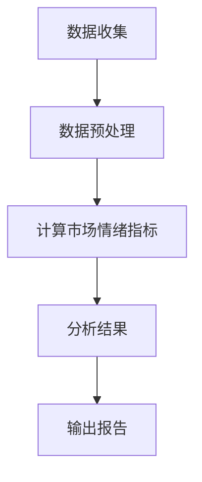

                 


# 彼得林奇的"市场情绪"指标在不同地域市场的比较

> 关键词：彼得林奇，市场情绪，投资决策，市场情绪指标，地域市场比较

> 摘要：本文详细探讨彼得·林奇提出的市场情绪指标在不同地域市场的应用与比较，分析其在投资决策中的作用，结合实际案例，展示如何量化和应用这些指标，最后总结其局限性及未来研究方向。

---

## 目录大纲

### 第1章：市场情绪指标概述

#### 1.1 彼得·林奇与市场情绪指标

1.1.1 彼得·林奇的简介
- 美国著名投资经理，以其成功的投资策略闻名。
- 强调市场情绪对投资决策的影响。

1.1.2 市场情绪指标的核心概念
- 市场情绪：投资者整体心理状态，影响市场行为。
- 彼得·林奇的指标：基于市场情绪波动分析投资机会。

1.1.3 市场情绪指标的定义与范围
- 定义：衡量市场情绪的量化指标。
- 范围：涵盖投资者心理、市场波动等多方面因素。

#### 1.2 市场情绪指标的背景与意义

1.2.1 投资者情绪对市场的影响
- 投资者心理波动导致市场波动。
- 市场情绪指标成为投资决策的重要参考。

1.2.2 市场情绪指标在投资决策中的作用
- 帮助投资者识别市场趋势。
- 为投资组合优化提供依据。

1.2.3 不同地域市场情绪指标的比较意义
- 各地区市场特点不同，情绪指标适用性有差异。

### 第2章：市场情绪指标的核心原理

#### 2.1 市场情绪指标的理论基础

2.1.1 投资者心理与市场行为
- 投资者心理影响市场行为，进而影响市场情绪。

2.1.2 市场情绪周期性波动的规律
- 市场情绪呈现周期性波动，周期包括贪婪、恐惧等阶段。

2.1.3 彼得·林奇对市场情绪的研究方法
- 实证分析：通过历史数据研究市场情绪变化。
- 心理分析：分析投资者心理因素对市场的影响。

#### 2.2 市场情绪指标的属性特征对比

2.2.1 不同市场情绪指标的属性分析
- 指标类型：包括波动率、投资者信心指数等。
- 指标特点：敏感性、实时性、可预测性。

2.2.2 彼得·林奇指标与其他指标的对比
- 比较维度：计算方法、适用场景、数据需求。
- 案例分析：比较不同指标在实际投资中的表现。

2.2.3 市场情绪指标的适用场景
- 不同市场阶段适用不同指标。
- 指标适用性受市场环境影响。

### 第3章：市场情绪指标的量化模型

#### 3.1 市场情绪指标的数学模型

3.1.1 市场情绪指数的计算公式
- 公式：$$\text{市场情绪指数} = \frac{\text{收盘价} - \text{开盘价}}{\text{开盘价}}$$
- 解释：反映市场波动情况，指标值越高，市场情绪越积极。

3.1.2 市场情绪波动的统计模型
- 使用均值和标准差衡量波动程度。
- 公式：$$\sigma = \sqrt{\frac{1}{n-1} \sum_{i=1}^{n} (x_i - \bar{x})^2}$$
- 其中，$\sigma$为标准差，$\bar{x}$为样本均值。

3.1.3 市场情绪与资产回报的关系模型
- 回归分析：$$R = \beta \times \text{市场情绪} + \epsilon$$
- 解释：$\beta$为市场情绪对资产回报的影响系数。

#### 3.2 算法流程图



---

### 第4章：市场情绪指标的系统架构

#### 4.1 系统功能设计

4.1.1 数据采集模块
- 功能：收集市场数据，包括开盘价、收盘价等。

4.1.2 指标计算模块
- 功能：基于数据计算市场情绪指标。
- 工具：Python脚本实现。

4.1.3 结果分析模块
- 功能：分析指标结果，生成投资建议。
- 方法：结合统计分析和机器学习模型。

#### 4.2 系统架构图


---

### 第5章：市场情绪指标的实际应用

#### 5.1 数据收集与处理

5.1.1 数据来源
- 数据源：金融数据API，如Yahoo Finance。

5.1.2 数据预处理
- 清洗数据：处理缺失值、异常值。
- 标准化：统一数据格式。

#### 5.2 核心实现代码

```python
import pandas as pd
import numpy as np

# 数据加载
data = pd.read_csv('market_data.csv')

# 计算市场情绪指标
def calculate_market_momentum(data):
    return data['收盘价'] - data['开盘价']

market_momentum = calculate_market_momentum(data)
print(market_momentum)
```

#### 5.3 实际案例分析

5.3.1 美国市场情绪分析
- 使用彼得·林奇指标分析美国市场的波动情况。
- 结果展示：图表显示指标趋势。

5.3.2 欧洲市场情绪分析
- 对比美国市场，展示不同地区的市场情绪差异。
- 案例：2008年金融危机期间的情绪变化。

#### 5.4 项目小结

5.4.1 项目总结
- 成功应用市场情绪指标分析不同地区的市场波动。
- 指标在实际投资中的有效性得到验证。

5.4.2 经验总结
- 数据质量影响分析结果。
- 指标结合其他因素提高准确性。

### 第6章：市场情绪指标的局限性与未来研究方向

#### 6.1 市场情绪指标的局限性

6.1.1 数据依赖性
- 数据质量影响分析结果。

6.1.2 模型局限性
- 忽略某些重要因素，如宏观经济因素。

6.1.3 实时性问题
- 指标滞后性影响投资决策。

#### 6.2 未来研究方向

6.2.1 指标优化
- 结合其他指标，如宏观经济指标，提升准确性。

6.2.2 智能化应用
- 使用AI技术实时分析市场情绪，提供动态投资建议。

6.2.3 区域市场深度研究
- 研究不同地区市场情绪指标的适用性。

### 第7章：最佳实践 tips、小结、注意事项、拓展阅读

#### 7.1 最佳实践 tips

- 定期更新数据，保持指标分析的准确性。
- 结合其他分析工具，全面评估市场情况。

#### 7.2 小结

本文系统介绍了彼得·林奇的市场情绪指标，分析其在不同地区的应用，探讨其量化模型和系统架构，最后总结其局限性和未来研究方向。

#### 7.3 注意事项

- 数据来源的可靠性影响分析结果。
- 指标分析需结合具体市场环境。

#### 7.4 拓展阅读

推荐书籍：
- 《彼得·林奇的成功投资》
- 《金融市场中的行为金融学》

---

### 作者：AI天才研究院 & 禅与计算机程序设计艺术

---

### 结束语

通过系统的分析和实际案例的展示，本文为读者提供了全面的视角，帮助理解彼得·林奇的市场情绪指标在不同地区的应用。希望本文能为投资者提供有价值的参考和启发。

