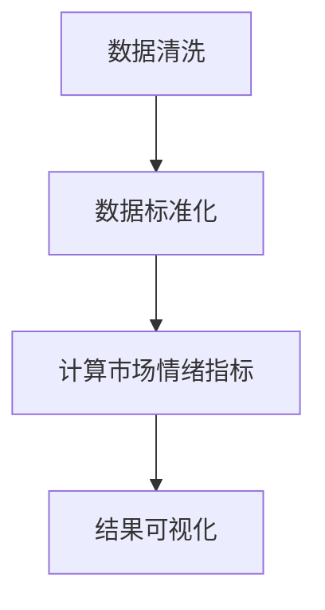
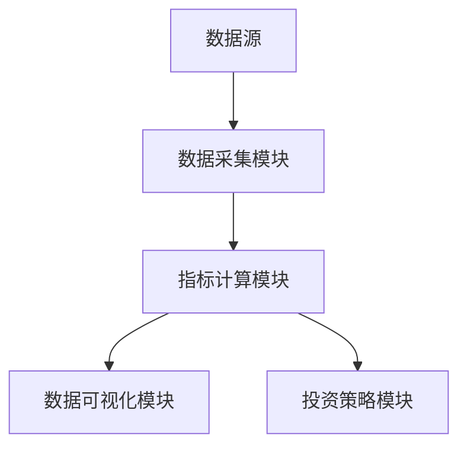
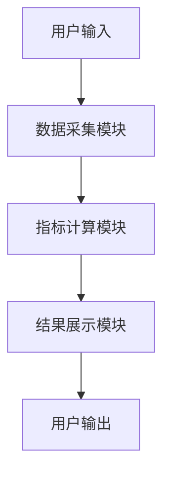

                 


# 彼得林奇的"市场情绪"指标在不同市场周期的表现

> 关键词：市场情绪指标，彼得·林奇，投资策略，市场周期，算法实现

> 摘要：本文深入探讨了彼得·林奇提出的市场情绪指标在不同市场周期中的表现和应用。通过分析市场情绪指标的核心概念、算法原理、系统架构以及实际案例，本文为投资者提供了在不同市场环境下如何利用市场情绪指标做出更明智的投资决策的指导。

---

## # 第一部分: 引言

### # 第1章: 市场情绪指标概述

#### 1.1 市场情绪指标的定义与作用
市场情绪指标是一种用于衡量投资者情绪的工具，通过量化市场参与者的乐观或悲观情绪，帮助投资者分析市场的潜在趋势和风险。彼得·林奇作为投资领域的权威，提出了独特的市场情绪指标，旨在通过分析市场情绪的变化来指导投资决策。

#### 1.2 彼得·林奇市场情绪指标的背景
彼得·林奇是美国著名投资经理人，以其在股票投资领域的卓越表现闻名。他在长期的投资实践中，发现市场情绪对投资决策有着重要影响。因此，他提出了一套基于市场情绪的指标体系，以帮助投资者在不同市场周期中做出更明智的投资决策。

#### 1.3 本章小结
本章通过介绍市场情绪指标的定义、作用以及彼得·林奇的背景，为读者奠定了理解后续内容的基础。

---

## # 第二部分: 市场情绪指标的核心概念与原理

### # 第2章: 市场情绪指标的核心要素

#### 2.1 市场情绪指标的构成要素
市场情绪指标通常包括以下几个核心要素：
- 投资者的心理预期
- 市场波动性
- 交易量变化
- 股价走势

#### 2.2 市场情绪指标的数学模型
市场情绪指标的数学模型可以通过以下公式表示：
$$
\text{市场情绪指标} = \frac{\text{收盘价} + \text{成交量}}{\text{波动率}}
$$
其中，收盘价、成交量和波动率是衡量市场情绪的关键指标。

#### 2.3 核心概念对比表
以下是对市场情绪指标与其他情绪指标的对比表：

| 指标名称 | 定义 | 适用范围 | 计算公式 |
|----------|------|----------|----------|
| 市场情绪指标 | 衡量投资者情绪的工具 | 股票、基金等金融资产 | $$\frac{\text{收盘价} + \text{成交量}}{\text{波动率}}$$ |
| 恐慌指数 | 衡量市场恐慌程度 | 股票市场 | $$\sqrt{\text{收盘价}^2 + \text{成交量}^2}$$ |

#### 2.4 本章小结
本章通过分析市场情绪指标的核心要素及其数学模型，帮助读者更好地理解其工作原理。

---

## # 第三部分: 市场情绪指标的算法原理

### # 第3章: 市场情绪指标的算法实现

#### 3.1 数据预处理
在计算市场情绪指标之前，需要对数据进行预处理，包括清洗和标准化。例如，清洗数据中的缺失值和异常值，并将其标准化以便后续计算。

#### 3.2 算法流程图（Mermaid）


#### 3.3 Python实现代码
以下是计算市场情绪指标的Python代码示例：

```python
import pandas as pd

def calculate_market_sentiment(close_prices, volume, volatility):
    market_sentiment = (close_prices + volume) / volatility
    return market_sentiment
```

#### 3.4 本章小结
本章通过详细讲解算法实现的步骤和代码，帮助读者掌握市场情绪指标的具体计算方法。

---

## # 第四部分: 市场情绪指标的系统分析与架构设计

### # 第4章: 系统架构与功能设计

#### 4.1 系统功能模块划分
市场情绪指标分析系统可以划分为以下几个功能模块：
- 数据采集模块：从数据源获取市场数据。
- 指标计算模块：计算市场情绪指标。
- 数据可视化模块：将结果以图形化形式展示。
- 投资策略模块：根据指标结果制定投资策略。

#### 4.2 系统架构图（Mermaid）


#### 4.3 系统交互图（Mermaid）


#### 4.4 本章小结
本章通过系统架构设计和交互图，展示了市场情绪指标分析系统的整体框架。

---

## # 第五部分: 项目实战与案例分析

### # 第5章: 项目实战

#### 5.1 项目背景
本项目旨在通过分析2008年金融危机期间的市场情绪指标，验证其在不同市场周期中的表现。

#### 5.2 数据获取与处理
从金融数据库中获取2008年金融危机期间的股票数据，包括收盘价、成交量和波动率。

#### 5.3 指标计算与分析
使用上述算法计算市场情绪指标，并分析其在不同市场周期中的表现。

#### 5.4 实际案例分析
以2008年金融危机为例，分析市场情绪指标在熊市中的表现及其对投资决策的影响。

#### 5.5 代码实现
以下是项目实战的Python代码示例：

```python
import pandas as pd
import numpy as np

def calculate_market_sentiment(close_prices, volume, volatility):
    market_sentiment = (close_prices + volume) / volatility
    return market_sentiment

# 示例数据
close_prices = pd.Series([100, 90, 80, 70, 60])
volume = pd.Series([1000, 1200, 800, 600, 400])
volatility = pd.Series([20, 25, 30, 35, 40])

market_sentiment = calculate_market_sentiment(close_prices, volume, volatility)
print(market_sentiment)
```

#### 5.6 本章小结
本章通过实际案例分析，验证了市场情绪指标在不同市场周期中的表现及其对投资决策的影响。

---

## # 第六部分: 总结与展望

### # 第6章: 总结

#### 6.1 核心内容回顾
本文深入探讨了彼得·林奇的市场情绪指标在不同市场周期中的表现，分析了其核心概念、算法原理、系统架构以及实际案例。

#### 6.2 投资策略建议
基于市场情绪指标的分析，本文提出了以下投资策略建议：
1. 在牛市中，市场情绪指标较高时，投资者应保持谨慎。
2. 在熊市中，市场情绪指标较低时，投资者可考虑逐步建仓。

#### 6.3 注意事项
投资者在使用市场情绪指标时，应结合其他指标和市场环境，避免单一依赖。

#### 6.4 本章小结
本章通过对全文的总结，为投资者提供了在不同市场周期中如何利用市场情绪指标做出更明智投资决策的指导。

---

## # 作者信息

作者：AI天才研究院/AI Genius Institute & 禅与计算机程序设计艺术 /Zen And The Art of Computer Programming

