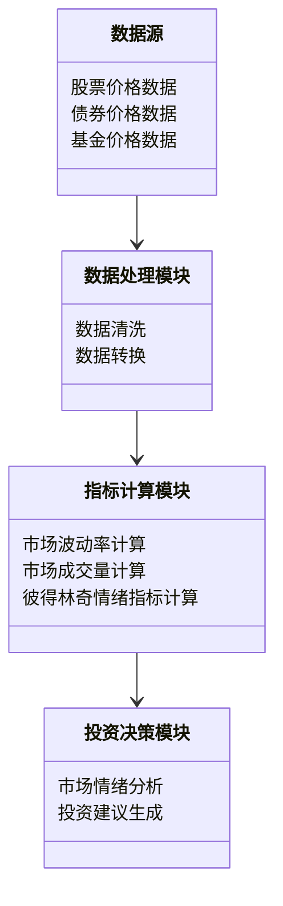
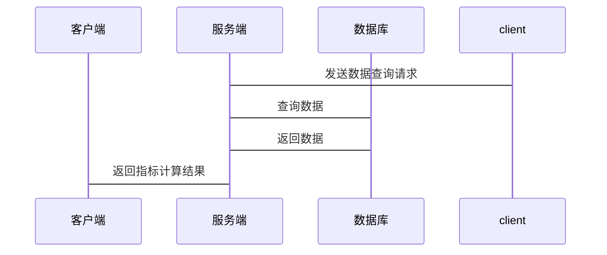

                 


# 彼得林奇的"市场情绪"指标在不同资产类别中的应用比较

## 关键词：
- 彼得林奇
- 市场情绪
- 资产类别
- 投资分析
- 技术指标

## 摘要：
彼得林奇的市场情绪指标是一种用于衡量市场参与者的心理状态和市场情绪的工具，能够帮助投资者更好地理解市场波动和潜在投资机会。本文将详细探讨这一指标在不同资产类别（如股票、债券、基金、商品等）中的应用，分析其优势与局限性，并结合实际案例进行深入解读。通过系统分析和架构设计，本文旨在为投资者提供一种科学的市场情绪分析方法，从而优化投资决策。

---

# 第1章: 市场情绪指标的背景与定义

## 1.1 市场情绪指标的定义与核心概念
### 1.1.1 市场情绪指标的定义
市场情绪指标是衡量市场参与者心理状态和市场情绪的工具，通过分析市场参与者的买卖行为、价格波动等数据，量化市场的乐观或悲观情绪。

### 1.1.2 市场情绪指标的核心要素
- 市场参与者行为
- 市场价格波动
- 市场成交量变化
- 时间周期（短期、中期、长期）

### 1.1.3 市场情绪指标的起源与演变
市场情绪分析的起源可以追溯到古代的市场交易行为研究，但彼得林奇的市场情绪指标是现代市场情绪分析的重要里程碑之一。

---

## 1.2 彼得林奇市场情绪指标的独特性
### 1.2.1 彼得林奇的市场情绪理论
彼得林奇认为，市场的波动性主要由市场参与者的心理状态驱动，市场情绪的变化往往领先于价格变化。

### 1.2.2 与其他市场情绪指标的对比
- 情绪指标的计算方法
- 情绪指标的适用场景
- 情绪指标的解读方式

### 1.2.3 彼得林奇指标的数学模型
彼得林奇市场情绪指标的数学模型基于市场波动率和成交量变化，公式如下：
$$
\text{彼得林奇情绪指标} = \frac{\text{市场波动率}}{\text{市场成交量}}
$$

---

## 1.3 市场情绪指标在投资分析中的作用
### 1.3.1 市场情绪与投资决策的关系
市场情绪是影响投资决策的重要因素，能够帮助投资者识别市场拐点和投资机会。

### 1.3.2 市场情绪指标的局限性
- 情绪指标的滞后性
- 市场情绪的不可预测性
- 情绪指标的适用范围有限

### 1.3.3 如何结合其他指标进行分析
通过结合其他技术指标（如RSI、MACD等），可以提高市场情绪分析的准确性。

---

## 1.4 本章小结
本章介绍了彼得林奇市场情绪指标的定义、核心要素、数学模型以及其在投资分析中的作用。通过对比其他情绪指标，强调了彼得林奇指标的独特性和局限性。

---

# 第2章: 彼得林奇市场情绪指标的核心原理

## 2.1 市场情绪指标的数学模型
### 2.1.1 彼得林奇指标的公式推导
彼得林奇情绪指标的计算公式为：
$$
\text{彼得林奇情绪指标} = \frac{\text{市场波动率}}{\text{市场成交量}}
$$
其中，市场波动率可以用标准差或波动率指标来衡量，市场成交量可以用交易量或成交额来衡量。

### 2.1.2 公式中的变量与参数
- 市场波动率：衡量市场的波动程度
- 市场成交量：衡量市场的活跃程度

### 2.1.3 公式的实际应用案例
以某股票为例，计算其彼得林奇情绪指标，并分析其在不同市场周期中的表现。

---

## 2.2 市场情绪指标的计算方法
### 2.2.1 数据收集与处理
- 数据来源：股票价格数据、成交量数据
- 数据清洗：去除异常值、填补缺失值

### 2.2.2 指标的计算步骤
1. 计算市场波动率
2. 计算市场成交量
3. 计算彼得林奇情绪指标

### 2.2.3 计算结果的解读
- 指数大于1：市场情绪乐观
- 指数小于1：市场情绪悲观

---

## 2.3 彼得林奇指标与市场周期的关系
### 2.3.1 市场周期的定义与分类
- 牛市
- 熊市
- 修正牛/熊市

### 2.3.2 彼得林奇指标在不同周期的表现
- 牛市：指标波动较小，但整体趋势向上
- 熊市：指标波动较大，整体趋势向下

### 2.3.3 如何利用指标预测市场周期
通过分析彼得林奇指标的变化趋势，可以预测市场的周期变化。

---

## 2.4 本章小结
本章详细讲解了彼得林奇市场情绪指标的数学模型、计算方法以及其与市场周期的关系，为后续章节的应用分析奠定了基础。

---

# 第3章: 不同资产类别中的市场情绪指标应用

## 3.1 股票市场中的应用
### 3.1.1 股票市场情绪的定义与特点
股票市场的波动性较高，市场情绪的变化对股价影响显著。

### 3.1.2 彼得林奇指标在股票投资中的应用
通过分析彼得林奇指标，投资者可以更好地判断股票市场的买卖时机。

### 3.1.3 实例分析：如何利用指标进行股票投资决策
以某股票为例，分析彼得林奇指标在股票投资中的实际应用。

---

## 3.2 债券市场中的应用
### 3.2.1 债券市场情绪的定义与特点
债券市场的波动性较低，但市场情绪的变化仍会影响债券价格。

### 3.2.2 彼得林奇指标在债券投资中的应用
通过分析彼得林奇指标，投资者可以更好地判断债券市场的风险和收益。

### 3.2.3 实例分析：如何利用指标进行债券投资决策
以某债券为例，分析彼得林奇指标在债券投资中的实际应用。

---

## 3.3 基金市场中的应用
### 3.3.1 基金市场情绪的定义与特点
基金市场的波动性介于股票和债券之间，市场情绪的变化对基金价格影响较大。

### 3.3.2 彼得林奇指标在基金投资中的应用
通过分析彼得林奇指标，投资者可以更好地选择基金投资时机。

### 3.3.3 实例分析：如何利用指标进行基金投资决策
以某基金为例，分析彼得林奇指标在基金投资中的实际应用。

---

## 3.4 商品市场中的应用
### 3.4.1 商品市场情绪的定义与特点
商品市场的波动性较高，市场情绪的变化对商品价格影响显著。

### 3.4.2 彼得林奇指标在商品投资中的应用
通过分析彼得林奇指标，投资者可以更好地判断商品市场的买卖时机。

### 3.4.3 实例分析：如何利用指标进行商品投资决策
以某商品为例，分析彼得林奇指标在商品投资中的实际应用。

---

## 3.5 其他资产类别中的应用
### 3.5.1 其他资产类别的定义与特点
- 房地产
- 黄金
- 其他另类资产

### 3.5.2 彼得林奇指标在其他资产类别中的应用
通过分析彼得林奇指标，投资者可以更好地判断其他资产类别的投资机会。

### 3.5.3 实例分析：如何利用指标进行其他资产投资决策
以某房地产为例，分析彼得林奇指标在房地产投资中的实际应用。

---

## 3.6 本章小结
本章分析了彼得林奇市场情绪指标在不同资产类别中的应用，包括股票、债券、基金、商品等，通过实例分析展示了其在实际投资中的价值。

---

# 第4章: 系统分析与架构设计方案

## 4.1 系统分析
### 4.1.1 问题场景介绍
- 数据收集与处理
- 指标计算与分析
- 投资决策支持

### 4.1.2 项目介绍
- 项目目标：构建基于彼得林奇市场情绪指标的投资分析系统
- 项目范围：涵盖股票、债券、基金等资产类别

### 4.1.3 系统功能设计（领域模型Mermaid类图）



---

## 4.2 系统架构设计
### 4.2.1 系统架构设计Mermaid架构图

```mermaid
container 客户端 {
    HTTP请求
    数据可视化
}
container 服务端 {
    数据库
    计算引擎
    API接口
}
客户端 --> API接口
API接口 --> 数据库
API接口 --> 计算引擎
```

### 4.2.2 系统接口设计
- API接口：RESTful API，提供数据查询和指标计算功能
- 数据接口：支持多种数据源的接入

### 4.2.3 系统交互Mermaid序列图



---

## 4.3 本章小结
本章通过系统分析与架构设计，展示了如何构建基于彼得林奇市场情绪指标的投资分析系统，为投资者提供高效的投资决策支持。

---

# 第5章: 项目实战

## 5.1 环境安装
### 5.1.1 安装Python
- 安装Python 3.x
- 安装Jupyter Notebook

### 5.1.2 安装相关库
- NumPy
- Pandas
- Matplotlib
- Scipy

### 5.1.3 数据源获取
- 股票数据：Yahoo Finance API
- 债券数据：Quandl API
- 基金数据：Morningstar API

---

## 5.2 系统核心实现源代码
### 5.2.1 数据处理代码

```python
import pandas as pd
import numpy as np

# 数据加载
data = pd.read_csv('market_data.csv')

# 数据清洗
data = data.dropna()
data = data[~data['volume'].isin([0])]
```

### 5.2.2 指标计算代码

```python
def calculate_peter_lynch_indicator(data):
    # 计算市场波动率
    volatility = data['close'].pct_change().std()
    # 计算市场成交量
    volume = data['volume'].mean()
    # 计算彼得林奇情绪指标
    peter_lynnch_indicator = volatility / volume
    return peter_lynnch_indicator

peter_lynnch_indicator = calculate_peter_lynch_indicator(data)
print(peter_lynnch_indicator)
```

### 5.2.3 投资决策代码

```python
def investment_decision(peter_lynnch_indicator):
    if peter_lynnch_indicator > 1:
        return "买入信号"
    elif peter_lynnch_indicator < 1:
        return "卖出信号"
    else:
        return "观望信号"

decision = investment_decision(peter_lynnch_indicator)
print(decision)
```

---

## 5.3 代码应用解读与分析
通过上述代码，我们可以实现彼得林奇市场情绪指标的计算，并根据指标结果生成投资决策信号。

---

## 5.4 实际案例分析
### 5.4.1 案例背景
以某股票为例，分析其市场情绪指标的变化趋势及其对投资决策的影响。

### 5.4.2 数据分析与解读
通过数据可视化工具（如Matplotlib），分析市场情绪指标的变化趋势。

### 5.4.3 投资建议
根据市场情绪指标的变化，生成相应的投资建议。

---

## 5.5 项目小结
本章通过项目实战，展示了如何利用彼得林奇市场情绪指标进行投资分析和决策，帮助投资者更好地应对市场波动。

---

# 第6章: 最佳实践与总结

## 6.1 最佳实践 tips
- 定期更新数据
- 结合其他指标进行分析
- 灵活调整投资策略

## 6.2 小结
彼得林奇市场情绪指标是一种重要的市场分析工具，能够帮助投资者更好地理解市场情绪的变化，并据此优化投资决策。

## 6.3 注意事项
- 情绪指标的滞后性
- 市场情绪的不可预测性
- 指标的适用范围有限

## 6.4 拓展阅读
- 彼得林奇的投资理论
- 其他市场情绪指标
- 投资心理学

---

# 作者：AI天才研究院/AI Genius Institute & 禅与计算机程序设计艺术 /Zen And The Art of Computer Programming

---

**摘要**：
本文通过系统分析和实际案例，探讨了彼得林奇市场情绪指标在不同资产类别中的应用，展示了其在投资分析中的重要性。通过系统架构设计和项目实战，为投资者提供了一种科学的市场情绪分析方法，从而优化投资决策。

