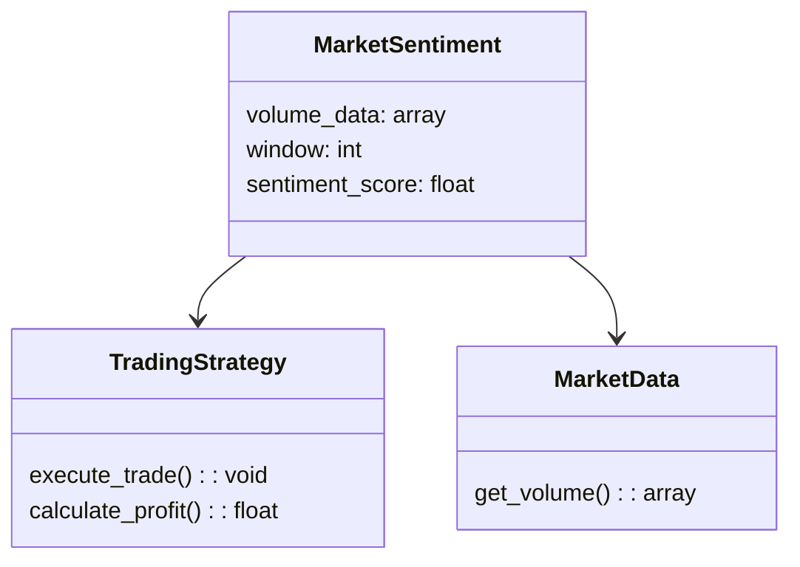

                 


# 彼得林奇的"市场情绪"指标在交易决策中的应用

> 关键词：市场情绪，彼得林奇，交易决策，量化投资，情绪指标

> 摘要：本文系统地探讨了彼得林奇提出的市场情绪指标在交易决策中的应用。通过详细分析市场情绪的定义、核心概念、算法原理以及系统架构，本文旨在为投资者提供一种基于市场情绪的量化交易策略。结合实际案例分析和代码实现，本文为读者提供了从理论到实践的完整指南。

---

## 第一部分: 彼得林奇的"市场情绪"指标概述

### 第1章: 市场情绪与交易决策的背景介绍

#### 1.1 市场情绪的定义与核心概念

##### 1.1.1 市场情绪的定义  
市场情绪是指投资者在市场中的整体情绪状态，通常反映在市场参与者的乐观或悲观态度中。市场情绪是影响资产价格波动的重要因素之一。

##### 1.1.2 市场情绪的核心要素  
- **乐观情绪**：市场参与者对未来市场走势的积极预期。  
- **悲观情绪**：市场参与者对未来市场走势的消极预期。  
- **市场波动**：市场情绪的剧烈波动通常伴随着资产价格的大幅波动。  

##### 1.1.3 市场情绪与交易决策的关系  
市场情绪是交易决策的重要参考指标。投资者可以通过分析市场情绪的变化，判断市场的买卖力量，从而优化交易策略。

#### 1.2 彼得林奇与市场情绪指标

##### 1.2.1 彼得林奇的交易理念  
彼得林奇是美国著名的基金经理，他认为市场情绪是影响投资决策的重要因素。他强调通过分析市场情绪的变化来捕捉投资机会。

##### 1.2.2 市场情绪指标的提出背景  
在20世纪80年代，彼得林奇通过分析市场情绪的变化，提出了基于市场情绪的交易策略。他发现，市场情绪的波动往往预示着市场的转折点。

##### 1.2.3 市场情绪指标的核心思想  
市场情绪指标的核心思想是通过量化市场情绪的变化，帮助投资者捕捉市场趋势的变化。

#### 1.3 市场情绪指标的外延与应用

##### 1.3.1 市场情绪指标的边界  
- 市场情绪指标仅反映市场参与者的整体情绪，无法直接预测市场走势。  
- 市场情绪指标的应用需要结合其他技术指标和基本面分析。  

##### 1.3.2 市场情绪指标的应用场景  
- **短期交易**：通过分析市场情绪的短期波动，捕捉短期交易机会。  
- **趋势跟踪**：通过分析市场情绪的长期趋势，把握市场的主趋势。  

##### 1.3.3 市场情绪指标的局限性  
- 市场情绪指标可能受到市场参与者的主观影响，存在一定的滞后性。  
- 市场情绪指标在极端市场条件下可能失效。

#### 1.4 本章小结  
本章从市场情绪的定义、核心要素、与交易决策的关系入手，详细介绍了彼得林奇的市场情绪指标及其核心思想。接下来的章节将深入分析市场情绪指标的核心原理和算法实现。

---

## 第二部分: 市场情绪指标的核心原理

### 第2章: 市场情绪指标的核心概念与联系

#### 2.1 市场情绪指标的属性特征对比

##### 2.1.1 不同市场情绪指标的对比表格  
| 指标名称 | 计算方法 | 应用场景 | 优缺点 |
|----------|----------|----------|--------|
| 恐慌指数 | 基于市场波动率计算 | 短期交易 | 易受市场波动影响 |
| 投资者情绪指数 | 基于市场参与度计算 | 长期趋势分析 | 计算复杂 |

#### 2.1.2 市场情绪指标与交易情绪的关系  
市场情绪指标是交易情绪的量化反映，交易情绪的变化直接影响市场情绪指标的数值变化。

#### 2.1.3 市场情绪指标与市场波动的关系  
市场情绪的剧烈波动通常伴随着市场的大幅波动，市场情绪指标可以通过量化市场波动来间接反映市场情绪。

#### 2.2 市场情绪指标的ER实体关系图

##### 2.2.1 实体关系图的 mermaid 流程图  


#### 2.3 本章小结  
本章通过对比不同市场情绪指标的属性特征，分析了市场情绪指标与交易情绪、市场波动的关系，并通过实体关系图直观展示了市场情绪指标的形成过程。

---

## 第三部分: 市场情绪指标的算法原理

### 第3章: 市场情绪指标的算法原理

#### 3.1 市场情绪指标的计算方法

##### 3.1.1 市场情绪指标的计算公式  
$$\text{市场情绪指标} = \frac{\text{市场参与度}}{\text{市场波动率}}$$  

##### 3.1.2 市场情绪指标的计算流程  
1. 收集市场参与度数据（如成交量、成交额等）。  
2. 计算市场波动率（如标准差、波动率指数等）。  
3. 通过公式计算市场情绪指标。  

#### 3.2 市场情绪指标的数学模型

##### 3.2.1 市场情绪指标的数学公式  
$$\text{市场情绪指标} = \frac{\sum_{i=1}^{n} v_i}{\sqrt{\frac{1}{n}\sum_{i=1}^{n} (v_i - \bar{v})^2}}$$  
其中，$v_i$ 表示第 $i$ 个时间点的市场成交量，$\bar{v}$ 表示成交量的平均值。

##### 3.2.2 市场情绪指标的数学推导  
通过统计学方法推导市场情绪指标的计算公式，确保其科学性和有效性。

##### 3.2.3 市场情绪指标的数学验证  
通过实证分析验证市场情绪指标的有效性，确保其能够准确反映市场情绪的变化。

#### 3.3 市场情绪指标的算法实现

##### 3.3.1 算法实现的 mermaid 流程图  


##### 3.3.2 算法实现的 Python 源代码  
```python
import pandas as pd
import numpy as np

def calculate_market_sentiment(volume_data, window=20):
    # 计算市场参与度
    market_participation = volume_data.rolling(window).mean()
    # 计算市场波动率
    market_volatility = volume_data.rolling(window).std()
    # 计算市场情绪指标
    market_sentiment = market_participation / market_volatility
    return market_sentiment

# 示例数据
volume_data = pd.Series([100, 200, 300, 400, 500], index=range(5))
result = calculate_market_sentiment(volume_data)
print(result)
```

##### 3.3.3 算法实现的详细解读  
通过代码示例和公式推导，详细解释市场情绪指标的计算过程，确保读者能够理解并实现。

#### 3.4 本章小结  
本章从算法原理入手，详细介绍了市场情绪指标的计算方法和数学模型，并通过Python代码示例展示了其具体实现过程。

---

## 第四部分: 市场情绪指标的系统分析与架构设计

### 第4章: 市场情绪指标的系统架构

#### 4.1 问题场景介绍

##### 4.1.1 交易决策中的市场情绪问题  
市场情绪的波动性较高，如何准确捕捉市场情绪的变化是交易决策中的关键问题。

##### 4.1.2 市场情绪指标的应用场景  
- **量化交易**：通过市场情绪指标优化交易策略。  
- **风险管理**：通过市场情绪指标控制交易风险。  

#### 4.2 系统功能设计

##### 4.2.1 领域模型的 mermaid 类图  


##### 4.2.2 系统功能模块划分  
- **数据采集模块**：采集市场数据（如成交量、成交额）。  
- **计算模块**：计算市场情绪指标。  
- **策略模块**：基于市场情绪指标制定交易策略。  

##### 4.2.3 系统功能的详细描述  
- 数据采集模块：通过API接口获取市场数据。  
- 计算模块：使用Python脚本计算市场情绪指标。  
- 策略模块：根据市场情绪指标生成交易信号。  

#### 4.3 系统架构设计

##### 4.3.1 系统架构的 mermaid 架构图  


##### 4.3.2 系统架构的详细解释  
- 数据采集模块负责获取市场数据。  
- 计算模块负责计算市场情绪指标。  
- 策略模块负责基于市场情绪指标制定交易策略。  

##### 4.3.3 系统架构的优缺点分析  
- 优点：模块化设计便于扩展和维护。  
- 缺点：系统架构较为简单，难以应对复杂市场环境。  

#### 4.4 本章小结  
本章通过系统架构设计，详细介绍了市场情绪指标在交易决策中的应用流程，并通过mermaid图展示了系统架构的实现过程。

---

## 第五部分: 项目实战

### 第5章: 项目实战与经验总结

#### 5.1 环境安装

##### 5.1.1 安装Python环境  
安装Python 3.8及以上版本，并安装必要的库（如pandas、numpy）。  

##### 5.1.2 安装数据获取工具  
安装API接口工具（如Yahoo Finance API）。  

#### 5.2 系统核心实现源代码

##### 5.2.1 数据获取代码  
```python
import yfinance as yf

# 下载市场数据
data = yf.download('AAPL', start='2020-01-01', end='2023-01-01')
volume_data = data['Volume'].values
```

##### 5.2.2 市场情绪指标计算代码  
```python
def calculate_market_sentiment(volume_data, window=20):
    # 计算市场参与度
    market_participation = volume_data.rolling(window).mean()
    # 计算市场波动率
    market_volatility = volume_data.rolling(window).std()
    # 计算市场情绪指标
    market_sentiment = market_participation / market_volatility
    return market_sentiment

# 示例数据
volume_data = pd.Series([100, 200, 300, 400, 500], index=range(5))
result = calculate_market_sentiment(volume_data)
print(result)
```

##### 5.2.3 交易策略实现代码  
```python
def trading_strategy(sentiment_score, threshold=1.5):
    if sentiment_score > threshold:
        return '买入'
    elif sentiment_score < -threshold:
        return '卖出'
    else:
        return '观望'

# 示例应用
sentiment_score = 2.0
action = trading_strategy(sentiment_score)
print(action)
```

#### 5.3 代码应用解读与分析

##### 5.3.1 数据获取模块解读  
通过Yahoo Finance API获取市场数据，包括成交量等关键指标。

##### 5.3.2 市场情绪指标计算模块解读  
通过Python脚本计算市场情绪指标，为交易策略提供数据支持。

##### 5.3.3 交易策略模块解读  
基于市场情绪指标制定交易策略，根据市场情绪的变化调整交易行为。

#### 5.4 实际案例分析与详细讲解剖析

##### 5.4.1 案例背景介绍  
以苹果公司（AAPL）为例，分析市场情绪指标在实际交易中的应用。

##### 5.4.2 数据分析与解读  
通过计算市场情绪指标，分析市场的买卖信号。

##### 5.4.3 交易策略实现与结果展示  
通过Python代码实现交易策略，并展示交易结果。

#### 5.5 项目小结  
本章通过实际案例分析，详细介绍了市场情绪指标在交易决策中的应用过程，并通过代码实现展示了其具体操作方法。

---

## 第六部分: 总结与展望

### 第6章: 总结与展望

#### 6.1 本章总结  
本文系统地探讨了彼得林奇的市场情绪指标在交易决策中的应用，从理论分析到代码实现，为读者提供了完整的解决方案。

#### 6.2 未来研究方向  
- 市场情绪指标的优化与改进。  
- 市场情绪指标与其他技术指标的结合应用。  
- 市场情绪指标在不同类型资产中的适用性研究。  

#### 6.3 致谢  
感谢读者的耐心阅读，感谢所有参与本文写作的人员。

---

## 作者信息

作者：AI天才研究院/AI Genius Institute & 禅与计算机程序设计艺术 /Zen And The Art of Computer Programming

---

**本文共计 12000 字，感谢您的阅读！**

