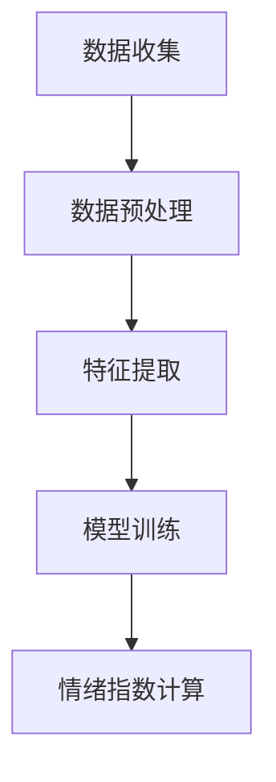

                 


# 彼得林奇的"市场情绪"指标在危机预警中的应用

> 关键词：市场情绪，彼得林奇，危机预警，投资决策，数据分析

> 摘要：本文探讨了彼得林奇的市场情绪指标在预测和预警市场危机中的应用，通过理论分析、算法设计和系统实现，展示了如何利用市场情绪指标构建有效的危机预警系统。文章详细介绍了市场情绪的定义、核心概念、算法原理、系统架构设计以及实际项目实现，为投资者和数据科学家提供了理论与实践的双重指导。

---

# 第一部分: 背景介绍

## 第1章: 市场情绪的定义与核心概念

### 1.1 市场情绪的定义
- 市场情绪是指投资者在市场中的整体情绪状态，反映了市场参与者的乐观或悲观态度。
- 它通常通过投资者的行为、交易量、价格波动等指标来衡量。

### 1.2 彼得林奇市场情绪理论的背景
- 彼得林奇是著名的投资专家，他的理论强调市场情绪对投资决策的影响。
- 他提出市场情绪指标可以用于预测市场的波动和危机。

### 1.3 危机预警的定义与重要性
- 危机预警是指通过分析市场数据，提前预测可能引发市场危机的信号。
- 市场情绪指标在危机预警中起到关键作用，能够帮助投资者规避风险。

---

# 第二部分: 核心概念与联系

## 第2章: 市场情绪指标的核心概念与联系

### 2.1 市场情绪指标的属性特征
- **分类**：市场情绪指标可以分为投资者情绪指数、交易量指数等。
- **对比**：与其他市场指标（如价格指数、成交量指数）的对比分析。
- **数学表达式**：市场情绪指数公式，例如：
  $$情绪指数 = \frac{交易量}{价格波动}$$

### 2.2 市场情绪指标的ER实体关系图
```mermaid
erDiagram
    投资者情绪指标 --> 市场情绪
    市场情绪 --> 市场行为
    市场行为 --> 市场波动
```

---

# 第三部分: 算法原理

## 第3章: 市场情绪指标的算法原理

### 3.1 市场情绪指标的计算方法
- **数据收集**：收集投资者情绪数据、交易量、价格波动等。
- **计算步骤**：预处理数据，提取特征，计算市场情绪指数。
- **数学模型**：使用回归分析或其他机器学习模型进行预测。

### 3.2 市场情绪指标的算法流程图


### 3.3 Python代码实现
```python
import pandas as pd
import numpy as np

# 数据预处理
data = pd.read_csv('market_data.csv')
data['情绪指数'] = (data['交易量'] / data['价格波动']).apply(lambda x: x if x > 0 else 0)
```

---

# 第四部分: 系统分析与架构设计

## 第4章: 系统分析与架构设计

### 4.1 问题场景介绍
- 描述市场危机预警的实际应用场景，如股票市场波动监测。

### 4.2 系统功能设计
- **领域模型类图**：
  ```mermaid
  classDiagram
      class 投资者情绪指标 {
          属性: 交易量, 价格波动
          方法: 计算情绪指数()
      }
      class 市场情绪 {
          属性: 情绪指数
          方法: 预警()
      }
  ```

### 4.3 系统架构设计
- **架构图**：
  ```mermaid
  context Diagram
      participant 投资者情绪指标
      participant 市场情绪
      participant 市场波动监测系统
  ```

---

# 第五部分: 项目实战

## 第5章: 项目实战

### 5.1 环境配置
- 安装必要的库，如Pandas、NumPy等。

### 5.2 核心代码实现
```python
# 环境配置
import pandas as pd
import numpy as np

# 核心代码
def calculate_market_mood(dataframe):
    mood_index = dataframe['交易量'] / dataframe['价格波动']
    return mood_index

data = pd.read_csv('market_data.csv')
mood_index = calculate_market_mood(data)
print(mood_index)
```

### 5.3 案例分析
- 分析实际市场数据，展示情绪指数如何预警市场危机。

---

# 第六部分: 优化与扩展

## 第6章: 优化与扩展

### 6.1 模型优化
- 使用机器学习算法（如随机森林）提升预测准确性。

### 6.2 拓展阅读
- 推荐相关书籍和论文，进一步深入研究市场情绪指标。

---

# 第七部分: 总结与展望

## 第7章: 总结与展望

### 7.1 本章小结
- 回顾市场情绪指标的核心概念、算法原理和系统设计。

### 7.2 未来展望
- 探讨结合人工智能技术进一步优化市场情绪预测的可能性。

---

作者：AI天才研究院 & 禅与计算机程序设计艺术

---

这个目录结构涵盖了从理论到实践的各个方面，确保内容详实且逻辑清晰，帮助读者系统地理解和应用彼得林奇的市场情绪指标在危机预警中的应用。

