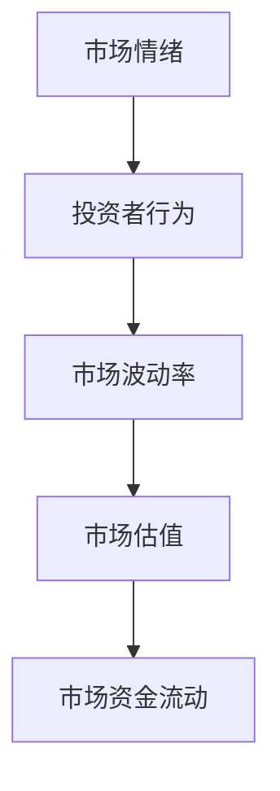
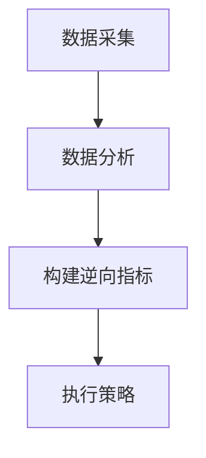
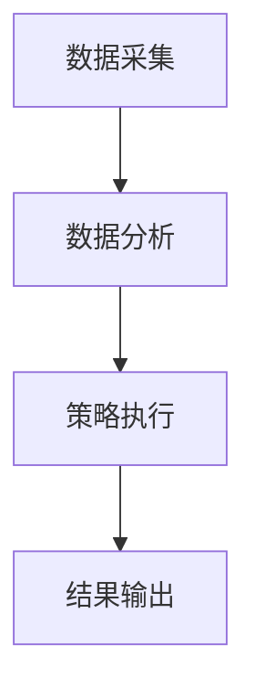
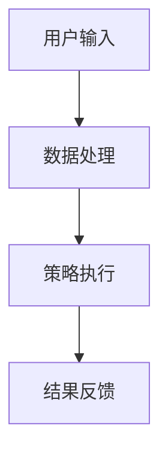

                 


# 彼得林奇的"市场情绪"逆向指标运用

## 关键词：彼得林奇，市场情绪，逆向指标，投资策略，金融分析

## 摘要：本文深入探讨了彼得林奇提出的市场情绪逆向指标在投资决策中的应用。通过分析市场情绪的核心概念、指标体系、策略模型以及系统架构，结合实际案例和代码实现，全面解析了逆向指标的原理和应用方法。文章最后总结了最佳实践和注意事项，为投资者提供了实用的指导。

---

# 第一部分: 彼得林奇的市场情绪逆向指标概述

## 第1章: 市场情绪与逆向指标的定义

### 1.1 市场情绪的定义与特征

#### 1.1.1 市场情绪的定义  
市场情绪是指投资者在金融市场中的情感倾向和行为模式，通常表现为乐观或悲观。它是影响市场走势的重要因素之一。

#### 1.1.2 市场情绪的特征  
市场情绪具有波动性、传染性和周期性。投资者情绪的变化往往会导致市场的非理性波动。

#### 1.1.3 市场情绪与投资决策的关系  
市场情绪影响投资者的决策，但过度的情绪化可能导致错误判断。因此，理性分析市场情绪是投资成功的关键。

### 1.2 彼得林奇投资理念的核心

#### 1.2.1 彼得林奇的生平与投资风格  
彼得·林奇是美国著名的基金经理，以其独特的投资风格闻名。他强调基本面分析和长期投资。

#### 1.2.2 彼得林奇对市场情绪的研究  
林奇发现，市场情绪的波动往往与市场走势相反。因此，他提出了逆向投资的策略。

#### 1.2.3 彼得林奇逆向指标的提出  
逆向指标是指在市场情绪高涨时卖出，在市场情绪低落时买入。这种策略帮助投资者在市场低谷时抓住机会。

---

## 第2章: 逆向指标的定义与应用

### 2.1 逆向指标的定义

#### 2.1.1 逆向指标的定义  
逆向指标是一种基于市场情绪的反向投资策略，旨在通过分析市场情绪的极端值来寻找投资机会。

#### 2.1.2 逆向指标的核心思想  
市场情绪的极端值往往对应市场的拐点。因此，逆向指标的核心思想是在市场情绪高涨时寻找卖出机会，在市场情绪低落时寻找买入机会。

#### 2.1.3 逆向指标与市场情绪的关系  
逆向指标是对市场情绪的反向运用，通过分析情绪的波动来寻找投资机会。

### 2.2 逆向指标的应用场景

#### 2.2.1 股票投资中的逆向指标  
在股票投资中，逆向指标可以帮助投资者在市场恐慌时买入优质股票，在市场狂热时卖出。

#### 2.2.2 债券投资中的逆向指标  
债券市场同样受到市场情绪的影响。逆向指标可以帮助投资者在债券市场情绪低落时买入，情绪高涨时卖出。

#### 2.2.3 其他金融市场的逆向指标  
逆向指标不仅适用于股票和债券市场，还可以扩展到期货、外汇等其他金融市场。

---

# 第二部分: 市场情绪的核心概念与联系

## 第3章: 市场情绪的指标体系

### 3.1 市场情绪的指标构成

#### 3.1.1 投资者情绪指数  
投资者情绪指数是衡量市场情绪的重要指标，通常通过调查和数据分析得出。

#### 3.1.2 市场波动率指标  
市场波动率反映了市场的不确定性，是市场情绪的重要指标。

#### 3.1.3 市场资金流动指标  
市场资金流动反映了投资者的资金流向，是市场情绪的晴雨表。

### 3.2 逆向指标的核心要素

#### 3.2.1 投资者行为分析  
分析投资者行为可以帮助识别市场情绪的变化。

#### 3.2.2 市场情绪周期  
市场情绪具有周期性，逆向指标可以通过分析周期变化来寻找投资机会。

#### 3.2.3 市场估值指标  
市场估值指标是衡量市场是否被高估或低估的重要指标，与市场情绪密切相关。

---

## 第4章: 核心概念的联系与对比

### 4.1 市场情绪与逆向指标的对比分析

#### 4.1.1 市场情绪的多维度分析  
市场情绪可以从投资者行为、市场波动率等多个维度进行分析。

#### 4.1.2 逆向指标的数学模型  
逆向指标的数学模型可以通过统计学方法构建，反映市场情绪的变化。

#### 4.1.3 市场情绪与逆向指标的关联性  
逆向指标是对市场情绪的反向运用，两者密切相关。

### 4.2 市场情绪指标体系的ER实体关系图



---

# 第三部分: 逆向指标的策略分析与算法原理

## 第5章: 逆向指标的策略模型

### 5.1 逆向指标的数学模型

#### 5.1.1 数学模型的构建  
逆向指标的数学模型可以通过统计学方法构建，反映市场情绪的变化。

#### 5.1.2 数学公式的推导  
$$\text{逆向指标} = \frac{\text{市场情绪的极端值}}{\text{市场情绪的平均值}}$$

#### 5.1.3 案例分析  
通过具体案例分析，说明逆向指标在实际投资中的应用。

---

## 第6章: 逆向指标的算法实现

### 6.1 算法的实现步骤

#### 6.1.1 数据采集  
通过数据接口获取市场数据，包括股票价格、市场波动率等。

#### 6.1.2 数据分析  
使用统计学方法分析市场情绪，构建逆向指标。

#### 6.1.3 策略执行  
根据逆向指标的结果，执行买入或卖出策略。

### 6.2 算法的流程图



---

## 第7章: 逆向指标的系统架构

### 7.1 系统架构设计

#### 7.1.1 系统功能模块  
系统包括数据采集模块、数据分析模块、策略执行模块等。

#### 7.1.2 系统架构图



---

## 第8章: 逆向指标的接口设计

### 8.1 系统接口设计

#### 8.1.1 数据接口  
通过API获取市场数据。

#### 8.1.2 策略接口  
通过API执行投资策略。

### 8.2 交互流程图



---

## 第9章: 逆向指标的项目实战

### 9.1 环境安装

#### 9.1.1 安装Python  
安装Python编程语言和必要的库。

#### 9.1.2 安装数据分析库  
安装Pandas、NumPy等数据分析库。

### 9.2 核心代码实现

#### 9.2.1 数据采集代码  
```python
import pandas as pd

# 通过API获取市场数据
data = pd.read_json('https://api.example.com/market_data')
```

#### 9.2.2 逆向指标计算代码  
```python
def calculate_reverse_indicator(data):
    # 计算市场情绪的极端值
    extreme_values = data['market_mood'].quantile(0.05)
    # 计算市场情绪的平均值
    average_values = data['market_mood'].mean()
    # 计算逆向指标
    reverse_indicator = extreme_values / average_values
    return reverse_indicator
```

#### 9.2.3 策略执行代码  
```python
def execute_strategy(data):
    reverse_indicator = calculate_reverse_indicator(data)
    if reverse_indicator < 0.5:
        print("买入信号")
    elif reverse_indicator > 0.7:
        print("卖出信号")
    else:
        print("观望")
```

### 9.3 案例分析

#### 9.3.1 实际案例分析  
通过具体案例分析，展示逆向指标在实际投资中的应用。

#### 9.3.2 代码实现解读  
解读上述代码的实现过程，说明每一步的作用。

### 9.4 项目总结

#### 9.4.1 项目小结  
总结项目的主要成果和经验。

#### 9.4.2 项目反思  
反思项目中的不足之处，提出改进建议。

---

# 第四部分: 逆向指标的最佳实践与注意事项

## 第10章: 最佳实践

### 10.1 最佳实践 tips

#### 10.1.1 保持理性  
在市场情绪高涨时，保持冷静，避免盲目跟风。

#### 10.1.2 定期调整策略  
根据市场变化，定期调整逆向指标的策略。

#### 10.1.3 多元化投资  
通过多元化投资降低风险，提高收益。

### 10.2 小结

总结逆向指标的优势和不足，提出改进建议。

---

## 第11章: 注意事项

### 11.1 投资者需注意的风险

#### 11.1.1 市场波动风险  
市场波动可能导致逆向指标失效。

#### 11.1.2 情绪过度反应  
市场情绪的过度反应可能导致投资决策失误。

#### 11.1.3 数据质量风险  
数据的质量直接影响逆向指标的准确性。

### 11.2 拓展阅读

推荐相关的书籍和论文，供读者进一步学习。

---

## 第12章: 未来展望

### 12.1 未来的研究方向

#### 12.1.1 更复杂的情绪模型  
未来可以研究更复杂的情绪模型，提高逆向指标的准确性。

#### 12.1.2 人工智能的应用  
利用人工智能技术，提高市场情绪的分析能力。

#### 12.1.3 多市场应用  
将逆向指标扩展到更多金融市场，提高应用范围。

---

## 作者：AI天才研究院/AI Genius Institute & 禅与计算机程序设计艺术 /Zen And The Art of Computer Programming

