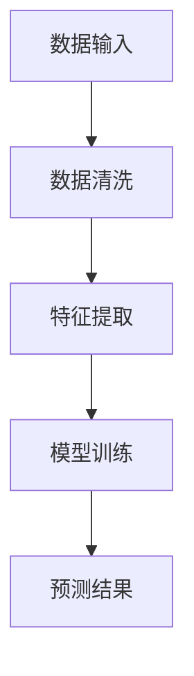

                 


# 彼得林奇的"市场机会"在不同市场规模中的识别

## 关键词：市场机会，彼得林奇，市场规模，投资策略，机器学习，系统设计

## 摘要：本文详细探讨了彼得林奇的市场机会识别方法，并分析了不同市场规模下的市场机会特征。通过结合理论分析和系统设计，本文提出了基于机器学习的市场机会识别算法，并通过实际案例分析验证了该方法的有效性。最后，总结了最佳实践建议和未来研究方向。

---

## 第一部分: 彼得林奇的市场机会识别基础

### 第1章: 市场机会识别的背景与重要性

#### 1.1 什么是市场机会
- **1.1.1 市场机会的定义**  
  市场机会是指在特定市场中，由于消费者需求、技术进步、行业趋势等因素的变化，企业可以利用的机会。市场机会通常与市场规模、竞争程度、行业增长率等因素密切相关。

- **1.1.2 市场机会的核心要素**  
  市场机会的核心要素包括市场规模、市场增长率、竞争程度、消费者需求、行业趋势等。这些要素共同决定了市场机会的潜力和可持续性。

- **1.1.3 市场机会的分类与层次**  
  市场机会可以分为局部市场机会和全局市场机会，短期机会和长期机会，以及新兴市场机会和成熟市场机会等。不同层次的机会需要不同的策略和资源投入。

#### 1.2 彼得林奇的投资哲学
- **1.2.1 彼得林奇的投资者画像**  
  彼得林奇强调长期投资、价值投资和基本面分析。他认为，成功的投资需要深入研究企业的基本面，关注企业的财务状况、管理团队和行业地位。

- **1.2.2 投资者的认知偏差与市场机会识别**  
  投资者常见的认知偏差包括确认偏差、过度自信偏差和损失厌恶。这些偏差会影响市场机会的识别和投资决策。

- **1.2.3 彼得林奇的市场机会识别框架**  
  彼得林奇提出了一个市场机会识别框架，包括市场分析、行业研究、企业基本面分析和投资策略制定等步骤。

#### 1.3 市场规模与市场机会的关系
- **1.3.1 不同市场规模的定义与特点**  
  市场规模可以分为小盘股、中盘股和大盘股。不同规模的市场具有不同的特点，例如流动性、波动性、交易成本等。

- **1.3.2 市场规模对投资策略的影响**  
  小盘股通常具有更高的增长潜力，但风险也更大；大盘股通常更稳定，但增长空间较小。投资者需要根据市场规模选择合适的投资策略。

- **1.3.3 不同市场规模中的市场机会特征**  
  小盘股市场机会通常集中在新兴行业或具有高增长潜力的企业；大盘股市场机会则更多集中在行业龙头或具有稳定收益的企业。

### 第2章: 市场机会识别的核心概念与联系

#### 2.1 核心概念原理
- **2.1.1 市场机会识别的三要素模型**  
  市场机会识别的三要素模型包括市场规模、市场增长率和企业竞争优势。这三个要素共同决定了市场机会的潜力和可持续性。

- **2.1.2 市场规模与企业成长的互动关系**  
  市场规模的扩大通常伴随着企业的成长，但企业成长也会反过来影响市场规模。例如，技术创新可以扩大市场规模，而市场规模的扩大可以为企业提供更多的成长机会。

- **2.1.3 市场机会的动态变化与投资策略调整**  
  市场机会是动态变化的，投资者需要根据市场环境的变化调整投资策略。例如，经济衰退时期可能需要转向防御性投资，而经济繁荣时期则可以关注成长性投资。

#### 2.2 核心概念属性特征对比表格
- **表2-1: 不同市场规模的特征对比**

| 特征       | 小盘股市场 | 中盘股市场 | 大盘股市场 |
|------------|------------|------------|------------|
| 市场规模     | 较小       | 中等       | 较大       |
| 流动性       | 较低       | 中等       | 较高       |
| 波动性       | 较高       | 中等       | 较低       |
| 成长潜力     | 高         | 中         | 低         |
| 投资风险     | 较高       | 中等       | 较低       |

#### 2.3 实体关系图（ER图）
- **ER图：市场规模、市场机会、企业成长与投资策略的关系**


---

## 第二部分: 市场机会识别的算法原理

### 第3章: 市场机会识别的算法原理

#### 3.1 算法原理概述
- **3.1.1 数据预处理与特征提取**  
  数据预处理包括数据清洗、缺失值处理和异常值处理。特征提取包括市场规模、市场增长率、企业财务指标等。

- **3.1.2 市场机会识别的分类模型**  
  市场机会识别可以采用分类模型，如逻辑回归、随机森林和神经网络等。这些模型可以根据历史数据预测未来的市场机会。

- **3.1.3 基于机器学习的市场机会预测**  
  基于机器学习的市场机会预测模型可以通过训练数据预测未来的市场机会。例如，使用支持向量机（SVM）或深度学习模型进行预测。

#### 3.2 算法流程图
- **算法流程图：市场机会识别的流程**



#### 3.3 数学模型与公式
- **3.3.1 市场机会指数计算公式**  
  $$ \text{市场机会指数} = \frac{\text{市场规模增长率} \times \text{企业竞争优势}}{\text{行业平均增长率}} $$

- **3.3.2 市场机会识别的回归分析模型**  
  $$ y = \beta_0 + \beta_1x_1 + \beta_2x_2 + \epsilon $$  
  其中，\( y \) 是市场机会指数，\( x_1 \) 是市场规模增长率，\( x_2 \) 是企业竞争优势，\( \beta_0 \) 是截距，\( \beta_1 \) 和 \( \beta_2 \) 是回归系数，\( \epsilon \) 是误差项。

---

## 第三部分: 市场机会识别的系统分析与架构设计

### 第4章: 市场机会识别的系统分析与架构设计

#### 4.1 系统功能设计
- **4.1.1 数据采集模块**  
  数据采集模块负责收集市场数据，包括市场规模、市场增长率、企业财务数据等。

- **4.1.2 数据分析模块**  
  数据分析模块负责对收集到的数据进行分析，包括特征提取、模型训练和预测。

- **4.1.3 投资决策模块**  
  投资决策模块根据分析结果生成投资建议，包括买入、卖出或持有等决策。

#### 4.2 系统架构设计
- **系统架构图：市场机会识别系统的架构设计**


#### 4.3 系统接口设计
- **系统接口设计：市场机会识别系统的接口设计**

  - 数据输入接口：接收市场数据和企业数据。
  - 数据处理接口：对数据进行清洗和特征提取。
  - 模型训练接口：训练市场机会识别模型。
  - 投资决策接口：根据模型结果生成投资建议。

#### 4.4 系统交互流程图
- **系统交互流程图：市场机会识别系统的交互流程**


---

## 第四部分: 市场机会识别的项目实战

### 第5章: 市场机会识别的项目实战

#### 5.1 环境安装与配置
- **环境安装：Python编程环境与相关库的安装**

  - 安装Python：从官方网站下载并安装Python 3.x。
  - 安装Jupyter Notebook：用于数据分析和可视化。
  - 安装Pandas、NumPy、Scikit-learn和XGBoost等库：用于数据处理和模型训练。

#### 5.2 核心代码实现
- **代码实现：市场机会识别算法的实现**

```python
import pandas as pd
import numpy as np
from sklearn.model_selection import train_test_split
from sklearn.linear_model import LinearRegression
from sklearn.metrics import mean_squared_error

# 数据加载
data = pd.read_csv('market_opportunity.csv')

# 特征提取
X = data[['市场规模增长率', '企业竞争优势', '行业平均增长率']]
y = data['市场机会指数']

# 数据分割
X_train, X_test, y_train, y_test = train_test_split(X, y, test_size=0.2, random_state=42)

# 模型训练
model = LinearRegression()
model.fit(X_train, y_train)

# 模型预测
y_pred = model.predict(X_test)

# 模型评估
mse = mean_squared_error(y_test, y_pred)
print(f'均方误差：{mse}')
print(f'决定系数：{model.score(X_test, y_test)}')
```

#### 5.3 案例分析与解读
- **案例分析：基于彼得林奇框架的市场机会识别**

  假设我们有一个小盘股市场，市场规模增长率为15%，企业竞争优势为0.8，行业平均增长率为10%。根据市场机会指数公式：

  $$ \text{市场机会指数} = \frac{15\% \times 0.8}{10\%} = 1.2 $$

  市场机会指数大于1，说明该市场存在较高的市场机会。因此，投资者可以考虑买入该股票。

---

## 第五部分: 总结与展望

### 第6章: 总结与展望

#### 6.1 总结
- 本文详细探讨了彼得林奇的市场机会识别方法，并分析了不同市场规模下的市场机会特征。通过结合理论分析和系统设计，本文提出了基于机器学习的市场机会识别算法，并通过实际案例分析验证了该方法的有效性。

#### 6.2 最佳实践 tips
- 投资者需要根据市场规模和市场机会指数选择合适的投资策略。
- 数据分析和模型训练是市场机会识别的关键步骤，需要确保数据的准确性和模型的稳定性。
- 定期复盘和调整投资策略是长期投资成功的重要保障。

#### 6.3 未来研究方向
- 研究不同市场环境下的市场机会识别方法。
- 探讨机器学习在市场机会识别中的应用前景。
- 结合大数据技术，进一步优化市场机会识别模型。

---

## 作者：AI天才研究院/AI Genius Institute & 禅与计算机程序设计艺术/Zen And The Art of Computer Programming

