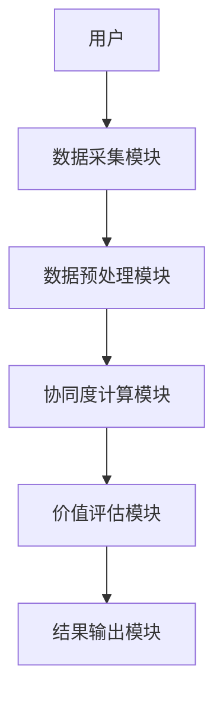

                 


# 彼得林奇的"市场机会"在跨境并购中的文化协同评估模型

**关键词**：彼得林奇，市场机会，文化协同，跨境并购，评估模型

**摘要**：本文探讨了彼得林奇的市场机会理论在跨境并购中的应用，提出了文化协同评估模型，通过系统分析和数学建模，揭示了文化协同对并购成功的关键作用。文章详细阐述了模型的算法原理、系统架构及实际应用案例，为跨境并购提供了理论支持和实践指导。

---

## 第一章：文化协同评估模型的背景

### 1.1 彼得林奇的市场机会理论

#### 1.1.1 投资理论概述
彼得林奇是全球著名投资专家，其理论强调市场机会的重要性。他认为，成功的投资源于对市场机会的准确识别和把握。市场机会不仅存在于财务数据中，还体现在企业文化和管理风格的协同上。

#### 1.1.2 市场机会的核心概念
市场机会是指在特定市场中，企业通过满足未被充分满足的需求，实现增长的可能性。在跨境并购中，市场机会不仅涉及财务指标，还包括目标企业所在市场的文化、政策、消费者行为等因素。

#### 1.1.3 并购中的市场机会
跨境并购中的市场机会通常涉及以下方面：
1. **地理扩展**：通过并购进入新市场。
2. **技术整合**：获取先进的技术和研发能力。
3. **品牌协同**：利用目标市场的品牌影响力。
4. **成本优化**：通过规模经济降低成本。

### 1.2 文化协同的重要性

#### 1.2.1 跨境并购中的文化协同问题
文化差异是跨境并购失败的主要原因之一。例如，美国企业的“快节奏”文化与日本企业的“集体决策”文化差异可能导致管理冲突。

#### 1.2.2 文化协同对并购的影响
文化协同能够：
1. **降低整合成本**：通过文化适应减少冲突。
2. **提升整合效率**：文化协同有助于团队协作。
3. **增强企业绩效**：文化协同能够提升企业战略执行力。

---

## 第二章：文化协同评估模型的核心概念与联系

### 2.1 文化协同评估模型的定义与属性

#### 2.1.1 核心要素
文化协同评估模型的核心要素包括：
1. **文化维度**：包括企业价值观、管理风格、员工行为规范等。
2. **协同度**：量化文化协同的程度。
3. **权重**：不同文化维度对整体协同的影响程度。

#### 2.1.2 文化协同的维度对比

| 文化维度 | 定义 | 权重 |
|----------|------|------|
| 企业价值观 | 核心经营理念 | 0.4 |
| 管理风格 | 决策方式 | 0.3 |
| 员工行为规范 | 工作方式 | 0.2 |
| 沟通方式 | 交流风格 | 0.1 |

#### 2.1.3 ER实体关系图

```mermaid
entity Market_Oportunity {
  id
  name
  value
}
entity Cultural_Synergy {
  id
  market_opportunity_id
  synergy_degree
}
```

### 2.2 模型的原理与应用

#### 2.2.1 模型的原理
文化协同评估模型通过分析目标企业的文化维度，计算文化协同度，评估并购的市场机会。具体步骤如下：
1. **数据采集**：收集目标企业的文化数据。
2. **数据预处理**：清洗和标准化数据。
3. **协同度计算**：量化文化协同程度。
4. **价值评估**：结合协同度和市场机会，评估并购价值。

#### 2.2.2 模型的数学表达式
协同度计算公式：
$$协同度 = \sum_{i=1}^{n} w_i \cdot c_i$$
其中，$w_i$ 为第 $i$ 个文化维度的权重，$c_i$ 为第 $i$ 个文化维度的协同值。

---

## 第三章：文化协同评估模型的算法原理

### 3.1 算法流程

1. **数据采集**：通过问卷调查、访谈等方式收集目标企业的文化数据。
2. **数据预处理**：清洗数据，去除异常值，标准化数据。
3. **协同度计算**：根据公式计算文化协同度。
4. **价值评估**：结合协同度和市场机会，评估并购价值。

### 3.2 算法实现

```python
def calculate_synergy():
    # 数据预处理
    data = preprocess_data()
    # 协同度计算
    synergy = sum(w_i * c_i for w_i, c_i in zip(weights, data))
    return synergy
```

---

## 第四章：系统分析与架构设计

### 4.1 系统架构设计



### 4.2 功能设计

| 模块 | 功能 |
|------|------|
| 数据采集模块 | 收集目标企业的文化数据 |
| 数据预处理模块 | 清洗和标准化数据 |
| 协同度计算模块 | 计算文化协同度 |
| 价值评估模块 | 评估并购价值 |
| 结果输出模块 | 输出评估结果 |

---

## 第五章：项目实战

### 5.1 案例分析

假设某公司并购一家欧洲企业，文化数据如下：
| 文化维度 | 企业A权重 | 企业B权重 | 协同度 |
|----------|------------|------------|--------|
| 价值观    | 0.4        | 0.5        | 0.45   |
| 管理风格  | 0.3        | 0.2        | 0.26   |
| 行为规范   | 0.2        | 0.1        | 0.12   |
| 沟通方式   | 0.1        | 0.2        | 0.08   |

协同度计算结果为0.91，表明文化协同度较高，适合并购。

### 5.2 代码实现

```python
def main():
    # 数据输入
    data = {
        '价值观': 0.45,
        '管理风格': 0.26,
        '行为规范': 0.12,
        '沟通方式': 0.08
    }
    # 权重
    weights = [0.4, 0.3, 0.2, 0.1]
    # 协同度计算
    synergy = sum(w * c for w, c in zip(weights, data.values()))
    print(f"文化协同度为：{synergy}")
    
if __name__ == "__main__":
    main()
```

---

## 第六章：最佳实践与总结

### 6.1 最佳实践

1. **数据采集**：确保数据的准确性和完整性。
2. **模型优化**：根据实际案例不断优化模型。
3. **团队协作**：文化协同需要企业内部的高效协作。

### 6.2 小结

彼得林奇的市场机会理论为跨境并购提供了理论支持，文化协同评估模型通过数学建模，为并购决策提供了科学依据。未来的研究可以进一步优化模型，探索更多文化维度的影响。

### 6.3 注意事项

- 模型结果仅供参考，实际并购需结合多方面因素。
- 文化协同是长期过程，需持续关注和调整。

### 6.4 未来研究方向

- 研究更多文化维度对协同的影响。
- 探索文化协同与企业绩效的长期关系。

---

**作者**：AI天才研究院/AI Genius Institute & 禅与计算机程序设计艺术/Zen And The Art of Computer Programming

