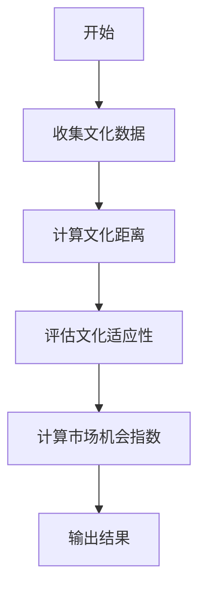
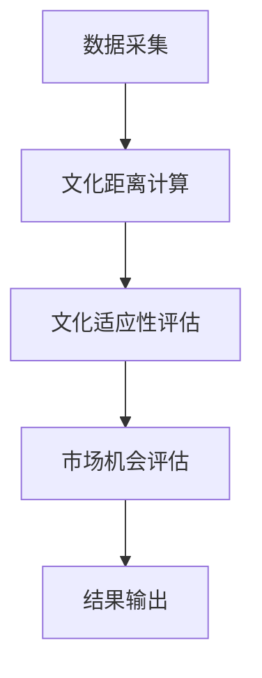
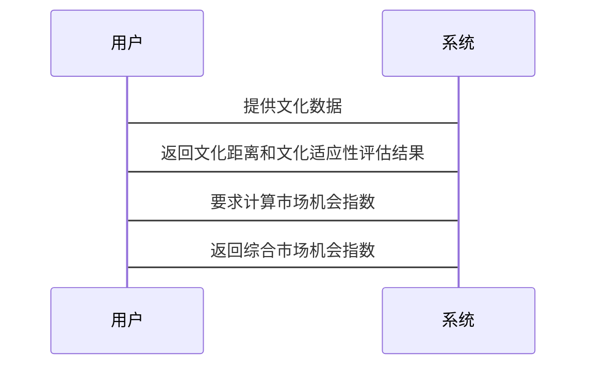

                 


# 彼得林奇的"市场机会"在跨境并购中的文化因素评估

## 关键词：彼得林奇，市场机会，文化因素，跨境并购，投资理论

## 摘要：  
本文通过分析彼得林奇的市场机会理论，探讨文化因素在跨境并购中的重要性。文章首先介绍市场机会和文化因素的基本概念，分析其在跨境并购中的作用，然后从文化差异对消费者行为的影响、文化适应性对市场机会的影响等方面展开论述。通过构建文化因素评估模型，提出文化距离、文化适应性、市场机会指数等核心概念，并结合实际案例，验证模型的可行性。最后，总结文化因素对市场机会评估的启示，提出投资决策中的文化风险管理建议。

---

## 第一部分：背景介绍

### 第1章：市场机会与文化因素概述

#### 1.1 市场机会的定义与重要性  
- **市场机会的定义**：市场机会是指在特定市场中，由于需求未被充分满足或供给不足而产生的投资机会。  
- **市场机会的重要性**：彼得林奇认为，市场机会是投资成功的核心，投资者需要识别那些被市场低估的潜力股。  
- **市场机会的来源与类型**：包括新兴行业、技术进步、政策变化等，其中文化因素是影响市场机会的重要外部因素。  

#### 1.2 文化因素在市场机会中的作用  
- **文化因素的定义**：文化因素指一个国家或地区的社会价值观、消费习惯、语言、宗教信仰等，这些因素会影响市场的行为和需求。  
- **文化因素对市场机会的影响**：文化差异可能导致市场机会的差异，例如某些文化背景下对特定产品的偏好较高。  
- **文化因素的多样性与复杂性**：不同国家和地区的文化差异可能导致市场机会的复杂性增加，需要投资者具备跨文化敏感性。  

#### 1.3 跨境并购的背景与现状  
- **跨境并购的定义与特点**：跨境并购是指一家企业收购另一家位于不同国家的企业，具有跨文化、跨国界的特性。  
- **跨境并购的驱动因素**：包括资源获取、市场扩展、技术获取等。  
- **跨境并购中的文化因素挑战**：文化差异可能导致并购后的整合困难，例如管理风格、员工文化适应性等问题。  

#### 1.4 彼得林奇的市场机会理论  
- **彼得林奇的市场机会理论概述**：彼得林奇强调，市场机会的核心在于识别那些被市场低估的行业或企业，这些机会往往存在于市场波动或经济周期的低谷期。  
- **理论在跨境并购中的应用**：将彼得林奇的市场机会理论应用于跨境并购，需要结合目标市场的文化因素进行评估。  
- **理论的局限性与改进方向**：彼得林奇的理论主要关注市场估值，忽略了文化因素对市场机会的影响，因此需要结合文化因素进行补充。  

#### 1.5 本章小结  
本章从市场机会和文化因素的基本概念出发，分析了文化因素在市场机会中的作用，并结合跨境并购的背景，探讨了彼得林奇市场机会理论的适用性和改进方向。

---

## 第二部分：核心概念与联系

### 第2章：文化因素与市场机会的关系

#### 2.1 文化因素对市场机会的影响机制  
- **文化差异对消费者行为的影响**：不同文化背景下的消费者对产品的偏好、购买决策和消费习惯存在显著差异。  
- **文化适应性对市场机会的影响**：企业需要根据目标市场的文化特点调整产品和服务，以抓住市场机会。  
- **文化距离与市场机会的关系**：文化距离越大，市场机会的不确定性越高，但潜在的市场空间也可能更大。  

#### 2.2 文化因素对市场机会的评估模型  
- **文化因素评估模型的构建**：通过分析文化距离、文化适应性、文化敏感性等指标，构建文化因素评估模型。  
- **文化距离的定义与计算**：文化距离是指不同市场之间的文化差异程度，可以通过文化维度（如霍夫斯泰德的文化维度）进行量化。  
- **文化适应性的定义与评估**：文化适应性是指企业在目标市场中调整产品和服务以适应当地文化的能力。  

#### 2.3 文化因素与市场机会的关系模型  
- **概念对比表**：  
| **因素** | **定义** | **对市场机会的影响** |  
|----------|----------|------------------------|  
| 文化距离 | 文化差异程度 | 距离越大，市场机会的不确定性越高 |  
| 文化适应性 | 企业调整能力 | 适应性越强，市场机会越大 |  

- **ER实体关系图**：  
  ```mermaid
  entity CultureDistance {
    id
    country
    culturalDimension
  }

  entity CulturalAdaptability {
    id
    company
    adjustmentStrategy
  }

  entity MarketOpportunity {
    id
    marketSize
    competition
    culturalFactors
  }
  ```

---

## 第三部分：算法原理与数学模型

### 第3章：文化因素评估算法的设计与实现

#### 3.1 算法原理  
- **算法目标**：通过分析文化因素，评估目标市场的市场机会。  
- **算法步骤**：  
  1. 收集目标市场的文化数据（如文化维度、消费习惯）。  
  2. 计算文化距离（如使用霍夫斯泰德的文化维度进行加权计算）。  
  3. 评估文化适应性（如通过问卷调查或数据分析）。  
  4. 结合文化距离和文化适应性，计算市场机会指数。  

#### 3.2 算法实现  
- **文化距离计算公式**：  
  $$ \text{文化距离} = \sum_{i=1}^{n} w_i \times d_i $$  
  其中，\(w_i\) 是文化维度的权重，\(d_i\) 是文化差异程度。  

- **文化适应性评估公式**：  
  $$ \text{文化适应性} = \sum_{j=1}^{m} a_j \times c_j $$  
  其中，\(a_j\) 是调整策略的权重，\(c_j\) 是文化适应性指标。  

- **市场机会指数计算公式**：  
  $$ \text{市场机会指数} = \alpha \times \text{文化距离} + \beta \times \text{文化适应性} $$  
  其中，\(\alpha\) 和 \(\beta\) 是调整系数，根据具体情况确定。  

#### 3.3 算法流程图  


---

### 第4章：数学模型与公式推导

#### 4.1 文化因素与市场机会的关系模型  
- **文化距离与市场机会的关系**：  
  $$ \text{市场机会} = \text{文化距离} \times \text{市场潜力} $$  
  其中，市场潜力可以通过市场规模和竞争程度进行评估。  

#### 4.2 文化适应性与市场机会的关系模型  
- **文化适应性与市场机会的关系**：  
  $$ \text{市场机会} = \text{文化适应性} \times \text{竞争优势} $$  
  其中，竞争优势可以通过产品差异化、成本优势等因素进行评估。  

#### 4.3 综合模型  
- **综合模型公式**：  
  $$ \text{综合市场机会指数} = \gamma \times \text{文化距离} + \delta \times \text{文化适应性} $$  
  其中，\(\gamma\) 和 \(\delta\) 是根据具体情况确定的权重系数。  

---

## 第四部分：系统分析与架构设计

### 第5章：文化因素评估系统的架构设计

#### 5.1 系统功能设计  
- **功能模块**：  
  1. 数据采集模块：收集目标市场的文化数据。  
  2. 文化距离计算模块：根据文化维度计算文化距离。  
  3. 文化适应性评估模块：评估企业的文化适应能力。  
  4. 市场机会评估模块：计算市场机会指数并输出结果。  

#### 5.2 系统架构设计  


#### 5.3 系统交互设计  


---

## 第五部分：项目实战与案例分析

### 第6章：文化因素评估系统的实现与应用

#### 6.1 项目背景与目标  
- **项目背景**：一家中国企业计划并购海外公司，需要评估目标市场的文化因素对市场机会的影响。  
- **项目目标**：通过文化因素评估系统，帮助企业识别和评估文化因素对市场机会的影响。  

#### 6.2 系统实现  
- **环境安装**：Python 3.8，Python库（pandas、numpy、scikit-learn）。  
- **核心代码实现**：  
  ```python
  import pandas as pd
  import numpy as np

  def calculate_cultural_distance(cultural_data):
      # cultural_data: 包含文化维度的数据，如霍夫斯泰德的文化维度
      weights = [0.4, 0.3, 0.2, 0.1]  # 权重可以根据实际情况调整
      distance = 0
      for i in range(len(weights)):
          distance += weights[i] * abs(cultural_data[i] - reference_data[i])
      return distance

  def calculate_cultural_adaptability(adjustment Strategies):
      # adjustment Strategies: 包含调整策略的数据
      adaptability = 0
      for strategy in adjustment Strategies:
          adaptability += strategy['weight'] * strategy['effectiveness']
      return adaptability

  def calculate_market_opportunity_index(cultural_distance, cultural_adaptability):
      alpha = 0.6  # 根据实际情况调整权重
      beta = 0.4
      market_opportunity = alpha * cultural_distance + beta * cultural_adaptability
      return market_opportunity
  ```

#### 6.3 案例分析与结果解读  
- **案例分析**：以某中国企业并购海外公司为例，计算文化距离和文化适应性指数，最终得出市场机会指数。  
- **结果解读**：根据市场机会指数，帮助企业制定并购决策，例如是否需要调整产品策略或管理风格。  

---

## 第六部分：最佳实践与总结

### 第7章：总结与展望

#### 7.1 最佳实践  
- **文化因素的重要性**：在跨境并购中，文化因素是影响市场机会的重要因素，必须进行深入评估。  
- **数据收集的挑战**：文化数据的获取和准确性是文化因素评估的关键挑战。  
- **模型的局限性**：文化因素评估模型需要根据具体情况调整权重和参数，具有一定的局限性。  

#### 7.2 小结  
本文通过分析彼得林奇的市场机会理论，结合文化因素在跨境并购中的作用，构建了文化因素评估模型，并通过案例分析验证了模型的可行性。  

#### 7.3 注意事项  
- 在实际应用中，需要结合具体情况进行模型调整。  
- 文化因素评估需要结合定量和定性分析，避免片面性。  

#### 7.4 拓展阅读  
- 推荐阅读彼得林奇的《投资最重要的事情》和霍夫斯泰德的《文化维度理论》。  

---

## 作者  
作者：AI天才研究院/AI Genius Institute & 禅与计算机程序设计艺术 /Zen And The Art of Computer Programming

