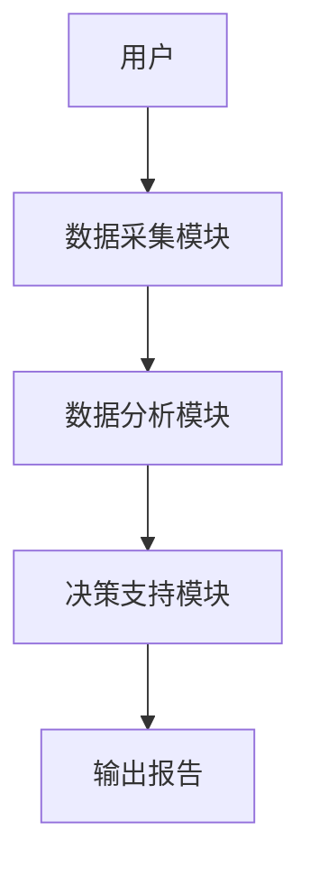
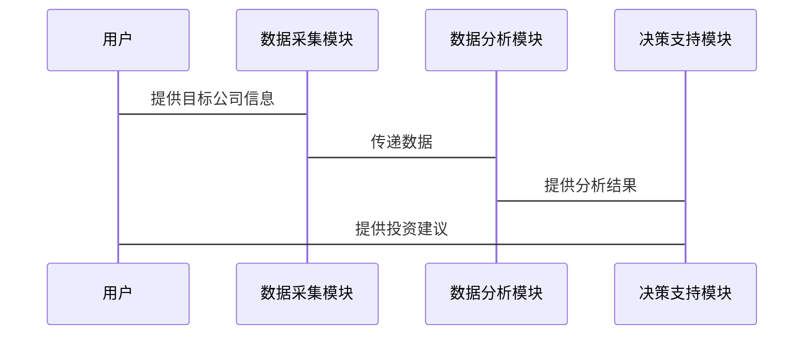

                 


# 彼得林奇的"市场机会"在跨境并购中的识别

> 关键词：彼得·林奇，市场机会，跨境并购，投资理论，并购策略

> 摘要：本文深入探讨了彼得·林奇的市场机会理论在跨境并购中的应用，结合具体案例和系统分析，分析了如何识别和利用市场机会进行有效的跨境并购。通过详细分析市场机会识别的核心概念、算法原理和系统架构，本文为读者提供了从理论到实践的全面指导，帮助投资者在跨境并购中做出明智的决策。

---

## 第一部分: 背景介绍与核心概念

### 第1章: 跨境并购与市场机会概述

#### 1.1 跨境并购的定义与特点
- **1.1.1 跨境并购的定义**
  跨境并购是指一家公司收购另一家位于不同国家或地区的公司，涉及跨国界的资产和股权交易。这种并购方式通常涉及复杂的法律、财务和文化因素。

- **1.1.2 跨境并购的核心特点**
  - **跨国性**：涉及不同国家或地区的公司。
  - **复杂性**：涉及多方面的法律、税务和文化差异。
  - **高风险性**：由于跨国因素，风险较高，包括政治、经济和市场风险。

- **1.1.3 跨境并购与国内并购的对比**
  - 国内并购：仅涉及同一国家的公司，法律和文化风险较低。
  - 跨境并购：涉及跨国因素，风险更高，但潜在回报也更大。

#### 1.2 彼得·林奇的市场机会理论
- **1.2.1 彼得·林奇的市场机会理论概述**
  彼得·林奇是美国著名投资经理人，他认为市场机会是投资成功的关键。他强调通过深入研究市场趋势和公司基本面，找到具有长期增长潜力的公司。

- **1.2.2 市场机会的核心要素**
  - **行业趋势**：行业的发展前景和增长潜力。
  - **公司竞争优势**：公司在行业中的独特优势。
  - **财务状况**：公司的财务健康状况和估值。

- **1.2.3 市场机会与投资决策的关系**
  市场机会是投资决策的核心依据，投资者通过识别市场机会，选择具有长期增长潜力的公司进行投资。

#### 1.3 跨境并购中的市场机会识别
- **1.3.1 跨境并购中的市场机会特点**
  - 全球化视角：关注全球市场趋势和行业动态。
  - 跨国整合：通过并购实现资源优化和市场扩展。
  - 风险与回报平衡：在高风险中寻找高回报的机会。

- **1.3.2 市场机会识别的关键步骤**
  - 收集信息：通过市场调研、行业报告和数据分析，了解目标市场的基本情况。
  - 分析行业趋势：研究行业的发展前景和竞争格局。
  - 评估公司价值：通过财务分析和估值模型，评估目标公司的价值。

- **1.3.3 彼得·林奇理论在跨境并购中的应用**
  - **行业分析**：关注全球行业趋势，寻找具有增长潜力的行业。
  - **公司筛选**：通过基本面分析，筛选出具有竞争优势的公司。
  - **估值分析**：利用估值模型，确定目标公司的合理价格范围。

### 第2章: 跨境并购的背景与现状

#### 2.1 跨境并购的全球发展趋势
- **2.1.1 全球化背景下的跨境并购**
  全球化促进了跨国公司的扩张，跨境并购成为企业全球化战略的重要手段。
  
- **2.1.2 跨境并购的主要驱动因素**
  - 市场扩展：通过并购进入新市场，扩大销售网络。
  - 资源整合：通过并购获取技术、品牌和渠道资源。
  - 成本控制：通过并购降低生产成本和管理成本。

- **2.1.3 跨境并购的区域分布与行业特点**
  - 区域分布：亚洲、欧洲和北美是跨境并购的主要区域。
  - 行业特点：科技、金融、医疗和消费品等行业是跨境并购的热点。

#### 2.2 跨境并购中的主要参与者
- **2.2.1 跨境并购中的买方角色**
  - 大型企业：具有充足资金和国际化经验，是跨境并购的主要买方。
  - 私募基金：通过杠杆收购，参与跨境并购。

- **2.2.2 跨境并购中的卖方角色**
  - 卖方公司：出售资产或股权，获取资金或实现战略调整。
  - 国有企业：通过出售资产，优化资源配置。

- **2.2.3 中介机构与专业顾问的作用**
  - 投资银行：提供财务顾问和交易撮合服务。
  - 律师事务所：提供法律咨询和合同审查服务。
  - 会计师事务所：提供财务审计和税务筹划服务。

#### 2.3 跨境并购中的主要挑战
- **2.3.1 跨境并购中的法律与合规风险**
  - 法律法规复杂：不同国家有不同的法律法规，增加了并购的复杂性。
  - 反垄断审查：需要通过各国的反垄断审查，增加了交易时间。

- **2.3.2 跨境并购中的文化与管理差异**
  - 文化冲突：不同国家的管理风格和企业文化可能存在差异，导致整合困难。
  - 语言障碍：语言差异可能影响沟通和协调。

- **2.3.3 跨境并购中的财务与估值风险**
  - 财务风险：汇率波动和财务报表差异可能影响估值和交易价格。
  - 估值风险：目标公司的估值可能受到市场波动和经济环境的影响。

---

## 第二部分: 市场机会识别的核心概念与方法

### 第3章: 市场机会识别的核心概念

#### 3.1 市场机会的核心要素
- **行业趋势与市场潜力**
  - 行业发展趋势：分析行业的发展前景和增长潜力。
  - 市场规模：评估目标市场的市场规模和增长速度。

- **企业竞争优势**
  - 核心竞争力：分析目标公司的核心竞争优势。
  - 产品和服务：评估目标公司的产品和服务是否具有市场竞争力。

- **财务状况与估值分析**
  - 财务健康状况：分析目标公司的财务报表，评估其盈利能力、资产负债状况和现金流情况。
  - 估值合理性：通过市盈率、市净率等指标，评估目标公司的估值是否合理。

#### 3.2 跨境并购中的市场机会评估模型
- **3.2.1 市场机会评估模型的构建**
  市场机会评估模型是一个综合考虑多个因素的分析框架，用于评估目标公司的市场机会。

- **3.2.2 市场机会评估模型的输入变量**
  - 行业增长率：目标行业的年增长率。
  - 市场份额：目标公司在目标市场的份额。
  - 盈利能力：目标公司的净利率和毛利率。
  - 估值指标：市盈率、市净率等。

- **3.2.3 市场机会评估模型的输出结果**
  - 市场机会评分：通过综合评估，给出目标公司的市场机会评分。
  - 投资建议：根据评分结果，提出投资建议。

#### 3.3 彼得·林奇市场机会理论的扩展与应用
- **3.3.1 林奇理论在跨境并购中的适用性**
  林奇理论强调基本面分析和长期投资，适用于跨境并购中对目标公司的深入分析。

- **3.3.2 林奇理论的局限性与改进方向**
  - 局限性：林奇理论主要适用于国内市场，跨国并购中需要考虑更多的复杂因素。
  - 改进方向：结合跨国并购的特殊性，扩展林奇理论的应用范围，考虑更多的外部因素。

- **3.3.3 林奇理论与其他市场机会识别方法的对比**
  - 传统估值法：基于财务指标的估值方法。
  - 战略分析法：基于战略匹配和协同效应的分析方法。
  - 林奇理论：基于基本面分析和长期投资价值的分析方法。

### 第4章: 市场机会识别的定性与定量方法

#### 4.1 定性分析方法
- **行业分析与趋势预测**
  - 行业生命周期：分析目标行业所处的生命周期阶段，判断其增长潜力。
  - 行业竞争格局：分析目标行业的竞争结构，判断公司的竞争优势。

- **企业竞争优势分析**
  - 核心竞争力：分析目标公司的核心竞争力，判断其在行业中的地位。
  - 产品和服务：评估目标公司的产品和服务是否具有市场竞争力。

- **管理团队与企业治理评估**
  - 管理团队能力：评估目标公司的管理团队的能力和经验。
  - 公司治理结构：评估目标公司的治理结构是否完善，是否能够有效管理跨国并购后的整合。

#### 4.2 定量分析方法
- **财务状况分析**
  - 利润能力：分析目标公司的盈利能力，包括净利率、毛利率等。
  - 资产负债状况：分析目标公司的资产负债状况，评估其财务健康状况。
  - 现金流状况：分析目标公司的现金流状况，评估其财务稳定性。

- **估值分析**
  - 估值指标：市盈率（P/E）、市净率（P/B）、企业价值倍数（EV/EBITDA）等。
  - 相对估值法：比较目标公司与可比公司的估值差异，判断其估值是否合理。
  - 绝对估值法：通过DCF模型等方法，评估目标公司的内在价值。

#### 4.3 定性与定量分析的结合
- **定性分析与定量分析的结合**
  - 通过定性分析确定目标公司的核心竞争优势和市场地位。
  - 通过定量分析评估目标公司的财务健康状况和估值合理性。
  - 综合分析：结合定性和定量分析结果，做出全面的市场机会评估。

---

## 第三部分: 算法原理与系统架构

### 第5章: 算法原理

#### 5.1 多因素分析模型
- **5.1.1 多因素分析模型的构建**
  多因素分析模型是一个综合考虑多个因素的分析框架，用于评估目标公司的市场机会。

- **5.1.2 多因素分析模型的算法步骤**
  1. 收集目标公司的财务数据和行业数据。
  2. 分析行业趋势和市场潜力。
  3. 评估目标公司的竞争优势和财务状况。
  4. 计算目标公司的估值指标。
  5. 综合评估目标公司的市场机会评分。

#### 5.2 多因素分析模型的数学模型
- **5.2.1 多因素分析模型的数学表达**
  市场机会评分（S）= α × 行业增长潜力（G）+ β × 市场份额（M）+ γ × 盈利能力（P）+ δ × 估值合理性（V）

  其中，α、β、γ、δ是权重系数，G、M、P、V是各个因素的评分。

- **5.2.2 举例说明**
  假设目标公司的行业增长潜力为80分，市场份额为70分，盈利能力为85分，估值合理性为90分，权重系数分别为0.3、0.2、0.3、0.2。

  市场机会评分（S）= 0.3 × 80 + 0.2 × 70 + 0.3 × 85 + 0.2 × 90 = 24 + 14 + 25.5 + 18 = 81.5分。

#### 5.3 多因素分析模型的实现
- **5.3.1 数据输入**
  - 行业增长潜力：80分。
  - 市场份额：70分。
  - 盈利能力：85分。
  - 估值合理性：90分。

- **5.3.2 权重分配**
  - 行业增长潜力：0.3
  - 市场份额：0.2
  - 盈利能力：0.3
  - 估值合理性：0.2

- **5.3.3 计算市场机会评分**
  S = 0.3 × 80 + 0.2 × 70 + 0.3 × 85 + 0.2 × 90 = 24 + 14 + 25.5 + 18 = 81.5分。

- **5.3.4 结果解释**
  市场机会评分为81.5分，属于较高水平，建议进行投资。

### 第6章: 系统架构设计

#### 6.1 系统功能设计
- **6.1.1 数据采集模块**
  - 收集目标公司的财务数据和行业数据。
  - 数据来源包括公司财报、行业报告、新闻资讯等。

- **6.1.2 数据分析模块**
  - 实现多因素分析模型的计算，评估目标公司的市场机会评分。
  - 提供可视化报告，展示分析结果。

- **6.1.3 决策支持模块**
  - 根据市场机会评分，提供投资建议。
  - 提供风险提示和预警机制。

#### 6.2 系统架构设计


- **6.2.1 数据采集模块**
  - 负责收集目标公司的数据，包括财务数据、行业数据、公司治理信息等。

- **6.2.2 数据分析模块**
  - 负责对数据进行分析，计算市场机会评分。
  - 提供可视化报告，帮助用户直观了解分析结果。

- **6.2.3 决策支持模块**
  - 根据分析结果，提供投资建议和风险提示。
  - 提供预警机制，及时通知用户潜在风险。

#### 6.3 系统接口设计
- **6.3.1 数据接口**
  - 数据采集模块与数据分析模块之间的接口。
  - 数据格式：JSON或CSV。
  - 接口协议：RESTful API。

- **6.3.2 用户接口**
  - 用户与系统的交互界面。
  - 提供数据输入、分析结果查看和投资建议等功能。

#### 6.4 系统交互流程


---

## 第四部分: 项目实战

### 第7章: 项目实战

#### 7.1 项目背景
- **目标公司：某跨国科技公司**
- **行业：信息技术**
- **目标：评估该公司的市场机会，提供投资建议。**

#### 7.2 环境安装
- **工具：Python、Pandas、Matplotlib、Scikit-learn**
- **数据来源：公司财报、行业报告、新闻资讯等。**

#### 7.3 核心代码实现
```python
import pandas as pd
import numpy as np
import matplotlib.pyplot as plt

# 数据输入
data = {
    '行业增长潜力': [80],
    '市场份额': [70],
    '盈利能力': [85],
    '估值合理性': [90]
}

df = pd.DataFrame(data)

# 权重分配
weights = {
    '行业增长潜力': 0.3,
    '市场份额': 0.2,
    '盈利能力': 0.3,
    '估值合理性': 0.2
}

# 计算市场机会评分
def calculate_market_opportunity_score(df, weights):
    score = 0
    for column in df.columns:
        score += df[column] * weights[column]
    return score

market_opportunity_score = calculate_market_opportunity_score(df, weights)
print(f"市场机会评分：{market_opportunity_score}")
```

#### 7.4 代码应用解读
- **数据输入**：目标公司的行业增长潜力、市场份额、盈利能力、估值合理性评分。
- **权重分配**：根据各个因素的重要性分配权重。
- **计算市场机会评分**：通过加权计算，得到市场机会评分。

#### 7.5 实际案例分析
- **案例分析**：目标公司的市场机会评分为81.5分，属于较高水平。
- **投资建议**：建议进行投资，但需关注潜在的跨国并购风险。

#### 7.6 项目小结
- 通过项目实战，验证了多因素分析模型的有效性。
- 强调了定性与定量分析的结合在市场机会识别中的重要性。

---

## 第五部分: 总结与展望

### 第8章: 总结与展望

#### 8.1 总结
- **核心内容回顾**
  - 彼得·林奇的市场机会理论在跨境并购中的应用。
  - 多因素分析模型的构建与实现。
  - 系统架构设计与项目实战。

- **主要收获**
  - 理解了市场机会识别的核心概念与方法。
  - 掌握了多因素分析模型的算法原理与实现。
  - 学习了系统架构设计与项目管理的技巧。

#### 8.2 最佳实践 tips
- **市场机会识别**：
  - 结合定性与定量分析，全面评估目标公司的市场机会。
  - 关注行业趋势和公司基本面，选择具有长期增长潜力的公司。
- **跨国并购风险**：
  - 重视法律与合规风险，确保并购交易的合法性。
  - 关注文化与管理差异，确保并购后的顺利整合。
- **系统工具的应用**：
  - 利用数据分析工具，提高市场机会识别的效率和准确性。
  - 通过系统架构设计，优化并购决策的流程和效果。

#### 8.3 展望
- **未来研究方向**
  - 结合人工智能技术，提升市场机会识别的智能化水平。
  - 探索跨国并购中的风险管理与控制方法。
- **技术发展趋势**
  - 数据分析技术的进一步发展，为市场机会识别提供更强大的工具。
  - 人工智能在并购决策中的应用，提高并购的精准性和效率。

---

## 作者

作者：AI天才研究院/AI Genius Institute & 禅与计算机程序设计艺术/Zen And The Art of Computer Programming

