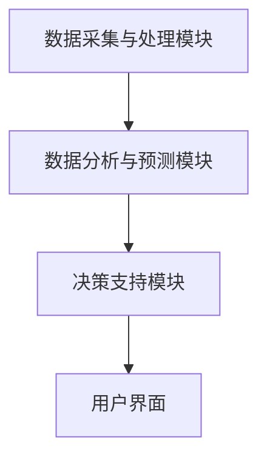
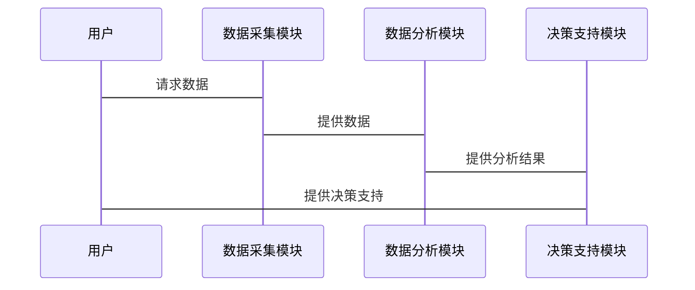

                 


# 彼得林奇的"市场机会"在跨境并购中的识别方法

---

## 关键词：
- 彼得林奇
- 市场机会
- 跨境并购
- 投资策略
- 数据分析

---

## 摘要：
本文基于彼得林奇的市场机会理论，系统阐述了如何在跨境并购中识别和把握市场机会。通过分析市场机会的识别方法、行业选择策略、数据驱动的预测模型以及系统架构设计，结合实际案例，为投资者提供一套完整的市场机会识别框架。文章结合理论与实践，深入探讨了跨境并购中的独特挑战，并提出了相应的解决方案。

---

## 第1章: 彼得林奇的市场机会理论概述

### 1.1 彼得林奇投资理念概述

#### 1.1.1 彼得林奇的投资哲学
彼得·林奇是美国著名投资经理，以其独特的投资哲学闻名。他强调长期投资、价值发现和分散投资。他认为，市场的短期波动是不可预测的，但长期趋势可以通过基本面分析来把握。

#### 1.1.2 市场机会的定义
市场机会是指在特定市场中，由于某种因素导致某类资产或行业的价值被低估，从而为投资者提供获利空间的机会。彼得林奇认为，市场机会的核心在于发现那些具有长期增长潜力但当前被市场忽视的资产或企业。

#### 1.1.3 跨境并购的定义与特点
跨境并购是指一家企业收购另一家位于不同国家或地区的企业的行为。其特点包括：
- **跨国性**：涉及多个国家或地区。
- **复杂性**：涉及法律、税务、文化等多方面因素。
- **高风险性**：由于跨国经营的不确定性，风险较高。
- **高回报潜力**：通过整合资源、扩大市场，可能带来更高的回报。

---

### 1.2 跨境并购的背景与现状

#### 1.2.1 跨境并购的历史演变
跨境并购的历史可以追溯到20世纪初，但真正大规模发展是在20世纪末至21世纪初。随着全球化的深入，企业通过跨境并购扩大市场份额、获取技术或降低成本成为趋势。

#### 1.2.2 当前全球经济环境下的并购趋势
近年来，跨境并购的活跃程度受到全球经济波动的影响。例如，2008年全球金融危机后，许多企业通过并购整合资源，提升竞争力。当前，数字化转型和技术创新成为推动跨境并购的重要动力。

#### 1.2.3 跨境并购的主要驱动因素
- **市场扩张**：通过并购进入新市场。
- **技术获取**：通过并购获取关键技术。
- **成本优化**：通过并购降低生产成本。
- **战略整合**：通过并购实现协同效应。

---

### 1.3 市场机会识别的核心要素

#### 1.3.1 市场机会的定义与特征
市场机会的特征包括：
- **可衡量性**：可以通过量化指标评估。
- **可操作性**：可以通过具体策略实现。
- **时间敏感性**：需要在特定时间内把握。

#### 1.3.2 彼得林奇的市场机会筛选标准
彼得林奇提出的市场机会筛选标准包括：
- **低市盈率**：选择市盈率低于行业平均水平的企业。
- **高ROE**：选择净资产收益率较高的企业。
- **管理团队稳定性**：选择管理团队稳定且有成功经验的企业。

#### 1.3.3 跨境并购中的市场机会独特性
跨境并购中的市场机会具有以下独特性：
- **文化差异**：不同国家或地区的文化差异可能影响企业整合。
- **法律差异**：不同国家的法律法规差异可能增加并购难度。
- **市场环境差异**：不同市场的经济周期和政策环境不同。

---

## 第2章: 市场机会识别方法论

### 2.1 市场机会识别的核心步骤

#### 2.1.1 信息收集与数据整理
市场机会识别的第一步是信息收集与数据整理。这包括收集目标市场的经济数据、行业数据、企业财务数据等。

#### 2.1.2 数据分析与模式识别
通过数据分析，识别市场中的潜在机会。例如，通过分析行业趋势，发现哪些行业具有增长潜力。

#### 2.1.3 投资决策与风险评估
基于数据分析结果，做出投资决策，并评估相关风险。

---

### 2.2 彼得林奇的市场机会筛选模型

#### 2.2.1 模型的构建逻辑
彼得林奇的市场机会筛选模型基于以下逻辑：
- 选择市盈率低于行业平均水平的企业。
- 选择净资产收益率较高的企业。
- 选择管理团队稳定且有成功经验的企业。

#### 2.2.2 模型的关键参数与指标
- 市盈率（P/E）
- 净资产收益率（ROE）
- 管理团队稳定性

#### 2.2.3 模型的验证与优化
通过历史数据验证模型的有效性，并根据实际情况优化模型参数。

---

### 2.3 跨境并购中的市场机会评估

#### 2.3.1 行业分析与竞争格局
分析目标行业的竞争格局，评估行业的增长潜力和风险。

#### 2.3.2 目标企业筛选标准
- 财务健康状况
- 估值合理性
- 并购整合可行性

#### 2.3.3 并购风险的量化评估
通过定量分析，评估并购过程中的法律、税务和整合风险。

---

## 第3章: 跨境并购中的市场机会识别策略

### 3.1 跨境并购的行业选择策略

#### 3.1.1 行业生命周期分析
分析目标行业的生命周期，选择处于成长期或成熟期的行业。

#### 3.1.2 行业竞争结构评估
评估行业的竞争结构，选择具有竞争优势的行业。

#### 3.1.3 行业政策环境影响
分析目标行业的政策环境，评估政策对行业的影响。

---

### 3.2 目标企业识别的财务指标分析

#### 3.2.1 财务健康状况评估
分析企业的财务健康状况，包括利润表、资产负债表和现金流量表。

#### 3.2.2 估值模型与市场定价
使用估值模型（如市盈率模型、现金流模型）评估企业的市场定价。

#### 3.2.3 财务风险与回报潜力
评估企业的财务风险和回报潜力，选择风险可控、回报潜力高的企业。

---

### 3.3 跨境并购中的文化与法律风险评估

#### 3.3.1 文化差异对企业价值的影响
分析文化差异对并购后整合的影响，制定相应的应对策略。

#### 3.3.2 法律与税务风险分析
分析并购过程中的法律和税务风险，制定相应的风险管理策略。

#### 3.3.3 并购后的整合挑战
评估并购后的整合挑战，包括组织架构、文化融合等。

---

## 第4章: 数据驱动的市场机会识别方法

### 4.1 数据分析在市场机会识别中的作用

#### 4.1.1 数据收集与清洗
收集目标市场的相关数据，并进行数据清洗。

#### 4.1.2 数据分析工具与方法
使用数据分析工具（如Python、R）和方法（如回归分析、聚类分析）进行数据分析。

#### 4.1.3 数据可视化与洞察提取
通过数据可视化工具（如Tableau、Power BI）提取数据中的关键洞察。

---

### 4.2 基于大数据的市场机会预测模型

#### 4.2.1 数据特征提取与选择
从数据中提取特征，并选择对预测有重要影响的特征。

#### 4.2.2 机器学习算法在预测中的应用
使用机器学习算法（如随机森林、支持向量机）进行市场机会预测。

#### 4.2.3 模型的验证与优化
通过交叉验证和网格搜索优化模型参数，提高模型的预测准确率。

---

### 4.3 跨境并购中的数据驱动决策

#### 4.3.1 数据驱动的行业分析
通过大数据分析，评估目标行业的市场潜力和风险。

#### 4.3.2 数据驱动的目标企业筛选
基于大数据分析，筛选出符合条件的目标企业。

#### 4.3.3 数据驱动的并购风险评估
通过大数据分析，评估并购过程中的法律、税务和整合风险。

---

## 第5章: 系统架构设计与实现

### 5.1 问题场景介绍

#### 5.1.1 系统目标
设计一个基于彼得林奇市场机会理论的跨境并购识别系统。

#### 5.1.2 系统功能需求
- 数据采集与处理模块
- 数据分析与预测模块
- 决策支持模块

---

### 5.2 系统功能设计

#### 5.2.1 数据采集与处理模块
- 数据采集：从多个数据源采集目标市场的数据。
- 数据清洗：清理数据中的噪声和缺失值。

#### 5.2.2 数据分析与预测模块
- 数据分析：使用机器学习算法进行数据分析。
- 市场机会预测：基于分析结果预测市场机会。

#### 5.2.3 决策支持模块
- 风险评估：评估并购过程中的各种风险。
- 决策支持：为投资者提供决策支持。

---

### 5.3 系统架构设计

#### 5.3.1 系统架构图


#### 5.3.2 接口设计
- 数据采集接口：从外部数据源获取数据。
- 分析接口：调用数据分析模块进行分析。
- 决策支持接口：为用户提供决策支持。

---

### 5.4 系统交互设计

#### 5.4.1 系统交互流程图


---

## 第6章: 项目实战与案例分析

### 6.1 项目环境安装

#### 6.1.1 环境要求
- 操作系统：Windows/Mac/Linux
- Python版本：3.6以上
- 需要安装的库：Pandas、NumPy、Scikit-learn、Matplotlib

#### 6.1.2 安装步骤
```bash
pip install pandas numpy scikit-learn matplotlib
```

---

### 6.2 核心代码实现

#### 6.2.1 数据采集与处理
```python
import pandas as pd
import numpy as np

# 数据采集
data = pd.read_csv('target_market.csv')

# 数据清洗
data = data.dropna()
data = data.drop_duplicates()
```

#### 6.2.2 数据分析与预测
```python
from sklearn.ensemble import RandomForestRegressor
from sklearn.model_selection import train_test_split

# 数据分割
X = data.drop(columns=['target'])
y = data['target']

X_train, X_test, y_train, y_test = train_test_split(X, y, test_size=0.2)

# 模型训练
model = RandomForestRegressor()
model.fit(X_train, y_train)

# 模型预测
y_pred = model.predict(X_test)
```

#### 6.2.3 案例分析
以某跨国并购案例为例，分析市场机会的识别过程。

---

## 第7章: 总结与展望

### 7.1 最佳实践 tips
- 在进行跨境并购前，必须充分了解目标市场的法律、税务和文化环境。
- 数据分析在市场机会识别中起着至关重要的作用。

### 7.2 小结
本文系统阐述了彼得林奇的市场机会理论在跨境并购中的应用，提出了基于数据分析的市场机会识别方法，并设计了一个完整的系统架构。

### 7.3 注意事项
- 跨境并购涉及的法律和税务风险较高，需要充分评估。
- 数据分析模型需要根据实际情况进行调整和优化。

### 7.4 拓展阅读
- 彼得林奇的《战胜市场的智慧》
- 克里斯托弗·布朗的《并购的艺术》

---

## 作者：AI天才研究院 & 禅与计算机程序设计艺术

