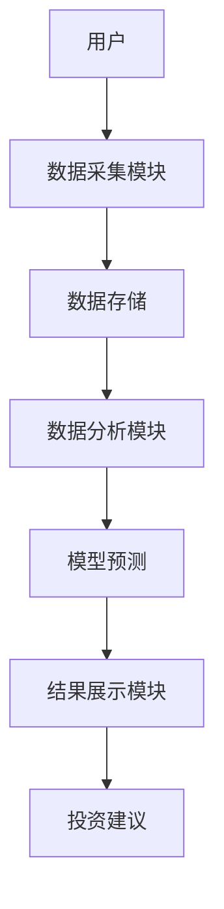
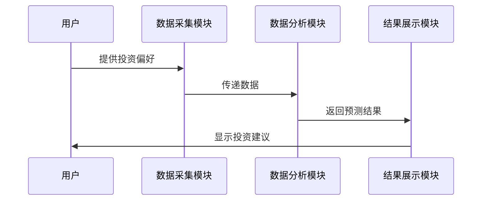

                 


# 彼得林奇的"市场机会"在跨境投资中的识别

**关键词**：彼得·林奇、市场机会、跨境投资、投资策略、算法原理、系统架构

**摘要**：本文探讨了彼得·林奇的市场机会识别理论在跨境投资中的应用。通过分析市场机会的核心概念、算法原理和系统架构，结合实际案例，展示了如何利用技术手段识别和把握跨境投资中的市场机会。

---

## 第一部分: 背景介绍

### 第1章: 市场机会与彼得·林奇的理论概述

#### 1.1 市场机会的定义与核心概念

**1.1.1 市场机会的定义**

市场机会是指在特定市场中，由于内外部环境的变化，出现的投资或商业机会。这些机会通常伴随着潜在的收益和风险，需要投资者具备敏锐的洞察力和分析能力。

**1.1.2 市场机会的核心要素**

- **需求与供给**：市场的供需变化是识别机会的关键。
- **行业趋势**：行业的发展趋势和周期性变化。
- **竞争优势**：企业的核心竞争力和市场地位。

**1.1.3 跨境投资中的市场机会特点**

- **多样性**：不同国家和地区的市场环境差异大。
- **复杂性**：涉及法律、税务、文化等多个因素。
- **风险性**：汇率波动、政策变化等增加了投资风险。

#### 1.2 彼得·林奇的市场机会理论

**1.2.1 彼得·林奇的投资理念**

彼得·林奇强调基本面分析和长期投资，认为市场机会通常存在于低估的股票中。他主张深入研究企业，关注其财务状况和行业地位。

**1.2.2 市场机会识别的关键原则**

- **价值投资**：寻找价格低于内在价值的股票。
- **分散投资**：降低风险，避免过度集中。
- **长期视角**：关注企业的长期增长潜力。

**1.2.3 彼得·林奇的成功案例分析**

以某跨国公司为例，分析其如何通过基本面分析识别市场机会，实现投资收益。

#### 1.3 跨境投资的背景与挑战

**1.3.1 跨境投资的定义与特点**

跨境投资是指投资者在不同国家或地区进行资产配置，以分散风险、追求更高收益。

**1.3.2 跨境投资的主要挑战**

- **法律与税务**：不同国家的法律法规和税务政策差异大。
- **汇率波动**：汇率变化直接影响投资收益。
- **文化差异**：不同国家的市场行为和消费者偏好不同。

**1.3.3 跨境投资的市场机会分析**

通过分析全球经济趋势、区域市场特点，识别潜在的投资机会。

---

## 第二部分: 核心概念与联系

### 第2章: 市场机会识别的核心概念与联系

#### 2.1 市场机会识别的核心概念

**2.1.1 宏观经济环境分析**

分析GDP增长率、利率、通货膨胀等宏观经济指标，评估市场环境。

**2.1.2 行业趋势分析**

研究行业周期、技术进步、市场需求等因素，判断行业的发展潜力。

**2.1.3 企业基本面分析**

通过财务报表分析企业的盈利能力、财务状况和管理能力。

#### 2.2 彼得·林奇策略与市场机会的关系

**2.2.1 彼得·林奇策略的核心要素**

- **基本面分析**：关注企业的财务数据和行业地位。
- **估值分析**：寻找价格低估的企业。
- **风险管理**：分散投资，控制风险。

**2.2.2 市场机会识别的步骤与流程**

1. **信息收集**：收集目标市场的经济、行业和企业数据。
2. **数据分析**：运用定量和定性方法分析数据。
3. **机会评估**：评估机会的潜在收益和风险。
4. **投资决策**：制定投资策略并执行。

**2.2.3 彼得·林奇策略在跨境投资中的应用**

通过具体案例，展示彼得·林奇策略在跨境投资中的应用，如选择具有竞争优势的跨国企业。

#### 2.3 核心概念对比分析

**2.3.1 定性分析与定量分析的对比**

- **定性分析**：基于经验和判断，分析市场趋势和行业动态。
- **定量分析**：通过数据和模型，量化市场机会和风险。

**2.3.2 不同市场环境下的策略选择**

根据市场的不同阶段和特点，选择合适的分析方法和投资策略。

**2.3.3 彼得·林奇策略与其他投资策略的对比**

比较价值投资、成长投资、指数投资等策略的异同，分析其优缺点。

---

## 第三部分: 算法原理讲解

### 第3章: 市场机会识别的算法原理

#### 3.1 数据采集与预处理

**3.1.1 数据来源与采集方法**

- **数据来源**：从金融数据库、政府统计网站、企业财报等获取数据。
- **数据清洗**：去除缺失值、异常值，确保数据质量。
- **特征提取**：从数据中提取有用的特征，如收益增长率、市盈率等。

#### 3.2 市场机会识别的算法选择

**3.2.1 常见算法介绍**

- **回归分析**：预测市场趋势和企业业绩。
- **聚类分析**：将相似的企业或市场分为同一类别。
- **时间序列分析**：分析市场数据的时间依赖性。

**3.2.2 算法选择的依据**

- **数据类型**：根据数据类型选择适合的算法。
- **分析目标**：根据分析目标选择合适的模型。
- **计算复杂度**：考虑算法的计算效率和资源消耗。

#### 3.3 算法实现与优化

**3.3.1 算法实现步骤**

1. **数据预处理**：清洗数据，提取特征。
2. **模型训练**：选择算法，训练模型。
3. **模型评估**：评估模型的准确性和稳定性。
4. **模型优化**：调整参数，提高预测精度。

**3.3.2 算法优化方法**

- **参数调整**：优化算法参数，提高模型性能。
- **特征选择**：去除无关特征，提高模型效率。
- **集成学习**：结合多个模型的结果，提高预测准确性。

**3.3.3 算法性能评估**

通过准确率、召回率、F1值等指标评估模型的性能。

#### 3.4 算法原理的数学模型和公式

**回归分析模型**：

$$ y = \beta_0 + \beta_1 x + \epsilon $$

其中，$y$是目标变量，$x$是自变量，$\beta_0$和$\beta_1$是回归系数，$\epsilon$是误差项。

**时间序列分析模型（ARIMA）**：

$$ ARIMA(p, d, q) $$

其中，$p$是自回归阶数，$d$是差分阶数，$q$是移动平均阶数。

---

## 第四部分: 系统分析与架构设计

### 第4章: 跨境投资市场机会识别系统的架构设计

#### 4.1 系统功能需求分析

**4.1.1 系统目标与功能模块划分**

- **目标**：识别跨境投资中的市场机会，辅助投资决策。
- **功能模块**：数据采集、数据分析、模型预测、结果展示。

**4.1.2 系统输入输出分析**

- **输入**：市场数据、企业数据、用户输入的投资偏好。
- **输出**：市场机会分析报告、投资建议、风险评估。

**4.1.3 系统性能需求**

- **响应时间**：系统应在合理时间内完成数据分析和预测。
- **数据处理能力**：支持大量数据的处理和分析。

#### 4.2 系统架构设计

**4.2.1 分层架构设计**

- **数据层**：存储原始数据和处理后的数据。
- **业务逻辑层**：处理数据，执行分析和预测。
- **用户界面层**：展示结果，提供交互界面。

**4.2.2 模块化设计**

- **数据采集模块**：负责数据的获取和清洗。
- **数据分析模块**：执行数据分析和建模。
- **结果展示模块**：生成报告和可视化结果。

#### 4.3 系统架构图（使用mermaid）



#### 4.4 系统接口设计

- **数据接口**：与金融数据库对接，获取实时数据。
- **用户接口**：提供用户输入和结果展示的界面。

#### 4.5 系统交互设计

**4.5.1 系统交互流程**

1. 用户输入投资偏好和目标市场。
2. 系统采集相关市场和企业数据。
3. 数据分析模块处理数据，生成预测结果。
4. 结果展示模块提供可视化报告和投资建议。

**4.5.2 交互流程图（使用mermaid）**



---

## 第五部分: 项目实战

### 第5章: 跨境投资市场机会识别项目实战

#### 5.1 项目环境安装

- **工具安装**：安装Python、Pandas、NumPy、Scikit-learn等库。
- **数据源**：获取目标市场的历史数据和实时数据。

#### 5.2 系统核心实现源代码

```python
import pandas as pd
from sklearn.linear_model import LinearRegression
from sklearn.metrics import mean_squared_error

# 数据加载
data = pd.read_csv('market_data.csv')

# 数据预处理
X = data[['GDP', '行业指数', '企业利润']]
y = data['股价']

# 模型训练
model = LinearRegression()
model.fit(X, y)

# 模型预测
predictions = model.predict(X)

# 模型评估
mse = mean_squared_error(y, predictions)
print(f'均方误差：{mse}')
```

#### 5.3 代码应用解读与分析

- **数据加载**：从CSV文件加载市场数据。
- **数据预处理**：选择相关特征，建立数据集。
- **模型训练**：使用线性回归模型进行训练。
- **模型预测**：预测目标变量，评估模型性能。

#### 5.4 实际案例分析

以某具体市场为例，展示如何利用上述代码和模型进行市场机会识别，提供投资建议。

#### 5.5 项目小结

总结项目实施过程中的经验教训，提出改进建议。

---

## 第六部分: 总结与展望

### 第6章: 总结与展望

#### 6.1 本章小结

总结全文，回顾市场机会识别的核心概念、算法原理和系统设计，强调技术手段在跨境投资中的重要性。

#### 6.2 未来展望

探讨未来的研究方向，如人工智能在市场机会识别中的应用，多模型融合优化等。

---

**作者**：AI天才研究院/AI Genius Institute & 禅与计算机程序设计艺术/Zen And The Art of Computer Programming

