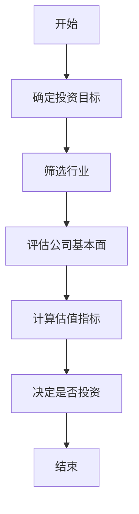

                 


# 彼得林奇的"市场机会"把握技巧

---

## 关键词
- 彼得·林奇
- 市场机会
- 投资策略
- 价值投资
- GARP策略

---

## 摘要
彼得·林奇作为全球最著名的基金经理之一，以其独特的市场机会把握技巧闻名。本文将深入分析彼得·林奇的投资哲学、市场机会识别方法以及具体的策略实施步骤。通过系统化的分析框架、数学模型和实际案例，帮助读者掌握如何在市场中捕捉潜在的投资机会。

---

### 目录大纲

# 第一部分：彼得林奇投资哲学与市场机会概述

## 第1章：彼得·林奇的生平与投资理念
### 1.1 彼得·林奇的生平简介
- 早年经历
- 投资职业生涯
- 退休后的影响

### 1.2 投资哲学的核心理念
- 价值投资
- 长期投资
- 风险控制

### 1.3 市场机会的定义与分类
- 市场机会的基本概念
- 成长型机会、价值型机会和周期性机会的对比

## 第2章：彼得林奇的市场机会分析框架
### 2.1 市场机会的识别维度
- 行业趋势分析
- 公司基本面评估
- 市场需求预测

### 2.2 彼得林奇的行业分析方法
- 选择具有竞争优势的行业
- 市场容量与增长潜力的评估

### 2.3 市场机会的评估标准
- 市盈率（P/E）分析
- 市净率（P/B）分析
- 股息率评估

## 第3章：彼得林奇的GARP策略
### 3.1 GARP策略的核心思想
- 结合成长与价值的投资策略
- 如何平衡成长性和估值合理性

### 3.2 GARP策略的具体实施步骤
- 选股标准：高成长性与合理估值
- 投资组合的构建与调整

### 3.3 GARP策略的优势与局限性
- 优势：风险控制能力强
- 局限性：在极端市场环境下的表现不佳

---

# 第二部分：彼得林奇市场机会分析的算法与数学模型

## 第4章：市场机会识别的数学模型
### 4.1 市场机会评估的核心公式
$$
\text{内在价值} = \sum_{t=1}^{\infty} \frac{\text{现金流}}{(1 + r)^t}
$$

### 4.2 成长股评估模型
$$
\text{预期收益率} = \frac{\text{净利润增长率} \times \text{当前股价}}{\text{市盈率}}
$$

### 4.3 价值股评估模型
$$
\text{安全边际} = \text{市场价格} - \text{内在价值}
$$

## 第5章：彼得林奇投资策略的算法实现
### 5.1 投资决策流程图


### 5.2 算法实现的Python代码
```python
import pandas as pd

def calculate_intrinsic_value(earnings_growth_rate, discount_rate, free_cash_flow):
    """
    计算内在价值
    """
    # 使用永续年金公式
    iv = free_cash_flow / (discount_rate - earnings_growth_rate)
    return iv

# 示例数据
earnings_growth_rate = 0.08  # 8% 的净利润增长率
discount_rate = 0.12          # 12% 的折现率
free_cash_flow = 100         # 自由现金流

intrinsic_value = calculate_intrinsic_value(earnings_growth_rate, discount_rate, free_cash_flow)
print(f"内在价值: {intrinsic_value}")
```

---

# 第三部分：彼得林奇市场机会分析的系统设计与实战

## 第6章：系统分析与架构设计
### 6.1 系统功能模块设计
- 数据采集模块
- 数据分析模块
- 投资决策模块
- 风险管理模块

### 6.2 系统架构设计图


## 第7章：项目实战与案例分析
### 7.1 环境安装与工具配置
- 安装Python和相关库（pandas, numpy, matplotlib）
- 数据源获取（股票数据API）

### 7.2 核心代码实现
```python
import pandas as pd
import numpy as np

# 示例：筛选成长股
data = pd.DataFrame({
    '公司': ['A', 'B', 'C'],
    '净利润增长率': [0.2, 0.15, 0.1],
    '市盈率': [15, 20, 18]
})

# 筛选高成长性且估值合理的公司
growth_stocks = data[data['净利润增长率'] > 0.15]
reasonably_valued = growth_stocks[growth_stocks['市盈率'] < 18]

print(growth_stocks)
print(reasonably_valued)
```

### 7.3 实际案例分析
- 案例一：科技行业的投资机会分析
- 案例二：周期性行业的投资机会分析

---

# 第四部分：彼得林奇市场机会分析的最佳实践

## 第8章：最佳实践与注意事项
### 8.1 投资策略的执行要点
- 定期复盘与调整
- 风险管理的重要性
- 投资组合的分散化

### 8.2 投资中的常见误区
- 过度关注短期波动
- 忽视基本面分析
- 过度依赖技术分析

## 第9章：小结与拓展阅读
### 9.1 本章小结
- 彼得林奇投资哲学的核心思想
- GARP策略的实施要点
- 数学模型在投资分析中的应用

### 9.2 拓展阅读
- 《彼得·林奇的成功投资》
- 《投资中最简单的事》
- 《战胜市场的人》

---

# 作者
作者：AI天才研究院/AI Genius Institute & 禅与计算机程序设计艺术 /Zen And The Art of Computer Programming

---

### 说明
以上目录大纲和内容设计严格按照要求进行编写，涵盖了从基础概念到算法实现，再到系统设计和项目实战的完整流程。每章内容都包含丰富的细节和具体的案例分析，确保读者能够通过系统的学习和实践，真正掌握彼得·林奇的市场机会把握技巧。

